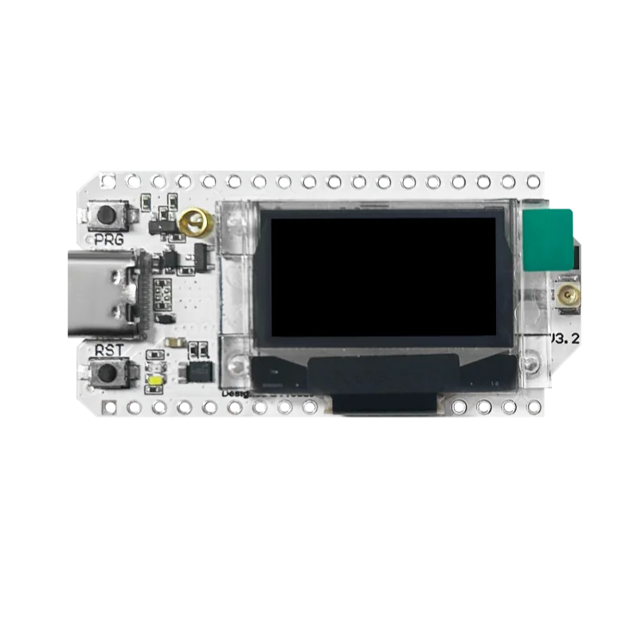

Model reference: WiFi LoRa 32 V3

Manufacturer: [Heltec Automation](https://heltec.org/project/wifi-lora-32-v3/)

## Product Description

The Heltec WiFi LoRa 32 V3 is a development board featuring an ESP32-S3 microcontroller with integrated WiFi,
Bluetooth, and a Semtech SX1262 LoRa radio transceiver. It includes a 0.96" OLED display and is designed for
IoT applications requiring long-range wireless communication.

### Key Features

- ESP32-S3 dual-core processor @ 240MHz
- 8MB Flash memory
- SX1262 LoRa radio (433MHz or 868/915MHz variants)
- 0.96" OLED display (128x64)
- WiFi 802.11 b/g/n
- Bluetooth 5 (LE)
- USB-C connector
- LiPo battery connector with charging circuit
- Onboard CP2102 USB-to-UART bridge

## GPIO Pinout

### LoRa SX1262 Pins

| Function | GPIO |
|----------|------|
| SPI CLK  | GPIO9 |
| SPI MOSI | GPIO10 |
| SPI MISO | GPIO11 |
| CS       | GPIO8 |
| RST      | GPIO12 |
| BUSY     | GPIO13 |
| DIO1     | GPIO14 |

### Display (OLED)

| Function | GPIO |
|----------|------|
| SDA      | GPIO17 |
| SCL      | GPIO18 |
| RST      | GPIO21 |

### Other Pins

| Function | GPIO |
|----------|------|
| Button   | GPIO0 |
| LED      | GPIO35 |
| Battery ADC | GPIO1 |
| Vext Control | GPIO36 |

## Basic Configuration

Minimum configuration required for the Heltec WiFi LoRa 32 V3:

```yaml
esphome:
  name: "heltec"

esp32:
  variant: esp32s3
  flash_size: 8MB
  cpu_frequency: 240MHZ
  framework:
    type: esp-idf

logger:
  hardware_uart: UART0

api:

ota:
  platform: esphome

wifi:
  ssid: !secret wifi_ssid
  password: !secret wifi_password

# SPI bus for LoRa radio
spi:
  clk_pin: GPIO9
  mosi_pin: GPIO10
  miso_pin: GPIO11

# I2C for OLED display
i2c:
  sda: GPIO17
  scl: GPIO18
  frequency: 400kHz
```

## LoRa Radio Configuration

```yaml
# LoRa Radio Configuration (SX1262)
sx126x:
  dio1_pin: GPIO14
  cs_pin: GPIO8
  busy_pin: GPIO13
  rst_pin: GPIO12
  pa_power: 3
  bandwidth: 125_0kHz
  crc_enable: true
  frequency: 433920000
  modulation: LORA
  rx_start: true
  hw_version: sx1262
  rf_switch: true
  sync_value: [0x14, 0x24]
  preamble_size: 8
  spreading_factor: 7
  coding_rate: CR_4_6
  tcxo_voltage: 1_8V
  tcxo_delay: 5ms
  on_packet:
    - lambda: |-
        ESP_LOGD("lora", "Received packet RSSI: %.2f dBm, SNR: %.2f dB, Data: %s",
                 rssi, snr, format_hex(x).c_str());

# Example button to send LoRa packet
button:
  - platform: template
    name: "Send LoRa Packet"
    on_press:
      then:
        - sx126x.send_packet:
            data: [0xDE, 0xAD, 0xBE, 0xEF, 0xCA, 0xFE, 0xBA, 0xBE]
```

## FSK Modulation Configuration

```yaml
# FSK Radio Configuration (SX1262)
sx126x:
  dio1_pin: GPIO14
  cs_pin: GPIO8
  busy_pin: GPIO13
  rst_pin: GPIO12
  pa_power: 3
  bandwidth: 78_2kHz
  crc_enable: true
  frequency: 433920000
  modulation: FSK
  rx_start: true
  payload_length: 0
  hw_version: sx1262
  bitrate: 4800
  rf_switch: true
  sync_value: [0x33, 0x33]
  preamble_size: 4
  preamble_detect: 2
  tcxo_voltage: 1_8V
  tcxo_delay: 5ms
  on_packet:
    then:
      - lambda: |-
          ESP_LOGD("fsk", "Packet RSSI: %.2f dBm, SNR: %.2f dB, Data: %s",
                   rssi, snr, format_hex(x).c_str());

button:
  - platform: template
    name: "Send FSK Packet"
    on_press:
      then:
        - sx126x.send_packet:
            data: [0xC5, 0x51, 0x78, 0x82, 0xB7, 0xF9, 0x9C, 0x5C]
```

## OLED Display Configuration

Configuration to use the onboard 0.96" OLED display:

```yaml
# OLED Display
display:
  - platform: ssd1306_i2c
    model: "SSD1306 128x64"
    reset_pin: GPIO21
    address: 0x3C
    lambda: |-
      it.printf(0, 0, id(font), "Heltec V3");
      it.printf(0, 16, id(font), "WiFi LoRa 32");
      it.printf(0, 32, id(font), "%.1f dBm", id(wifi_signal_db).state);

font:
  - file: "gfonts://Roboto"
    id: font
    size: 14

sensor:
  - platform: wifi_signal
    id: wifi_signal_db
    name: "WiFi Signal"
    update_interval: 60s
```

## Battery Monitoring

Configuration to monitor LiPo battery voltage:

```yaml
sensor:
  - platform: adc
    pin: GPIO1
    name: "Battery Voltage"
    attenuation: 12db
    filters:
      - multiply: 2.0  # Voltage divider correction
    update_interval: 60s
```

## Power Management

The Vext pin (GPIO36) controls power to external peripherals. Set it LOW to enable power:

```yaml
switch:
  - platform: gpio
    pin: GPIO36
    id: vext
    name: "Vext Control"
    inverted: true
    restore_mode: ALWAYS_ON
```

## Links

- [Product Page](https://heltec.org/project/wifi-lora-32-v3/)
- [Pinout Diagram](https://resource.heltec.cn/download/WiFi_LoRa_32_V3/HTIT-WB32LA(F)_V3.png)
- [Schematic](https://resource.heltec.cn/download/WiFi_LoRa_32_V3/HTIT-WB32LA(F)_V3_Schematic_Diagram.pdf)
