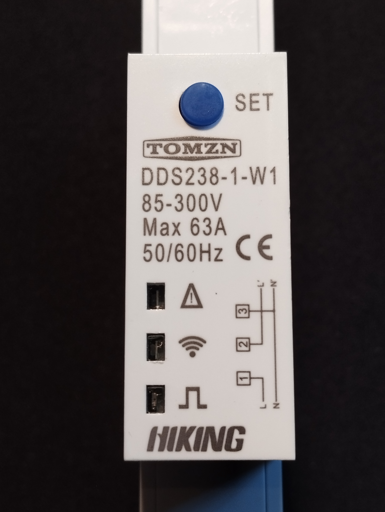
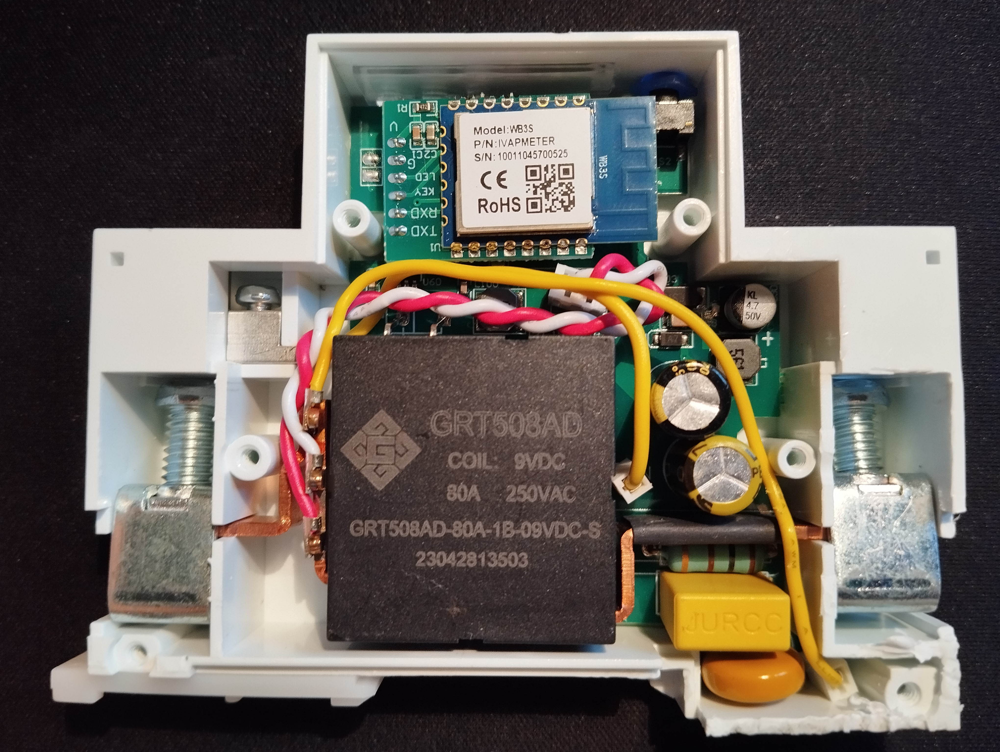
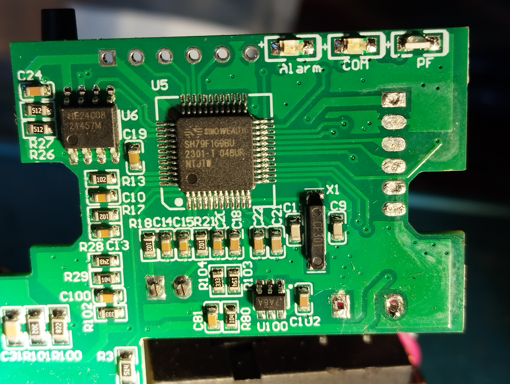

## Manufacturer

Hiking TOMZN (Tuya)

## Product Info

| Spec              | Value       |
| ----------------- | ----------- |
| Rate Frequency    | 50 or 60 Hz |
| Rated Current     | 63A         |
| Rate Voltage      | 85~300V AC  |
| kWH accuracy      | Class 1     |
| R.M.S. accuracy   | Class 0.5   |
| Starting current  | 20 mA       |
| WiFi network      | 2.4GHz only |
| Operational temp. | -25~70°C    |

35mm Din Rail install

## Product Images





Device button (named SET) wired to Tuya MCU.
Load toggling happens on tripple SET key pressing.

## Flashing info

Originally device equipped with WB3S module.
Module replaced with ESP-12F and following config provided.

ESP-12F must be flashed before installing into device as RX/TX pins wired to Tuya MCU.
10 kOm resistor additionally to be soldered between GND and GPIO15 pins (SMD 0805 is a good choice).

Device case is secured by screws, but also glued in some places.
Then opened - PCB can be easily detached from.

## ESP GPIO Pinout

| Pin    | Function             | Note     |
| ------ | -------------------- | -------- |
| GPIO01 | Tuya MCU Rx          |          |
| GPIO03 | Tuya MCU Tx          |          |
| GPIO02 | Blue LED on ESP-12F  | inverted |
| GPIO14 | Blue LED on device   | inverted |
| GPIO16 | SET long press (>3 sec.) | inverted |

## Tuya Component Output

```txt
Tuya:
  Datapoint 16: switch (value: OFF)
  Datapoint 6: raw (value: 00.00.00.00.00.00.00.00.03.E8.00.00.00.09.47 (15))
  Datapoint 1: int value (value: 3)
  Datapoint 101: int value (value: 3)
  Datapoint 102: int value (value: 0)
  Datapoint 11: switch (value: OFF)
  Datapoint 13: int value (value: 0)
  Datapoint 107: int value (value: 0)
  Datapoint 109: int value (value: 0)
  Datapoint 17: raw (value: 00.00.00.00.00.00.00.00.00.00.00.64.00.01.0E.00.00.AA.00.00.00.00.00.0A.00.00.00.00.00.00 (30))
  Datapoint 18: raw (value: 00.05.00.64.00.05.00.1E.00.3C.00.00.00.00.00.00.00 (17))
  Datapoint 9: bitmask (value: 0)
  Datapoint 108: string value (value: 000000000000)
  Datapoint 103: int value (value: 0)
  Datapoint 110: int value (value: 0)
  Datapoint 111: int value (value: 1000)
  Datapoint 105: int value (value: 5001)
  GPIO Configuration: status: pin 26, reset: pin 14
  Product: '{"p":"i55reuttymjocx0j","v":"1.0.0","m":2}'
```

## Tuya DataPoints

| DP  | Switch            | Notes |
| --- | ----------------- | ----- |
|  16 | To operate Relay  |       |
|  11 | Relay on startup  | OFF - Restore, ON - Relay OFF |

Relay is driven by Tuya MCU. ESP restart will not affect state of Relay !

| DP  | Sensor           | Multiply | Unit | Decimals |
| --- | ---------------- | -------- | ---- | -------- |
| 101 | Energy Total     | 0.001    | kWh  | 3        |
|   1 | Energy from Grid | 0.001    | kWh  | 3        |
| 102 | Energy to Grid   | 0.001    | kWh  | 3        |
| 103 | Power Active     | 0.001    | kW   | 3        |
| 110 | Power Reactive   | 0.001    | kVAr | 3        |
| 111 | Power Factor     | 0.001    |      | 3        |
| 105 | Frequency        | 0.01     | Hz   | 2        |
| 108 | So far always reported 0                      |
| 109 | Power Flow ? Reported 4 when flow is to Grid  |

Report negative "Power Active" when power flow is to Grid.

## Tuya DataPoint 6 (raw, 15 bytes)

| Bytes | Sensor         | Multiply | Unit | Decimals | Parsed by MCU |
| ----- | -------------- | -------- | ---- | -------- | ------------- |
| 13,14 | Voltage        | 0.1      | V    | 1        |               |
| 11,12 | Current        | 0.001    | A    | 3        |               |
| 06,07 | Power Reactive | 0.001    | kVAr | 3        | as DP110      |
| 02,03 | Power Active   | 0.001    | kW   | 3        | as DP103      |
|    00 | Power Flow Direction: 00 - from Grid, 01 - to Grid          |

## Basic Configuration

```yaml
# Basic Config
---
substitutions:
  device_name:   "energy-meter"
  friendly_name: "Energy Meter"

esphome:
  name: ${device_name}
  friendly_name: ${friendly_name}
  platform: ESP8266
  board: esp12e

wifi:
  ssid: !secret wifi_ssid
  password: !secret wifi_pass

  on_connect:
    - output.turn_on:  tuya_led_wifi
  on_disconnect:
    - output.turn_off: tuya_led_wifi

logger:
  baud_rate: 0

api:

ota:
  - platform: esphome

uart:
  rx_pin: GPIO03
  tx_pin: GPIO01
  baud_rate: 9600

tuya:
  on_datapoint_update:
    - sensor_datapoint: 6
      datapoint_type: raw
      then:
        - lambda: |-
            ESP_LOGD("main", "on_datapoint_update %s", format_hex_pretty(x).c_str());
            id(voltage).publish_state((x[13] << 8 | x[14]) * 0.1);
            id(current).publish_state((x[11] << 8 | x[12]) * 0.001);

#            id(power_active).publish_state((x[02] << 8 | x[03]) * 0.001);   # Power Active   in kW   - DP103
#            id(power_reactive).publish_state((x[06] << 8 | x[07]) * 0.001); # Power Reactive in kVAr - DP110

output:
  - platform: gpio
    pin: GPIO14
    id: tuya_led_wifi
    inverted: True

switch:
  - platform: "tuya"
    id: sw_relay
    name: "Switch"
    switch_datapoint: 16

  - platform: "tuya"
    name: "Restore on startup"
    switch_datapoint: 11
    inverted: True

binary_sensor:
  - platform: gpio
    pin:
      number: GPIO16
      inverted: True
    name: "SET long press"

sensor:
  - platform: template
    id: voltage
    name: "Voltage"
    device_class: voltage
    unit_of_measurement: V
    state_class: measurement
    accuracy_decimals: 1

  - platform: template
    id: current
    name: "Current"
    device_class: current
    unit_of_measurement: A
    state_class: measurement
    accuracy_decimals: 3

  - platform: "tuya"
    name: "Frequency"
    sensor_datapoint: 105
    device_class: frequency
    unit_of_measurement: Hz
    state_class: measurement
    accuracy_decimals: 2
    filters:
      - multiply: 0.01

  - platform: "tuya"
    id: power_active
    name: "Power Active"
    sensor_datapoint: 103
    device_class: power
    unit_of_measurement: kW
    state_class: measurement
    accuracy_decimals: 3
    filters:
      - multiply: 0.001

  - platform: "tuya"
    id: power_reactive
    name: "Power Reactive"
    sensor_datapoint: 110
    device_class: power
    unit_of_measurement: kVAr
    state_class: measurement
    accuracy_decimals: 3
    filters:
      - multiply: 0.001

  - platform: "tuya"
    name: "Power Factor"
    sensor_datapoint: 111
    device_class: power_factor
    state_class: measurement
    accuracy_decimals: 3
    filters:
      - multiply: 0.001

  - platform: "tuya"
    name: "Energy"
    sensor_datapoint: 101
    device_class: energy
    unit_of_measurement: kWh
    state_class: total_increasing
    accuracy_decimals: 3
    filters:
      - multiply: 0.001

  - platform: "tuya"
    name: "Energy from Grid"
    sensor_datapoint: 1
    device_class: energy
    unit_of_measurement: kWh
    state_class: total_increasing
    accuracy_decimals: 3
    filters:
      - multiply: 0.001

  - platform: "tuya"
    name: "Energy to Grid"
    sensor_datapoint: 102
    device_class: energy
    unit_of_measurement: kWh
    state_class: total_increasing
    accuracy_decimals: 3
    filters:
      - multiply: 0.001
```
