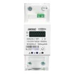

## Manufacturer

Hiking TOMZN (Tuya)

## Product Images



## Available from

[aliexpress.com](https://www.aliexpress.com/item/1005002409492948.html)

## Flashing info

I flashed the compiled config using tasmotizer with no issues. Desolding the ESP-Board is required as the TX/RX pins are connected to the Tuya MCU, guide [here](https://github.com/krikk/Hiking-DDS238-2-WIFI-Din-Rail-Energy-Meter-flashing-Tasmota) for Tasmota with photo's.

## GPIO Pinout

| Pin    | Function          |
| ------ | ----------------- |
| GPIO1  | Tuya MCU Tx       |
| GPIO3  | Tuya MCU Rx       |
| GPIO14 | LED (inverted)    |
| GPIO16 | Button (inverted) |

## Basic Configuration

```yaml
# Basic Config
---
substitutions:
  device_name: energy_meter
  friendly_name: "Energy Meter"

esphome:
  name: ${device_name}
  platform: ESP8266
  board: esp01_1m
  
# OTA flashing
ota:
  - platform: esphome

wifi: # Your Wifi network details
  
# Enable fallback hotspot in case wifi connection fails  
  ap:

# Enabling the logging component
logger:
  baud_rate: 0

# Enable Home Assistant API
api:

# Enable the captive portal
captive_portal:

uart:
  rx_pin: GPIO3
  tx_pin: GPIO1
  baud_rate: 9600

tuya:

switch:
  - platform: "tuya"
    name: "${friendly_name} Switch"
    id: power
    switch_datapoint: 1

binary_sensor:
  - platform: gpio
    pin: 16
    id: button
    on_press:
      then:
        - switch.toggle: power

sensor:
  - platform: "tuya"
    name: "${friendly_name} Current"
    sensor_datapoint: 18
    accuracy_decimals: 2
    unit_of_measurement: "A"
    icon: "mdi:flash"
    filters:
      - multiply: 0.001

  - platform: "tuya"
    name: "${friendly_name} Power"
    sensor_datapoint: 19
    accuracy_decimals: 1
    unit_of_measurement: "W"
    icon: "mdi:flash"
    filters:
      - multiply: 0.1

  - platform: "tuya"
    name: "${friendly_name} Voltage"
    sensor_datapoint: 20
    unit_of_measurement: "V"
    accuracy_decimals: 1
    icon: "mdi:flash"
    filters:
      - multiply: 0.1

  - platform: "tuya"
    name: "${friendly_name} kWh +"
    sensor_datapoint: 101
    unit_of_measurement: "kWh"
    accuracy_decimals: 3
    icon: "mdi:flash"
    filters:
      - multiply: 0.01

  - platform: "tuya"
    name: "${friendly_name} kWh -"
    sensor_datapoint: 9
    unit_of_measurement: "kWh"
    accuracy_decimals: 3
    icon: "mdi:flash"
    filters:
      - multiply: 0.01
```
