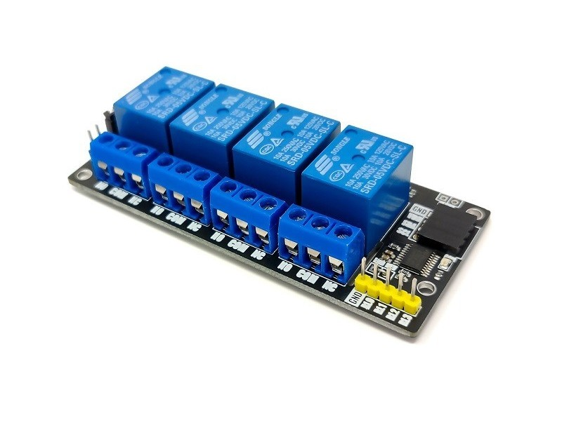

## Description

The mLink relay modules are serial I2C relays available in 1, 2, or 4 channel versions. Because they can be controlled via an I2C interface this makes them a convenient soltion for interfacting to ESP device. Especially with ESP8266 devlopments boards where IO pins can be limited.

This guid builds on the custom switch example to allow control of these modules from your YAML file. The first step is to save the following c++ class to your configuration directory under the file name mLinkRelay.h

```c++
#include "esphome.h"
#include "mLink.h"

#define I2C_ADD 0x52        // Default I2C address

class mLinkRelay : public Component, public Switch
{
  private:
  int relay;

  public:
  mLink ml;
  mLinkRelay(int i)
  {
    relay = i;
  }

  void setup() override
  {
    ml.init();
  }


  void write_state(bool state) override
  {
    // This will be called every time the user requests a state change.
    switch(relay)
    {
      case 0:
        ml.SET_RLY0(I2C_ADD, state);
        break;

      case 1:
        ml.SET_RLY1(I2C_ADD, state);
        break;

      case 2:
        ml.SET_RLY2(I2C_ADD, state);
        break;

      case 3:
        ml.SET_RLY3(I2C_ADD, state);
        break;
    }

    // Acknowledge new state by publishing it
    publish_state(state);
    }
};
```

In your YAML file add the following:

```yaml
esphome:
  name: mLinkRelayExample
  friendly_name: mLink Relay Example
  
  includes:
    - mLinkRelay.h
  
  libraries:
    - "Wire"
    - "mlink"

switch:
- platform: custom
  lambda: |-
    auto mLinkRelay0 = new mLinkRelay(0);
    App.register_component(mLinkRelay0);

    auto mLinkRelay1 = new mLinkRelay(1);
    App.register_component(mLinkRelay1);

    auto mLinkRelay2 = new mLinkRelay(2);
    App.register_component(mLinkRelay2);

    auto mLinkRelay3 = new mLinkRelay(3);
    App.register_component(mLinkRelay3);

    return {mLinkRelay0, mLinkRelay1, mLinkRelay2, mLinkRelay3};

  switches:
    - name: "mLink Relay 0"
      id: mLinkRelay0
    - name: "mLink Relay 1"
      id: mLinkRelay1
    - name: "mLink Relay 2"
      id: mLinkRelay2
    - name: "mLink Relay 3"
      id: mLinkRelay3
```

The mLink relays can be purchased directly from the Hobby Components store here: [https://hobbycomponents.com/235-mlink](https://hobbycomponents.com/235-mlink)

For help and support you can visit the mLink section of our support forum here: [https://hobbycomponents.com/mlink](https://hobbycomponents.com/mlink)
