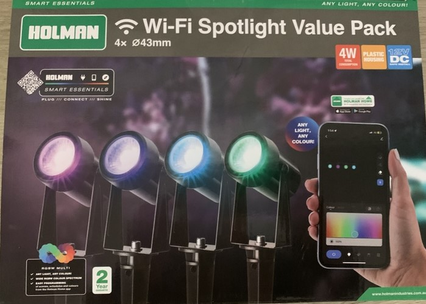

## Holman 4x34mm Wifi Spotlight Value Pack

Sold by Bunnings Warehouse this is a AU/NZ standard wall Low voltage spotlight based on the Beken BK7231N module. Now that ESPHome natively supports BK72XX microcontrollers, you can also put ESPHome directly onto the device.

The unit uses the Tuya CBU Wifi Module.



### Disassembly

You can flash directly to the outlet with USB to serial adapter.

## GPIO pinout

| PIN | GPIO # |   Component   |
|-----|--------|---------------|
|  2  | P16    | LED SPOTLIGHT |
|  3  | P20    |      Button 1 |
| 13  | GND    |        GND    |
| 14  | 3V3    |         3V3   |
| 15  | TX     |         TX    |
| 16  | RX     |         RX    |
| 18  | CEN    |   FOR FLASH   |

## Basic Configuration

```yaml
substitutions:
  device_name: holman_led_spotlight
  friendly_name: "Holman LED Spotlight"

#################################

esphome:
  name: ${devicename}

bk72xx:
  board: generic-bk7231n-qfn32-tuya

#################################

## ----------------- ##
##      Buttons      ##
## ----------------- ##
binary_sensor:
  - platform: gpio
    pin:
      number: P20
      inverted: true
      mode:
        input: true
        pullup: true
    name: "LED_button"

## ------------ ##
##    Lights    ##
## ------------ ##
light:
  - platform: beken_spi_led_strip
    rgb_order: RGB
    pin: P16
    num_leds: 5
    id: rgb_led
    chipset: ws2812
    is_wrgb: true
    name:  "Light"
```
