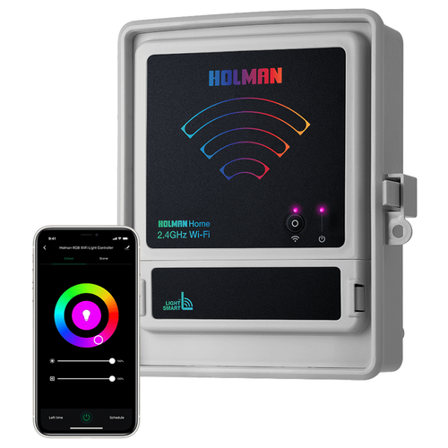

## General Notes

Available from [Bunnings](https://www.bunnings.com.au/holman-rgb-wi-fi-garden-light-controller_p0189462)

Uses [TYWE3L](https://developer.tuya.com/en/docs/iot/wifie3lpinmodule?id=K9605uj1ar87n) module.
Can be programmed without removing from PCB.



## GPIO Pinout

| Pin    | Function                  |
| ------ | ------------------------- |
| GPIO0  |  Panel Button             |
| GPIO12 |  PWM Green                |
| GPIO13 |  PWM Red                  |
| GPIO14 |  PWM Blue                 |

## Status LED Not Implemented

The user manual says that the power led on the panel will flash on initialisation (wifi status?). I have not been able to determine what pin this led is connected so this configuration does not support status_led.

## Configuration

```yaml
substitutions:
  name: "rgb-01"
  friendly_name: "RGB 01"
  project_name: "holman.CLXRGB60"
  project_version: "1.0"
  device_description: "RGB Light"

esphome:
  name: "${name}"
  comment: "${device_description}"
  project:
    name: "${project_name}"
    version: "${project_version}"

esp8266:
  board: esp01_1m
  
# OTA flashing
ota:
  - platform: esphome

wifi: # Your Wifi network details
  
# Enable fallback hotspot in case wifi connection fails  
  ap:

# Enabling the logging component
logger:

# Enable Home Assistant API
api:

# Enable the captive portal
captive_portal:

sensor:
  - platform: wifi_signal
    name: "${friendly_name} wifi signal"
    update_interval: 600s
  - platform: uptime
    name: Uptime Sensor
    id: uptime_sensor
    update_interval: 60s
    disabled_by_default: true
    on_raw_value:
      then:
        - text_sensor.template.publish:
            id: uptime_human
            state: !lambda |-
              int seconds = round(id(uptime_sensor).raw_state);
              int days = seconds / (24 * 3600);
              seconds = seconds % (24 * 3600);
              int hours = seconds / 3600;
              seconds = seconds % 3600;
              int minutes = seconds /  60;
              seconds = seconds % 60;
              return (
                (days ? to_string(days) + "d " : "") +
                (hours ? to_string(hours) + "h " : "") +
                (minutes ? to_string(minutes) + "m " : "") +
                (to_string(seconds) + "s")
              ).c_str();

#################################
binary_sensor:
  # Front Panel On/Off
  - platform: gpio
    pin:
      number: GPIO0
      inverted: true
      mode:
        input: true
        pullup: true
    name: "${friendly_name} Panel Button"
    id: panelButton
    on_click:
      min_length: 50ms
      max_length: 350ms
      then:
        - light.toggle: rgbLight

light:
  - platform: rgb
    name: "RGB Lights"
    red: output_component_red
    green: output_component_green
    blue: output_component_blue
    effects:
      # Use default parameters:
      - random:
      # Customize parameters
      - random:
          name: "Slow Random Effect"
          transition_length: 30s
          update_interval: 30s
      - random:
          name: "Fast Random Effect"
          transition_length: 4s
          update_interval: 5s
      - pulse:
      - pulse:
          name: "Fast Pulse"
          transition_length: 0.5s
          update_interval: 0.5s
      - pulse:
          name: "Slow Pulse"
          # transition_length: 1s      # defaults to 1s
          update_interval: 2s
      - strobe:
      - strobe:
          name: Strobe Effect With Custom Values
          colors:
            - state: true
              brightness: 100%
              red: 100%
              green: 90%
              blue: 0%
              duration: 500ms
            - state: false
              duration: 250ms
            - state: true
              brightness: 100%
              red: 0%
              green: 100%
              blue: 0%
              duration: 500ms
      - flicker:
      - flicker:
          name: Flicker Effect With Custom Values
          alpha: 95%
          intensity: 1.5%

output:
  - platform: esp8266_pwm
    id: output_component_red
    pin: GPIO13
  - platform: esp8266_pwm
    id: output_component_green
    pin: GPIO12
  - platform: esp8266_pwm
    id: output_component_blue
    pin: GPIO14

button:
  - platform: restart
    id: restart_button
    name: "${friendly_name} Restart"
    disabled_by_default: true

text_sensor:
  - platform: wifi_info
    ip_address:
      name: "${friendly_name} IP Address"
      disabled_by_default: true
    bssid:
      name: "${friendly_name} BSSID"
      disabled_by_default: true
  - platform: template
    name: Uptime
    id: uptime_human
    icon: mdi:clock-start
    entity_category: diagnostic
```
