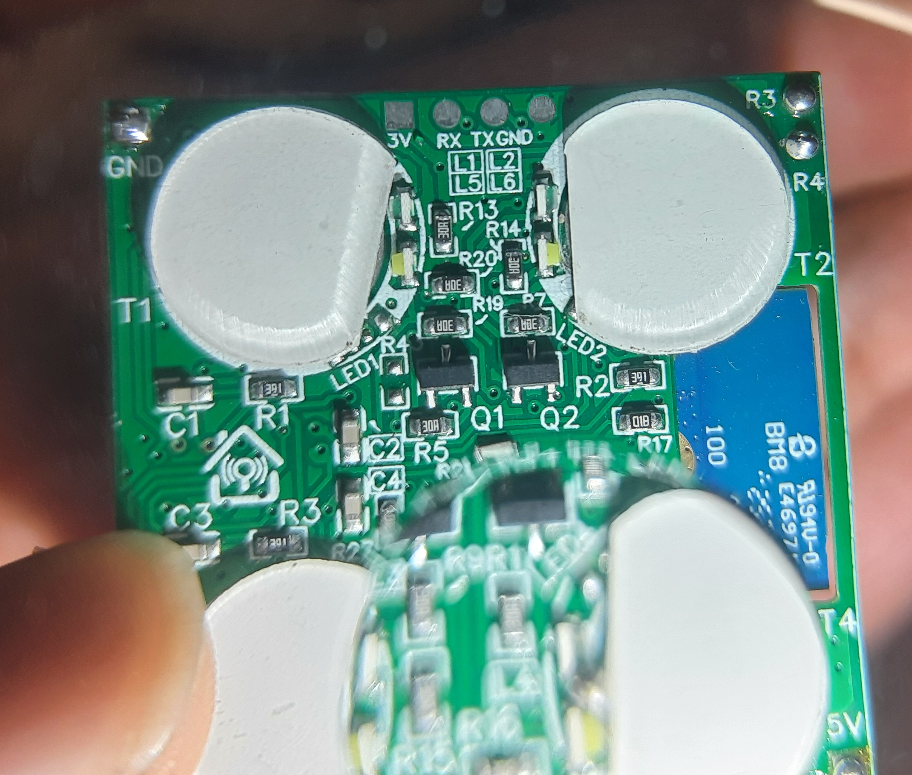
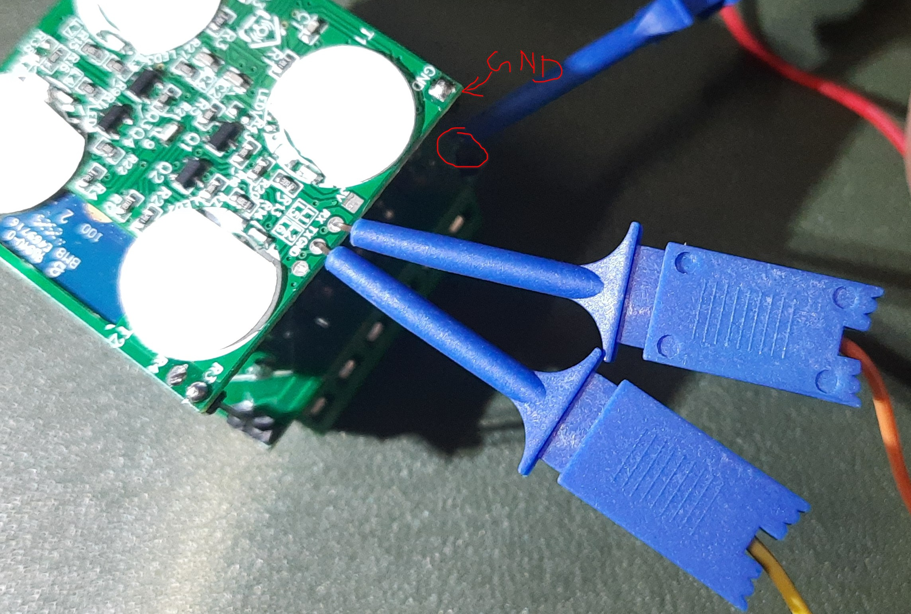

# Device Info
- **Name:** HomeMate 4 Gang Touch Switch
- **Chip:** CB3S
- **MCU:** BK7231N

[Product on Manufacturer Site](https://homemate.co.in/product/wi-fi-4g-touch-panel/)

# Flashing with Serial




1. Open the device by removing the back cover. Remember the orientation of the PCB stack for reassembly.
2. Remove the PCB from the front panel. This is held by clips, so gently spread the panel sides to release the PCB Stack.
3. The serial pads are located on the back of the PCB. with easy access to the pads.
4. Connect RX and TX correctly (RX to TX, TX to RX) to the serial adapter. I did not solder wires directly to the pads, instead I used tiny clip test leads to make contact with the pads as seen in the image above.
5. There is a 5v line on the PCB clearly marked (A long pin header connecting multiple PCBs). Use a 5V serial adapter to power the device during flashing as a stable power source is required for successful flashing and using 3.3V may lead to instability as reported by some users.
6. Connect GND to GND, I did not use pads here since a pin header was available on the PCB.
1. Start flashing software on your computer. I used `ltchiptool` with the following command:
   ```bash
   ltchiptool flash write -d /dev/ttyUSB0 HomeMate-4-Gang-Touch-Switch-bk7231n.uf2
   ```
7. Put the device into flashing mode by shorting the CEN pin (on the chip itself) to GND once your tool says so. You will hear a relay click when it enters flashing mode. To short CEN to GND, I used a male jumper wire to touch the CEN pad and GND pad simultaneously. refer to the [image on lbretiny's docs](https://docs.libretiny.eu/boards/cb3s) to locate the CEN pin.

# ESPHome Configuration

You can use the following ESPHome configuration for the HomeMate 4 Gang Touch Switch. This configuration includes support for controlling the relays, touch buttons, status LEDs, and a power-on state selection.

Compile and flash the uf2 file as per the instructions above.

```yaml
bk72xx:
  board: cb3s


substitutions:
  name: hm-4node-touch
  friendly_name: HomeMate 4 Node Touch

preferences:
  flash_write_interval: 5min

esphome:
  name: ${name}
  friendly_name: ${friendly_name}
  # This logic runs once every time the device starts up.
  on_boot:
    priority: -10.0 # Ensures this runs after switch components are initialized.
    then:
      # --- Part 1: Apply the Power-On State ---
      - if:
          condition:
            lambda: 'return id(power_on_select).state == "Off";'
          then:
            - logger.log: "Power-On State is 'Off'. Turning all relays off."
            - switch.turn_off: relay_1
            - switch.turn_off: relay_2
            - switch.turn_off: relay_3
            - switch.turn_off: relay_4
          else:
            - if:
                condition:
                  lambda: 'return id(power_on_select).state == "On";'
                then:
                  - logger.log: "Power-On State is 'On'. Turning all relays on."
                  - switch.turn_on: relay_1
                  - switch.turn_on: relay_2
                  - switch.turn_on: relay_3
                  - switch.turn_on: relay_4
                else:
                  - logger.log: "Power-On State is 'Restore'. Restoring from memory."
      
      # --- Part 2: NEW - Apply the correct Status LED state for any relays that are OFF ---
      - logger.log: "Applying initial status LED state for any off relays."
      - if:
          condition: { switch.is_off: relay_1 }
          then:
            - if:
                condition: { lambda: 'return id(status_led_when_off);' }
                then: { lambda: 'pinMode(14, OUTPUT); digitalWrite(14, LOW);' } # White LED ON
                else: { lambda: 'pinMode(14, INPUT);' }                         # White LED OFF
      - if:
          condition: { switch.is_off: relay_2 }
          then:
            - if:
                condition: { lambda: 'return id(status_led_when_off);' }
                then: { lambda: 'pinMode(9, OUTPUT); digitalWrite(9, LOW);' }
                else: { lambda: 'pinMode(9, INPUT);' }
      - if:
          condition: { switch.is_off: relay_3 }
          then:
            - if:
                condition: { lambda: 'return id(status_led_when_off);' }
                then: { lambda: 'pinMode(8, OUTPUT); digitalWrite(8, LOW);' }
                else: { lambda: 'pinMode(8, INPUT);' }
      - if:
          condition: { switch.is_off: relay_4 }
          then:
            - if:
                condition: { lambda: 'return id(status_led_when_off);' }
                then: { lambda: 'pinMode(7, OUTPUT); digitalWrite(7, LOW);' }
                else: { lambda: 'pinMode(7, INPUT);' }
logger:
api:
ota:
wifi:
  ssid: !secret wifi_ssid
  password: !secret wifi_password

  # Enable fallback hotspot (captive portal) in case wifi connection fails
  ap:
    ssid: "esp ${name}"
    password: !secret ap_password

captive_portal:

web_server:

globals:
  - id: status_led_when_off
    type: bool
    restore_value: yes
    initial_value: 'true'

status_led:
  pin: GPIO06


select:
  - platform: template
    name: "${friendly_name} Power-On State"
    id: power_on_select
    icon: "mdi:power-settings"
    options: ["Restore", "Off", "On"]
    restore_value: yes
    optimistic: True
    entity_category: "config"

# Touch Buttons
binary_sensor:
  - platform: gpio
    pin: { number: GPIO26, mode: INPUT_PULLUP }
    name: "${friendly_name} Button 1"
    entity_category: "diagnostic"
    on_release: { switch.toggle: relay_1 }
    disabled_by_default: True
  - platform: gpio
    pin: { number: GPIO24, mode: INPUT_PULLUP }
    name: "${friendly_name} Button 2"
    entity_category: "diagnostic"
    on_release: { switch.toggle: relay_2 }
    disabled_by_default: True
  - platform: gpio
    pin: { number: GPIO20, mode: INPUT_PULLUP }
    name: "${friendly_name} Button 3"
    entity_category: "diagnostic"
    on_release: { switch.toggle: relay_3 }
    disabled_by_default: True
  - platform: gpio
    pin: { number: GPIO22, mode: INPUT_PULLUP }
    name: "${friendly_name} Button 4"
    entity_category: "diagnostic" 
    disabled_by_default: True
    on_multi_click:
      - timing:
          - OFF for at least 1s
        then:
          - logger.log: "Button 4 long press: Toggling status LEDs."
          - switch.toggle: status_led_control
      - timing:
          - OFF for at most 500ms
        then:
          - logger.log: "Button 4 short press: Toggling relay 4."
          - switch.toggle: relay_4
  - platform: status
    name: "${friendly_name} Status"
    entity_category: "diagnostic"

switch:
  # This is the switch to control the backlight LEDs
  - platform: template
    name: "${friendly_name} Status LEDs When Off"
    id: status_led_control
    icon: "mdi:lightbulb-night"
    lambda: 'return id(status_led_when_off);'
    turn_on_action:
      - globals.set: { id: status_led_when_off, value: 'true' }
      - if:
          condition: { switch.is_off: relay_1 }
          then: { lambda: 'pinMode(14, OUTPUT); digitalWrite(14, LOW);' }
      - if:
          condition: { switch.is_off: relay_2 }
          then: { lambda: 'pinMode(9, OUTPUT); digitalWrite(9, LOW);' }
      - if:
          condition: { switch.is_off: relay_3 }
          then: { lambda: 'pinMode(8, OUTPUT); digitalWrite(8, LOW);' }
      - if:
          condition: { switch.is_off: relay_4 }
          then: { lambda: 'pinMode(7, OUTPUT); digitalWrite(7, LOW);' }
    turn_off_action:
      - globals.set: { id: status_led_when_off, value: 'false' }
      - if:
          condition: { switch.is_off: relay_1 }
          then: { lambda: 'pinMode(14, INPUT);' }
      - if:
          condition: { switch.is_off: relay_2 }
          then: { lambda: 'pinMode(9, INPUT);' }
      - if:
          condition: { switch.is_off: relay_3 }
          then: { lambda: 'pinMode(8, INPUT);' }
      - if:
          condition: { switch.is_off: relay_4 }
          then: { lambda: 'pinMode(7, INPUT);' }

  # --- Relay 1 ---
  - platform: template
    name: "${friendly_name} Relay 1"
    id: relay_1
    optimistic: true
    restore_mode: RESTORE_DEFAULT_OFF
    turn_on_action:
      - lambda: 'pinMode(14, OUTPUT); digitalWrite(14, HIGH);'
    turn_off_action:
      - if:
          condition: { lambda: 'return id(status_led_when_off);' }
          then: { lambda: 'pinMode(14, OUTPUT); digitalWrite(14, LOW);' }
          else: { lambda: 'pinMode(14, INPUT);' }
  - platform: template
    name: "${friendly_name} Relay 2"
    id: relay_2
    optimistic: true
    restore_mode: RESTORE_DEFAULT_OFF
    turn_on_action:
      - lambda: 'pinMode(9, OUTPUT); digitalWrite(9, HIGH);'
    turn_off_action:
      - if:
          condition: { lambda: 'return id(status_led_when_off);' }
          then: { lambda: 'pinMode(9, OUTPUT); digitalWrite(9, LOW);' }
          else: { lambda: 'pinMode(9, INPUT);' }
  - platform: template
    name: "${friendly_name} Relay 3"
    id: relay_3
    optimistic: true
    restore_mode: RESTORE_DEFAULT_OFF
    turn_on_action:
      - lambda: 'pinMode(8, OUTPUT); digitalWrite(8, HIGH);'
    turn_off_action:
      - if:
          condition: { lambda: 'return id(status_led_when_off);' }
          then: { lambda: 'pinMode(8, OUTPUT); digitalWrite(8, LOW);' }
          else: { lambda: 'pinMode(8, INPUT);' }
  - platform: template
    name: "${friendly_name} Relay 4"
    id: relay_4
    optimistic: true
    restore_mode: RESTORE_DEFAULT_OFF
    turn_on_action:
      - lambda: 'pinMode(7, OUTPUT); digitalWrite(7, HIGH);'
    turn_off_action:
      - if:
          condition: { lambda: 'return id(status_led_when_off);' }
          then: { lambda: 'pinMode(7, OUTPUT); digitalWrite(7, LOW);' }
          else: { lambda: 'pinMode(7, INPUT);' }
```