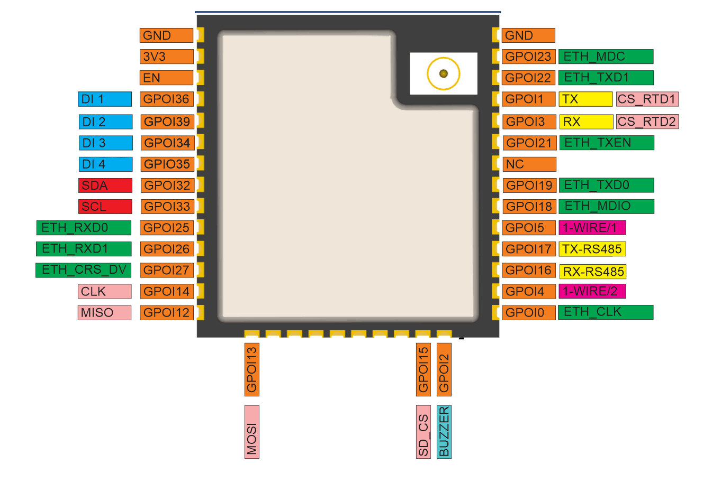
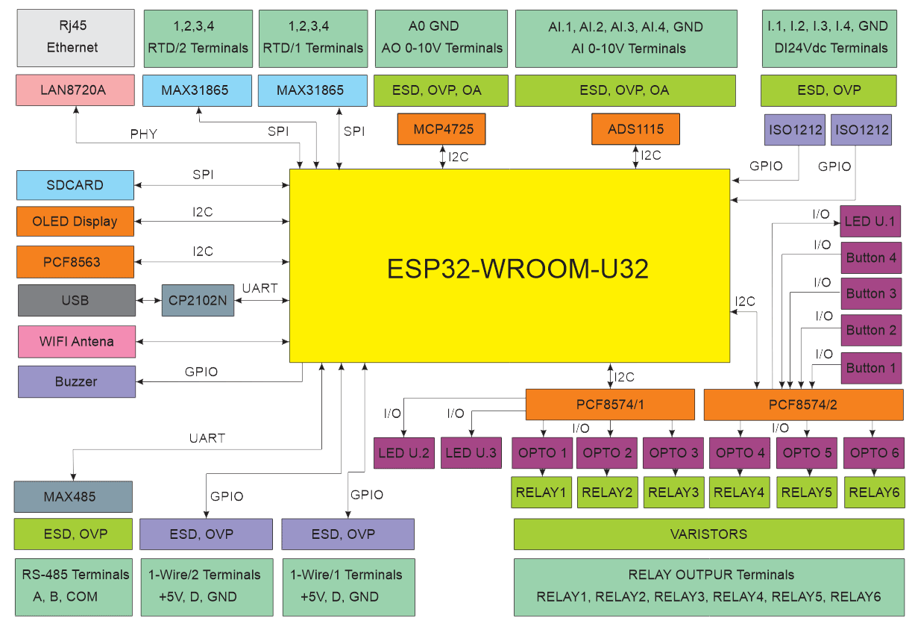

## Product description

The HOMAMASTER MiniPLC is a powerful and compact automation controller designed for advanced smart home applications. Built around the ESP32-WROOM-32U

Maker: https://www.home-master.eu/

Product page: https://www.home-master.eu/shop/esp32-miniplc-55

## Key Features

24V Digital Inputs – 4 industrial-grade inputs for dry contacts.

Relay Outputs – 6 relays controlled via I²C expanders for switching AC/DC loads.

Analog Inputs – 4 high-resolution 16-bit channels (ADS1115) for monitoring 0–10V signals.

Analog Output (0–10V) – 1 DAC output (MCP4725) for generating analog control signals.

Temperature Sensors – Supports 2xRTD (MAX31865) sensors.

Two 1-Wire.

User Interface – 4 front-panel buttons and configurable LEDs for local interaction.

OLED Display – 128x64 screen for displaying data and interaction.

RTC with Backup – PCF8563 real-time clock with Home Assistant synchronization.

I²C Expanders – PCF8574 chips expand digital I/O for more flexible device control.

Modbus RTU – UART-based support for extension modules.

## Networking

Wi-Fi Connectivity – Integrated Wi-Fi for wireless access and Home Assistant integration.

Ethernet Support – Optional LAN8720 PHY via RMII interface for reliable wired networking.

## Pinout



## MiniPLC Functional Block Diagram



## Programming

## Programming

The MicroPLC comes with ESPHome pre-installed and can be confgured via:

### Improve

Wi-Fi Configuration with Improv

1. Power on your HomeMaster MinioPLC.
2. Go to 👉 improv-wifi.com.
3. Connect via USB (Serial) or Bluetooth LE.
4. Enter your Wi-Fi SSID and password, then press Connect.
5. The device joins your Wi-Fi and is now ready.

You can then access it via its local address (e.g., http://homemaster-microplc.local) or directly in Home Assistant.

### One-Click Import (ESPHome Dashboard Import)

Once connected to Wi-Fi, the MicroPLC will be automatically discovered in ESPHome Dashboard.
When the device appears in ESPHome Dashboard, click “Take Control”.
The MicroPLC supports dashboard import, automatically pulling its official configuration from GitHub

### USB Type-C: Use the ESPHome Dashboard to upload the configuration

1. Connect the MicroPLC to your computer with a USB Type-C cable.
2. Download the YAML configuration file from our GitHub repository.(https://github.com/isystemsautomation/HOMEMASTER/blob/main/MiniPLC/Firmware/miniplc.yaml)
3. Open the ESPHome Dashboard, import the YAML file, and update it with your Wi-Fi SSID and password.
4. Flash the device directly from ESPHome Dashboard.
5. The MicroPLC supports automatic reset and boot control — there is no need to press reset or boot buttons during programming.
6. After flashing, the device will reboot automatically and run the updated firmware.

## Bus system configuration

### I2C

|        | PIN                           |
| ------ | ----------------------------- |
| SDA    | GPIO32                        |
| SCL    | GPIO33                        |

### I2C addresses

|              | address                     |
| ------------ | --------------------------- |
| pcf8574/2    | 0x38                        |
| pcf8574/1    | 0x39                        |
| ads1115      | 0x48                        |
| SH1106 128x64| 0x3C                        |
| pcf8563      | 0x51                        |

### SPI

|        | PIN                           |
| ------ | ----------------------------- |
| MISO   | GPIO12                        |
| MOSI   | GPIO13                        |
| CLK    | GPIO14                        |

### SPI_CS pins

|                | PIN                           |
| -------------- | ----------------------------- |
| max31865 RTD1  | GPIO01                        |
| max31865 RTD1  | GPIO03                        |
| SDCARD         | GPIO15                        |

## Basic Config

```yaml
# ESPHome configuration for MiniPLC
# This file configures an ESP32-based automation controller with:
# - Modbus RTU over UART
# - 1-Wire sensors
# - I2C PCF8574 expanders
# - I2C PCF8563 RTC
# - SPI-based MAX31865 temperature sensors
# - ADC inputs via ADS1115
# - DAC input MCP4725
# - OLED display over I2C
# - Ethernet
# - Multiple GPIOs managed via PCF8574 expanders
substitutions:
  name: "homemaster-miniplc"           # Internal device name (used by ESPHome & hostname)
  friendly_name: "Homemaster MiniPLC"  # Friendly name (shown in Home Assistant UI)
  room: ""                              # Optional: assign device to a room in HA
  device_description: "Homemaster MiniPLC"  # Description for documentation
  project_name: "Homemaster.MiniPLC"   # Project identifier
  project_version: "v1.0.0"             # Firmware version
  update_interval: 60s                  # Default sensor update interval
  dns_domain: ".local"                  # mDNS domain suffix for network discovery
  timezone: ""                          # Timezone (can be set if device runs in different region)
  wifi_fast_connect: "false"            # If true, reconnects faster (skips Wi-Fi scans)
  log_level: "DEBUG"                    # Logging level (NONE, ERROR, WARN, INFO, DEBUG, VERBOSE)
  ipv6_enable: "false"                  # Enable IPv6 if supported

esphome:
  name: "${name}"                       # Uses substitution for device name
  friendly_name: "${friendly_name}"     # Uses substitution for friendly name
  comment: "${device_description}"      # Metadata comment
  area: "${room}"                       # Assign device to a room
  min_version: 2025.7.0                 # Minimum ESPHome version required
  name_add_mac_suffix: true             # Append MAC to hostname to avoid duplicates
  project:
    name: "${project_name}"             # Project name
    version: "${project_version}"       # Project version

esp32:
  board: esp32dev              # Target board type (generic ESP32 DevKit)
  framework:
    type: esp-idf                       # Use ESP-IDF (official Espressif framework)
    version: recommended                # Recommended stable version

logger:
  baud_rate: 115200                     # Serial logging baud rate
  level: ${log_level}                   # Logging level from substitutions

mdns:
  disabled: false                       # Enable mDNS for auto-discovery on the network

api:                                    # Enable ESPHome API for Home Assistant integration

ota:
  - platform: esphome

network:
  enable_ipv6: ${ipv6_enable}

wifi:
  ap: {}
  fast_connect: "${wifi_fast_connect}"
  domain: "${dns_domain}"

captive_portal:                         # Captive portal for fallback hotspot

improv_serial:                          # Allows setup via Improv over Serial

esp32_improv:
  authorizer: none                      # No additional authorization required for Improv

dashboard_import:
  package_import_url: github://isystemsautomation/HOMEMASTER/MiniPLC/Firmware/miniplc.yaml@main
  import_full_config: true   # Allows importing this YAML from GitHub into ESPHome Dashboard

#ethernet:
#  type: LAN8720
#  mdc_pin: GPIO23
#  mdio_pin: GPIO18
#  clk_mode: GPIO0_OUT
#  phy_addr: 1

uart:
  tx_pin: 17
  rx_pin: 16
  baud_rate: 19200
  id: mod_uart

one_wire:
  - platform: gpio
    pin: GPIO05
    id: hub_1
  - platform: gpio
    pin: GPIO04
    id: hub_2

i2c:
  - id: bus_a
    sda: 32
    scl: 33
    frequency: 400kHz
    timeout: 1s
    scan: true

time:
  - platform: pcf8563
    id: pcf8563_time
    address: 0x51
  - platform: homeassistant
    # instead try to synchronize via network repeatedly ...
    on_time_sync:
      then:
        # ... and update the RTC when the synchronization was successful
        pcf8563.write_time:

pcf8574:
  - id: 'pcf8574_hub_a'
    address: 0x38
    pcf8575: false
  - id: 'pcf8574_hub_b'
    address: 0x39
    pcf8575: false

ads1115:
  - address: 0x48

# spi:
#  miso_pin: GPIO12
#  mosi_pin: GPIO13
#  clk_pin: GPIO14

display:
  - platform: ssd1306_i2c
    model: "SH1106 128x64"
    address: 0x3C
    rotation: 180
    contrast: 100%
    id: oled_display
    update_interval: 1s

binary_sensor:
  - platform: gpio
    pin:
      number: GPIO36
    name: "DI #1"
  - platform: gpio
    pin:
      number: GPIO39
    name: "DI #2"
  - platform: gpio
    pin:
      number: GPIO34
    name: "DI #3"
  - platform: gpio
    pin:
      number: GPIO35
    name: "DI #4"
  - platform: gpio
    name: "Button #1"
    pin:
      pcf8574: pcf8574_hub_a
      number: 0
      inverted: true
  - platform: gpio
    name: "Button #2"
    pin:
      pcf8574: pcf8574_hub_a
      number: 1
      inverted: true
  - platform: gpio
    name: "Button #3"
    pin:
      pcf8574: pcf8574_hub_a
      number: 2
      inverted: true
  - platform: gpio
    name: "Button #4"
    pin:
      pcf8574: pcf8574_hub_a
      number: 3
      inverted: true

switch:
 - platform: gpio
   name: "RELAY #1"
   pin:
      pcf8574: pcf8574_hub_b
      number: 2
      mode:
        output: true
      inverted: true
 - platform: gpio
   name: "RELAY #2"
   pin:
      pcf8574: pcf8574_hub_b
      number: 1
      mode:
        output: true
      inverted: true
 - platform: gpio
   name: "RELAY #3"
   pin:
      pcf8574: pcf8574_hub_b
      number: 0
      mode:
        output: true
      inverted: true

 - platform: gpio
   name: "RELAY #4"
   pin:
      pcf8574: pcf8574_hub_a
      number: 6
      mode:
        output: true
      inverted: true
 - platform: gpio
   name: "RELAY #5"
   pin:
      pcf8574: pcf8574_hub_a
      number: 5
      mode:
        output: true
      inverted: true
 - platform: gpio
   name: "RELAY #6"
   pin:
      pcf8574: pcf8574_hub_a
      number: 4
      mode:
        output: true
      inverted: true
 - platform: gpio
   name: "LED #2"
   pin:
      pcf8574: pcf8574_hub_b
      number: 3
      mode:
        output: true
      inverted: true
 - platform: gpio
   name: "LED #3"
   pin:
      pcf8574: pcf8574_hub_b
      number: 4
      mode:
        output: true
      inverted: true
 - platform: template
   name: "Switch buzzer"
   optimistic: true
   turn_on_action:
     - output.turn_on: buzzer_output
     - output.ledc.set_frequency:
         id: buzzer_output
         frequency: "2441Hz"
     - output.set_level:
         id: buzzer_output
         level: "75%"
   turn_off_action:
     - output.turn_off: buzzer_output

fan:
  - platform: speed
    output: dac_output
    name: "DAC 0-10V"

sensor:
#MAX 31865 RTD
#  - platform: max31865
#    name: "MAX 31856 Temperature 1"
#    cs_pin: GPIO1
#    reference_resistance: 400 Ω
#    rtd_nominal_resistance: 100 Ω
#    update_interval: 60s
#  - platform: max31865
#    name: "MAX 31856 Temperature 2"
#    cs_pin: GPIO3
#    reference_resistance: 4000 Ω
#    rtd_nominal_resistance: 1000 Ω
#    update_interval: 60s
  - platform: ads1115
    multiplexer: 'A0_GND'
    gain: 6.144
    name: "ADC AI4"
    update_interval: 60s
    filters:
      - multiply: 3
  - platform: ads1115
    multiplexer: 'A1_GND'
    gain: 6.144
    name: "ADC AI3"
    update_interval: 60s
    filters:
      - multiply: 3
  - platform: ads1115
    multiplexer: 'A2_GND'
    gain: 6.144
    name: "ADC AI2"
    update_interval: 60s
    filters:
      - multiply: 3
  - platform: ads1115
    multiplexer: 'A3_GND'
    gain: 6.144
    name: "ADC AI1"
    update_interval: 60s
    filters:
      - multiply: 3

output:
 - platform: ledc
   pin: GPIO02
   id: buzzer_output  
 - platform: mcp4725
   id: dac_output
status_led:
  pin:
     pcf8574: pcf8574_hub_a
     number: 7
     mode:
       output: true
     inverted: false
```
