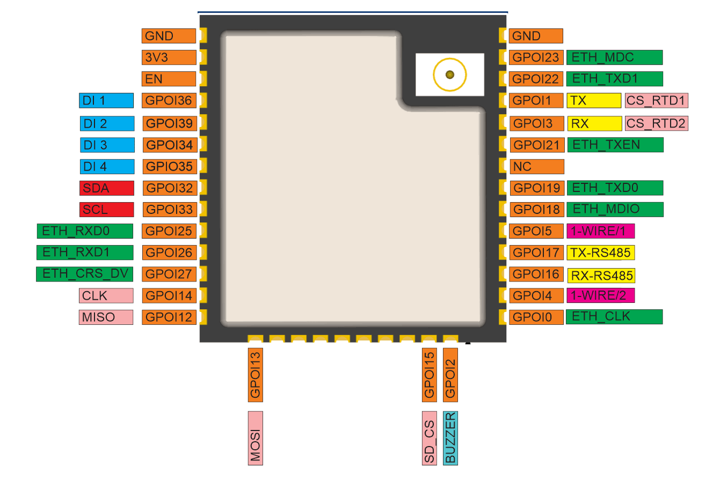
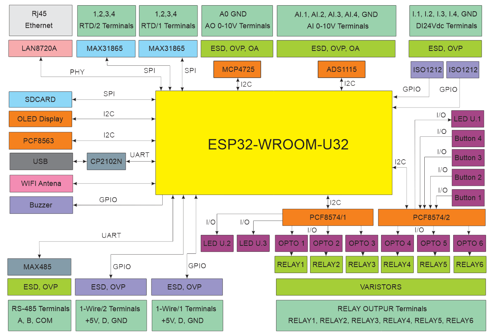

## Product description

The HomeMaster MiniPLC is an open-source DIN-rail automation controller based on the ESP32-WROOM-32U.
Designed for seamless integration with Home Assistant using ESPHome, it combines digital inputs,
relay outputs, analog inputs, an analog output, RTD and 1-Wire temperature inputs, an OLED display,
front-panel buttons, a battery-backed RTC, and an isolated RS-485 / Modbus RTU bus.

Maker: [home-master.eu](https://www.home-master.eu/)

Product page: [home-master.eu/shop/esp32-miniplc-55](https://www.home-master.eu/shop/esp32-miniplc-55)

Repository: [GitHub — isystemsautomation/homemaster-dev/MiniPLC](https://github.com/isystemsautomation/homemaster-dev/tree/main/MiniPLC)

Schematics: [MiniPLC/Schematic](https://github.com/isystemsautomation/homemaster-dev/tree/main/MiniPLC/Schematic)

Datasheet: [MiniPLC_Datasheet.pdf](https://github.com/isystemsautomation/homemaster-dev/blob/main/MiniPLC/Manuals/MiniPLC_Datasheet.pdf)

User Manual: [User Manual.pdf](https://github.com/isystemsautomation/homemaster-dev/blob/main/MiniPLC/Manuals/User%20Manual.pdf)

Declaration of Conformity: [DoC-MiniPLC-V1.0.pdf](https://github.com/isystemsautomation/homemaster-dev/blob/main/MiniPLC/Manuals/DoC-MiniPLC-V1.0.pdf)

## Features

- **ESP32-WROOM-32U** microcontroller with Wi-Fi and Bluetooth
- **ESPHome compatible firmware** for seamless Home Assistant integration
- **6 × SPDT dry-contact relay outputs** (driven via PCF8574 I/O expanders)
- **4 × isolated 24 V DC digital inputs** with PTC fuse, TVS and EMI filtering
- **4 × 0–10 V analog inputs** (ADS1115, 16-bit)
- **1 × 0–10 V analog output** (MCP4725, 12-bit DAC)
- **2 × RTD inputs** (PT100 / PT1000 via MAX31865) and **2 × 1-Wire** (DS18B20 compatible)
- **Isolated RS-485 / Modbus RTU** for extension modules
- **128 × 64 OLED display** (SH1106) + **4 front-panel buttons**, status LEDs, buzzer
- **PCF8563 RTC** with battery backup
- **USB Type-C** for programming, debugging and power
- **Built-in web server** for local control and diagnostics
- **Optional Ethernet** (LAN8720 PHY)
- **DIN-rail mountable** for standard electrical enclosures

## Networking

**Wi-Fi Connectivity** – Integrated Wi-Fi for wireless access and Home Assistant
integration. Enabled by default in the shipped firmware.

**Optional wired Ethernet** via on-board LAN8720 PHY (RMII). Not enabled by
default. ESPHome does not allow `wifi:` and `ethernet:` simultaneously, so
switching to Ethernet replaces Wi-Fi rather than adding to it. See the
[project README](https://github.com/isystemsautomation/homemaster-dev/blob/main/MiniPLC/README.md)
for the full Ethernet configuration.

## Pinout



## MiniPLC Functional Block Diagram



## Programming

The MiniPLC comes with ESPHome pre-installed and can be configured via:

### Improv

Wi-Fi Configuration with Improv

1. Power on your HomeMaster MiniPLC.
2. Go to [improv-wifi.com](https://improv-wifi.com) (works in Chrome/Edge on desktop or mobile).
3. Connect via USB (Serial) or Bluetooth LE.
4. Enter your Wi-Fi SSID and password, then press Connect.
5. The device joins your Wi-Fi and is now ready.

After provisioning, the device appears automatically in Home Assistant and
in the ESPHome Dashboard. Its hostname (with a MAC suffix to avoid
collisions, e.g. `homemaster-miniplc-<mac>.local`) is shown in the ESPHome
Dashboard — the built-in web UI is reachable at that address on port 80.

### One-Click Import (ESPHome Dashboard Import)

Once connected to Wi-Fi, the MiniPLC will be automatically discovered in ESPHome Dashboard.

When the device appears in ESPHome Dashboard, click "Take Control".

The MiniPLC supports dashboard import, automatically pulling its official configuration from GitHub.

### USB Type-C: Use the ESPHome Dashboard to upload the configuration

1. Connect the MiniPLC to your computer with a USB Type-C cable.
2. Download the YAML configuration file from our [GitHub repository](https://github.com/isystemsautomation/homemaster-dev/blob/main/MiniPLC/Firmware/miniplc.yaml).
3. Open the ESPHome Dashboard, import the YAML file, and update it with your Wi-Fi SSID and password.
4. Flash the device directly from ESPHome Dashboard.
5. The MiniPLC supports automatic reset and boot control — there is no
   need to press reset or boot buttons during programming.
6. After flashing, the device will reboot automatically and run the updated firmware.

## Bus system configuration

### I2C

|     | PIN    |
| --- | ------ |
| SDA | GPIO32 |
| SCL | GPIO33 |

### I2C addresses

|                  | address |
| ---------------- | ------- |
| pcf8574 hub_a    | 0x20    |
| pcf8574 hub_b    | 0x21    |
| ads1115          | 0x48    |
| mcp4725 (DAC)    | 0x60    |
| pcf8563 (RTC)    | 0x51    |
| ssd1306 / SH1106 | 0x3C    |

### SPI

|      | PIN    |
| ---- | ------ |
| MISO | GPIO12 |
| MOSI | GPIO13 |
| CLK  | GPIO14 |

The SPI bus is used internally by the two on-board MAX31865 RTD interfaces with
chip-select on **GPIO1** (RTD #1) and **GPIO3** (RTD #2).

The RTD inputs and 1-Wire sensors are disabled in the factory firmware;
see the [project README](https://github.com/isystemsautomation/homemaster-dev/blob/main/MiniPLC/README.md)
for configuration.

## Specifications

| Feature           | Details                                                         |
| ----------------- | --------------------------------------------------------------- |
| Microcontroller   | ESP32-WROOM-32U                                                 |
| Power Supply      | 24 V DC, or 85–265 V AC, or 120–370 V DC (single input)         |
| Relay Outputs     | 6 × SPDT dry-contact (3 A @ 250 VAC system limit)               |
| Digital Inputs    | 4 × 24 V DC isolated                                            |
| Analog Inputs     | 4 × 0–10 V (ADS1115)                                            |
| Analog Output     | 1 × 0–10 V (MCP4725)                                            |
| Temperature       | 2 × RTD (MAX31865), 2 × 1-Wire (DS18B20)                        |
| Communication     | RS-485 (Modbus RTU), Wi-Fi, Bluetooth, optional Ethernet, USB-C |
| Display           | 128 × 64 OLED (SH1106)                                          |
| RTC               | PCF8563 (battery backup)                                        |
| Mounting          | 35 mm DIN rail (9 modules)                                      |
| Firmware          | ESPHome (pre-installed)                                         |

## Full shipped firmware (factory)

This is the actual YAML the device ships with from the factory and is what
dashboard_import pulls in when you click **Take Control**.

```yaml url=https://github.com/isystemsautomation/homemaster-dev/blob/main/MiniPLC/Firmware/miniplc.yaml
```
