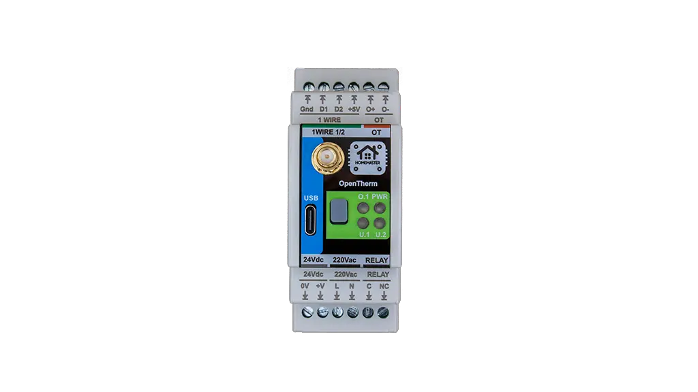
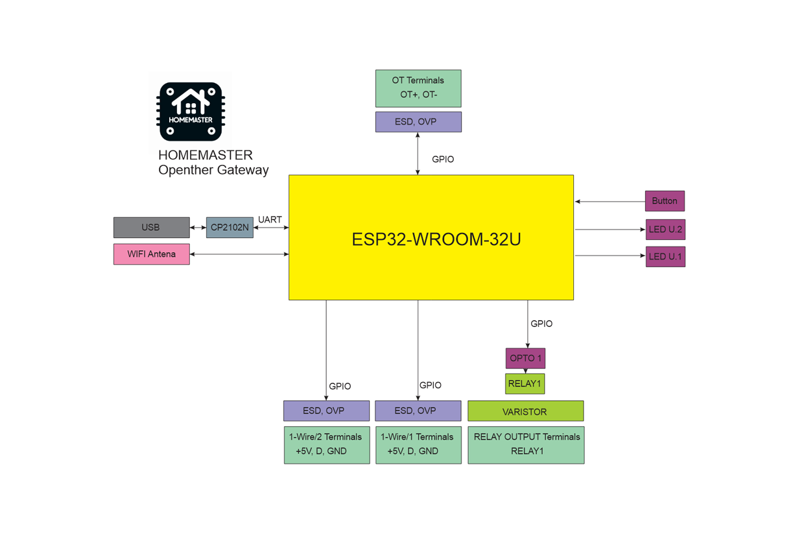

## Product description

The HomeMaster OpenTherm Gateway is an open-source DIN-rail device based on the ESP32-WROOM-32U-N16
that interfaces with OpenTherm-compatible boilers. It provides a hardware OpenTherm interface together
with one relay output and two 1-Wire temperature buses, and integrates directly with Home Assistant
via the pre-installed ESPHome firmware.

Maker: [home-master.eu](https://www.home-master.eu/)

Product page: [home-master.eu/shop/opentherm-gateway-59](https://www.home-master.eu/shop/opentherm-gateway-59)

Repository: [GitHub — isystemsautomation/homemaster-dev/OpenthermGateway](https://github.com/isystemsautomation/homemaster-dev/tree/main/OpenthermGateway)

Schematics: [OpenthermGateway/Schematic](https://github.com/isystemsautomation/homemaster-dev/tree/main/OpenthermGateway/Schematic)

Datasheet: [OpenTherm_Datasheet.pdf](https://github.com/isystemsautomation/homemaster-dev/blob/main/OpenthermGateway/Manuals/OpenTherm_Datasheet.pdf)

## Features

- **ESP32-WROOM-32U-N16** microcontroller with Wi-Fi and Bluetooth (16 MB flash, external antenna)
- **ESPHome compatible firmware** for seamless Home Assistant integration
- **Hardware OpenTherm interface** (OT+ / OT-)
- **1 × SPDT dry-contact relay output** (3 A @ 250 VAC system limit)
- **2 × 1-Wire buses** (DS18B20 compatible)
- **1 front-panel button + status LED**
- **Power input options**: 24 V DC, 85–265 V AC, or 120–370 V DC
- **USB Type-C** for programming, debugging and power
- **Built-in web server** for local control and diagnostics
- **DIN-rail mountable** (2 DIN modules)

## Networking

Wi-Fi Connectivity – Integrated Wi-Fi for wireless access and Home Assistant integration.

## Pinout


## OpenTherm Gateway Functional Block Diagram



## Programming

The OpenTherm Gateway comes with ESPHome pre-installed and can be configured via:

### Improv

Wi-Fi Configuration with Improv

1. Power on your HomeMaster OpenTherm Gateway.
2. Go to [improv-wifi.com](https://improv-wifi.com) (works in Chrome/Edge on desktop or mobile).
3. Connect via USB (Serial) or Bluetooth LE.
4. Enter your Wi-Fi SSID and password, then press Connect.
5. The device joins your Wi-Fi and is now ready.

After provisioning, the device appears automatically in Home Assistant and
in the ESPHome Dashboard. Its hostname (with a MAC suffix to avoid
collisions, e.g. `homemaster-opentherm-<mac>.local`) is shown in the
ESPHome Dashboard — the built-in web UI is reachable at that address on
port 80.

### One-Click Import (ESPHome Dashboard Import)

Once connected to Wi-Fi, the OpenTherm Gateway will be automatically discovered in ESPHome Dashboard.

When the device appears in ESPHome Dashboard, click "Take Control".

The device supports dashboard import, automatically pulling its official configuration from GitHub.

### USB Type-C: Use the ESPHome Dashboard to upload the configuration

1. Connect the device to your computer with a USB Type-C cable.
2. Download the YAML configuration file from our [GitHub repository](https://github.com/isystemsautomation/homemaster-dev/blob/main/OpenthermGateway/Firmware/opentherm.yaml).
3. Open the ESPHome Dashboard, import the YAML file, and update it with your Wi-Fi SSID and password.
4. Flash the device directly from ESPHome Dashboard.
5. The device supports automatic reset and boot control — there is no
   need to press reset or boot buttons during programming.
6. After flashing, the device will reboot automatically and run the updated firmware.

## GPIO map

| Signal  | Function           | GPIO   |
| ------- | ------------------ | ------ |
| OT+     | OpenTherm output   | GPIO26 |
| OT-     | OpenTherm input    | GPIO21 |
| D1      | 1-Wire Bus 1       | GPIO4  |
| D2      | 1-Wire Bus 2       | GPIO5  |
| Relay   | SPDT dry-contact   | GPIO32 |
| Button  | Front-panel button | GPIO35 |
| Status  | Status LED         | GPIO33 |

## Specifications

| Feature           | Details                                                  |
| ----------------- | -------------------------------------------------------- |
| Microcontroller   | ESP32-WROOM-32U-N16 (16 MB flash, external antenna)      |
| Power Supply      | 24 V DC, or 85–265 V AC, or 120–370 V DC (single input)  |
| OpenTherm         | Hardware interface (OT+ / OT-)                           |
| Relay Output      | 1 × SPDT dry-contact (3 A @ 250 VAC, 90 W @ 30 VDC)      |
| Temperature       | 2 × 1-Wire (DS18B20 compatible)                          |
| Communication     | Wi-Fi, Bluetooth, USB-C                                  |
| Mounting          | 35 mm DIN rail (2 modules)                               |
| Firmware          | ESPHome (pre-installed)                                  |

## Example configuration

Hardware-only example showing the OpenTherm bus, relay, button, status LED and 1-Wire buses. Network plumbing
(`api`, `ota`, `wifi`, `captive_portal`, `improv_*`, `dashboard_import`, vendor HTTP OTA) is intentionally
omitted here per `esphome-devices` rules and is provided by the upstream shipped configuration linked below.

```yaml file=config.yaml
```

## Full shipped firmware (factory)


```yaml url=https://github.com/isystemsautomation/homemaster-dev/blob/main/OpenthermGateway/Firmware/opentherm.yaml
```
