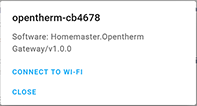

## 🔥 Opentherm Gateway – DIN-Rail Smart Heating Interface for Home Assistant


## 🌡️ Description

The Opentherm Gateway enables full bidirectional OpenTherm communication for intelligent climate control. It supports monitoring and control of key heating parameters such as burner status, flame modulation, setpoint temperatures, and system diagnostics.

A built-in high-voltage relay allows local control of zone valves or backup heaters, while two independent **1-Wire interfaces** support digital temperature sensors (e.g., DS18B20) for detailed room or system temperature monitoring.

## ⚙️ Key Features

- **OpenTherm Interface**: Full OpenTherm communication with compatible boilers for temperature control and diagnostics
- **ESP32-WROOM-32U**: Wi-Fi/Bluetooth-enabled microcontroller with ESPHome pre-installed
- **Relay Output**: One high-voltage relay for local switching (e.g., heaters, zone valves)
- **Dual 1-Wire Interfaces**: Two isolated 1-Wire buses for temperature sensors like DS18B20
- **Power Options**: Operates on 24 VDC or 220 VAC/220VDC for flexible installation
- **USB Type-C**: For firmware updates, serial configuration, and power
- **OTA Updates**: Supported via ESPHome for wireless firmware management
- **Improv**: Wi-Fi Configuration
- **DIN-Rail Mountable**: Standardized enclosure for electrical cabinets
- **Status LEDs**: Visual indicators for power, relay, OpenTherm, and Wi-Fi status

## Networking

Wi-Fi Connectivity – Integrated Wi-Fi for wireless access and Home Assistant integration.

## Pinout


## OpenTherm Gateway Functional Block Diagram


## Programming

The OpenTherm Gateway comes with ESPHome pre-installed and can be configured via:

### 🚀 Improv – Wi-Fi Configuration (Zero Configuration Setup)

To connect your **Homemaster OpenTherm Gateway** to your Wi-Fi without flashing, use **Improv**:

Power on your device.
Open [improv-wifi.com](https://www.improv-wifi.com) in **Chrome** or **Edge** (desktop or mobile).
Connect to the device using **USB (Serial)** or **Bluetooth LE**.
Enter your Wi-Fi credentials and click **Connect**.



Once provisioned, you’ll see confirmation:


✅ The device is now on your network.

You can now manage it from the **ESPHome Dashboard** or directly in **Home Assistant**, where it will appear automatically.

> ⚠️ **Note:**  
> The device does **not** host a web server by default, so accessing it via `http://opentherm.local` will **not work** unless `web_server:` is added to the YAML.  
> Also, because `name_add_mac_suffix: true` is set, the actual hostname includes a unique suffix, like `http://homemaster-opentherm-3f9a7c.local`. Use ESPHome or Home Assistant for discovery.

---

### 🧩 One-Click Import (ESPHome Dashboard)

Once connected to Wi-Fi, the OpenTherm Gateway will appear in your **ESPHome Dashboard** as a discovered device:


- Click **Take Control** to claim the device.
- ESPHome will automatically pull the official config from GitHub.

> ℹ️ No manual flashing is needed if the device is provisioned via Improv.

### 💻 USB Type-C Flashing (Manual Configuration)

1. Connect the OpenTherm Gateway to your computer with a USB Type-C cable.
2. Download the YAML configuration file from our GitHub repository.
3. Open the ESPHome Dashboard, import the YAML file, and update it with your Wi-Fi SSID and password.
4. Flash the device directly from ESPHome Dashboard.
5. The OpenTherm Gateway supports automatic reset and boot control — there is no need to press reset or boot buttons during programming.
6. After flashing, the device will reboot automatically and run the updated firmware.

## Specifications

| Feature              | Details                              |
|----------------------|--------------------------------------|
| Microcontroller      | ESP32-WROOM-32U                      |
| Power Supply         | 5V via USB-C for programming, 24V via terminal or 220VAC/DC via terminal      |
| Relay Output         | 1x 6A (optically isolated)     |
| Communication        | RS-485, Wi-Fi, Bluetooth, USB-C      |
| 1-Wire               | 2 channels (ESD/OVP protected)        |
| Mounting             | DIN-rail                             |
| Firmware             | ESPHome (pre-installed), Arduino |

## Basic Config

```yaml
substitutions:
  # General metadata and variables for reuse in the config
  name: "opentherm"                # Device hostname in ESPHome / network
  friendly_name: "Homemaster Opentherm Gateway"  # Friendly name in Home Assistant UI
  room: ""                                   # Optional: assign to a room in HA
  device_description: "Homemaster Opentherm Gateway" # Description for metadata
  project_name: "Homemaster.Opentherm Gateway" # Unique project identifier
  project_version: "v1.0.0"                  # Firmware version
  update_interval: 60s                       # Default sensor update frequency
  dns_domain: ".local"                       # mDNS domain suffix
  timezone: ""                               # Timezone (if needed different from HA server)
  wifi_fast_connect: "false"                 # Faster reconnect if true (skips scan)
  log_level: "DEBUG"                         # Logging level
  ipv6_enable: "false"                       # IPv6 support toggle

esphome:
  # Device-level settings for ESPHome
  name: "${name}"
  friendly_name: "${friendly_name}"
  comment: "${device_description}"
  area: "${room}"
  name_add_mac_suffix: true                  # Append MAC to hostname to avoid duplicates
  min_version: 2025.7.0                      # Minimum ESPHome version required
  project:
    name: "${project_name}"
    version: "${project_version}"

esp32:
  # Target hardware platform
  board: esp32dev
  framework:
    type: esp-idf                            # Use Espressif IDF framework
    version: recommended

logger:
  baud_rate: 115200                          # Serial log speed
  level: ${log_level}                        # Log level set from substitutions

mdns:
  disabled: false                            # Enable mDNS for network discovery

api:                                         # Enable native ESPHome <-> Home Assistant API

ota:
  - platform: esphome
    id: ota_esphome                          # Over-the-air updates

network:
  enable_ipv6: ${ipv6_enable}                # Enable/disable IPv6

wifi:
  ap: {}                                     # Fallback AP for first-time setup
  fast_connect: "${wifi_fast_connect}"       # Quick reconnect option
  domain: "${dns_domain}"                    # mDNS suffix

captive_portal:                              # Captive portal for AP fallback

improv_serial:
  id: improv_serial_if                       # Enable Improv setup over serial

esp32_improv:
  authorizer: none
  id: improv_ble_if                          # Enable Improv setup over BLE

dashboard_import:
  # Auto-import official config from GitHub into ESPHome Dashboard
  package_import_url: github://isystemsautomation/HOMEMASTER/OpenthermGateway/Firmware/opentherm.yaml@main
  import_full_config: true

opentherm:
  id: ot_bus                                 # OpenTherm bus definition
  in_pin: 21                                 # GPIO for receiving OpenTherm signal
  out_pin: 26                                # GPIO for sending OpenTherm signal

# Local button on GPIO35
binary_sensor:
  - platform: gpio
    id: bs_button_1
    name: "Button #1"
    pin: GPIO35

switch:
# Local relay output
  - platform: gpio
    id: sw_relay
    pin: GPIO32
    name: "RELAY"

status_led:
  pin:
    number: GPIO33                          # Status LED pin
    inverted: true                          # LED is active-low
```

## 📥 Example: OpenTherm Boiler Configuration in ESPHome

To receive telemetry, diagnostics, and control capability from your OpenTherm-compatible boiler, add the following to your ESPHome configuration:

> ⚠️ **Note:**  
> This is a **configuration example**. The exact list of available values depends on your **boiler model** and which OpenTherm parameters it supports.

### 🔧 OpenTherm Sensors (`sensor:`)

```yaml
sensor:
  # OpenTherm boiler sensors (read-only values)
  - platform: opentherm
    t_dhw:           { id: s_t_dhw,         name: "DHW temperature (°C)" }
    rel_mod_level:   { id: s_rel_mod_level, name: "Relative modulation level (%)" }
    ch_pressure:     { id: s_ch_pressure,   name: "Water pressure in CH circuit (bar)" }
    dhw_flow_rate:   { id: s_dhw_flow_rate, name: "Water flow rate in DHW circuit (l/min)" }
    t_boiler:        { id: s_t_boiler,      name: "Boiler water temperature (°C)" }
    t_exhaust:       { id: s_t_exhaust,     name: "Boiler exhaust temperature (°C)" }
    t_dhw_set_ub:    { id: s_t_dhw_set_ub,  name: "Upper bound for DHW setpoint (°C)" }
    t_dhw_set_lb:    { id: s_t_dhw_set_lb,  name: "Lower bound for DHW setpoint (°C)" }
    max_t_set_ub:    { id: s_max_t_set_ub,  name: "Upper bound for max CH setpoint (°C)" }
    max_t_set_lb:    { id: s_max_t_set_lb,  name: "Lower bound for max CH setpoint (°C)" }
    t_dhw_set:       { id: s_t_dhw_set,     name: "DHW temperature setpoint (°C)" }
    max_t_set:       { id: s_max_t_set,     name: "Max CH water setpoint (°C)" }
```

### 🔧 OpenTherm State Sensors (`binary_sensor:`)

```yaml
binary_sensor:
  # OpenTherm boiler state sensors
  - platform: opentherm
    ch_active:             { id: bs_ch_active,  name: "Boiler Central Heating active" }
    dhw_active:            { id: bs_dhw_active, name: "Boiler Domestic Hot Water active" }
    flame_on:              { id: bs_flame_on,   name: "Boiler Flame on" }
    fault_indication:      { id: bs_fault,      name: "Boiler Fault indication", entity_category: diagnostic }
    diagnostic_indication: { id: bs_diag,       name: "Boiler Diagnostic event",  entity_category: diagnostic }
```

### 🔧 Writable OpenTherm Parameters (`number:` and `switch:`)

```yaml
number:
  # Control setpoints (writable values)
  - platform: opentherm
    t_set: { id: n_t_set, name: "Boiler Control setpoint", min_value: 20, max_value: 65, step: 0.5 }

switch:
  # Enable/disable boiler central heating via OpenTherm
  - platform: opentherm
    ch_enable: { id: sw_ch_enable, name: "Boiler Central Heating enabled", restore_mode: RESTORE_DEFAULT_ON }
```

### 💡 Tip:

Ensure the `opentherm:` component is defined in your configuration like this:

```yaml
opentherm:
  id: ot_bus
  in_pin: 21
  out_pin: 26
```

## 🏠 Integration with Home Assistant

When flashed with ESPHome, the Opentherm Gateway exposes the following entities in Home Assistant:

- Boiler on/off
- Burner status
- Flame modulation level (%)
- CH/DHW setpoint temperatures
- Boiler water temperature
- System pressure (if supported)
- Relay output status
- Temperature readings from connected 1-Wire sensors
- etc.
  
Once uploaded, the above entities will automatically appear in Home Assistant if OpenTherm communication is working correctly.

## 🧷 Connection Diagrams – Homemaster OpenTherm Gateway

Below are reference diagrams and safety notes for connecting **power**, **OpenTherm bus**, **1-Wire sensors**, and **relay outputs** to your Homemaster OpenTherm Gateway.

---

### ⚠️ Safety First

> ⚠️ **IMPORTANT SAFETY INFORMATION**
>
> - Disconnect all power before installation or wiring changes.
> - Use proper insulation and terminals when working with **230 VAC** mains voltage.
> - Use appropriately rated **fuses or circuit breakers** (e.g., 1A slow-blow) as shown in schematics.
> - The device contains opto-isolated and ESD-protected interfaces for safe signal connections.
> - Always refer to your **boiler's OpenTherm specification** before wiring the OT bus.

---

### 🔌 Power Supply Options

You can power the device using either:

#### 🔋 1. 24 VDC Low Voltage Power

Connect a **24 VDC power supply** to the `+V` and `0V` terminals..


---

#### ⚡ 2. 230 VAC Mains Power

If using mains voltage, connect **L** (Live) and **N** (Neutral) to the terminal block.


*Figure: AC mains power input connection*

---

### 🔁 Relay Output (Dry Contact)

The relay output is **optically isolated** (via PC817 and S8050 driver stage) and capable of switching **AC or DC loads** up to 6A.  
Use it to control zone valves, pumps, or backup heating.


---

### 🌡️ 1-Wire Sensor Connections

Two independent **1-Wire buses** are available, each with:

- ESD protection (DS9503)
- Series resistor + clamping diodes
- Separate power lines (`1-WIRE1`, `1-WIRE2`) and +5V rail

You can connect **DS18B20** sensors using parasitic or powered mode.


---

### 🔄 OpenTherm Bus Wiring

Connect the boiler’s **OpenTherm interface** to the OT+ and OT− terminals.

**Note:** These lines are optically isolated and buffered using:

- BAV99S protection diodes
- OpenTherm transceivers and opto-isolators (e.g., PC817)
- Pull-ups and current-limiting resistors


---

### ✅ Recommended Wire Sizes

| Function       | Recommended Wire Gauge |
|----------------|-------------------------|
| Power (24 VDC) | 0.5–1.0 mm²             |
| Power (230 VAC) | 1.0–1.5 mm²             |
| Relay Output   | 1.0–1.5 mm²             |
| 1-Wire Sensors | 0.22–0.5 mm² (shielded if long) |
| OpenTherm Bus  | 0.22–0.5 mm² twisted pair |

---

> 📘 **Tip**: Always follow **local electrical code** and **boiler manufacturer guidelines** when wiring heating systems.


> 💡 **Notes**
> - Verify polarity and follow **electrical safety standards** at all times.
> - Telemetry and control features depend on your **boiler’s OpenTherm support**. Check the boiler manual for details.


## 📚 Resources

- 💾 [GitHub Repository](https://github.com/isystemsautomation/HOMEMASTER/tree/main/OpenthermGateway)
- 🛒 [Product Page](https://www.home-master.eu/shop/esp32-opentherm-gateway-59)
- 📘 [Schematics & Datasheets](https://github.com/isystemsautomation/HOMEMASTER/tree/main/OpenthermGateway/Schematic)
