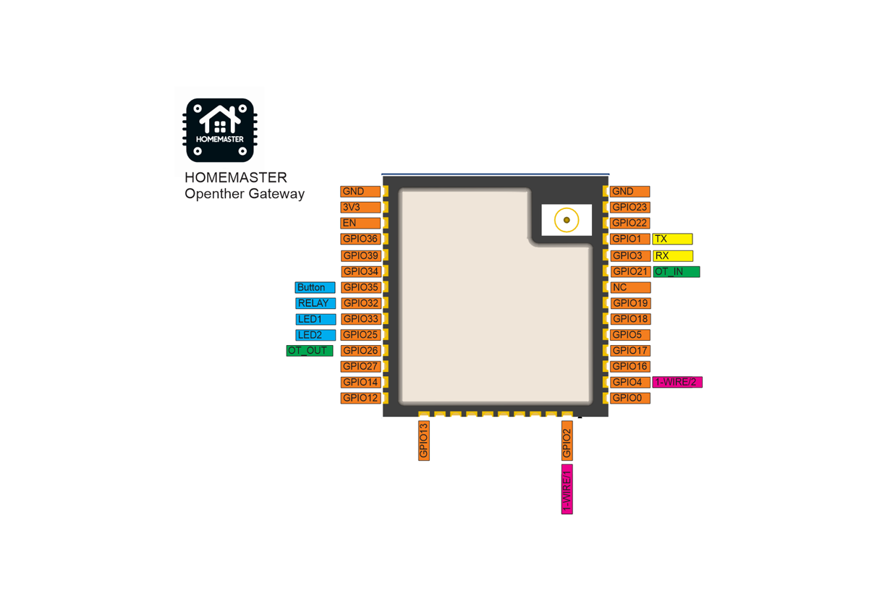

## 🔥 Opentherm Gateway – DIN-Rail Smart Heating Interface for Home Assistant


## Product description

## 🌡️ Description

The Opentherm Gateway enables full bidirectional OpenTherm communication for intelligent climate control. It supports monitoring and control of key heating parameters such as burner status, flame modulation, setpoint temperatures, and system diagnostics.

A built-in high-voltage relay allows local control of zone valves or backup heaters, while two independent **1-Wire interfaces** support digital temperature sensors (e.g., DS18B20) for detailed room or system temperature monitoring.

Maker: https://www.home-master.eu/

Product page: https://www.home-master.eu/shop/esp32-opentherm-gateway-59

Schematics: https://github.com/isystemsautomation/HOMEMASTER/tree/main/OpenthermGateway/Schematic

## Features

## ⚙️ Key Features

- **OpenTherm Interface**: Full OpenTherm communication with compatible boilers for temperature control and diagnostics
- **ESP32-WROOM-32U**: Wi-Fi/Bluetooth-enabled microcontroller with ESPHome pre-installed
- **Relay Output**: One high-voltage relay for local switching (e.g., heaters, zone valves)
- **Dual 1-Wire Interfaces**: Two isolated 1-Wire buses for temperature sensors like DS18B20
- **Power Options**: Operates on 24 VDC or 220 VAC/220VDC for flexible installation
- **USB Type-C**: For firmware updates, serial configuration, and power
- **OTA Updates**: Supported via ESPHome for wireless firmware management
- **Improv**: Wi-Fi Configuration
- **DIN-Rail Mountable**: Standardized enclosure for electrical cabinets
- **Status LEDs**: Visual indicators for power, relay, OpenTherm, and Wi-Fi status

## Networking

Wi-Fi Connectivity – Integrated Wi-Fi for wireless access and Home Assistant integration.

## Pinout



## OpenTherm Gateway Functional Block Diagram


## Programming

The OpenTherm Gateway comes with ESPHome pre-installed and can be configured via:

### Improv

Wi-Fi Configuration with Improv

1. Power on your HomeMaster OpenTherm Gateway.
2. Go to 👉 improv-wifi.com (works in Chrome/Edge on desktop or mobile).
3. Connect via USB (Serial) or Bluetooth LE.
4. Enter your Wi-Fi SSID and password, then press Connect.
5. The device joins your Wi-Fi and is now ready.

You can then access it via its local address (e.g., http://opentherm.local) or directly in Home Assistant.

### One-Click Import (ESPHome Dashboard Import)

Once connected to Wi-Fi, the OpenTherm Gateway will be automatically discovered in ESPHome Dashboard.
When the device appears in ESPHome Dashboard, click “Take Control”.
The OpenTherm Gateway supports dashboard import, automatically pulling its official configuration from GitHub

### USB Type-C: Use the ESPHome Dashboard to upload the configuration

1. Connect the OpenTherm Gateway to your computer with a USB Type-C cable.
2. Download the YAML configuration file from our GitHub repository.
3. Open the ESPHome Dashboard, import the YAML file, and update it with your Wi-Fi SSID and password.
4. Flash the device directly from ESPHome Dashboard.
5. The OpenTherm Gateway supports automatic reset and boot control — there is no need to press reset or boot buttons during programming.
6. After flashing, the device will reboot automatically and run the updated firmware.

## Specifications

| Feature              | Details                              |
|----------------------|--------------------------------------|
| Microcontroller      | ESP32-WROOM-32U                      |
| Power Supply         | 5V via USB-C for programming, 24V via terminal or 220VAC/DC via terminal      |
| Relay Output         | 1x 16A (optically isolated)     |
| Communication        | RS-485, Wi-Fi, Bluetooth, USB-C      |
| 1-Wire               | 2 channels (ESD/OVP protected)        |
| Mounting             | DIN-rail                             |
| Firmware             | ESPHome (pre-installed), Arduino |

## 🏠 Integration with Home Assistant

When flashed with ESPHome, the Opentherm Gateway exposes the following entities in Home Assistant:

- Boiler on/off
- Burner status
- Flame modulation level (%)
- CH/DHW setpoint temperatures
- Boiler water temperature
- System pressure (if supported)
- Relay output status
- Temperature readings from connected 1-Wire sensors
- etc.

## Basic Config

```yaml
substitutions:
  # General metadata and variables for reuse in the config
  name: "homemaster-opentherm"                # Device hostname in ESPHome / network
  friendly_name: "Homemaster Opentherm Gateway"  # Friendly name in Home Assistant UI
  room: ""                                   # Optional: assign to a room in HA
  device_description: "Homemaster Opentherm Gateway" # Description for metadata
  project_name: "Homemaster.Opentherm Gateway" # Unique project identifier
  project_version: "v1.0.0"                  # Firmware version
  update_interval: 60s                       # Default sensor update frequency
  dns_domain: ".local"                       # mDNS domain suffix
  timezone: ""                               # Timezone (if needed different from HA server)
  wifi_fast_connect: "false"                 # Faster reconnect if true (skips scan)
  log_level: "DEBUG"                         # Logging level
  ipv6_enable: "false"                       # IPv6 support toggle

esphome:
  # Device-level settings for ESPHome
  name: "${name}"
  friendly_name: "${friendly_name}"
  comment: "${device_description}"
  area: "${room}"
  name_add_mac_suffix: true                  # Append MAC to hostname to avoid duplicates
  min_version: 2025.7.0                      # Minimum ESPHome version required
  project:
    name: "${project_name}"
    version: "${project_version}"

esp32:
  # Target hardware platform
  board: esp32dev
  framework:
    type: esp-idf                            # Use Espressif IDF framework
    version: recommended

logger:
  baud_rate: 115200                          # Serial log speed
  level: ${log_level}                        # Log level set from substitutions

mdns:
  disabled: false                            # Enable mDNS for network discovery

api:                                         # Enable native ESPHome <-> Home Assistant API

ota:
  - platform: esphome
    id: ota_esphome                          # Over-the-air updates

network:
  enable_ipv6: ${ipv6_enable}                # Enable/disable IPv6

wifi:
  ap: {}                                     # Fallback AP for first-time setup
  fast_connect: "${wifi_fast_connect}"       # Quick reconnect option
  domain: "${dns_domain}"                    # mDNS suffix

captive_portal:                              # Captive portal for AP fallback

improv_serial:
  id: improv_serial_if                       # Enable Improv setup over serial

esp32_improv:
  authorizer: none
  id: improv_ble_if                          # Enable Improv setup over BLE

dashboard_import:
  # Auto-import official config from GitHub into ESPHome Dashboard
  package_import_url: github://isystemsautomation/HOMEMASTER/OpenthermGateway/Firmware/opentherm.yaml@main
  import_full_config: true

time:
  - platform: homeassistant                  # Sync time from Home Assistant
    id: homeassistant_time
    on_time_sync:                            # On first sync, publish "last restart"
      then:
        - if:
            condition:
              lambda: 'return id(device_last_restart).state == "";'
            then:
              - text_sensor.template.publish:
                  id: device_last_restart
                  state: !lambda 'return id(homeassistant_time).now().strftime("%a %d %b %Y - %I:%M:%S %p");'

opentherm:
  id: ot_bus                                 # OpenTherm bus definition
  in_pin: 21                                 # GPIO for receiving OpenTherm signal
  out_pin: 26                                # GPIO for sending OpenTherm signal

# Local button on GPIO35
  - platform: gpio
    id: bs_button_1
    name: "Button #1"
    pin: GPIO35

switch:
# Local relay output
  - platform: gpio
    id: sw_relay
    pin: GPIO32
    name: "RELAY"

status_led:
  pin:
    number: GPIO33                          # Status LED pin
    inverted: true                          # LED is active-low
```
