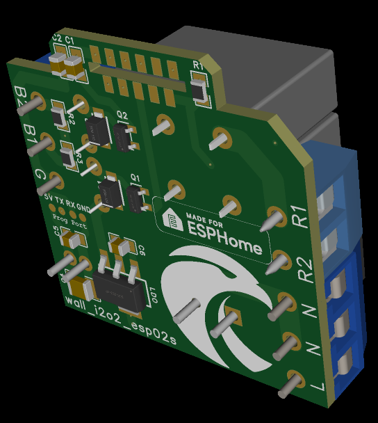
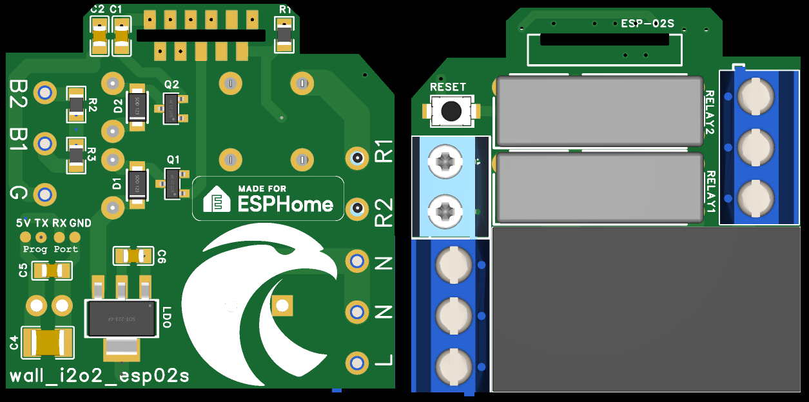
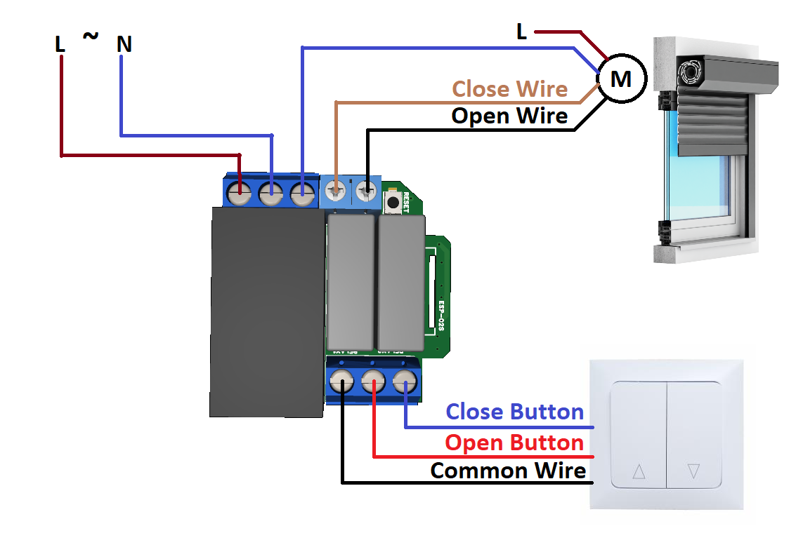

## Description

The Horus Blind Controller allows you to automate and control your blinds using Home Assistant while keeping manual operation via your existing physical switches. It seamlessly integrates with Home Assistant through ESPHome and requires minimal setup.




## Features

✅ Works with existing wall switches for manual control  
✅ Remote control via Home Assistant  
✅ Fully pre-flashed with ESPHome — no extra configuration required  
✅ Secure and reliable local communication (no cloud dependency)  
✅ Customizable automation rules  

## Wiring Diagram



## YAML Configuration

```yaml
substitutions:
  devicename: "horus-blind"

esphome:
  name: ${devicename}

esp8266:
  board: esp01_1m

# Enable logging
logger:

# Enable Home Assistant API
api:

ota:
  - platform: esphome
    password: ""

wifi:
  ssid: !secret wifi_ssid
  password: !secret wifi_password

  # Enable fallback hotspot (captive portal) in case wifi connection fails
  ap:
    ssid: "Horus-Blind"
    password: "esphomearez"

captive_portal:

#*** Web server optional if you whant check or control over http requests ***  
#web_server:
#  port: 80
#  version: 3
#  include_internal: true
#  ota: false

binary_sensor:
- platform: gpio
  pin:
    number: 4    # ---
    mode: INPUT_PULLUP
    inverted: true
  filters:
    - delayed_on: 50ms
    - delayed_off: 50ms
  id: button_open_1
  on_press:
    then:
      # logic for cycling through movements: open->stop->close->stop->...
      - lambda: |
          if (id(my_cover_1).current_operation == COVER_OPERATION_IDLE)  
            {
               id(my_cover_1).open();
               id(output_cover_open).turn_on();
            }
          else
            {
              id(my_cover_1).stop();   // Cover is opening/closing. Stop it
            }
  on_release:
    then:
      - lambda: |
          id(my_cover_1).stop();   // Cover is opening/closing. Stop it

- platform: gpio
  pin:
    number: 5  # ---
    mode: INPUT_PULLUP
    inverted: true
  filters:
    - delayed_on: 50ms
    - delayed_off: 50ms
  id: button_close_1
  on_press:
    then:
      # logic for cycling through movements: open->stop->close->stop->...
      - lambda: |
          if (id(my_cover_1).current_operation == COVER_OPERATION_IDLE)  
            {
               id(my_cover_1).close();
               id(output_cover_close).turn_on();
            }
          else
            {
              id(my_cover_1).stop();   // Cover is opening/closing. Stop it
            }
  on_release:
    then:
      - lambda: |
            id(my_cover_1).stop();   // Cover is opening/closing. Stop it

switch:
- platform: gpio
  pin:
    number: 14
    mode: OUTPUT
    inverted: false
  id: output_cover_open
- platform: gpio
  pin:
    number: 13
    mode: OUTPUT
    inverted: false
  id: output_cover_close

cover:
- platform: time_based
  name: "Blinds"
  id: my_cover_1
  open_action:
    - switch.turn_on: output_cover_open
    - switch.turn_off: output_cover_close
  open_duration: 23s    #Change this value in orther to match the blind open duration
  
  close_action:
    - switch.turn_off: output_cover_open
    - switch.turn_on: output_cover_close
  close_duration: 22s    #Change this value in orther to match the blind close duration
  
  stop_action:
    - switch.turn_off: output_cover_open
    - switch.turn_off: output_cover_close
```

## Installation

1. Connect the device to the existing blind switch following the wiring diagram.

2. Power on the device—it will automatically create a Wi-Fi hotspot if not connected to your home network.

3. Connect to the hotspot (SSID: ESPHome-XXXXXX), then configure the Wi-Fi settings.

4. Add to Home Assistant using the ESPHome integration.

## Home Assistant Integration

1. Navigate to Settings → Devices & Services

2. Click + Add Integration

3. Select ESPHome and enter the device IP address

## Automations & Controls

- Use the physical wall switches for direct control

- Create automations in Home Assistant to control blinds based on time, weather, or sunlight conditions

## Support

For troubleshooting, check the ESPHome logs:

```sh
esphome logs smart_blind_controller.yaml
```
