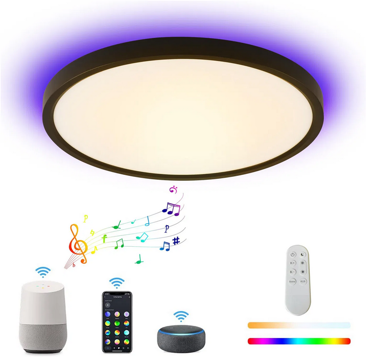
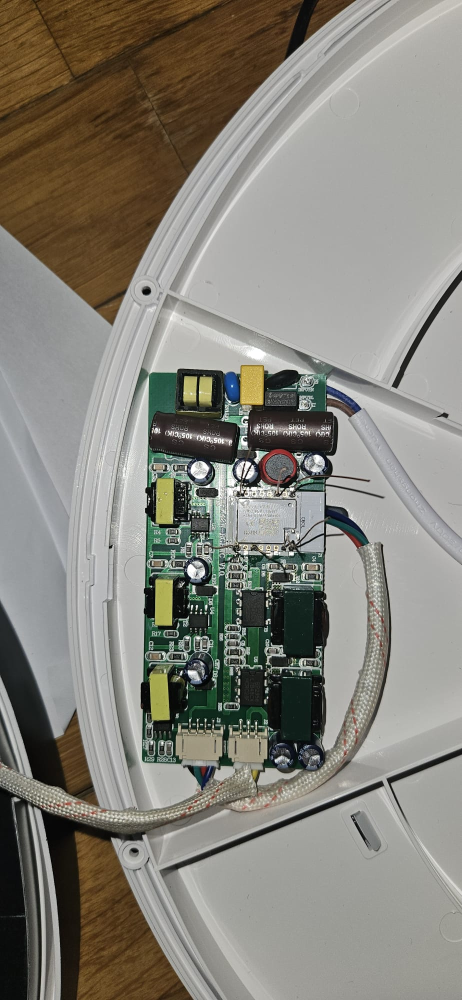
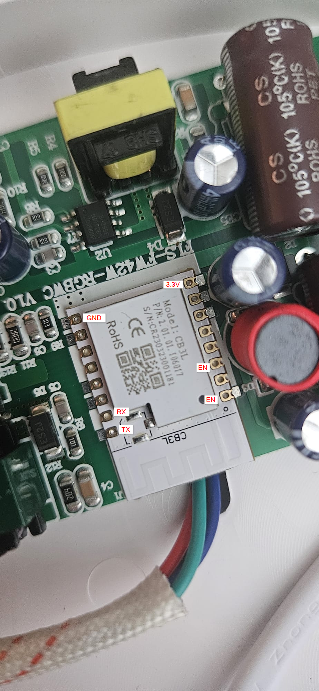

- The Immax RGBCW ceiling light has has CB3L (BK7231N) chip.
- Product site: https://www.immax.cz/immax-neo-lite-tudo-smart-stropni-svitidlo-rgb-podsviceni-40cm-50w-tuya-wifi-beacon-bila-p15662/




## Basic Configuration

```yaml
esphome:
  name: miro_ceiling_light
  friendly_name: immax_ceiling_light

bk72xx:
  board: cb3l

# Enable logging
logger:

# Enable Home Assistant API
api:
  encryption:
    key: "xxxxxxxxxxxxxxxxxxxxxxxxxxxxx"

ota:
  - platform: esphome
    password: "xxxxxxxxxxxxxxxxxxxxxxxxxxxxxxxxxxxx"

wifi:
  ssid: !secret wifi_ssid_iot
  password: !secret wifi_password_iot

  # Enable fallback hotspot (captive portal) in case wifi connection fails
  ap:
    ssid: "Immax Fallback Hotspot"
    password: "xxxxxxxxxxxxxxxxxxxxxxxx"
```
