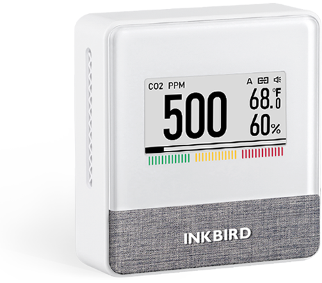

The [Inkbird IAM-T1](https://inkbird.com/pages/iam-t1) is an air quality
sensor that measures CO₂ concentration, temperature, relative humidity
and air pressure.



An ESPHome running on an ESP32, which provides BLE, can read the values
from the sensor.

## Quickstart

Use the configuration below to pull data from the sensor over BLE. You
will need to find the bluetooth MAC address of your IAM-T1 sensor. This
can be done using the [NRF Connect](https://www.nordicsemi.com/Products/Development-tools/nrf-connect-for-mobile)
app.

You can change the name and id fields where appropriate to suit your
device(s).

## Configuration

```yaml
esphome:
  name: example-device
  friendly_name: Example Device
   
# OTA flashing
ota:
  - platform: esphome

wifi: # Your Wifi network details
  
# Enable fallback hotspot in case wifi connection fails  
  ap:

# Enabling the logging component
logger:

# Enable Home Assistant API
api:

# Enable the captive portal
captive_portal:

esp32_ble_tracker:

ble_client:
  # Replace with the MAC address of your device.
  - mac_address: 11:22:33:44:55:66
    id: inkbird_iam_t1_co2
    on_connect:
      then:
        - lambda: |-
            ESP_LOGD("ble_client_lambda", "Connected to inkbird BLE device");

sensor:
  - platform: ble_client
    ble_client_id: inkbird_iam_t1_co2
    name: "Inkbird CO2 measurement"
    device_class: carbon_dioxide
    unit_of_measurement: 'ppm'
    accuracy_decimals: 0
    icon: 'mdi:molecule-co2'
    service_uuid: 'ffe0'
    characteristic_uuid: 'ffe4'
    notify: true
    type: characteristic
    lambda: |-
      uint16_t co2 = (x[9] << 8) | x[10];
      return (float)co2;

  # If your IAM-T1 is set to Celcius instead of
  # farenheit, simply change the unit of measurement
  # and icon here to celcius.
  - platform: ble_client
    ble_client_id: inkbird_iam_t1_co2
    name: "Inkbird Temperature"
    device_class: temperature
    unit_of_measurement: '°F'
    accuracy_decimals: 1
    icon: 'mdi:temperature-fahrenheit'
    service_uuid: 'ffe0'
    characteristic_uuid: 'ffe4'
    notify: true
    type: characteristic
    lambda: |-
      uint8_t is_negative = x[4] & 0xF;
      uint16_t temp = (x[5] << 8) | x[6];
      if (is_negative == 1) {
        return -((float)temp) / 10.0;
      } else {
        return ((float)temp) / 10.0;
      }

  - platform: ble_client
    ble_client_id: inkbird_iam_t1_co2
    name: "Inkbird Humidity"
    device_class: humidity
    unit_of_measurement: '%'
    accuracy_decimals: 1
    icon: 'mdi:water-percent'
    service_uuid: 'ffe0'
    characteristic_uuid: 'ffe4'
    notify: true
    type: characteristic
    lambda: |-
      uint16_t humidity = (x[7] << 8) | x[8];
      return ((float)humidity) / 10.0;

  - platform: ble_client
    ble_client_id: inkbird_iam_t1_co2
    name: "Inkbird Air Pressure"
    device_class: atmospheric_pressure
    unit_of_measurement: 'hPa'
    accuracy_decimals: 0
    icon: 'mdi:gauge'
    service_uuid: 'ffe0'
    characteristic_uuid: 'ffe4'
    notify: true
    type: characteristic
    lambda: |-
      uint16_t pressure = (x[11] << 8) | x[12];
      return (float)pressure;
```
