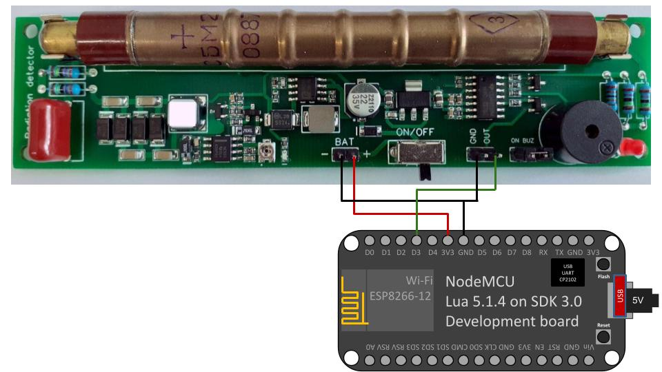
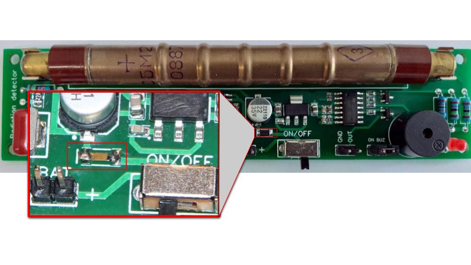

## GGreg20_V3 Ionizing radiation detector module

Geiger-Mueller tube: SBM20

Input voltage: 2.2V - 5.5V

Tube Voltage: 400V

Sensor-side interface: pulse output

MCU-side interface: GPIO with pulse counter

GGreg20_v3 is compatible with the ESP8266/ESP32 logic signal levels (3V3 ACTIVE-LOW: 3.0-3.3V HIGH and about 0.7V LOW), and will work even with the 5V logic input.
Sensor compatibility: any ESP8266- or ESP32- powered device

Vendor site: https://allmylinks.com/iot-devices

## Connection

For example, it could be GPIO0 (D3). This pin is convenient because it has a built-in Flash button in most devices and boards based on the ESP8266 module - in case you need to check how the controller counts pulses without a sensor, it is possible to simulate pulses with a button.

> 

## Powering from a 2.4V input source

If you want to power the GGreg20_V3 from a 2.4 volt source, you need to short the Schottky diode shown in the photo with a wire or replace it with a 0 ohm resistor. Note, however, that such a correction will disable the module's reverse polarity protection:


## Basic Configuration

```yaml
esphome:
  name: esphome_node1 # Controller Unique Name
  platform: ESP8266 # Platform type you have to select when creating new yaml-config in ESP Home
  board: nodemcuv2 # Controller type you have to select when creating new yaml-config in ESP Home

# OTA flashing
ota:
  - platform: esphome

wifi: # Your Wifi network details
  
# Enable fallback hotspot in case wifi connection fails  
  ap:

# Enabling the logging component
logger:

# Enable Home Assistant API
api:

# Enable the captive portal
captive_portal:

# Just embedded test D3 (GPIO0) button on every ESP8266 Devboard
# You can press D3 button several times to simulate incoming GGreg pulses
binary_sensor:
  - platform: gpio
    name: "D3 Input Button"
    pin:
      number: 0
      inverted: True
      mode: INPUT_PULLUP
# Here we calc and include to the firmware a power and doze values of ionizing radiation as sensor outputs
sensor:
  - platform: pulse_counter
    pin: D3
    unit_of_measurement: "mkSv/Hour"
    name: "Ionizing Radiation Power"
    count_mode:
      rising_edge: DISABLE
      falling_edge: INCREMENT
    update_interval: 60s
    accuracy_decimals: 3
    id: my_doze_meter
    filters:
      - sliding_window_moving_average: # 5-minutes moving average (MA5) here
          window_size: 5
          send_every: 5
      - multiply: 0.0054 # SBM20 tube conversion factor of pulses into mkSv/Hour
  - platform: integration
    name: "Total Ionizing Radiation Doze"
    unit_of_measurement: "mkSv"
    sensor: my_doze_meter # link entity id to the pulse_counter values above
    icon: "mdi:radioactive"
    accuracy_decimals: 5
    time_unit: min # integrate values every next minute
    filters:
      - multiply: 0.00009 # obtained doze (from mkSv/hour into mkSv/minute) conversion factor: 0.0054 / 60 minutes = 0.00009; so pulses * 0.00009 = doze every next minute, mkSv.
```
