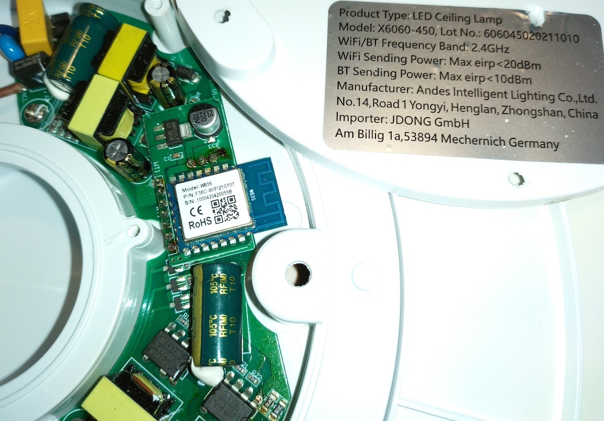

## Device

- Sold in Germany, e.g., by [Kaufland](https://www.kaufland.de/product/407823330/).
- Board inside is WB3S (BK7231T) and ESPHome can be flashed with [tuya-cloudcutter](https://github.com/tuya-cloudcutter/tuya-cloudcutter).
- ESPHome support for the IR remote control currently unknown (as no access to a remote).



## Basic Configuration

```yaml
substitutions:
  device_name: "jdong-rgbww-light"
  friendly_name: "JDONG X4040"
  project_name: "jdong.rgbww-light"
  project_version: "1.0"

esphome:
  name: "${device_name}"
  name_add_mac_suffix: true
  project:
    name: "${project_name}"
    version: "${project_version}"
  on_boot:
    priority: 600
    then:
      - light.turn_on:
          id: light_rgbww
          brightness: 100%
          color_temperature: 4000K

bk72xx:
  board: wb3s

logger:

web_server:

captive_portal:

mdns:

api:
  password: ""

ota:
  platform: esphome
  password: ""

wifi:
  ssid: !secret wifi_ssid
  password: !secret wifi_password
  ap:

text_sensor:
  - platform: libretiny
    version:
      name: LibreTiny Version
  - platform: wifi_info
    ip_address:
      name: "${friendly_name} IP Address"

binary_sensor:
  - platform: status
    name: "${friendly_name} Status"

sensor:
  - platform: uptime
    type: seconds
    name: "${friendly_name} Uptime Sensor"

output:
  - platform: libretiny_pwm
    id: output_red
    pin: P8
  - platform: libretiny_pwm
    id: output_green
    pin: P9
  - platform: libretiny_pwm
    id: output_blue
    pin: P7
  - platform: libretiny_pwm
    id: output_cold
    pin: P6
  - platform: libretiny_pwm
    id: output_warm
    pin: P24

light:
  - platform: rgbww
    id: light_rgbww
    name: "${friendly_name}"
    color_interlock: true
    cold_white_color_temperature: 6500 K
    warm_white_color_temperature: 2700 K
    red: output_red
    green: output_green
    blue: output_blue
    cold_white: output_cold
    warm_white: output_warm

remote_receiver:
  pin:
    number: P1
    inverted: true
    mode: INPUT_PULLUP
```
