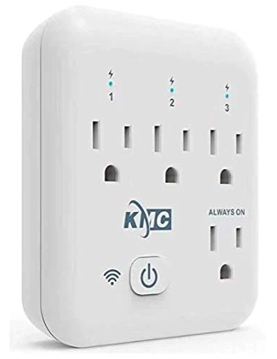

  
[https://kmc.co/products/smart-tap](https://kmc.co/products/smart-tap)

## GPIO Pinout

| Pin    | Function                   |
|--------|----------------------------|
| GPIO16 | Push Button                |
| GPIO1  | Blue LED (Inverted: true)  |
| GPIO15 | Outlet 1                   |
| GPIO13 | Outlet 2                   |
| GPIO14 | Outlet 3                   |
| GPIO12 | HLW8012 SEL Pin            |
| GPIO04 | HLW8012 CF Pin             |
| GPIO05 | HLW8012 CF1 Pin            |

## Basic Config

```yaml
esphome:
  name: KMC-Smart-Tap
  friendly_name: KMC-Smart-Tap

esp8266:
  board: esp01_1m
  restore_from_flash: True
  
# OTA flashing
ota:
  - platform: esphome

wifi: # Your Wifi network details
  
# Enable fallback hotspot in case wifi connection fails  
  ap:

# Enabling the logging component
logger:

# Enable Home Assistant API
api:

# Enable the captive portal
captive_portal:

sensor:
  - platform: hlw8012
    sel_pin: GPIO12
    cf_pin: GPIO4
    cf1_pin: GPIO5
    update_interval: 30s
    current:
      name: "KMC01 Current"
    voltage:
      name: "KMC01 Voltage"
      filters:
        # Map from sensor -> measured value
        - calibrate_linear:
            - 0.0 -> 0.0
            - 135.0 -> 122.0
    power:
      name: "KMC01 Power"

  - platform: wifi_signal
    name: "KMC01 WiFi signal"
    update_interval: 60s

  - platform: uptime
    name: "KMC01 Uptime"

text_sensor:
  - platform: version
    name: "KMC01 ESPHome Version"

button:
  - platform: restart
    name: "KMC01 Restart" # optional device restart switch

switch:
  - platform: gpio
    name: "KMC01 Outlet 3"
    pin: GPIO14
    id: outlet_3
    restore_mode: RESTORE_DEFAULT_ON
  - platform: gpio
    name: "KMC01 Outlet 2"
    pin: GPIO13
    id: outlet_2
    restore_mode: RESTORE_DEFAULT_ON
  - platform: gpio
    name: "KMC01 Outlet 1"
    pin: GPIO15
    id: outlet_1
    restore_mode: RESTORE_DEFAULT_ON

binary_sensor:
  - platform: gpio
    pin:
      number: GPIO16
      mode: INPUT
      inverted: True # Normally off /Press on
    name: "KMC01 button"
    on_multi_click: # Button Behavior (Click Outlets On/Off)
    - timing:
        - ON for at most 1s
        - OFF for at most 1s
        - ON for at most 1s
        - OFF for at most 1s
        - ON for at least 1s
        - OFF for at least 0.2s
      then:
        # Triple Click Toggle Outlet 3 On/Off
        # (Two presses followed by a long press)
        - logger.log: "Triple Click"
        - switch.toggle: outlet_3
    - timing:
        - ON for at most 1s
        - OFF for at most 1s
        - ON for at least 1s
        - OFF for at least 0.2s
      then:
        # Double Click Toggle Outlet 2 On/Off
        # (One press followed by a long press)
        - logger.log: "Double Click"
        - switch.toggle: outlet_2
    - timing:
        - ON for at least 1s
        - OFF for at least 0.2s
      then:
        # Single Click Toggle Outlet 1 On/Off
        # (One long press)
        - logger.log: "Single Click"
        - switch.toggle: outlet_1
  - platform: status
    name: "KMC01 Status"

status_led:
  pin:
    number: GPIO1
    inverted: yes # yes for off/no for on
```
