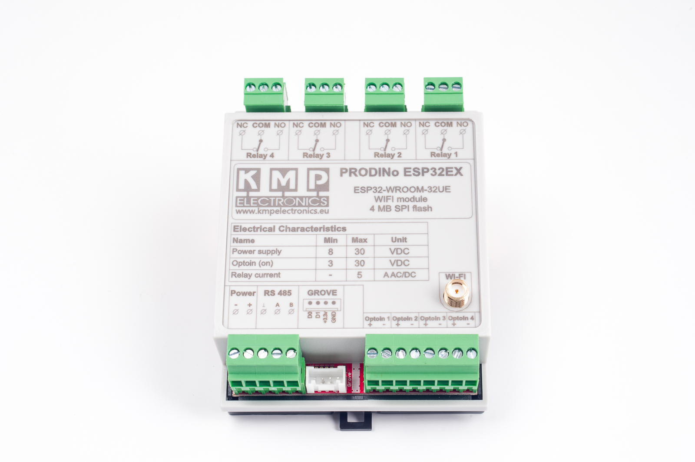

Manufacturer: [KMP Electronics](https://kmpelectronics.eu/shop/prodino-esp32ex/)

## GPIO Pinout

| Pin    | Function                           |
| ------ | ---------------------------------- |
| GPIO16 | TX RS485                           |
| GPIO04 | RX RS485                           |
| GPIO02 | flow_controll RS485                |
| GPIO0  | WS2812B RBG Status LED             |
| GPIO32 | mcp23s08_hub                       |

## Basic Configuration

```yaml
# Basic Config
esphome:
  name: prodino1

esp32:
  board: esp-wrover-kit

wifi:
  ssid: "ssid"
  password: "password"

  # Enable fallback hotspot (captive portal) in case wifi connection fails
  ap:
    ssid: "Prodino1 Fallback Hotspot"
    password: "Y43RDknj74vq"

captive_portal:

# Enable logging
logger:

# Enable Home Assistant API
api:
  encryption:
    key: !secret encryption_key

ota:
  password: "password"

#optional onewire
#one_wire:
#  - pin: GPIO21

sensor:
 #optional onewire
 # - platform: dallas_temp
 #   address: 0xcb021564bbacffff
 #   name: "Ds18B20 Temperature"

  - platform: dht
    model: AM2302
    pin: GPIO21
    temperature:
     name: "Living Room Temperature1"
    humidity:
     name: "Living Room Humidity1"
    update_interval: 30s

  - platform: dht
    model: AM2302
    pin: GPIO22
    temperature:
     name: "Living Room Temperature2"
    humidity:
     name: "Living Room Humidity2"
    update_interval: 30s

spi:
  clk_pin: GPIO18
  mosi_pin: GPIO23
  miso_pin: GPIO19

# Modbus RS485 from here
uart:
  id: mod_bus
  tx_pin: GPIO16
  rx_pin: GPIO04
  baud_rate: 9600
  parity: even
  stop_bits: 1
  debug:

modbus:
  flow_control_pin: GPIO02
  id: modbus1

modbus_controller:
  - id: modbusc1
    ## the Modbus device addr
    address: 0x1
    modbus_id: modbus1
    setup_priority: -10
# Modbus RS485 till here

mcp23s08:
  - id: 'mcp23s08_hub'
    cs_pin: GPIO32
    deviceaddress: 0
# Individual outputs
switch:
  - platform: gpio
    name: "RELAY4"
    pin:
      mcp23s08: mcp23s08_hub
      # Use pin number 4
      number: 4
      mode: OUTPUT
      inverted: False

  - platform: gpio
    name: "RELAY3"
    pin:
      mcp23s08: mcp23s08_hub
      # Use pin number 5
      number: 5
      mode: OUTPUT
      inverted: False

  - platform: gpio
    name: "RELAY2"
    pin:
      mcp23s08: mcp23s08_hub
      # Use pin number 6
      number: 6
      mode: OUTPUT
      inverted: False

  - platform: gpio
    name: "RELAY1"
    pin:
      mcp23s08: mcp23s08_hub
      # Use pin number 7
      number: 7
      mode: OUTPUT
      inverted: False

binary_sensor:
  - platform: gpio
    name: "INPUT1"
    pin:
      mcp23s08: mcp23s08_hub
      # Use pin number 3
      number: 3
      # One of INPUT or INPUT_PULLUP
      mode: INPUT
      inverted: True

  - platform: gpio
    name: "INPUT2"
    pin:
      mcp23s08: mcp23s08_hub
      # Use pin number 2
      number: 2
      # One of INPUT or INPUT_PULLUP
      mode: INPUT
      inverted: True

  - platform: gpio
    name: "INPUT3"
    pin:
      mcp23s08: mcp23s08_hub
      # Use pin number 1
      number: 1
      # One of INPUT or INPUT_PULLUP
      mode: INPUT
      inverted: True

  - platform: gpio
    name: "INPUT4"
    pin:
      mcp23s08: mcp23s08_hub
      # Use pin number 0
      number: 0
      # One of INPUT or INPUT_PULLUP
      mode: INPUT
      inverted: True

light:
  - platform: fastled_clockless
    chipset: WS2812B
    pin: GPIO0
    num_leds: 1
    rgb_order: GRB
    name: "LED WS2812B"
```
