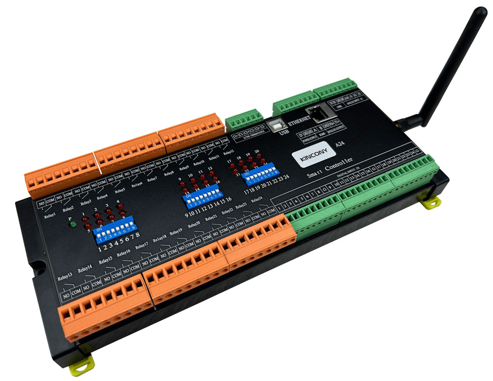
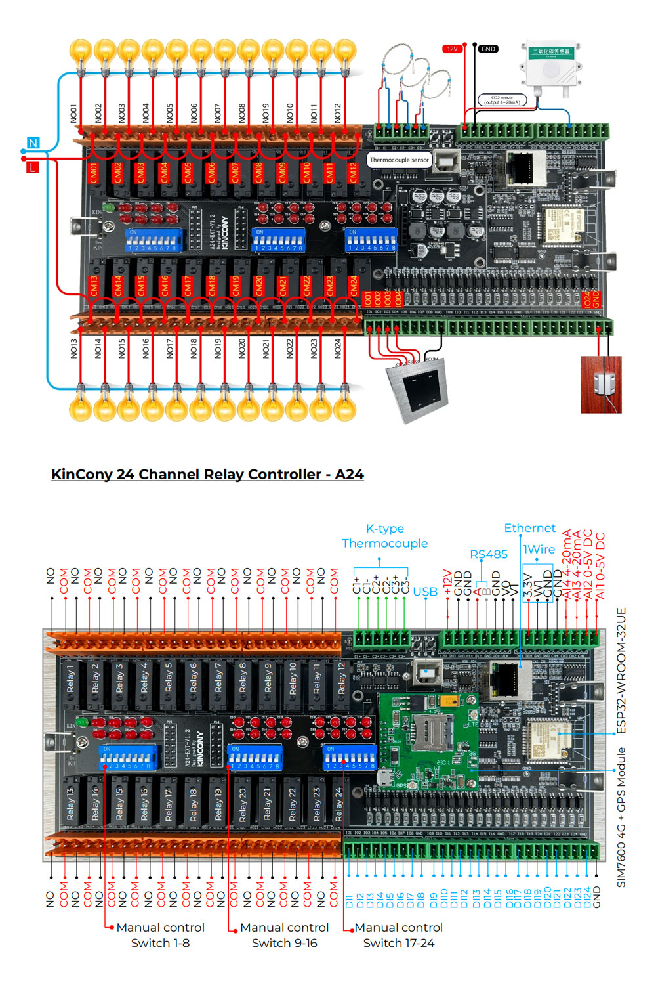

## Resources

- [ESP32 pin define details](https://www.kincony.com/forum/showthread.php?tid=3921)
- [YouTube video tour](https://youtu.be/E4Fc8hqFPc8)

## ESPHome Configuration

Here is an example YAML configuration for the KinCony-A24 board.

```yaml
esphome:
  name: a24

esp32:
  board: esp32dev


# Enable logging
logger:

# Enable Home Assistant API
api:


 # Example configuration entry
i2c:
   - id: bus_a
     sda: 16
     scl: 5
     scan: true
     frequency: 400kHz

# Example configuration entry
ethernet:
  type: LAN8720
  mdc_pin: GPIO23
  mdio_pin: GPIO18
  clk_mode: GPIO17_OUT
  phy_addr: 0


# Example configuration entry
pcf8574:
  - id: 'pcf8574_hub_out_1'  # for output channel 1-12 CS1-CS3
    i2c_id: bus_a
    address: 0x21
    pcf8575: true

  - id: 'pcf8574_hub_out_2'  # for output channel 13-24
    i2c_id: bus_a
    address: 0x22
    pcf8575: true

  - id: 'pcf8574_hub_in_1'  # for input channel 1-16
    i2c_id: bus_a
    address: 0x24
    pcf8575: true

  - id: 'pcf8574_hub_in_2'  # for a24--input channel 17-32
    i2c_id: bus_a
    address: 0x25
    pcf8575: true

# Individual outputs
switch:
  - platform: gpio
    name: "a24--light1"
    pin:
      pcf8574: pcf8574_hub_out_1
      number: 0
      mode: OUTPUT
      inverted: true

  - platform: gpio
    name: "a24--light2"
    pin:
      pcf8574: pcf8574_hub_out_1
      number: 1
      mode: OUTPUT
      inverted: true

  - platform: gpio
    name: "a24--light3"
    pin:
      pcf8574: pcf8574_hub_out_1
      number: 2
      mode: OUTPUT
      inverted: true

  - platform: gpio
    name: "a24--light4"
    pin:
      pcf8574: pcf8574_hub_out_1
      number: 3
      mode: OUTPUT
      inverted: true

  - platform: gpio
    name: "a24--light5"
    pin:
      pcf8574: pcf8574_hub_out_1
      number: 4
      mode: OUTPUT
      inverted: true

  - platform: gpio
    name: "a24--light6"
    pin:
      pcf8574: pcf8574_hub_out_1
      number: 5
      mode: OUTPUT
      inverted: true

  - platform: gpio
    name: "a24--light7"
    pin:
      pcf8574: pcf8574_hub_out_1
      number: 6
      mode: OUTPUT
      inverted: true

  - platform: gpio
    name: "a24--light8"
    pin:
      pcf8574: pcf8574_hub_out_1
      number: 7
      mode: OUTPUT
      inverted: true


  - platform: gpio
    name: "a24--light9"
    pin:
      pcf8574: pcf8574_hub_out_1
      number: 8
      mode: OUTPUT
      inverted: true

  - platform: gpio
    name: "a24--light10"
    pin:
      pcf8574: pcf8574_hub_out_1
      number: 9
      mode: OUTPUT
      inverted: true

  - platform: gpio
    name: "a24--light11"
    pin:
      pcf8574: pcf8574_hub_out_1
      number: 10
      mode: OUTPUT
      inverted: true

  - platform: gpio
    name: "a24--light12"
    pin:
      pcf8574: pcf8574_hub_out_1
      number: 11
      mode: OUTPUT
      inverted: true


  - platform: gpio
    name: "a24--light13"
    pin:
      pcf8574: pcf8574_hub_out_2
      number: 0
      mode: OUTPUT
      inverted: true

  - platform: gpio
    name: "a24--light14"
    pin:
      pcf8574: pcf8574_hub_out_2
      number: 1
      mode: OUTPUT
      inverted: true

  - platform: gpio
    name: "a24--light15"
    pin:
      pcf8574: pcf8574_hub_out_2
      number: 2
      mode: OUTPUT
      inverted: true

  - platform: gpio
    name: "a24--light16"
    pin:
      pcf8574: pcf8574_hub_out_2
      number: 3
      mode: OUTPUT
      inverted: true

  - platform: gpio
    name: "a24--light17"
    pin:
      pcf8574: pcf8574_hub_out_2
      number: 4
      mode: OUTPUT
      inverted: true

  - platform: gpio
    name: "a24--light18"
    pin:
      pcf8574: pcf8574_hub_out_2
      number: 5
      mode: OUTPUT
      inverted: true

  - platform: gpio
    name: "a24--light19"
    pin:
      pcf8574: pcf8574_hub_out_2
      number: 6
      mode: OUTPUT
      inverted: true

  - platform: gpio
    name: "a24--light20"
    pin:
      pcf8574: pcf8574_hub_out_2
      number: 7
      mode: OUTPUT
      inverted: true

  - platform: gpio
    name: "a24--light21"
    pin:
      pcf8574: pcf8574_hub_out_2
      number: 8
      mode: OUTPUT
      inverted: true

  - platform: gpio
    name: "a24--light22"
    pin:
      pcf8574: pcf8574_hub_out_2
      number: 9
      mode: OUTPUT
      inverted: true

  - platform: gpio
    name: "a24--light23"
    pin:
      pcf8574: pcf8574_hub_out_2
      number: 10
      mode: OUTPUT
      inverted: true

  - platform: gpio
    name: "a24--light24"
    pin:
      pcf8574: pcf8574_hub_out_2
      number: 11
      mode: OUTPUT
      inverted: true

# Individual inputs
binary_sensor:
  - platform: gpio
    name: "a24--input1"
    pin:
      pcf8574: pcf8574_hub_in_1
      number: 0
      mode: INPUT
      inverted: true

  - platform: gpio
    name: "a24--input2"
    pin:
      pcf8574: pcf8574_hub_in_1
      number: 1
      mode: INPUT
      inverted: true

  - platform: gpio
    name: "a24--input3"
    pin:
      pcf8574: pcf8574_hub_in_1
      number: 2
      mode: INPUT
      inverted: true

  - platform: gpio
    name: "a24--input4"
    pin:
      pcf8574: pcf8574_hub_in_1
      number: 3
      mode: INPUT
      inverted: true

  - platform: gpio
    name: "a24--input5"
    pin:
      pcf8574: pcf8574_hub_in_1
      number: 4
      mode: INPUT
      inverted: true

  - platform: gpio
    name: "a24--input6"
    pin:
      pcf8574: pcf8574_hub_in_1
      number: 5
      mode: INPUT
      inverted: true

  - platform: gpio
    name: "a24--input7"
    pin:
      pcf8574: pcf8574_hub_in_1
      number: 6
      mode: INPUT
      inverted: true

  - platform: gpio
    name: "a24--input8"
    pin:
      pcf8574: pcf8574_hub_in_1
      number: 7
      mode: INPUT
      inverted: true

  - platform: gpio
    name: "a24--input9"
    pin:
      pcf8574: pcf8574_hub_in_1
      number: 8
      mode: INPUT
      inverted: true

  - platform: gpio
    name: "a24--input10"
    pin:
      pcf8574: pcf8574_hub_in_1
      number: 9
      mode: INPUT
      inverted: true

  - platform: gpio
    name: "a24--input11"
    pin:
      pcf8574: pcf8574_hub_in_1
      number: 10
      mode: INPUT
      inverted: true

  - platform: gpio
    name: "a24--input12"
    pin:
      pcf8574: pcf8574_hub_in_1
      number: 11
      mode: INPUT
      inverted: true

  - platform: gpio
    name: "a24--input13"
    pin:
      pcf8574: pcf8574_hub_in_1
      number: 12
      mode: INPUT
      inverted: true

  - platform: gpio
    name: "a24--input14"
    pin:
      pcf8574: pcf8574_hub_in_1
      number: 13
      mode: INPUT
      inverted: true

  - platform: gpio
    name: "a24--input15"
    pin:
      pcf8574: pcf8574_hub_in_1
      number: 14
      mode: INPUT
      inverted: true

  - platform: gpio
    name: "a24--input16"
    pin:
      pcf8574: pcf8574_hub_in_1
      number: 15
      mode: INPUT
      inverted: true

  - platform: gpio
    name: "a24--input17"
    pin:
      pcf8574: pcf8574_hub_in_2
      number: 0
      mode: INPUT
      inverted: true

  - platform: gpio
    name: "a24--input18"
    pin:
      pcf8574: pcf8574_hub_in_2
      number: 1
      mode: INPUT
      inverted: true

  - platform: gpio
    name: "a24--input19"
    pin:
      pcf8574: pcf8574_hub_in_2
      number: 2
      mode: INPUT
      inverted: true

  - platform: gpio
    name: "a24--input20"
    pin:
      pcf8574: pcf8574_hub_in_2
      number: 3
      mode: INPUT
      inverted: true

  - platform: gpio
    name: "a24--input21"
    pin:
      pcf8574: pcf8574_hub_in_2
      number: 4
      mode: INPUT
      inverted: true

  - platform: gpio
    name: "a24--input22"
    pin:
      pcf8574: pcf8574_hub_in_2
      number: 5
      mode: INPUT
      inverted: true

  - platform: gpio
    name: "a24--input23"
    pin:
      pcf8574: pcf8574_hub_in_2
      number: 6
      mode: INPUT
      inverted: true

  - platform: gpio
    name: "a24--input24"
    pin:
      pcf8574: pcf8574_hub_in_2
      number: 7
      mode: INPUT
      inverted: true

sensor:
  - platform: adc
    pin: 35
    name: "A24 A1 Voltage"
    update_interval: 10s
    attenuation: 11db
    filters:
      - lambda:
          if (x >= 3.11) {
            return x * 1.60256;
          } else if (x <= 0.15) {
            return 0;
          } else {
            return x * 1.51;
          }
  - platform: adc
    pin: 34
    name: "A24 A2 Voltage"
    update_interval: 10s
    attenuation: 11db
    filters:
      # - multiply: 1.51515
      - lambda:
          if (x >= 3.11) {
            return x * 1.60256;
          } else if (x <= 0.15) {
            return 0;
          } else {
            return x * 1.51;
          }
  - platform: adc
    pin: 39
    name: "A24 A3 Current"
    update_interval: 10s
    unit_of_measurement: mA
    attenuation: 11db
    filters:
      - multiply: 6.66666666
  - platform: adc
    pin: 36
    name: "A24 A4 Current"
    update_interval: 10s
    unit_of_measurement: mA
    attenuation: 11db
    filters:
      - multiply: 6.66666666

  - platform: max31855
    name: "K-Type Thermocouple-1"
    cs_pin:
      pcf8574: pcf8574_hub_out_1
      number: 13
      mode: OUTPUT
      inverted: false
    update_interval: 5s

  - platform: max31855
    name: "K-Type Thermocouple-2"
    cs_pin:
      pcf8574: pcf8574_hub_out_1
      number: 14
      mode: OUTPUT
      inverted: false
    update_interval: 5s

  - platform: max31855
    name: "K-Type Thermocouple-3"
    cs_pin:
      pcf8574: pcf8574_hub_out_1
      number: 15
      mode: OUTPUT
      inverted: false
    update_interval: 5s

spi:
  - id: spi_bus0
    clk_pin: 14
    miso_pin: 12

gp8403:
  id: my_gp8403
  voltage: 10V

output:
  - platform: gp8403
    id: gp8403_output_1
    gp8403_id: my_gp8403
    channel: 0
  - platform: gp8403
    id: gp8403_output_2
    gp8403_id: my_gp8403
    channel: 1

light:
  - platform: monochromatic
    name: "A24-DAC-1"
    output: gp8403_output_1
  - platform: monochromatic
    name: "A24-DAC-2"
    output: gp8403_output_2
```
