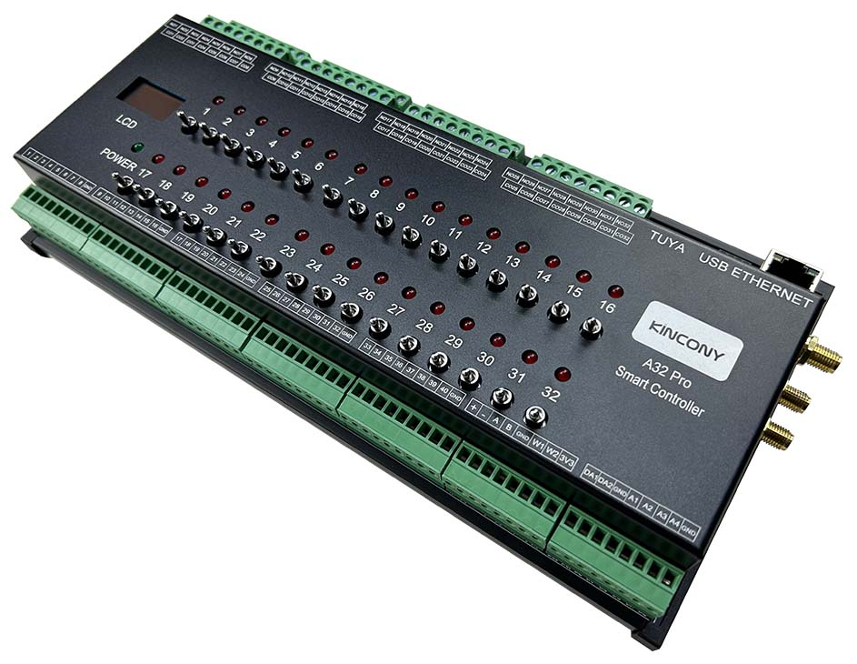
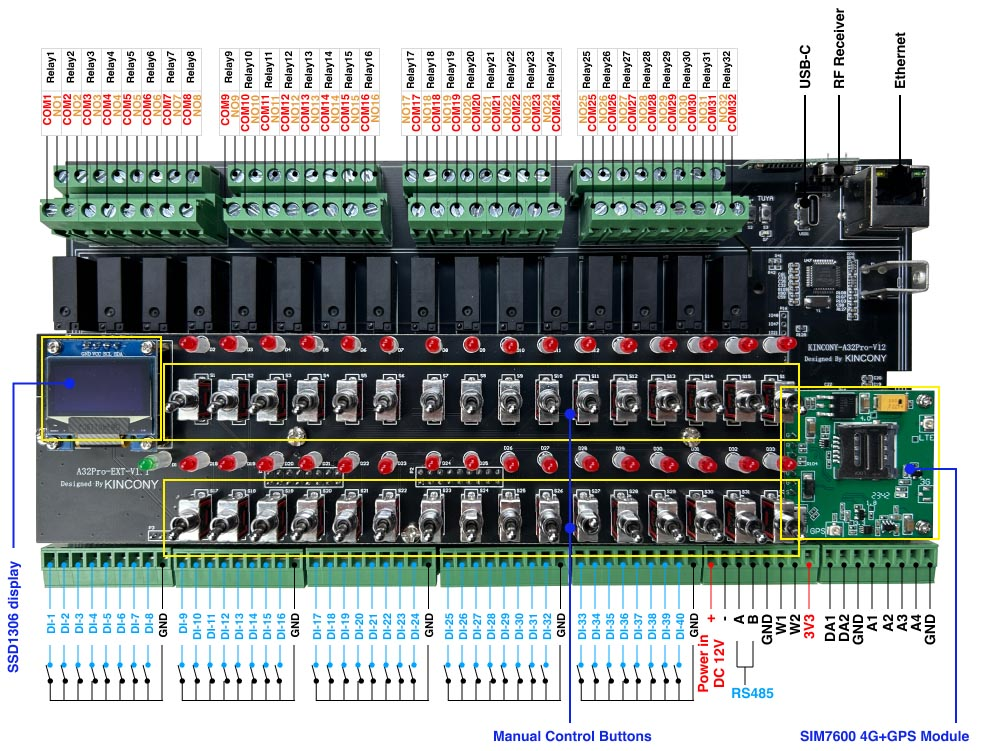

## Resources

- [ESP32 pin define details](https://www.kincony.com/forum/showthread.php?tid=5519)
- [YouTube video tour](https://youtu.be/yqArOKF5vWc)

## ESPHome Configuration

Here is an example YAML configuration for the KinCony-A32 Pro board.

```yaml
esphome:
  name: a32-pro-arduino
  friendly_name: a32-Pro-arduino
  platformio_options:
    board_build.extra_flags:
      # WIFI_CONTROL_SELF_MODE = 0
      # WIFI_CONTROL_SELF_MODE = 1
      - "-DWIFI_CONTROL_SELF_MODE=0"

external_components:
  - source:
      type: git
      url: https://github.com/hzkincony/esphome-tuya-wifi-mcu
      ref: v1.2.0

esp32:
  board: esp32-s3-devkitc-1
  framework:
    type: arduino

# Enable logging
# logger:

# Enable Home Assistant API
api:

ethernet:
  type: W5500
  clk_pin: GPIO42
  mosi_pin: GPIO44
  miso_pin: GPIO40
  cs_pin: GPIO39
  interrupt_pin: GPIO41
  reset_pin: GPIO43

uart:
  tx_pin: 15
  rx_pin: 16
  id: tuya_mcu_uart
  baud_rate: 9600

tuya_wifi_mcu:
  # tuya mcu product id
  product_id: fwy7fk4mzay3kern
  uart_id: tuya_mcu_uart
  wifi_reset_pin: 21
  wifi_led_pin: 45

i2c:
   - id: bus_a
     sda: 11
     scl: 10
     scan: true
     frequency: 400kHz

xl9535:
  - id: xl9535_hub_out1 # for output channel 1-16
    address: 0x21
  - id: xl9535_hub_out2 # for output channel 17-32
    address: 0x22
  - id: xl9535_hub_in1 # for input channel 1-16
    address: 0x24
  - id: xl9535_hub_in2 # for input channel 17-32
    address: 0x25

pcf8574:
  - id: 'pcf8574_in_3'  # for input channel 33-40
    address: 0x23


switch:

  - platform: gpio
    pin: 45
    name: "LED"

  - platform: gpio
    name: A32 Pro Switch01
    id: "a32_pro_switch01"
    pin:
      xl9535: xl9535_hub_out1
      number: 0
      mode: OUTPUT
      inverted: true
  
  - platform: tuya_wifi_mcu
    name: A32 Pro Switch01 Tuya
    dp_id: 101
    # hide from homeassistant ui
    internal: true
    # bind other switch, sync state
    bind_switch_id: "a32_pro_switch01"
  
  
  - platform: gpio
    name: A32 Pro Switch02
    id: "a32_pro_switch02"
    pin:
      xl9535: xl9535_hub_out1
      number: 1
      mode: OUTPUT
      inverted: true
  - platform: tuya_wifi_mcu
    name: A32 Pro Switch02 Tuya
    dp_id: 102
    # hide from homeassistant ui
    internal: true
    # bind other switch, sync state
    bind_switch_id: "a32_pro_switch02"

  - platform: gpio
    name: A32 Pro Switch03
    id: "a32_pro_switch03"
    pin:
      xl9535: xl9535_hub_out1
      number: 2
      mode: OUTPUT
      inverted: true
  - platform: tuya_wifi_mcu
    name: A32 Pro Switch03 Tuya
    dp_id: 103
    # hide from homeassistant ui
    internal: true
    # bind other switch, sync state
    bind_switch_id: "a32_pro_switch03"

  - platform: gpio
    name: A32 Pro Switch04
    id: "a32_pro_switch04"
    pin:
      xl9535: xl9535_hub_out1
      number: 3
      mode: OUTPUT
      inverted: true
  - platform: tuya_wifi_mcu
    name: A32 Pro Switch04 Tuya
    dp_id: 104
    # hide from homeassistant ui
    internal: true
    # bind other switch, sync state
    bind_switch_id: "a32_pro_switch04"

  - platform: gpio
    name: A32 Pro Switch05
    id: "a32_pro_switch05"
    pin:
      xl9535: xl9535_hub_out1
      number: 4
      mode: OUTPUT
      inverted: true
  - platform: tuya_wifi_mcu
    name: A32 Pro Switch05 Tuya
    dp_id: 105
    # hide from homeassistant ui
    internal: true
    # bind other switch, sync state
    bind_switch_id: "a32_pro_switch05"

  - platform: gpio
    name: A32 Pro Switch06
    id: "a32_pro_switch06"
    pin:
      xl9535: xl9535_hub_out1
      number: 5
      mode: OUTPUT
      inverted: true
  - platform: tuya_wifi_mcu
    name: A32 Pro Switch06 Tuya
    dp_id: 106
    # hide from homeassistant ui
    internal: true
    # bind other switch, sync state
    bind_switch_id: "a32_pro_switch06"

  - platform: gpio
    name: A32 Pro Switch07
    id: "a32_pro_switch07"
    pin:
      xl9535: xl9535_hub_out1
      number: 6
      mode: OUTPUT
      inverted: true
  - platform: tuya_wifi_mcu
    name: A32 Pro Switch07 Tuya
    dp_id: 107
    # hide from homeassistant ui
    internal: true
    # bind other switch, sync state
    bind_switch_id: "a32_pro_switch07"

  - platform: gpio
    name: A32 Pro Switch08
    id: "a32_pro_switch08"
    pin:
      xl9535: xl9535_hub_out1
      number: 7
      mode: OUTPUT
      inverted: true
  - platform: tuya_wifi_mcu
    name: A32 Pro Switch08 Tuya
    dp_id: 108
    # hide from homeassistant ui
    internal: true
    # bind other switch, sync state
    bind_switch_id: "a32_pro_switch08"

  - platform: gpio
    name: A32 Pro Switch09
    id: "a32_pro_switch09"
    pin:
      xl9535: xl9535_hub_out1
      number: 10
      mode: OUTPUT
      inverted: true
  - platform: tuya_wifi_mcu
    name: A32 Pro Switch09 Tuya
    dp_id: 109
    # hide from homeassistant ui
    internal: true
    # bind other switch, sync state
    bind_switch_id: "a32_pro_switch09"

  - platform: gpio
    name: A32 Pro Switch10
    id: "a32_pro_switch10"
    pin:
      xl9535: xl9535_hub_out1
      number: 11
      mode: OUTPUT
      inverted: true
  - platform: tuya_wifi_mcu
    name: A32 Pro Switch10 Tuya
    dp_id: 110
    # hide from homeassistant ui
    internal: true
    # bind other switch, sync state
    bind_switch_id: "a32_pro_switch10"

  - platform: gpio
    name: A32 Pro Switch11
    id: "a32_pro_switch11"
    pin:
      xl9535: xl9535_hub_out1
      number: 12
      mode: OUTPUT
      inverted: true
  - platform: tuya_wifi_mcu
    name: A32 Pro Switch11 Tuya
    dp_id: 111
    # hide from homeassistant ui
    internal: true
    # bind other switch, sync state
    bind_switch_id: "a32_pro_switch11"

  - platform: gpio
    name: A32 Pro Switch12
    id: "a32_pro_switch12"
    pin:
      xl9535: xl9535_hub_out1
      number: 13
      mode: OUTPUT
      inverted: true
  - platform: tuya_wifi_mcu
    name: A32 Pro Switch12 Tuya
    dp_id: 112
    # hide from homeassistant ui
    internal: true
    # bind other switch, sync state
    bind_switch_id: "a32_pro_switch12"

  - platform: gpio
    name: A32 Pro Switch13
    id: "a32_pro_switch13"
    pin:
      xl9535: xl9535_hub_out1
      number: 14
      mode: OUTPUT
      inverted: true
  - platform: tuya_wifi_mcu
    name: A32 Pro Switch13 Tuya
    dp_id: 113
    # hide from homeassistant ui
    internal: true
    # bind other switch, sync state
    bind_switch_id: "a32_pro_switch13"

  - platform: gpio
    name: A32 Pro Switch14
    id: "a32_pro_switch14"
    pin:
      xl9535: xl9535_hub_out1
      number: 15
      mode: OUTPUT
      inverted: true
  - platform: tuya_wifi_mcu
    name: A32 Pro Switch14 Tuya
    dp_id: 114
    # hide from homeassistant ui
    internal: true
    # bind other switch, sync state
    bind_switch_id: "a32_pro_switch14"

  - platform: gpio
    name: A32 Pro Switch15
    id: "a32_pro_switch15"
    pin:
      xl9535: xl9535_hub_out1
      number: 16
      mode: OUTPUT
      inverted: true
  - platform: tuya_wifi_mcu
    name: A32 Pro Switch15 Tuya
    dp_id: 115
    # hide from homeassistant ui
    internal: true
    # bind other switch, sync state
    bind_switch_id: "a32_pro_switch15"

  - platform: gpio
    name: A32 Pro Switch16
    id: "a32_pro_switch16"
    pin:
      xl9535: xl9535_hub_out1
      number: 17
      mode: OUTPUT
      inverted: true
  - platform: tuya_wifi_mcu
    name: A32 Pro Switch16 Tuya
    dp_id: 116
    # hide from homeassistant ui
    internal: true
    # bind other switch, sync state
    bind_switch_id: "a32_pro_switch16"

  - platform: gpio
    name: A32 Pro Switch17
    id: "a32_pro_switch17"
    pin:
      xl9535: xl9535_hub_out2
      number: 0
      mode: OUTPUT
      inverted: true
  - platform: tuya_wifi_mcu
    name: A32 Pro Switch17 Tuya
    dp_id: 117
    # hide from homeassistant ui
    internal: true
    # bind other switch, sync state
    bind_switch_id: "a32_pro_switch17"

  - platform: gpio
    name: A32 Pro Switch18
    id: "a32_pro_switch18"
    pin:
      xl9535: xl9535_hub_out2
      number: 1
      mode: OUTPUT
      inverted: true
  - platform: tuya_wifi_mcu
    name: A32 Pro Switch18 Tuya
    dp_id: 118
    # hide from homeassistant ui
    internal: true
    # bind other switch, sync state
    bind_switch_id: "a32_pro_switch18"

  - platform: gpio
    name: A32 Pro Switch19
    id: "a32_pro_switch19"
    pin:
      xl9535: xl9535_hub_out2
      number: 2
      mode: OUTPUT
      inverted: true
  - platform: tuya_wifi_mcu
    name: A32 Pro Switch19 Tuya
    dp_id: 119
    # hide from homeassistant ui
    internal: true
    # bind other switch, sync state
    bind_switch_id: "a32_pro_switch19"

  - platform: gpio
    name: A32 Pro Switch20
    id: "a32_pro_switch20"
    pin:
      xl9535: xl9535_hub_out2
      number: 3
      mode: OUTPUT
      inverted: true
  - platform: tuya_wifi_mcu
    name: A32 Pro Switch20 Tuya
    dp_id: 120
    # hide from homeassistant ui
    internal: true
    # bind other switch, sync state
    bind_switch_id: "a32_pro_switch20"

  - platform: gpio
    name: A32 Pro Switch21
    id: "a32_pro_switch21"
    pin:
      xl9535: xl9535_hub_out2
      number: 4
      mode: OUTPUT
      inverted: true
  - platform: tuya_wifi_mcu
    name: A32 Pro Switch21 Tuya
    dp_id: 121
    # hide from homeassistant ui
    internal: true
    # bind other switch, sync state
    bind_switch_id: "a32_pro_switch21"

  - platform: gpio
    name: A32 Pro Switch22
    id: "a32_pro_switch22"
    pin:
      xl9535: xl9535_hub_out2
      number: 5
      mode: OUTPUT
      inverted: true
  - platform: tuya_wifi_mcu
    name: A32 Pro Switch22 Tuya
    dp_id: 122
    # hide from homeassistant ui
    internal: true
    # bind other switch, sync state
    bind_switch_id: "a32_pro_switch22"

  - platform: gpio
    name: A32 Pro Switch23
    id: "a32_pro_switch23"
    pin:
      xl9535: xl9535_hub_out2
      number: 6
      mode: OUTPUT
      inverted: true
  - platform: tuya_wifi_mcu
    name: A32 Pro Switch23 Tuya
    dp_id: 123
    # hide from homeassistant ui
    internal: true
    # bind other switch, sync state
    bind_switch_id: "a32_pro_switch23"

  - platform: gpio
    name: A32 Pro Switch24
    id: "a32_pro_switch24"
    pin:
      xl9535: xl9535_hub_out2
      number: 7
      mode: OUTPUT
      inverted: true
  - platform: tuya_wifi_mcu
    name: A32 Pro Switch24 Tuya
    dp_id: 124
    # hide from homeassistant ui
    internal: true
    # bind other switch, sync state
    bind_switch_id: "a32_pro_switch24"

  - platform: gpio
    name: A32 Pro Switch25
    id: "a32_pro_switch25"
    pin:
      xl9535: xl9535_hub_out2
      number: 10
      mode: OUTPUT
      inverted: true
  - platform: tuya_wifi_mcu
    name: A32 Pro Switch25 Tuya
    dp_id: 125
    # hide from homeassistant ui
    internal: true
    # bind other switch, sync state
    bind_switch_id: "a32_pro_switch25"

  - platform: gpio
    name: A32 Pro Switch26
    id: "a32_pro_switch26"
    pin:
      xl9535: xl9535_hub_out2
      number: 11
      mode: OUTPUT
      inverted: true
  - platform: tuya_wifi_mcu
    name: A32 Pro Switch26 Tuya
    dp_id: 126
    # hide from homeassistant ui
    internal: true
    # bind other switch, sync state
    bind_switch_id: "a32_pro_switch26"

  - platform: gpio
    name: A32 Pro Switch27
    id: "a32_pro_switch27"
    pin:
      xl9535: xl9535_hub_out2
      number: 12
      mode: OUTPUT
      inverted: true
  - platform: tuya_wifi_mcu
    name: A32 Pro Switch27 Tuya
    dp_id: 127
    # hide from homeassistant ui
    internal: true
    # bind other switch, sync state
    bind_switch_id: "a32_pro_switch27"

  - platform: gpio
    name: A32 Pro Switch28
    id: "a32_pro_switch28"
    pin:
      xl9535: xl9535_hub_out2
      number: 13
      mode: OUTPUT
      inverted: true
  - platform: tuya_wifi_mcu
    name: A32 Pro Switch28 Tuya
    dp_id: 128
    # hide from homeassistant ui
    internal: true
    # bind other switch, sync state
    bind_switch_id: "a32_pro_switch28"

  - platform: gpio
    name: A32 Pro Switch29
    id: "a32_pro_switch29"
    pin:
      xl9535: xl9535_hub_out2
      number: 14
      mode: OUTPUT
      inverted: true
  - platform: tuya_wifi_mcu
    name: A32 Pro Switch29 Tuya
    dp_id: 129
    # hide from homeassistant ui
    internal: true
    # bind other switch, sync state
    bind_switch_id: "a32_pro_switch29"

  - platform: gpio
    name: A32 Pro Switch30
    id: "a32_pro_switch30"
    pin:
      xl9535: xl9535_hub_out2
      number: 15
      mode: OUTPUT
      inverted: true
  - platform: tuya_wifi_mcu
    name: A32 Pro Switch30 Tuya
    dp_id: 130
    # hide from homeassistant ui
    internal: true
    # bind other switch, sync state
    bind_switch_id: "a32_pro_switch30"

  - platform: gpio
    name: A32 Pro Switch31
    id: "a32_pro_switch31"
    pin:
      xl9535: xl9535_hub_out2
      number: 16
      mode: OUTPUT
      inverted: true
  - platform: tuya_wifi_mcu
    name: A32 Pro Switch31 Tuya
    dp_id: 131
    # hide from homeassistant ui
    internal: true
    # bind other switch, sync state
    bind_switch_id: "a32_pro_switch31"

  - platform: gpio
    name: A32 Pro Switch32
    id: "a32_pro_switch32"
    pin:
      xl9535: xl9535_hub_out2
      number: 17
      mode: OUTPUT
      inverted: true
  - platform: tuya_wifi_mcu
    name: A32 Pro Switch32 Tuya
    dp_id: 132
    # hide from homeassistant ui
    internal: true
    # bind other switch, sync state
    bind_switch_id: "a32_pro_switch32"

binary_sensor:
  - platform: gpio
    name: A32 Pro DI01
    id: "a32_pro_di01"
    pin:
      xl9535: xl9535_hub_in1
      number: 0
      mode: INPUT
      inverted: true
  - platform: tuya_wifi_mcu
    name: A32 Pro DI01 Tuya
    dp_id: 133
    bind_binary_sensor_id: a32_pro_di01
    internal: true


  - platform: gpio
    name: A32 Pro DI02
    id: "a32_pro_di02"
    pin:
      xl9535: xl9535_hub_in1
      number: 1
      mode: INPUT
      inverted: true
  - platform: tuya_wifi_mcu
    name: A32 Pro DI02 Tuya
    dp_id: 134
    bind_binary_sensor_id: a32_pro_di02
    internal: true

  - platform: gpio
    name: A32 Pro DI03
    id: "a32_pro_di03"
    pin:
      xl9535: xl9535_hub_in1
      number: 2
      mode: INPUT
      inverted: true
  - platform: tuya_wifi_mcu
    name: A32 Pro DI03 Tuya
    dp_id: 135
    bind_binary_sensor_id: a32_pro_di03
    internal: true

  - platform: gpio
    name: A32 Pro DI04
    id: "a32_pro_di04"
    pin:
      xl9535: xl9535_hub_in1
      number: 3
      mode: INPUT
      inverted: true
  - platform: tuya_wifi_mcu
    name: A32 Pro DI04 Tuya
    dp_id: 136
    bind_binary_sensor_id: a32_pro_di04
    internal: true

  - platform: gpio
    name: A32 Pro DI05
    pin:
      xl9535: xl9535_hub_in1
      number: 4
      mode: INPUT
      inverted: true
  - platform: gpio
    name: A32 Pro DI06
    pin:
      xl9535: xl9535_hub_in1
      number: 5
      mode: INPUT
      inverted: true
  - platform: gpio
    name: A32 Pro DI07
    pin:
      xl9535: xl9535_hub_in1
      number: 6
      mode: INPUT
      inverted: true
  - platform: gpio
    name: A32 Pro DI08
    pin:
      xl9535: xl9535_hub_in1
      number: 7
      mode: INPUT
      inverted: true
  - platform: gpio
    name: A32 Pro DI09
    pin:
      xl9535: xl9535_hub_in1
      number: 10
      mode: INPUT
      inverted: true
  - platform: gpio
    name: A32 Pro DI10
    pin:
      xl9535: xl9535_hub_in1
      number: 11
      mode: INPUT
      inverted: true
  - platform: gpio
    name: A32 Pro DI11
    pin:
      xl9535: xl9535_hub_in1
      number: 12
      mode: INPUT
      inverted: true
  - platform: gpio
    name: A32 Pro DI12
    pin:
      xl9535: xl9535_hub_in1
      number: 13
      mode: INPUT
      inverted: true
  - platform: gpio
    name: A32 Pro DI13
    pin:
      xl9535: xl9535_hub_in1
      number: 14
      mode: INPUT
      inverted: true
  - platform: gpio
    name: A32 Pro DI14
    pin:
      xl9535: xl9535_hub_in1
      number: 15
      mode: INPUT
      inverted: true
  - platform: gpio
    name: A32 Pro DI15
    pin:
      xl9535: xl9535_hub_in1
      number: 16
      mode: INPUT
      inverted: true
  - platform: gpio
    name: A32 Pro DI16
    pin:
      xl9535: xl9535_hub_in1
      number: 17
      mode: INPUT
      inverted: true

  - platform: gpio
    name: "A32 Pro TMP1"
    pin:
      number: 1
      inverted: true


  - platform: gpio
    name: "A32 Pro TMP2"
    pin:
      number: 2
      inverted: true

  - platform: gpio
    name: "A32 Pro DL"
    pin:
      number: 0
      inverted: true

  - platform: gpio
    name: "A32 Pro DTUYA"
    pin:
      number: 21
      inverted: true

  - platform: gpio
    name: A32 Pro DI17
    pin:
      xl9535: xl9535_hub_in2
      number: 0
      mode: INPUT
      inverted: true
  - platform: gpio
    name: A32 Pro DI18
    pin:
      xl9535: xl9535_hub_in2
      number: 1
      mode: INPUT
      inverted: true
  - platform: gpio
    name: A32 Pro DI19
    pin:
      xl9535: xl9535_hub_in2
      number: 2
      mode: INPUT
      inverted: true
  - platform: gpio
    name: A32 Pro DI20
    pin:
      xl9535: xl9535_hub_in2
      number: 3
      mode: INPUT
      inverted: true
  - platform: gpio
    name: A32 Pro DI21
    pin:
      xl9535: xl9535_hub_in2
      number: 4
      mode: INPUT
      inverted: true
  - platform: gpio
    name: A32 Pro DI22
    pin:
      xl9535: xl9535_hub_in2
      number: 5
      mode: INPUT
      inverted: true
  - platform: gpio
    name: A32 Pro DI23
    pin:
      xl9535: xl9535_hub_in2
      number: 6
      mode: INPUT
      inverted: true
  - platform: gpio
    name: A32 Pro DI24
    pin:
      xl9535: xl9535_hub_in2
      number: 7
      mode: INPUT
      inverted: true
  - platform: gpio
    name: A32 Pro DI25
    pin:
      xl9535: xl9535_hub_in2
      number: 10
      mode: INPUT
      inverted: true
  - platform: gpio
    name: A32 Pro DI26
    pin:
      xl9535: xl9535_hub_in2
      number: 11
      mode: INPUT
      inverted: true
  - platform: gpio
    name: A32 Pro DI27
    pin:
      xl9535: xl9535_hub_in2
      number: 12
      mode: INPUT
      inverted: true
  - platform: gpio
    name: A32 Pro DI28
    pin:
      xl9535: xl9535_hub_in2
      number: 13
      mode: INPUT
      inverted: true
  - platform: gpio
    name: A32 Pro DI29
    pin:
      xl9535: xl9535_hub_in2
      number: 14
      mode: INPUT
      inverted: true
  - platform: gpio
    name: A32 Pro DI30
    pin:
      xl9535: xl9535_hub_in2
      number: 15
      mode: INPUT
      inverted: true
  - platform: gpio
    name: A32 Pro DI31
    pin:
      xl9535: xl9535_hub_in2
      number: 16
      mode: INPUT
      inverted: true
  - platform: gpio
    name: A32 Pro DI32
    pin:
      xl9535: xl9535_hub_in2
      number: 17
      mode: INPUT
      inverted: true

  - platform: gpio
    name: A32 Pro DI33
    pin:
      pcf8574: pcf8574_in_3
      number: 0
      mode: INPUT
      inverted: true

  - platform: gpio
    name: A32 Pro DI34
    pin:
      pcf8574: pcf8574_in_3
      number: 1
      mode: INPUT
      inverted: true

  - platform: gpio
    name: A32 Pro DI35
    pin:
      pcf8574: pcf8574_in_3
      number: 2
      mode: INPUT
      inverted: true

  - platform: gpio
    name: A32 Pro DI36
    pin:
      pcf8574: pcf8574_in_3
      number: 3
      mode: INPUT
      inverted: true

  - platform: gpio
    name: A32 Pro DI37
    pin:
      pcf8574: pcf8574_in_3
      number: 4
      mode: INPUT
      inverted: true

  - platform: gpio
    name: A32 Pro DI38
    pin:
      pcf8574: pcf8574_in_3
      number: 5
      mode: INPUT
      inverted: true

  - platform: gpio
    name: A32 Pro DI39
    pin:
      pcf8574: pcf8574_in_3
      number: 6
      mode: INPUT
      inverted: true

  - platform: gpio
    name: A32 Pro DI40
    pin:
      pcf8574: pcf8574_in_3
      number: 7
      mode: INPUT
      inverted: true

gp8403:
  id: my_gp8403
  voltage: 10V

output:
  - platform: gp8403
    id: gp8403_output_1
    gp8403_id: my_gp8403
    channel: 0
  - platform: gp8403
    id: gp8403_output_2
    gp8403_id: my_gp8403
    channel: 1

light:
  - platform: monochromatic
    name: "A32 Pro-DAC-0"
    id: a32_pro_dac_0
    output: gp8403_output_1
    gamma_correct: 1.0

  - platform: tuya_wifi_mcu
    name: "Tuya A32 Pro-DAC-0"
    # bind other light, sync state
    bind_light_id: a32_pro_dac_0
    output: gp8403_output_1
    dp_id: 173
    # hide from homeassistant ui
    internal: true
    gamma_correct: 1.0

  - platform: monochromatic
    name: "A32 Pro-DAC-1"
    id: a32_pro_dac_1
    output: gp8403_output_2
    gamma_correct: 1.0

  - platform: tuya_wifi_mcu
    name: "Tuya A32 Pro-DAC-1"
    # bind other light, sync state
    bind_light_id: a32_pro_dac_1
    output: gp8403_output_2
    dp_id: 174
    # hide from homeassistant ui
    internal: true
    gamma_correct: 1.0

sensor:
  - platform: adc
    pin: 7
    name: "A32 Pro A1 Voltage"
    update_interval: 5s
    attenuation: 11db
    filters:
      - lambda:
          if (x >= 3.11) {
            return x * 1.60256;
          } else if (x <= 0.15) {
            return 0;
          } else {
            return x * 1.51;
          }
  - platform: adc
    pin: 6
    name: "A32 Pro A2 Voltage"
    update_interval: 5s
    attenuation: 11db
    filters:
      # - multiply: 1.51515
      - lambda:
          if (x >= 3.11) {
            return x * 1.60256;
          } else if (x <= 0.15) {
            return 0;
          } else {
            return x * 1.51;
          }
  - platform: adc
    pin: 5
    name: "A32 Pro A3 Current"
    update_interval: 5s
    unit_of_measurement: mA
    attenuation: 11db
    filters:
      - multiply: 6.66666666
  - platform: adc
    pin: 4
    name: "A32 Pro A4 Current"
    update_interval: 5s
    unit_of_measurement: mA
    attenuation: 11db
    filters:
      - multiply: 6.66666666

web_server:
  port: 80

font:
  - file: "gfonts://Roboto"
    id: roboto
    size: 20

display:
  - platform: ssd1306_i2c
    i2c_id: bus_a
    model: "SSD1306 128x64"
    address: 0x3C
    lambda: |-
      it.printf(0, 0, id(roboto), "A32 Pro");
```
