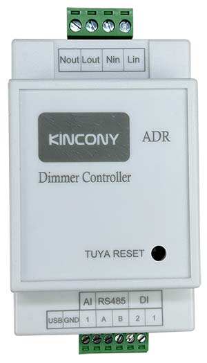
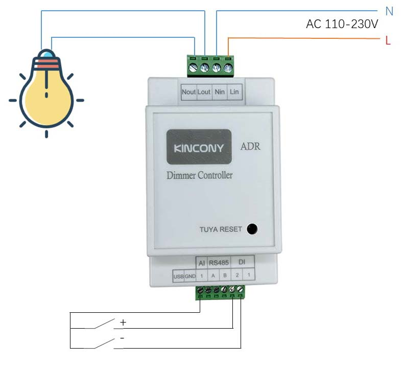
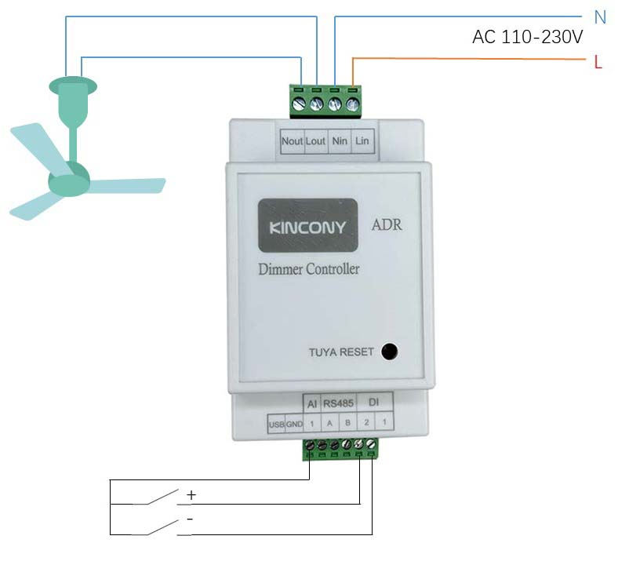

## Resources

- [ESP32 pin define details](https://www.kincony.com/forum/showthread.php?tid=5276)
- [YouTube video tour](https://youtu.be/JMtgOhL1Jb0)

## ESPHome Configuration

Here is an example YAML configuration for the KinCony-ADR board.

```yaml
esphome:
  name: adr
  friendly_name: ADR

esp32:
  board: esp32dev
  framework:
    type: arduino

# Enable logging
logger:

# Enable Home Assistant API
api:

wifi:
  ssid: !secret wifi_ssid
  password: !secret wifi_password

captive_portal:

output:
  - platform: ac_dimmer
    id: dimmer1
    gate_pin: 33
    zero_cross_pin:
      number: 25
      mode:
        input: true
      inverted: no
    min_power: 35%

light:
  - platform: monochromatic
    output: dimmer1
    name: adr_lamp
    default_transition_length: 100ms
```
