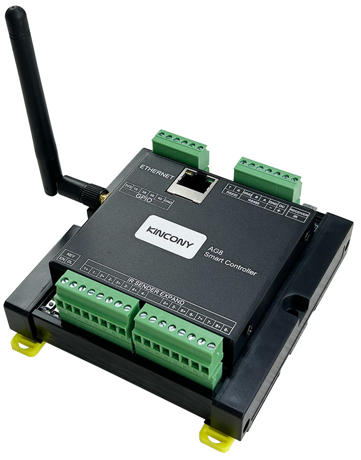
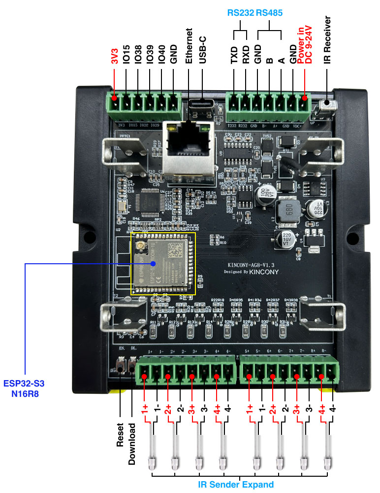

## Resources

- [ESP32 pin define details](https://www.kincony.com/forum/showthread.php?tid=5888)
- [YouTube video tour](https://youtu.be/wWhbA8ZlyUA)

## ESPHome Configuration

Here is an example YAML configuration for the KinCony-AG8 board.

```yaml
esphome:
  name: ag8
  friendly_name: ag8
  platformio_options:
    board_build.flash_mode: dio

esp32:
  board: esp32-s3-devkitc-1
  framework:
    type: esp-idf
    sdkconfig_options:
      SOC_RMT_SUPPORT_RX_PINGPONG: "n"
# Enable logging
logger:
  hardware_uart: USB_SERIAL_JTAG
# Enable Home Assistant API
api:

ethernet:
  type: W5500
  clk_pin: GPIO42
  mosi_pin: GPIO43
  miso_pin: GPIO44
  cs_pin: GPIO41
  interrupt_pin: GPIO2
  reset_pin: GPIO1

remote_receiver:
  pin: 48
  rmt_channel: 4  
  dump: all

remote_transmitter:
  - id: ir1
    pin: 9
    carrier_duty_percent: 50%
  - id: ir2
    pin: 10
    carrier_duty_percent: 50%
  - id: ir3
    pin: 11
    carrier_duty_percent: 50%
  - id: ir4
    pin: 12
    carrier_duty_percent: 50%
  # - id: ir5
  #   pin: 13
  #   carrier_duty_percent: 50%
  # - id: ir6
  #   pin: 14
  #   carrier_duty_percent: 50%
  # - id: ir7
  #   pin: 21
  #   carrier_duty_percent: 50%
  # - id: ir8
  #   pin: 47
  #   carrier_duty_percent: 50%

switch:
  - platform: template
    name: IR-Send1
    turn_on_action:
      - remote_transmitter.transmit_panasonic:
          transmitter_id: ir1
          address: 0x4004
          command: 0x8140DFA2

  - platform: template
    name: IR-Send2
    turn_on_action:
      - remote_transmitter.transmit_panasonic:
          transmitter_id: ir2
          address: 0x4004
          command: 0x8140DFA2

  - platform: template
    name: IR-Send3
    turn_on_action:
      - remote_transmitter.transmit_panasonic:
          transmitter_id: ir3
          address: 0x4004
          command: 0x8140DFA2

  - platform: template
    name: IR-Send4
    turn_on_action:
      - remote_transmitter.transmit_panasonic:
          transmitter_id: ir4
          address: 0x4004
          command: 0x8140DFA2

  # - platform: template
  #   name: IR-Send5
  #   turn_on_action:
  #     - remote_transmitter.transmit_panasonic:
  #         transmitter_id: ir5
  #         address: 0x4004
  #         command: 0x8140DFA2

  # - platform: template
  #   name: IR-Send6
  #   turn_on_action:
  #     - remote_transmitter.transmit_panasonic:
  #         transmitter_id: ir6
  #         address: 0x4004
  #         command: 0x8140DFA2

  # - platform: template
  #   name: IR-Send7
  #   turn_on_action:
  #     - remote_transmitter.transmit_panasonic:
  #         transmitter_id: ir7
  #         address: 0x4004
  #         command: 0x8140DFA2

  # - platform: template
  #   name: IR-Send8
  #   turn_on_action:
  #     - remote_transmitter.transmit_panasonic:
  #         transmitter_id: ir8
  #         address: 0x4004
  #         command: 0x8140DFA2

  - platform: uart
    uart_id: uart_485
    name: "RS485 Button"
    data: [0x11, 0x22, 0x33, 0x44, 0x55]

  - platform: uart
    uart_id: uart_232
    name: "RS232 Button"
    data: "RS232-test"

uart:
  - id: uart_485
    baud_rate: 9600
    debug:
      direction: BOTH
      dummy_receiver: true
      after:
        timeout: 10ms
    tx_pin: 18
    rx_pin: 8

  - id: uart_232
    baud_rate: 9600
    debug:
      direction: BOTH
      dummy_receiver: true
      after:
        timeout: 10ms
      sequence:
        - lambda: UARTDebug::log_string(direction, bytes);
    tx_pin: 17
    rx_pin: 16

binary_sensor:
  - platform: gpio
    name: "IO15"
    pin:
      number: 15
      inverted: true
      mode:
        input: true
        pullup: true
  - platform: gpio
    name: "IO38"
    pin:
      number: 38
      inverted: true
      mode:
        input: true
        pullup: true
  - platform: gpio
    name: "IO39"
    pin:
      number: 39
      inverted: true
      mode:
        input: true
        pullup: true
  - platform: gpio
    name: "IO40"
    pin:
      number: 40
      inverted: true
      mode:
        input: true
        pullup: true

web_server:
  port: 80
```
