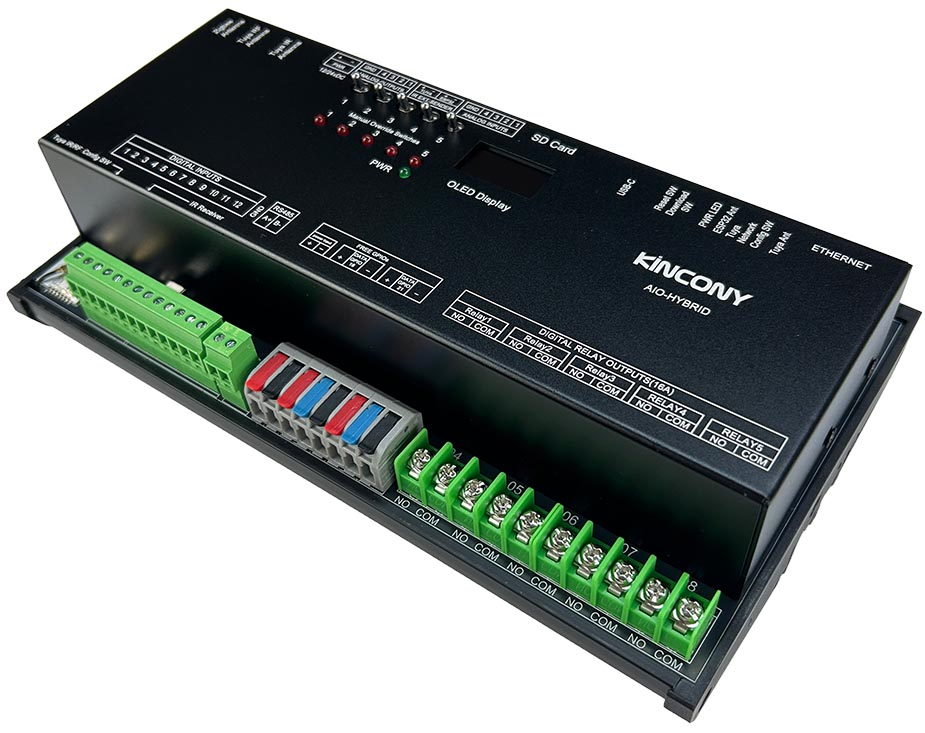
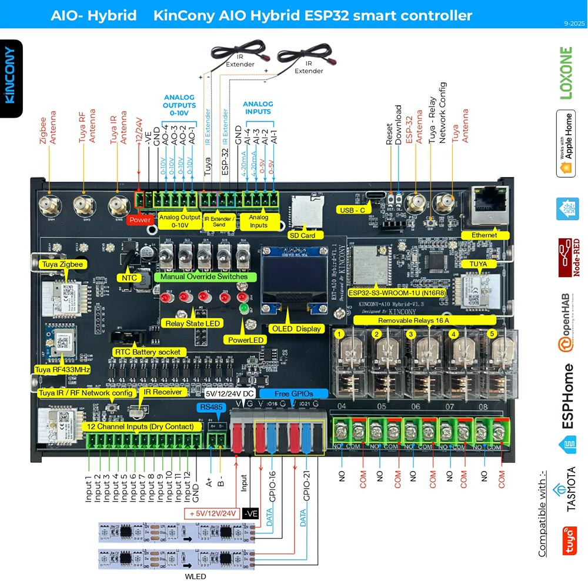

## Resources

- [ESP32 pin define details](https://www.kincony.com/forum/showthread.php?tid=8532)

## ESPHome Configuration

Here is an example YAML configuration for the KinCony AIO Hybrid ESP32-S3 ALL IN ONE board.
```yaml
esphome:
  name: aio-hybrid
  friendly_name: AIO-hybrid
  platformio_options:
    board_build.flash_mode: dio

esp32:
  board: esp32-s3-devkitc-1
  framework:
    type: esp-idf
    sdkconfig_options:
      SOC_RMT_SUPPORT_RX_PINGPONG: "n"
# Enable logging
logger:
  hardware_uart: USB_SERIAL_JTAG
# Enable Home Assistant API
api:

uart:
  - id: uart_zsu
    baud_rate: 115200
    debug:
      direction: BOTH
      dummy_receiver: true
      after:
        timeout: 10ms
      sequence:
        - lambda: UARTDebug::log_string(direction, bytes);
    tx_pin: 15
    rx_pin: 48

ethernet:
  type: W5500
  clk_pin: GPIO42
  mosi_pin: GPIO43
  miso_pin: GPIO44
  cs_pin: GPIO41
  interrupt_pin: GPIO2
  reset_pin: GPIO1

i2c:
   - id: bus_a
     sda: 8
     scl: 18
     scan: true
     frequency: 400kHz

pcf8574:
  - id: 'pcf8574_hub_output_1'  # for output channel 5
    i2c_id: bus_a
    address: 0x26

  - id: 'pcf8574_hub_input_1'  # for input channel 1-12
    i2c_id: bus_a
    address: 0x24
    pcf8575: true


switch:

  - platform: uart
    uart_id: uart_zsu
    name: "UART zigbee"
    data: [0x55, 0xaa, 0x00, 0x00, 0x04, 0x00, 0x00, 0x00, 0x01, 0x00, 0x04] # ZSU zigbee module

  - platform: gpio
    name: "AIO_hybrid-output01"
    id: "AIO_hybrid_output01"
    pin:
      pcf8574: pcf8574_hub_output_1
      number: 3
      mode: OUTPUT
      inverted: true

  - platform: gpio
    name: "AIO_hybrid-output02"
    id: "AIO_hybrid_output02"
    pin:
      pcf8574: pcf8574_hub_output_1
      number: 4
      mode: OUTPUT
      inverted: true

  - platform: gpio
    name: "AIO_hybrid-output03"
    id: "AIO_hybrid_output03"
    pin:
      pcf8574: pcf8574_hub_output_1
      number: 5
      mode: OUTPUT
      inverted: true

  - platform: gpio
    name: "AIO_hybrid-output04"
    id: "AIO_hybrid_output04"
    pin:
      pcf8574: pcf8574_hub_output_1
      number: 6
      mode: OUTPUT
      inverted: true

  - platform: gpio
    name: "AIO_hybrid-output05"
    id: "AIO_hybrid_output05"
    pin:
      pcf8574: pcf8574_hub_output_1
      number: 7
      mode: OUTPUT
      inverted: true

  - platform: template
    name: IR-Send1
    turn_on_action:
      - remote_transmitter.transmit_pronto:
          transmitter_id: ir1
          data: "0000 006C 0022 0002 015B 00AD 0016 0041 0016 0016 0016 0041 0016 0016 0016 0016 0016 0041 0016 0041 0016 0041 0016 0041 0016 0041 0016 0041 0016 0016 0016 0016 0016 0016 0016 0016 0016 0041 0016 0041 0016 0041 0016 0041 0016 0016 0016 0016 0016 0016 0016 0016 0016 0016 0016 0016 0016 0041 0016 0041 0016 0041 0016 0041 0016 0041 0016 0041 0016 0041 0016 0575 015B 0057 0016 0E6C"

binary_sensor:
  - platform: gpio
    name: "AIO_hybrid-input01"
    id: "AIO_hybrid_input01"
    pin:
      pcf8574: pcf8574_hub_input_1
      number: 0
      mode: INPUT
      inverted: true

  - platform: gpio
    name: "AIO_hybrid-input02"
    id: "AIO_hybrid_input02"
    pin:
      pcf8574: pcf8574_hub_input_1
      number: 1
      mode: INPUT
      inverted: true

  - platform: gpio
    name: "AIO_hybrid-input03"
    id: "AIO_hybrid_input03"
    pin:
      pcf8574: pcf8574_hub_input_1
      number: 2
      mode: INPUT
      inverted: true

  - platform: gpio
    name: "AIO_hybrid-input04"
    id: "AIO_hybrid_input04"
    pin:
      pcf8574: pcf8574_hub_input_1
      number: 3
      mode: INPUT
      inverted: true

  - platform: gpio
    name: "AIO_hybrid-input05"
    id: "AIO_hybrid_input05"
    pin:
      pcf8574: pcf8574_hub_input_1
      number: 4
      mode: INPUT
      inverted: true

  - platform: gpio
    name: "AIO_hybrid-input06"
    id: "AIO_hybrid_input06"
    pin:
      pcf8574: pcf8574_hub_input_1
      number: 5
      mode: INPUT
      inverted: true

  - platform: gpio
    name: "AIO_hybrid-input07"
    id: "AIO_hybrid_input07"
    pin:
      pcf8574: pcf8574_hub_input_1
      number: 6
      mode: INPUT
      inverted: true

  - platform: gpio
    name: "AIO_hybrid-input08"
    id: "AIO_hybrid_input08"
    pin:
      pcf8574: pcf8574_hub_input_1
      number: 7
      mode: INPUT
      inverted: true

  - platform: gpio
    name: "AIO_hybrid-input09"
    id: "AIO_hybrid_input09"
    pin:
      pcf8574: pcf8574_hub_input_1
      number: 8
      mode: INPUT
      inverted: true

  - platform: gpio
    name: "AIO_hybrid-input10"
    id: "AIO_hybrid_input10"
    pin:
      pcf8574: pcf8574_hub_input_1
      number: 9
      mode: INPUT
      inverted: true

  - platform: gpio
    name: "AIO_hybrid-input11"
    id: "AIO_hybrid_input11"
    pin:
      pcf8574: pcf8574_hub_input_1
      number: 10
      mode: INPUT
      inverted: true

  - platform: gpio
    name: "AIO_hybrid-input12"
    id: "AIO_hybrid_input12"
    pin:
      pcf8574: pcf8574_hub_input_1
      number: 11
      mode: INPUT
      inverted: true

## without resistance on PCB
  - platform: gpio
    name: "AIO_hybrid-433M"
    pin:
      number: 40
      inverted:  false

  - platform: gpio
    name: "AIO_hybrid-io0"
    pin:
      number: 0
      inverted:  false

mcp4728:
  - id: dac_output

output:
- platform: mcp4728
  id: dimmer1
  mcp4728_id: dac_output
  channel: A
  vref: vdd
  power_down: normal # default

- platform: mcp4728
  id: dimmer2
  mcp4728_id: dac_output
  channel: B
  vref: vdd
  power_down: normal # default

- platform: mcp4728
  id: dimmer3
  mcp4728_id: dac_output
  channel: C
  vref: vdd
  power_down: normal # default

- platform: mcp4728
  id: dimmer4
  mcp4728_id: dac_output
  channel: D
  vref: vdd
  power_down: normal # default

light:
  - platform: monochromatic
    name: "dimmer-1"
    output: dimmer1
    gamma_correct: 1.0

  - platform: monochromatic
    name: "dimmer-2"
    output: dimmer2
    gamma_correct: 1.0

  - platform: monochromatic
    name: "dimmer-3"
    output: dimmer3
    gamma_correct: 1.0

  - platform: monochromatic
    name: "dimmer-4"
    output: dimmer4
    gamma_correct: 1.0

  - platform: esp32_rmt_led_strip
    rgb_order: GRB
    pin: GPIO21
    num_leds: 20
    chipset: ws2812
    name: "My Light IO21"

font:
  - file: "gfonts://Roboto"
    id: roboto
    size: 20

display:
  - platform: ssd1306_i2c
    i2c_id: bus_a
    model: "SSD1306 128x64"
    address: 0x3C
    lambda: |-
      it.printf(0, 0, id(roboto), "AIO-hybrid");

sensor:
  - platform: adc
    pin: 5
    name: "AIO_hybrid A1 Voltage"
    update_interval: 55s
    attenuation: 11db
    filters:
      - lambda:
          if (x >= 3.11) {
            return x * 1.60256;
          } else if (x <= 0.15) {
            return 0;
          } else {
            return x * 1.51;
          }
  - platform: adc
    pin: 7
    name: "AIO_hybrid A2 Voltage"
    update_interval: 55s
    attenuation: 11db
    filters:
      # - multiply: 1.51515
      - lambda:
          if (x >= 3.11) {
            return x * 1.60256;
          } else if (x <= 0.15) {
            return 0;
          } else {
            return x * 1.51;
          }
  - platform: adc
    pin: 6
    name: "AIO_hybrid A3 Current"
    update_interval: 55s
    unit_of_measurement: mA
    attenuation: 11db
    filters:
      - multiply: 6.66666666
  - platform: adc
    pin: 4
    name: "AIO_hybrid A4 Current"
    update_interval: 55s
    unit_of_measurement: mA
    attenuation: 11db
    filters:
      - multiply: 6.66666666

remote_receiver:
  pin: 17
  dump: all

remote_transmitter:
  - id: ir1
    pin: 14
    carrier_duty_percent: 50%
```
