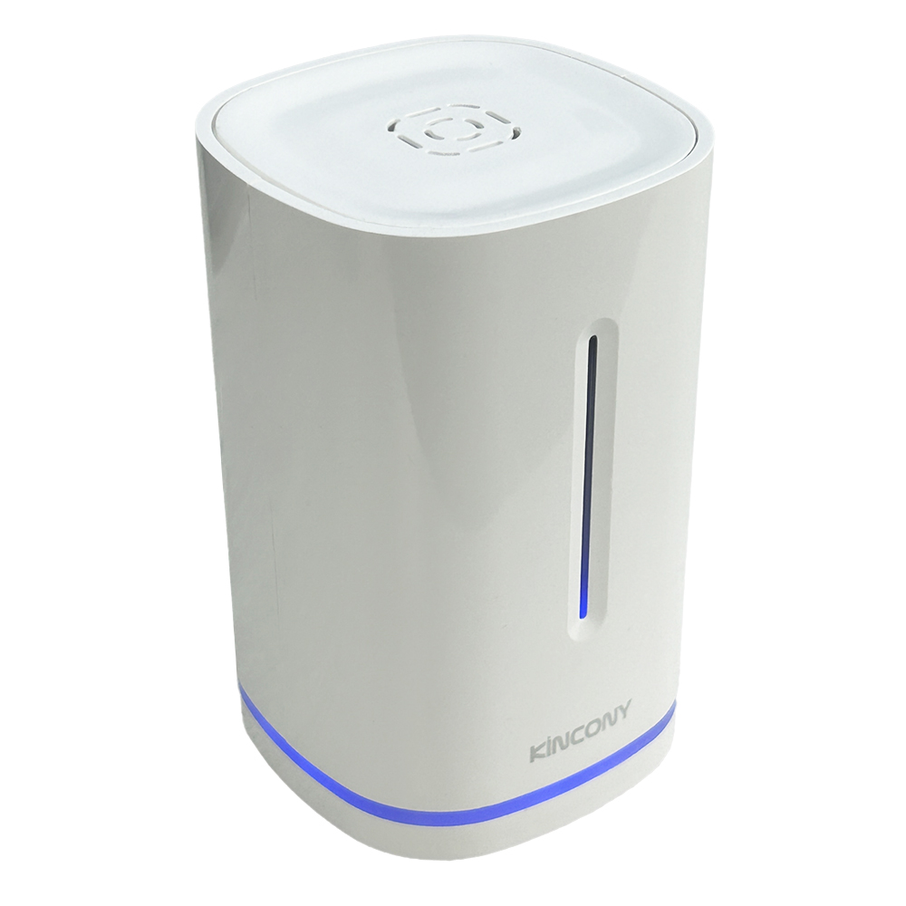
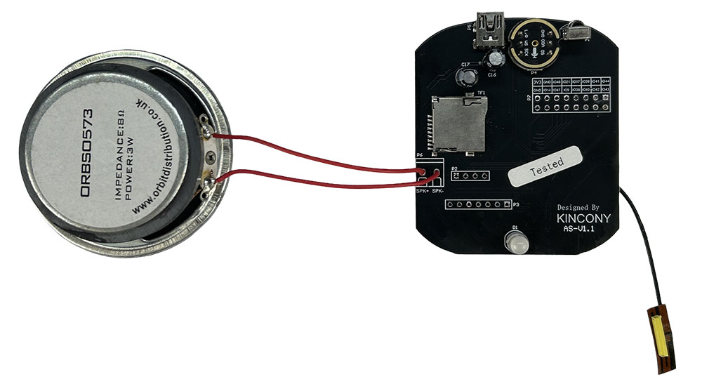
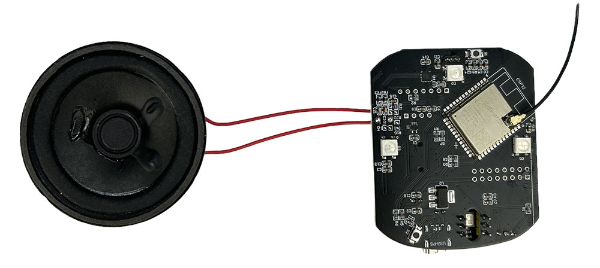

## Resources

- [ESP32 pin define details](https://www.kincony.com/forum/showthread.php?tid=6889)
- [YouTube video tour](https://youtu.be/g-KsrZjFljY)

## ESPHome Configuration

Here is an example YAML configuration for the KinCony-B16M board with custom sensor integration.

```yaml
esphome:
  name: as
  friendly_name: AS
  platformio_options:
    board_build.flash_mode: dio
  on_boot:
    - light.turn_on:
        id: led_ww
        blue: 100%
        brightness: 60%
        effect: fast pulse

esp32:
  board: esp32-s3-devkitc-1
  framework:
    type: esp-idf

    sdkconfig_options:
      CONFIG_ESP32S3_DEFAULT_CPU_FREQ_240: "y"
      CONFIG_ESP32S3_DATA_CACHE_64KB: "y"
      CONFIG_ESP32S3_DATA_CACHE_LINE_64B: "y"
      CONFIG_AUDIO_BOARD_CUSTOM: "y"

psram:
  mode: octal  # quad for N8R2 and octal for N16R8
  speed: 80MHz

# Enable logging
logger:
  hardware_uart: USB_SERIAL_JTAG

# Enable Home Assistant API
api:
  on_client_connected:
        then:
          - delay: 50ms
          - light.turn_off: led_ww
          - micro_wake_word.start:
  on_client_disconnected:
        then:
          - voice_assistant.stop:

wifi:
  ssid: !secret wifi_ssid
  password: !secret wifi_password

captive_portal:

button:
  - platform: restart
    name: "Restart"
    id: but_rest

switch:
  - platform: template
    id: mute
    name: mute
    optimistic: true
    on_turn_on:
      - micro_wake_word.stop:
      - voice_assistant.stop:
      - light.turn_on:
          id: led_ww
          red: 100%
          green: 0%
          blue: 0%
          brightness: 60%
          effect: fast pulse
      - delay: 2s
      - light.turn_off:
          id: led_ww
      - light.turn_on:
          id: led_ww
          red: 100%
          green: 0%
          blue: 0%
          brightness: 30%
    on_turn_off:
      - micro_wake_word.start:
      - light.turn_on:
          id: led_ww
          red: 0%
          green: 100%
          blue: 0%
          brightness: 60%
          effect: fast pulse
      - delay: 2s
      - light.turn_off:
          id: led_ww

light:
  - platform: esp32_rmt_led_strip
    id: led_ww
    rgb_order: RGB
    pin: GPIO16
    num_leds: 1
    rmt_channel: 0
    chipset: ws2812
    name: "on board light"
    effects:
      - pulse:
      - pulse:
          name: "Fast Pulse"
          transition_length: 0.5s
          update_interval: 0.5s
          min_brightness: 0%
          max_brightness: 100%

 # Audio and Voice Assistant Config
i2s_audio:
  - id: i2s_in
    i2s_lrclk_pin: GPIO3  #WS
    i2s_bclk_pin: GPIO2 #SCK
  - id: i2s_speaker
    i2s_lrclk_pin: GPIO6  #LRC
    i2s_bclk_pin: GPIO7 #BLCK

microphone:
  - platform: i2s_audio
    id: va_mic
    adc_type: external
    i2s_din_pin: GPIO4 #SD pin on the INMP441
    channel: left
    pdm: false
    i2s_audio_id: i2s_in
    bits_per_sample: 32 bit

speaker:
    platform: i2s_audio
    id: va_speaker
    i2s_audio_id: i2s_speaker
    dac_type: external
    i2s_dout_pin: GPIO8   #  DIN Pin of the MAX98357A Audio Amplifier
    channel: mono

micro_wake_word:
  on_wake_word_detected:
    # then:
    - voice_assistant.start:
        wake_word: !lambda return wake_word;
    - light.turn_on:
        id: led_ww
        red: 30%
        green: 30%
        blue: 70%
        brightness: 60%
        effect: fast pulse
  models:
    - model: github://esphome/micro-wake-word-models/models/v2/hey_jarvis.json

voice_assistant:
  id: va
  microphone: va_mic
  noise_suppression_level: 2.0
  volume_multiplier: 4.0
  speaker: va_speaker
  on_stt_end:
       then:
         - light.turn_off: led_ww
  on_error:
          - micro_wake_word.start:
  on_end:
        then:
          - light.turn_off: led_ww
          - wait_until:
              not:
                voice_assistant.is_running:
          - micro_wake_word.start:
```
