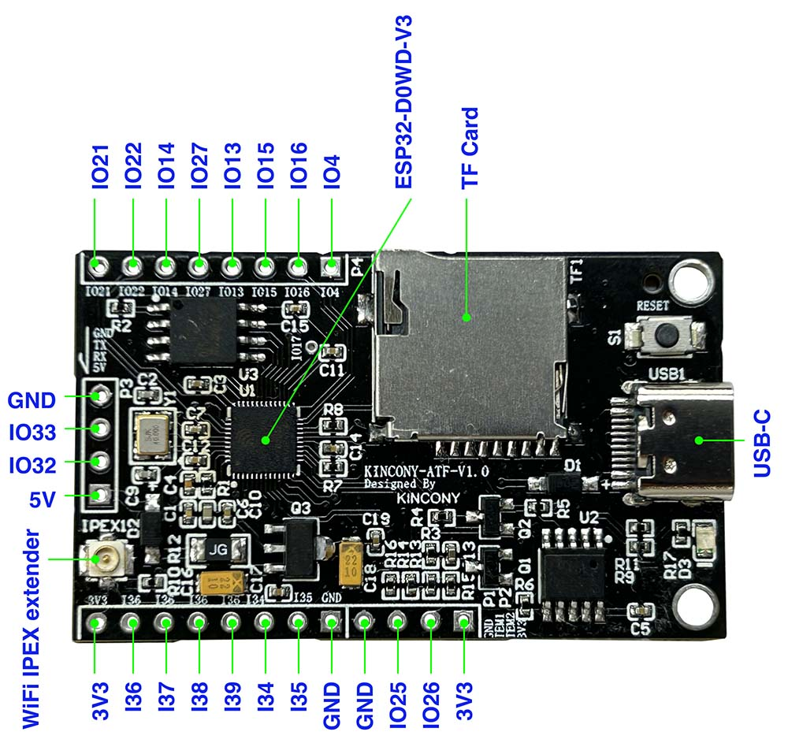

## Resources

- [ESP32 pin define details](https://www.kincony.com/forum/showthread.php?tid=5515)
- [YouTube video tour](https://youtu.be/-ujqoLx0BqA)

## ESPHome Configuration

Here is an example YAML configuration for the KinCony-ATF module.

```yaml
esphome:
  name: atf
  friendly_name: atf

esp32:
  board: esp32dev
  framework:
    type: arduino

# Enable logging
logger:

# Enable Home Assistant API
api:

ota:

wifi:
  ssid: !secret wifi_ssid
  password: !secret wifi_password

captive_portal:

binary_sensor:
  - platform: gpio
    name: "21"
    pin:
      number: 21
      inverted: true
  - platform: gpio
    name: "22"
    pin:
      number: 22
      inverted: true
  - platform: gpio
    name: "14"
    pin:
      number: 14
      inverted: true
  - platform: gpio
    name: "27"
    pin:
      number: 27
      inverted: true
  - platform: gpio
    name: "13"
    pin:
      number: 13
      inverted: true
  - platform: gpio
    name: "15"
    pin:
      number: 15
      inverted: true
  - platform: gpio
    name: "16"
    pin:
      number: 16
      inverted: true
  - platform: gpio
    name: "4"
    pin:
      number: 4
      inverted: true
  - platform: gpio
    name: "36"
    pin:
      number: 36
      inverted: true
  - platform: gpio
    name: "37"
    pin:
      number: 37
      inverted: true
  - platform: gpio
    name: "38"
    pin:
      number: 38
      inverted: true
  - platform: gpio
    name: "39"
    pin:
      number: 39
      inverted: true
  - platform: gpio
    name: "34"
    pin:
      number: 34
      inverted: true
  - platform: gpio
    name: "35"
    pin:
      number: 35
      inverted: true
  - platform: gpio
    name: "TMP1"
    pin:
      number: 26
      inverted: true
  - platform: gpio
    name: "TMP2"
    pin:
      number: 25
      inverted: true
  - platform: gpio
    name: "32"
    pin:
      number: 32
      inverted: true
  - platform: gpio
    name: "33"
    pin:
      number: 33
      inverted: true
web_server:
  port: 80
```
