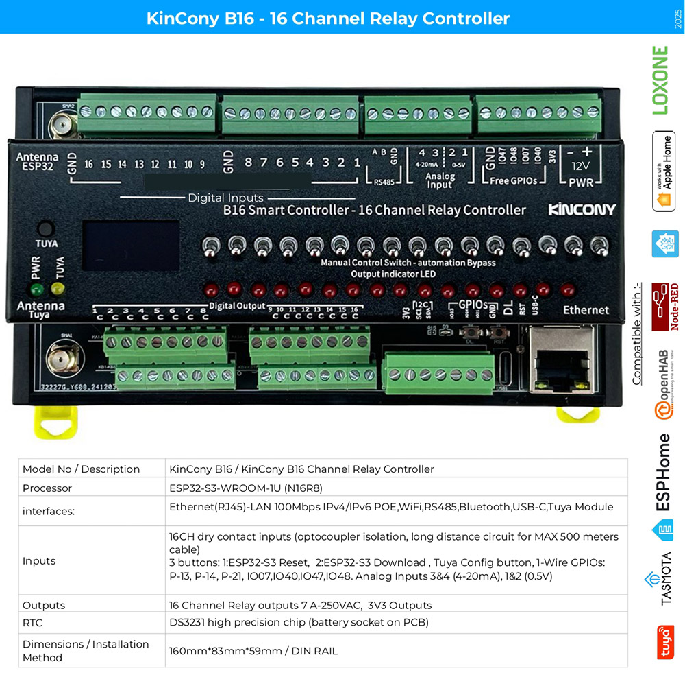
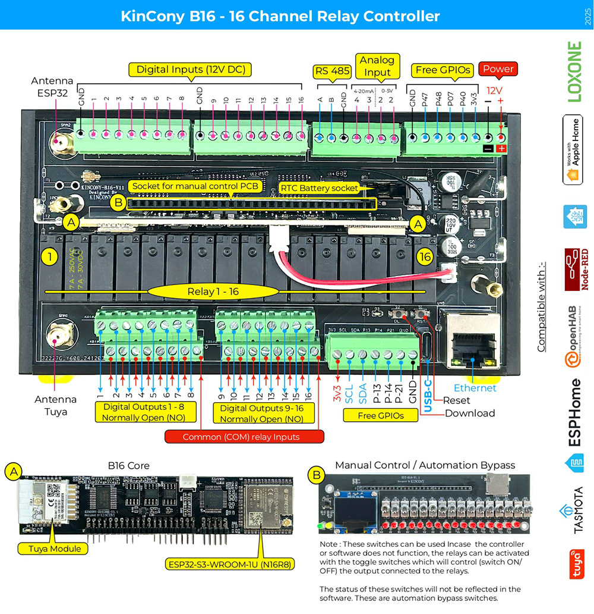

## Resources

- [ESP32 pin define details](https://www.kincony.com/forum/showthread.php?tid=7673)
- [YouTube video tour](https://youtu.be/nN9BOcp5fiI)

## ESPHome Configuration

Here is an example YAML configuration for the KinCony-B16 board.

```yaml
esphome:
  name: b16
  friendly_name: b16

esp32:
  board: esp32-s3-devkitc-1
  framework:
    type: arduino

# Enable logging
# logger:
#   hardware_uart: USB_SERIAL_JTAG
# Enable Home Assistant API
api:

ethernet:
  type: W5500
  clk_pin: GPIO1
  mosi_pin: GPIO2
  miso_pin: GPIO41
  cs_pin: GPIO42
  interrupt_pin: GPIO43
  reset_pin: GPIO44

i2c:
  - id: bus_a
    sda: 8
    scl: 18
    scan: true
    frequency: 400kHz

pcf8574:
  - id: pcf8574_hub_out_1 # for output channel 1-16
    i2c_id: bus_a
    address: 0x22
    pcf8575: true

  - id: pcf8574_hub_in_1 # for input channel 1-16
    i2c_id: bus_a
    address: 0x24
    pcf8575: true

uart:
  - id: uart_1 #RS485
    baud_rate: 9600
    debug:
      direction: BOTH
      dummy_receiver: true
      after:
        timeout: 10ms
    tx_pin: 39
    rx_pin: 38

switch:
  - platform: uart
    uart_id: uart_1
    name: "RS485 Button"
    data: [0x11, 0x22, 0x33, 0x44, 0x55]

  - platform: gpio
    name: "b16-output01"
    id: "b16_output01"
    pin:
      pcf8574: pcf8574_hub_out_1
      number: 0
      mode: OUTPUT
      inverted: true
  - platform: gpio
    name: "b16-output02"
    id: "b16_output02"
    pin:
      pcf8574: pcf8574_hub_out_1
      number: 1
      mode: OUTPUT
      inverted: true
  - platform: gpio
    name: "b16-output03"
    id: "b16_output03"
    pin:
      pcf8574: pcf8574_hub_out_1
      number: 2
      mode: OUTPUT
      inverted: true
  - platform: gpio
    name: "b16-output04"
    id: "b16_output04"
    pin:
      pcf8574: pcf8574_hub_out_1
      number: 3
      mode: OUTPUT
      inverted: true
  - platform: gpio
    name: "b16-output05"
    id: "b16_output05"
    pin:
      pcf8574: pcf8574_hub_out_1
      number: 4
      mode: OUTPUT
      inverted: true
  - platform: gpio
    name: "b16-output06"
    id: "b16_output06"
    pin:
      pcf8574: pcf8574_hub_out_1
      number: 5
      mode: OUTPUT
      inverted: true
  - platform: gpio
    name: "b16-output07"
    id: "b16_output07"
    pin:
      pcf8574: pcf8574_hub_out_1
      number: 6
      mode: OUTPUT
      inverted: true
  - platform: gpio
    name: "b16-output08"
    id: "b16_output08"
    pin:
      pcf8574: pcf8574_hub_out_1
      number: 7
      mode: OUTPUT
      inverted: true
  - platform: gpio
    name: "b16-output09"
    id: "b16_output09"
    pin:
      pcf8574: pcf8574_hub_out_1
      number: 8
      mode: OUTPUT
      inverted: true
  - platform: gpio
    name: "b16-output10"
    id: "b16_output10"
    pin:
      pcf8574: pcf8574_hub_out_1
      number: 9
      mode: OUTPUT
      inverted: true
  - platform: gpio
    name: "b16-output11"
    id: "b16_output11"
    pin:
      pcf8574: pcf8574_hub_out_1
      number: 10
      mode: OUTPUT
      inverted: true
  - platform: gpio
    name: "b16-output12"
    id: "b16_output12"
    pin:
      pcf8574: pcf8574_hub_out_1
      number: 11
      mode: OUTPUT
      inverted: true
  - platform: gpio
    name: "b16-output13"
    id: "b16_output13"
    pin:
      pcf8574: pcf8574_hub_out_1
      number: 12
      mode: OUTPUT
      inverted: true
  - platform: gpio
    name: "b16-output14"
    id: "b16_output14"
    pin:
      pcf8574: pcf8574_hub_out_1
      number: 13
      mode: OUTPUT
      inverted: true
  - platform: gpio
    name: "b16-output15"
    id: "b16_output15"
    pin:
      pcf8574: pcf8574_hub_out_1
      number: 14
      mode: OUTPUT
      inverted: true
  - platform: gpio
    name: "b16-output16"
    id: "b16_output16"
    pin:
      pcf8574: pcf8574_hub_out_1
      number: 15
      mode: OUTPUT
      inverted: true

binary_sensor:
  - platform: gpio
    name: "b16-input01"
    id: "b16_input01"
    pin:
      pcf8574: pcf8574_hub_in_1
      number: 0
      mode: INPUT
      inverted: true

  - platform: gpio
    name: "b16-input02"
    id: "b16_input02"
    pin:
      pcf8574: pcf8574_hub_in_1
      number: 1
      mode: INPUT
      inverted: true
  - platform: gpio
    name: "b16-input03"
    id: "b16_input03"
    pin:
      pcf8574: pcf8574_hub_in_1
      number: 2
      mode: INPUT
      inverted: true
  - platform: gpio
    name: "b16-input04"
    id: "b16_input04"
    pin:
      pcf8574: pcf8574_hub_in_1
      number: 3
      mode: INPUT
      inverted: true
  - platform: gpio
    name: "b16-input05"
    id: "b16_input05"
    pin:
      pcf8574: pcf8574_hub_in_1
      number: 4
      mode: INPUT
      inverted: true
  - platform: gpio
    name: "b16-input06"
    id: "b16_input06"
    pin:
      pcf8574: pcf8574_hub_in_1
      number: 5
      mode: INPUT
      inverted: true
  - platform: gpio
    name: "b16-input07"
    id: "b16_input07"
    pin:
      pcf8574: pcf8574_hub_in_1
      number: 6
      mode: INPUT
      inverted: true
  - platform: gpio
    name: "b16-input08"
    id: "b16_input08"
    pin:
      pcf8574: pcf8574_hub_in_1
      number: 7
      mode: INPUT
      inverted: true
  - platform: gpio
    name: "b16-input09"
    id: "b16_input09"
    pin:
      pcf8574: pcf8574_hub_in_1
      number: 8
      mode: INPUT
      inverted: true
  - platform: gpio
    name: "b16-input10"
    id: "b16_input10"
    pin:
      pcf8574: pcf8574_hub_in_1
      number: 9
      mode: INPUT
      inverted: true
  - platform: gpio
    name: "b16-input11"
    id: "b16_input11"
    pin:
      pcf8574: pcf8574_hub_in_1
      number: 10
      mode: INPUT
      inverted: true
  - platform: gpio
    name: "b16-input12"
    id: "b16_input12"
    pin:
      pcf8574: pcf8574_hub_in_1
      number: 11
      mode: INPUT
      inverted: true
  - platform: gpio
    name: "b16-input13"
    id: "b16_input13"
    pin:
      pcf8574: pcf8574_hub_in_1
      number: 12
      mode: INPUT
      inverted: true
  - platform: gpio
    name: "b16-input14"
    id: "b16_input14"
    pin:
      pcf8574: pcf8574_hub_in_1
      number: 13
      mode: INPUT
      inverted: true
  - platform: gpio
    name: "b16-input15"
    id: "b16_input15"
    pin:
      pcf8574: pcf8574_hub_in_1
      number: 14
      mode: INPUT
      inverted: true
  - platform: gpio
    name: "b16-input16"
    id: "b16_input16"
    pin:
      pcf8574: pcf8574_hub_in_1
      number: 15
      mode: INPUT
      inverted: true

  ##pull-up resistance on PCB
  - platform: gpio
    name: "b16-W1-io48"
    pin:
      number: 48
      inverted: true

  - platform: gpio
    name: "b16-W1-io47"
    pin:
      number: 47
      inverted: true

  - platform: gpio
    name: "b16-W1-io40"
    pin:
      number: 40
      inverted: true

  - platform: gpio
    name: "b16-W1-io7"
    pin:
      number: 7
      inverted: true
  ## without resistance on PCB
  - platform: gpio
    name: "b16-io13"
    pin:
      number: 13
      inverted: false

  - platform: gpio
    name: "b16-io14"
    pin:
      number: 14
      inverted: false

  - platform: gpio
    name: "b16-21"
    pin:
      number: 21
      inverted: false

  - platform: gpio
    name: "b16-0"
    pin:
      number: 0
      inverted: false

ads1115:
  - address: 0x48

sensor:
  - platform: ads1115
    multiplexer: A0_GND
    gain: 6.144
    resolution: 16_BITS
    name: "ADS1115 Channel A0-GND"
    update_interval: 5s
  - platform: ads1115
    multiplexer: A1_GND
    gain: 6.144
    name: "ADS1115 Channel A1-GND"
    update_interval: 5s
  - platform: ads1115
    multiplexer: A2_GND
    gain: 6.144
    name: "ADS1115 Channel A2-GND"
    update_interval: 5s
  - platform: ads1115
    multiplexer: A3_GND
    gain: 6.144
    name: "ADS1115 Channel A3-GND"
    update_interval: 5s

web_server:
  port: 80

font:
  - file: "gfonts://Roboto"
    id: roboto
    size: 20

display:
  - platform: ssd1306_i2c
    i2c_id: bus_a
    model: "SSD1306 128x64"
    address: 0x3C
    lambda: |-
      it.printf(0, 0, id(roboto), "KinCony B16");
```
