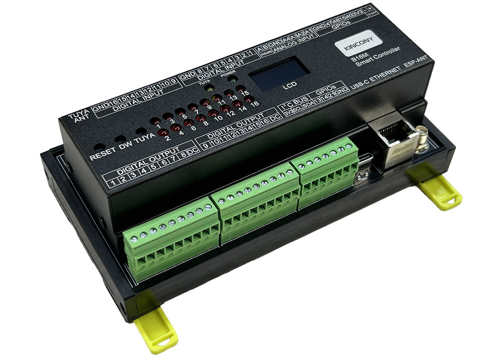
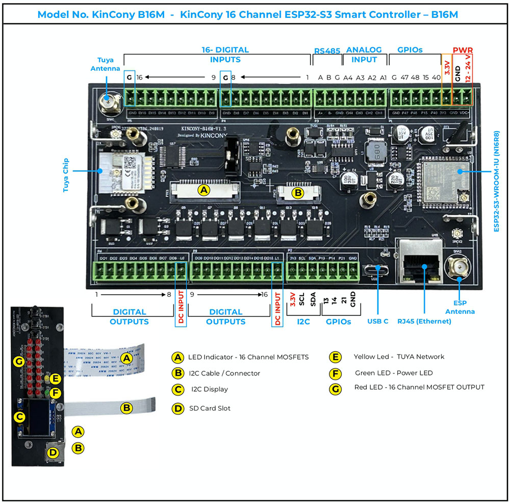

## Resources

- [ESP32 pin define details](https://www.kincony.com/forum/showthread.php?tid=6781)
- [YouTube video tour](https://youtu.be/yui05vCePmg)

## ESPHome Configuration

Here is an example YAML configuration for the KinCony-B16M board with custom sensor integration.

```yaml
esphome:
  name: b16m
  friendly_name: b16m
  platformio_options:
    board_build.flash_mode: dio
esp32:
  board: esp32-s3-devkitc-1
  framework:
    type: esp-idf

# Enable logging
logger:
  hardware_uart: USB_SERIAL_JTAG
# Enable Home Assistant API
api:

ethernet:
  type: W5500
  clk_pin: GPIO42
  mosi_pin: GPIO43
  miso_pin: GPIO44
  cs_pin: GPIO41
  interrupt_pin: GPIO2
  reset_pin: GPIO1

i2c:
   - id: bus_a
     sda: 38
     scl: 39
     scan: true
     frequency: 400kHz

pcf8574:
  - id: 'pcf8574_hub_out_1'  # for output channel 1-16
    i2c_id: bus_a
    address: 0x25
    pcf8575: true

  - id: 'pcf8574_hub_in_1'  # for input channel 1-16
    i2c_id: bus_a
    address: 0x24
    pcf8575: true

uart:
  - id: uart_1
    baud_rate: 9600
    debug:
      direction: BOTH
      dummy_receiver: true
      after:
        timeout: 10ms
    tx_pin: 18
    rx_pin: 8

switch:
  - platform: uart
    uart_id: uart_1
    name: "RS485 Button"
    data: [0x11, 0x22, 0x33, 0x44, 0x55]

  - platform: gpio
    name: "b16m-output01"
    pin:
      pcf8574: pcf8574_hub_out_1
      number: 0
      mode: OUTPUT
      inverted: true

  - platform: gpio
    name: "b16m-output02"
    pin:
      pcf8574: pcf8574_hub_out_1
      number: 1
      mode: OUTPUT
      inverted: true

  - platform: gpio
    name: "b16m-output03"
    pin:
      pcf8574: pcf8574_hub_out_1
      number: 2
      mode: OUTPUT
      inverted: true

  - platform: gpio
    name: "b16m-output04"
    pin:
      pcf8574: pcf8574_hub_out_1
      number: 3
      mode: OUTPUT
      inverted: true

  - platform: gpio
    name: "b16m-output05"
    pin:
      pcf8574: pcf8574_hub_out_1
      number: 4
      mode: OUTPUT
      inverted: true

  - platform: gpio
    name: "b16m-output06"
    pin:
      pcf8574: pcf8574_hub_out_1
      number: 5
      mode: OUTPUT
      inverted: true

  - platform: gpio
    name: "b16m-output07"
    pin:
      pcf8574: pcf8574_hub_out_1
      number: 6
      mode: OUTPUT
      inverted: true

  - platform: gpio
    name: "b16m-output08"
    pin:
      pcf8574: pcf8574_hub_out_1
      number: 7
      mode: OUTPUT
      inverted: true

  - platform: gpio
    name: "b16m-output09"
    pin:
      pcf8574: pcf8574_hub_out_1
      number: 8
      mode: OUTPUT
      inverted: true

  - platform: gpio
    name: "b16m-output10"
    pin:
      pcf8574: pcf8574_hub_out_1
      number: 9
      mode: OUTPUT
      inverted: true

  - platform: gpio
    name: "b16m-output11"
    pin:
      pcf8574: pcf8574_hub_out_1
      number: 10
      mode: OUTPUT
      inverted: true

  - platform: gpio
    name: "b16m-output12"
    pin:
      pcf8574: pcf8574_hub_out_1
      number: 11
      mode: OUTPUT
      inverted: true

  - platform: gpio
    name: "b16m-output13"
    pin:
      pcf8574: pcf8574_hub_out_1
      number: 12
      mode: OUTPUT
      inverted: true

  - platform: gpio
    name: "b16m-output14"
    pin:
      pcf8574: pcf8574_hub_out_1
      number: 13
      mode: OUTPUT
      inverted: true

  - platform: gpio
    name: "b16m-output15"
    pin:
      pcf8574: pcf8574_hub_out_1
      number: 14
      mode: OUTPUT
      inverted: true

  - platform: gpio
    name: "b16m-output16"
    pin:
      pcf8574: pcf8574_hub_out_1
      number: 15
      mode: OUTPUT
      inverted: true

binary_sensor:
  - platform: gpio
    name: "b16m-input01"
    pin:
      pcf8574: pcf8574_hub_in_1
      number: 0
      mode: INPUT
      inverted: true

  - platform: gpio
    name: "b16m-input02"
    pin:
      pcf8574: pcf8574_hub_in_1
      number: 1
      mode: INPUT
      inverted: true

  - platform: gpio
    name: "b16m-input03"
    pin:
      pcf8574: pcf8574_hub_in_1
      number: 2
      mode: INPUT
      inverted: true

  - platform: gpio
    name: "b16m-input04"
    pin:
      pcf8574: pcf8574_hub_in_1
      number: 3
      mode: INPUT
      inverted: true

  - platform: gpio
    name: "b16m-input05"
    pin:
      pcf8574: pcf8574_hub_in_1
      number: 4
      mode: INPUT
      inverted: true

  - platform: gpio
    name: "b16m-input06"
    pin:
      pcf8574: pcf8574_hub_in_1
      number: 5
      mode: INPUT
      inverted: true

  - platform: gpio
    name: "b16m-input07"
    pin:
      pcf8574: pcf8574_hub_in_1
      number: 6
      mode: INPUT
      inverted: true

  - platform: gpio
    name: "b16m-input08"
    pin:
      pcf8574: pcf8574_hub_in_1
      number: 7
      mode: INPUT
      inverted: true

  - platform: gpio
    name: "b16m-input09"
    pin:
      pcf8574: pcf8574_hub_in_1
      number: 8
      mode: INPUT
      inverted: true

  - platform: gpio
    name: "b16m-input10"
    pin:
      pcf8574: pcf8574_hub_in_1
      number: 9
      mode: INPUT
      inverted: true

  - platform: gpio
    name: "b16m-input11"
    pin:
      pcf8574: pcf8574_hub_in_1
      number: 10
      mode: INPUT
      inverted: true

  - platform: gpio
    name: "b16m-input12"
    pin:
      pcf8574: pcf8574_hub_in_1
      number: 11
      mode: INPUT
      inverted: true

  - platform: gpio
    name: "b16m-input13"
    pin:
      pcf8574: pcf8574_hub_in_1
      number: 12
      mode: INPUT
      inverted: true

  - platform: gpio
    name: "b16m-input14"
    pin:
      pcf8574: pcf8574_hub_in_1
      number: 13
      mode: INPUT
      inverted: true

  - platform: gpio
    name: "b16m-input15"
    pin:
      pcf8574: pcf8574_hub_in_1
      number: 14
      mode: INPUT
      inverted: true

  - platform: gpio
    name: "b16m-input16"
    pin:
      pcf8574: pcf8574_hub_in_1
      number: 15
      mode: INPUT
      inverted: true
##pull-up resistance on PCB
  - platform: gpio
    name: "b16m-W1-io40"
    pin:
      number: 40
      inverted: true

  - platform: gpio
    name: "b16m-W1-io15"
    pin:
      number: 15
      inverted: true

  - platform: gpio
    name: "b16m-W1-io48"
    pin:
      number: 48
      inverted: true

  - platform: gpio
    name: "b16m-W1-io47"
    pin:
      number: 47
      inverted: true
## without resistance on PCB
  - platform: gpio
    name: "b16m-W1-io13"
    pin:
      number: 13
      inverted: false

  - platform: gpio
    name: "b16m-W1-io14"
    pin:
      number: 14
      inverted:  false

  - platform: gpio
    name: "b16m-W1-io21"
    pin:
      number: 21
      inverted: false

ads1115:
  - address: 0x48
sensor:
  - platform: ads1115
    multiplexer: 'A0_GND'
    gain: 6.144
    resolution: 16_BITS
    name: "ADS1115 Channel A0-GND"
    update_interval: 5s
  - platform: ads1115
    multiplexer: 'A1_GND'
    gain: 6.144
    name: "ADS1115 Channel A1-GND"
    update_interval: 5s
  - platform: ads1115
    multiplexer: 'A2_GND'
    gain: 6.144
    name: "ADS1115 Channel A2-GND"
    update_interval: 5s
  - platform: ads1115
    multiplexer: 'A3_GND'
    gain: 6.144
    name: "ADS1115 Channel A3-GND"
    update_interval: 5s

web_server:
  port: 80
```
