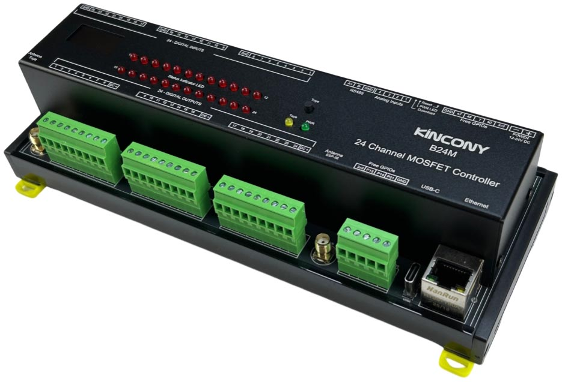

## Resources

- [ESP32 pin define details](https://www.kincony.com/forum/showthread.php?tid=8358)

## ESPHome Configuration

Here is an example YAML configuration for the KinCony B24M ESP32-S3 mosfet board.

```yaml
esphome:
  name: b24m
  friendly_name: b24m

esp32:
  board: esp32-s3-devkitc-1
  framework:
    type: arduino

# Enable logging
logger:

# Enable Home Assistant API
api:

ethernet:
  type: W5500
  clk_pin: GPIO1
  mosi_pin: GPIO2
  miso_pin: GPIO41
  cs_pin: GPIO42
  interrupt_pin: GPIO43
  reset_pin: GPIO44

uart:
  - id: uart_1    #RS485
    baud_rate: 9600
    debug:
      direction: BOTH
      dummy_receiver: true
      after:
        timeout: 10ms
    tx_pin: 39
    rx_pin: 38

i2c:
   - id: bus_a
     sda: 8
     scl: 18
     scan: true
     frequency: 400kHz

pcf8574:
  - id: 'pcf8574_hub_in_1'  # for input channel 1-16
    i2c_id: bus_a
    address: 0x22
    pcf8575: true

  - id: 'pcf8574_hub_in_out_1'  # for digital input channel 17-24 & ouptut 1-8
    i2c_id: bus_a
    address: 0x25
    pcf8575: true

  - id: 'pcf8574_hub_out_1'  # for output channel 9-24
    i2c_id: bus_a
    address: 0x24
    pcf8575: true

binary_sensor:
  - platform: gpio
    name: "b24-input01"
    id: "b24_input01"
    pin:
      pcf8574: pcf8574_hub_in_1
      number: 8
      mode: INPUT
      inverted: true


  - platform: gpio
    name: "b24-input02"
    id: "b24_input02"
    pin:
      pcf8574: pcf8574_hub_in_1
      number: 9
      mode: INPUT
      inverted: true


  - platform: gpio
    name: "b24-input03"
    id: "b24_input03"
    pin:
      pcf8574: pcf8574_hub_in_1
      number: 10
      mode: INPUT
      inverted: true


  - platform: gpio
    name: "b24-input04"
    id: "b24_input04"
    pin:
      pcf8574: pcf8574_hub_in_1
      number: 11
      mode: INPUT
      inverted: true


  - platform: gpio
    name: "b24-input05"
    id: "b24_input05"
    pin:
      pcf8574: pcf8574_hub_in_1
      number: 12
      mode: INPUT
      inverted: true


  - platform: gpio
    name: "b24-input06"
    id: "b24_input06"
    pin:
      pcf8574: pcf8574_hub_in_1
      number: 13
      mode: INPUT
      inverted: true


  - platform: gpio
    name: "b24-input07"
    id: "b24_input07"
    pin:
      pcf8574: pcf8574_hub_in_1
      number: 14
      mode: INPUT
      inverted: true

  - platform: gpio
    name: "b24-input08"
    id: "b24_input08"
    pin:
      pcf8574: pcf8574_hub_in_1
      number: 15
      mode: INPUT
      inverted: true

  - platform: gpio
    name: "b24-input09"
    id: "b24_input09"
    pin:
      pcf8574: pcf8574_hub_in_1
      number: 0
      mode: INPUT
      inverted: true


  - platform: gpio
    name: "b24-input10"
    id: "b24_input10"
    pin:
      pcf8574: pcf8574_hub_in_1
      number: 1
      mode: INPUT
      inverted: true


  - platform: gpio
    name: "b24-input11"
    id: "b24_input11"
    pin:
      pcf8574: pcf8574_hub_in_1
      number: 2
      mode: INPUT
      inverted: true


  - platform: gpio
    name: "b24-input12"
    id: "b24_input12"
    pin:
      pcf8574: pcf8574_hub_in_1
      number: 3
      mode: INPUT
      inverted: true


  - platform: gpio
    name: "b24-input13"
    id: "b24_input13"
    pin:
      pcf8574: pcf8574_hub_in_1
      number: 4
      mode: INPUT
      inverted: true


  - platform: gpio
    name: "b24-input14"
    id: "b24_input14"
    pin:
      pcf8574: pcf8574_hub_in_1
      number: 5
      mode: INPUT
      inverted: true


  - platform: gpio
    name: "b24-input15"
    id: "b24_input15"
    pin:
      pcf8574: pcf8574_hub_in_1
      number: 6
      mode: INPUT
      inverted: true


  - platform: gpio
    name: "b24-input16"
    id: "b24_input16"
    pin:
      pcf8574: pcf8574_hub_in_1
      number: 7
      mode: INPUT
      inverted: true

  - platform: gpio
    name: "b24-input17"
    id: "b24_input17"
    pin:
      pcf8574: pcf8574_hub_in_out_1
      number: 0
      mode: INPUT
      inverted: true

  - platform: gpio
    name: "b24-input18"
    id: "b24_input18"
    pin:
      pcf8574: pcf8574_hub_in_out_1
      number: 1
      mode: INPUT
      inverted: true

  - platform: gpio
    name: "b24-input19"
    id: "b24_input19"
    pin:
      pcf8574: pcf8574_hub_in_out_1
      number: 2
      mode: INPUT
      inverted: true

  - platform: gpio
    name: "b24-input20"
    id: "b24_input20"
    pin:
      pcf8574: pcf8574_hub_in_out_1
      number: 3
      mode: INPUT
      inverted: true

  - platform: gpio
    name: "b24-input21"
    id: "b24_input21"
    pin:
      pcf8574: pcf8574_hub_in_out_1
      number: 4
      mode: INPUT
      inverted: true

  - platform: gpio
    name: "b24-input22"
    id: "b24_input22"
    pin:
      pcf8574: pcf8574_hub_in_out_1
      number: 5
      mode: INPUT
      inverted: true

  - platform: gpio
    name: "b24-input23"
    id: "b24_input23"
    pin:
      pcf8574: pcf8574_hub_in_out_1
      number: 6
      mode: INPUT
      inverted: true

  - platform: gpio
    name: "b24-input24"
    id: "b24_input24"
    pin:
      pcf8574: pcf8574_hub_in_out_1
      number: 7
      mode: INPUT
      inverted: true

##pull-up resistance on PCB
  - platform: gpio
    name: "b24-W1-io48"
    pin:
      number: 48
      inverted: true

  - platform: gpio
    name: "b24-W1-io47"
    pin:
      number: 47
      inverted: true

  - platform: gpio
    name: "b24-W1-io40"
    pin:
      number: 40
      inverted: true

  - platform: gpio
    name: "b24-W1-io7"
    pin:
      number: 7
      inverted: true
## without resistance on PCB
  - platform: gpio
    name: "b24-W1-io13"
    pin:
      number: 13
      inverted: false

  - platform: gpio
    name: "b24-W1-io14"
    pin:
      number: 14
      inverted:  false

  - platform: gpio
    name: "b24-W1-io21"
    pin:
      number: 21
      inverted:  false

  - platform: gpio
    name: "b24-W1-io0"
    pin:
      number: 0
      inverted:  false

switch:
  - platform: gpio
    name: "b24-output01"
    id: "b24_output01"
    pin:
      pcf8574: pcf8574_hub_in_out_1
      number: 8
      mode: OUTPUT
      inverted: true

  - platform: gpio
    name: "b24-output02"
    id: "b24_output02"
    pin:
      pcf8574: pcf8574_hub_in_out_1
      number: 9
      mode: OUTPUT
      inverted: true

  - platform: gpio
    name: "b24-output03"
    id: "b24_output03"
    pin:
      pcf8574: pcf8574_hub_in_out_1
      number: 10
      mode: OUTPUT
      inverted: true

  - platform: gpio
    name: "b24-output04"
    id: "b24_output04"
    pin:
      pcf8574: pcf8574_hub_in_out_1
      number: 11
      mode: OUTPUT
      inverted: true

  - platform: gpio
    name: "b24-output05"
    id: "b24_output05"
    pin:
      pcf8574: pcf8574_hub_in_out_1
      number: 12
      mode: OUTPUT
      inverted: true

  - platform: gpio
    name: "b24-output06"
    id: "b24_output06"
    pin:
      pcf8574: pcf8574_hub_in_out_1
      number: 13
      mode: OUTPUT
      inverted: true

  - platform: gpio
    name: "b24-output07"
    id: "b24_output07"
    pin:
      pcf8574: pcf8574_hub_in_out_1
      number: 14
      mode: OUTPUT
      inverted: true

  - platform: gpio
    name: "b24-output08"
    id: "b24_output08"
    pin:
      pcf8574: pcf8574_hub_in_out_1
      number: 15
      mode: OUTPUT
      inverted: true

  - platform: gpio
    name: "b24-output09"
    id: b24_output09
    pin:
      pcf8574: pcf8574_hub_out_1
      number: 0
      mode: OUTPUT
      inverted: true

  - platform: gpio
    name: "b24-output10"
    id: b24_output10
    pin:
      pcf8574: pcf8574_hub_out_1
      number: 1
      mode: OUTPUT
      inverted: true

  - platform: gpio
    name: "b24-output11"
    id: b24_output11
    pin:
      pcf8574: pcf8574_hub_out_1
      number: 2
      mode: OUTPUT
      inverted: true

  - platform: gpio
    name: "b24-output12"
    id: b24_output12
    pin:
      pcf8574: pcf8574_hub_out_1
      number: 3
      mode: OUTPUT
      inverted: true

  - platform: gpio
    name: "b24-output13"
    id: b24_output13
    pin:
      pcf8574: pcf8574_hub_out_1
      number: 4
      mode: OUTPUT
      inverted: true

  - platform: gpio
    name: "b24-output14"
    id: b24_output14
    pin:
      pcf8574: pcf8574_hub_out_1
      number: 5
      mode: OUTPUT
      inverted: true

  - platform: gpio
    name: "b24-output15"
    id: b24_output15
    pin:
      pcf8574: pcf8574_hub_out_1
      number: 6
      mode: OUTPUT
      inverted: true

  - platform: gpio
    name: "b24-output16"
    id: b24_output16
    pin:
      pcf8574: pcf8574_hub_out_1
      number: 7
      mode: OUTPUT
      inverted: true

  - platform: gpio
    name: "b24-output17"
    id: b24_output17
    pin:
      pcf8574: pcf8574_hub_out_1
      number: 8
      mode: OUTPUT
      inverted: true

  - platform: gpio
    name: "b24-output18"
    id: b24_output18
    pin:
      pcf8574: pcf8574_hub_out_1
      number: 9
      mode: OUTPUT
      inverted: true

  - platform: gpio
    name: "b24-output19"
    id: b24_output19
    pin:
      pcf8574: pcf8574_hub_out_1
      number: 10
      mode: OUTPUT
      inverted: true

  - platform: gpio
    name: "b24-output20"
    id: b24_output20
    pin:
      pcf8574: pcf8574_hub_out_1
      number: 11
      mode: OUTPUT
      inverted: true

  - platform: gpio
    name: "b24-output21"
    id: b24_output21
    pin:
      pcf8574: pcf8574_hub_out_1
      number: 12
      mode: OUTPUT
      inverted: true

  - platform: gpio
    name: "b24-output22"
    id: b24_output22
    pin:
      pcf8574: pcf8574_hub_out_1
      number: 13
      mode: OUTPUT
      inverted: true

  - platform: gpio
    name: "b24-output23"
    id: b24_output23
    pin:
      pcf8574: pcf8574_hub_out_1
      number: 14
      mode: OUTPUT
      inverted: true

  - platform: gpio
    name: "b24-output24"
    id: b24_output24
    pin:
      pcf8574: pcf8574_hub_out_1
      number: 15
      mode: OUTPUT
      inverted: true

  - platform: uart
    uart_id: uart_1
    name: "RS485 Button"
    data: [0x11, 0x22, 0x33, 0x44, 0x55]

ads1115:
  - address: 0x48

sensor:
  - platform: ads1115
    multiplexer: 'A0_GND'
    gain: 6.144
    resolution: 16_BITS
    name: "ADS1115 Channel A0-GND"
    update_interval: 5s
  - platform: ads1115
    multiplexer: 'A1_GND'
    gain: 6.144
    name: "ADS1115 Channel A1-GND"
    update_interval: 5s
  - platform: ads1115
    multiplexer: 'A2_GND'
    gain: 6.144
    name: "ADS1115 Channel A2-GND"
    update_interval: 5s
  - platform: ads1115
    multiplexer: 'A3_GND'
    gain: 6.144
    name: "ADS1115 Channel A3-GND"
    update_interval: 5s

font:
  - file: "gfonts://Roboto"
    id: roboto
    size: 20

display:
  - platform: ssd1306_i2c
    i2c_id: bus_a
    model: "SSD1306 128x64"
    address: 0x3C
    lambda: |-
      it.printf(0, 0, id(roboto), "KinCony B24M");
```
