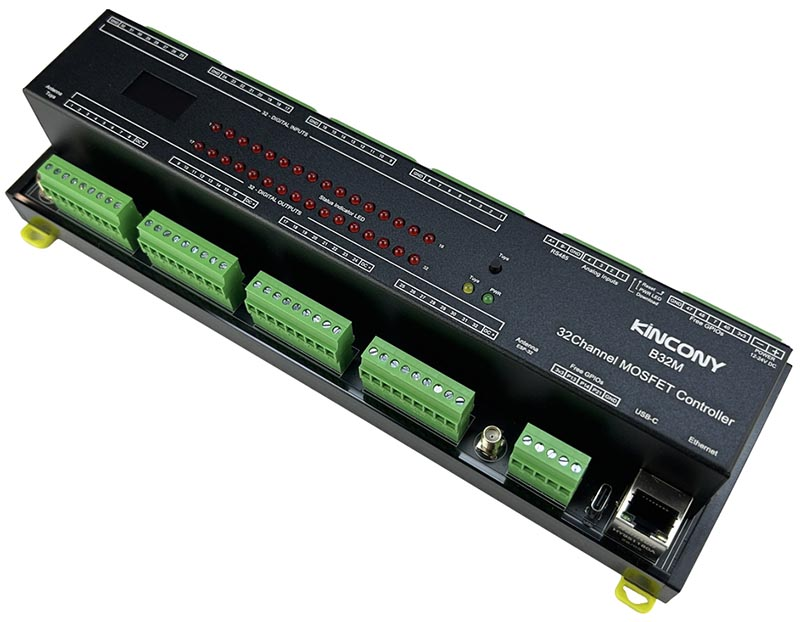

## Resources

- [ESP32 pin define details](https://www.kincony.com/forum/showthread.php?tid=9089)

## ESPHome Configuration

Here is an example YAML configuration for the KinCony B32M ESP32-S3 mosfet board.
```yaml
esphome:
  name: b32m
  friendly_name: b32m

esp32:
  board: esp32-s3-devkitc-1
  framework:
    type: arduino

# Enable logging
logger:

# Enable Home Assistant API
api:

ethernet:
  type: W5500
  clk_pin: GPIO1
  mosi_pin: GPIO2
  miso_pin: GPIO41
  cs_pin: GPIO42
  interrupt_pin: GPIO43
  reset_pin: GPIO44

uart:
  - id: uart_1    #RS485
    baud_rate: 9600
    debug:
      direction: BOTH
      dummy_receiver: true
      after:
        timeout: 10ms
    tx_pin: 39
    rx_pin: 38

i2c:
   - id: bus_a
     sda: 8
     scl: 18
     scan: true
     frequency: 400kHz

pcf8574:
  - id: 'pcf8574_hub_in_1'  # for input channel 1-16
    i2c_id: bus_a
    address: 0x22
    pcf8575: true

  - id: 'pcf8574_hub_in_out_1'  # for digital input channel 17-24 & output 1-8
    i2c_id: bus_a
    address: 0x25
    pcf8575: true

  - id: 'pcf8574_hub_out_1'  # for output channel 9-24
    i2c_id: bus_a
    address: 0x24
    pcf8575: true

  - id: 'pcf8574_hub_in_out_2'  # for digital input channel 25--32 & output 25--32
    i2c_id: bus_a
    address: 0x26
    pcf8575: true

binary_sensor:
  - platform: gpio
    name: "b32-input01"
    id: "b32_input01"
    pin:
      pcf8574: pcf8574_hub_in_1
      number: 8
      mode: INPUT
      inverted: true


  - platform: gpio
    name: "b32-input02"
    id: "b32_input02"
    pin:
      pcf8574: pcf8574_hub_in_1
      number: 9
      mode: INPUT
      inverted: true


  - platform: gpio
    name: "b32-input03"
    id: "b32_input03"
    pin:
      pcf8574: pcf8574_hub_in_1
      number: 10
      mode: INPUT
      inverted: true


  - platform: gpio
    name: "b32-input04"
    id: "b32_input04"
    pin:
      pcf8574: pcf8574_hub_in_1
      number: 11
      mode: INPUT
      inverted: true


  - platform: gpio
    name: "b32-input05"
    id: "b32_input05"
    pin:
      pcf8574: pcf8574_hub_in_1
      number: 12
      mode: INPUT
      inverted: true


  - platform: gpio
    name: "b32-input06"
    id: "b32_input06"
    pin:
      pcf8574: pcf8574_hub_in_1
      number: 13
      mode: INPUT
      inverted: true


  - platform: gpio
    name: "b32-input07"
    id: "b32_input07"
    pin:
      pcf8574: pcf8574_hub_in_1
      number: 14
      mode: INPUT
      inverted: true

  - platform: gpio
    name: "b32-input08"
    id: "b32_input08"
    pin:
      pcf8574: pcf8574_hub_in_1
      number: 15
      mode: INPUT
      inverted: true

  - platform: gpio
    name: "b32-input09"
    id: "b32_input09"
    pin:
      pcf8574: pcf8574_hub_in_1
      number: 0
      mode: INPUT
      inverted: true


  - platform: gpio
    name: "b32-input10"
    id: "b32_input10"
    pin:
      pcf8574: pcf8574_hub_in_1
      number: 1
      mode: INPUT
      inverted: true


  - platform: gpio
    name: "b32-input11"
    id: "b32_input11"
    pin:
      pcf8574: pcf8574_hub_in_1
      number: 2
      mode: INPUT
      inverted: true


  - platform: gpio
    name: "b32-input12"
    id: "b32_input12"
    pin:
      pcf8574: pcf8574_hub_in_1
      number: 3
      mode: INPUT
      inverted: true


  - platform: gpio
    name: "b32-input13"
    id: "b32_input13"
    pin:
      pcf8574: pcf8574_hub_in_1
      number: 4
      mode: INPUT
      inverted: true


  - platform: gpio
    name: "b32-input14"
    id: "b32_input14"
    pin:
      pcf8574: pcf8574_hub_in_1
      number: 5
      mode: INPUT
      inverted: true


  - platform: gpio
    name: "b32-input15"
    id: "b32_input15"
    pin:
      pcf8574: pcf8574_hub_in_1
      number: 6
      mode: INPUT
      inverted: true


  - platform: gpio
    name: "b32-input16"
    id: "b32_input16"
    pin:
      pcf8574: pcf8574_hub_in_1
      number: 7
      mode: INPUT
      inverted: true

  - platform: gpio
    name: "b32-input17"
    id: "b32_input17"
    pin:
      pcf8574: pcf8574_hub_in_out_1
      number: 0
      mode: INPUT
      inverted: true

  - platform: gpio
    name: "b32-input18"
    id: "b32_input18"
    pin:
      pcf8574: pcf8574_hub_in_out_1
      number: 1
      mode: INPUT
      inverted: true

  - platform: gpio
    name: "b32-input19"
    id: "b32_input19"
    pin:
      pcf8574: pcf8574_hub_in_out_1
      number: 2
      mode: INPUT
      inverted: true

  - platform: gpio
    name: "b32-input20"
    id: "b32_input20"
    pin:
      pcf8574: pcf8574_hub_in_out_1
      number: 3
      mode: INPUT
      inverted: true

  - platform: gpio
    name: "b32-input21"
    id: "b32_input21"
    pin:
      pcf8574: pcf8574_hub_in_out_1
      number: 4
      mode: INPUT
      inverted: true

  - platform: gpio
    name: "b32-input22"
    id: "b32_input22"
    pin:
      pcf8574: pcf8574_hub_in_out_1
      number: 5
      mode: INPUT
      inverted: true

  - platform: gpio
    name: "b32-input23"
    id: "b32_input23"
    pin:
      pcf8574: pcf8574_hub_in_out_1
      number: 6
      mode: INPUT
      inverted: true

  - platform: gpio
    name: "b32-input24"
    id: "b32_input24"
    pin:
      pcf8574: pcf8574_hub_in_out_1
      number: 7
      mode: INPUT
      inverted: true

  - platform: gpio
    name: "b32-input25"
    id: "b32_input25"
    pin:
      pcf8574: pcf8574_hub_in_out_2
      number: 0
      mode: INPUT
      inverted: true

  - platform: gpio
    name: "b32-input26"
    id: "b32_input26"
    pin:
      pcf8574: pcf8574_hub_in_out_2
      number: 1
      mode: INPUT
      inverted: true

  - platform: gpio
    name: "b32-input27"
    id: "b32_input27"
    pin:
      pcf8574: pcf8574_hub_in_out_2
      number: 2
      mode: INPUT
      inverted: true

  - platform: gpio
    name: "b32-input28"
    id: "b32_input28"
    pin:
      pcf8574: pcf8574_hub_in_out_2
      number: 3
      mode: INPUT
      inverted: true

  - platform: gpio
    name: "b32-input29"
    id: "b32_input29"
    pin:
      pcf8574: pcf8574_hub_in_out_2
      number: 4
      mode: INPUT
      inverted: true

  - platform: gpio
    name: "b32-input30"
    id: "b32_input30"
    pin:
      pcf8574: pcf8574_hub_in_out_2
      number: 5
      mode: INPUT
      inverted: true

  - platform: gpio
    name: "b32-input31"
    id: "b32_input31"
    pin:
      pcf8574: pcf8574_hub_in_out_2
      number: 6
      mode: INPUT
      inverted: true

  - platform: gpio
    name: "b32-input32"
    id: "b32_input32"
    pin:
      pcf8574: pcf8574_hub_in_out_2
      number: 7
      mode: INPUT
      inverted: true

##pull-up resistance on PCB
  - platform: gpio
    name: "b32-W1-io48"
    pin: 
      number: 48
      inverted: true

  - platform: gpio
    name: "b32-W1-io47"
    pin: 
      number: 47
      inverted: true

  - platform: gpio
    name: "b32-W1-io40"
    pin: 
      number: 40
      inverted: true

  - platform: gpio
    name: "b32-W1-io7"
    pin: 
      number: 7
      inverted: true
## without resistance on PCB
  - platform: gpio
    name: "b32-W1-io13"
    pin: 
      number: 13
      inverted: false

  - platform: gpio
    name: "b32-W1-io14"
    pin: 
      number: 14
      inverted:  false

  - platform: gpio
    name: "b32-W1-io21"
    pin: 
      number: 21
      inverted:  false

  - platform: gpio
    name: "b32-W1-io0"
    pin: 
      number: 0
      inverted:  false

switch:
  - platform: gpio
    name: "b32-output01"
    id: b32_output01
    pin:
      pcf8574: pcf8574_hub_in_out_2
      number: 8
      mode: OUTPUT
      inverted: true

  - platform: gpio
    name: "b32-output02"
    id: b32_output02
    pin:
      pcf8574: pcf8574_hub_in_out_2
      number: 9
      mode: OUTPUT
      inverted: true

  - platform: gpio
    name: "b32-output03"
    id: b32_output03
    pin:
      pcf8574: pcf8574_hub_in_out_2
      number: 10
      mode: OUTPUT
      inverted: true

  - platform: gpio
    name: "b32-output04"
    id: b32_output04
    pin:
      pcf8574: pcf8574_hub_in_out_2
      number: 11
      mode: OUTPUT
      inverted: true

  - platform: gpio
    name: "b32-output05"
    id: b32_output05
    pin:
      pcf8574: pcf8574_hub_in_out_2
      number: 12
      mode: OUTPUT
      inverted: true

  - platform: gpio
    name: "b32-output06"
    id: b32_output06
    pin:
      pcf8574: pcf8574_hub_in_out_2
      number: 13
      mode: OUTPUT
      inverted: true

  - platform: gpio
    name: "b32-output07"
    id: b32_output07
    pin:
      pcf8574: pcf8574_hub_in_out_2
      number: 14
      mode: OUTPUT
      inverted: true

  - platform: gpio
    name: "b32-output08"
    id: b32_output08
    pin:
      pcf8574: pcf8574_hub_in_out_2
      number: 15
      mode: OUTPUT
      inverted: true


  - platform: gpio
    name: "b32-output09"
    id: "b32_output09"
    pin:
      pcf8574: pcf8574_hub_in_out_1
      number: 8
      mode: OUTPUT
      inverted: true

  - platform: gpio
    name: "b32-output10"
    id: "b32_output10"
    pin:
      pcf8574: pcf8574_hub_in_out_1
      number: 9
      mode: OUTPUT
      inverted: true

  - platform: gpio
    name: "b32-output11"
    id: "b32_output11"
    pin:
      pcf8574: pcf8574_hub_in_out_1
      number: 10
      mode: OUTPUT
      inverted: true

  - platform: gpio
    name: "b32-output12"
    id: "b32_output12"
    pin:
      pcf8574: pcf8574_hub_in_out_1
      number: 11
      mode: OUTPUT
      inverted: true

  - platform: gpio
    name: "b32-output13"
    id: "b32_output13"
    pin:
      pcf8574: pcf8574_hub_in_out_1
      number: 12
      mode: OUTPUT
      inverted: true

  - platform: gpio
    name: "b32-output14"
    id: "b32_output14"
    pin:
      pcf8574: pcf8574_hub_in_out_1
      number: 13
      mode: OUTPUT
      inverted: true

  - platform: gpio
    name: "b32-output15"
    id: "b32_output15"
    pin:
      pcf8574: pcf8574_hub_in_out_1
      number: 14
      mode: OUTPUT
      inverted: true

  - platform: gpio
    name: "b32-output16"
    id: "b32_output16"
    pin:
      pcf8574: pcf8574_hub_in_out_1
      number: 15
      mode: OUTPUT
      inverted: true

  - platform: gpio
    name: "b32-output17"
    id: b32_output17
    pin:
      pcf8574: pcf8574_hub_out_1
      number: 0
      mode: OUTPUT
      inverted: true

  - platform: gpio
    name: "b32-output18"
    id: b32_output18
    pin:
      pcf8574: pcf8574_hub_out_1
      number: 1
      mode: OUTPUT
      inverted: true

  - platform: gpio
    name: "b32-output19"
    id: b32_output19
    pin:
      pcf8574: pcf8574_hub_out_1
      number: 2
      mode: OUTPUT
      inverted: true

  - platform: gpio
    name: "b32-output20"
    id: b32_output20
    pin:
      pcf8574: pcf8574_hub_out_1
      number: 3
      mode: OUTPUT
      inverted: true

  - platform: gpio
    name: "b32-output21"
    id: b32_output21
    pin:
      pcf8574: pcf8574_hub_out_1
      number: 4
      mode: OUTPUT
      inverted: true

  - platform: gpio
    name: "b32-output22"
    id: b32_output22
    pin:
      pcf8574: pcf8574_hub_out_1
      number: 5
      mode: OUTPUT
      inverted: true

  - platform: gpio
    name: "b32-output23"
    id: b32_output23
    pin:
      pcf8574: pcf8574_hub_out_1
      number: 6
      mode: OUTPUT
      inverted: true

  - platform: gpio
    name: "b32-output24"
    id: b32_output24
    pin:
      pcf8574: pcf8574_hub_out_1
      number: 7
      mode: OUTPUT
      inverted: true

  - platform: gpio
    name: "b32-output25"
    id: b32_output25
    pin:
      pcf8574: pcf8574_hub_out_1
      number: 8
      mode: OUTPUT
      inverted: true

  - platform: gpio
    name: "b32-output26"
    id: b32_output26
    pin:
      pcf8574: pcf8574_hub_out_1
      number: 9
      mode: OUTPUT
      inverted: true

  - platform: gpio
    name: "b32-output27"
    id: b32_output27
    pin:
      pcf8574: pcf8574_hub_out_1
      number: 10
      mode: OUTPUT
      inverted: true

  - platform: gpio
    name: "b32-output28"
    id: b32_output28
    pin:
      pcf8574: pcf8574_hub_out_1
      number: 11
      mode: OUTPUT
      inverted: true

  - platform: gpio
    name: "b32-output29"
    id: b32_output29
    pin:
      pcf8574: pcf8574_hub_out_1
      number: 12
      mode: OUTPUT
      inverted: true

  - platform: gpio
    name: "b32-output30"
    id: b32_output30
    pin:
      pcf8574: pcf8574_hub_out_1
      number: 13
      mode: OUTPUT
      inverted: true

  - platform: gpio
    name: "b32-output31"
    id: b32_output31
    pin:
      pcf8574: pcf8574_hub_out_1
      number: 14
      mode: OUTPUT
      inverted: true

  - platform: gpio
    name: "b32-output32"
    id: b32_output32
    pin:
      pcf8574: pcf8574_hub_out_1
      number: 15
      mode: OUTPUT
      inverted: true

  - platform: uart
    uart_id: uart_1
    name: "RS485 Button"
    data: [0x11, 0x22, 0x33, 0x44, 0x55]

ads1115:
  - address: 0x48
sensor:
  - platform: ads1115
    multiplexer: 'A0_GND'
    gain: 6.144
    resolution: 16_BITS
    name: "ADS1115 Channel A0-GND"
    update_interval: 5s
  - platform: ads1115
    multiplexer: 'A1_GND'
    gain: 6.144
    name: "ADS1115 Channel A1-GND"
    update_interval: 5s
  - platform: ads1115
    multiplexer: 'A2_GND'
    gain: 6.144
    name: "ADS1115 Channel A2-GND"
    update_interval: 5s
  - platform: ads1115
    multiplexer: 'A3_GND'
    gain: 6.144
    name: "ADS1115 Channel A3-GND"
    update_interval: 5s

web_server:
  port: 80

font:
  - file: "gfonts://Roboto"
    id: roboto
    size: 20

display:
  - platform: ssd1306_i2c
    i2c_id: bus_a
    model: "SSD1306 128x64"
    address: 0x3C
    lambda: |-
      it.printf(0, 0, id(roboto), "KinCony B32M");