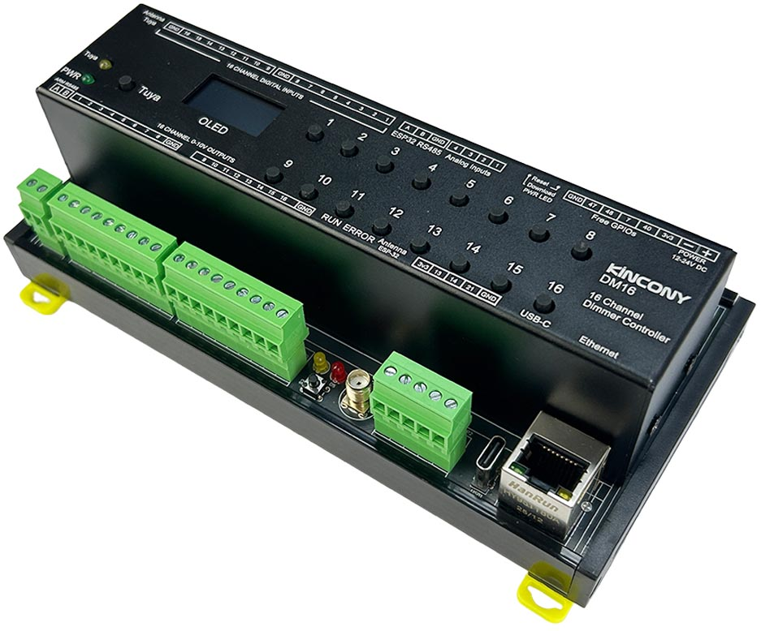

## Resources

- [ESP32 pin define details](https://www.kincony.com/forum/showthread.php?tid=8499)

## ESPHome Configuration

Here is an example YAML configuration for the KinCony DM16 ESP32-S3 dimmer board.

```yaml
esphome:
  name: dm16
  friendly_name: dm16

esp32:
  board: esp32-s3-devkitc-1
  framework:
    type: arduino

# Enable logging
logger:

# Enable Home Assistant API
api:

ota:
  platform: esphome

ethernet:
  type: W5500
  clk_pin: GPIO1
  mosi_pin: GPIO2
  miso_pin: GPIO41
  cs_pin: GPIO42
  interrupt_pin: GPIO43
  reset_pin: GPIO44

i2c:
   - id: bus_a
     sda: 8
     scl: 18
     scan: true
     frequency: 400kHz

text_sensor:
  - platform: ethernet_info
    ip_address:
      name: ESP IP Address
      id: eth_ip
      address_0:
        name: ESP IP Address 0
      address_1:
        name: ESP IP Address 1
      address_2:
        name: ESP IP Address 2
      address_3:
        name: ESP IP Address 3
      address_4:
        name: ESP IP Address 4
    dns_address:
      name: ESP DNS Address
    mac_address:
      name: ESP MAC Address

font:
  - file: "gfonts://Roboto"
    id: roboto
    size: 15

display:
  - platform: ssd1306_i2c
    model: "SSD1306 128x64"
    address: 0x3C
    lambda: |-
      it.printf(0, 15, id(roboto), "IP: %s", id(eth_ip).state.c_str());

uart:
  id: dac_uart
  rx_pin: 4
  tx_pin: 6
  baud_rate: 115200
  stop_bits: 1
  data_bits: 8
  parity: NONE
  debug:

modbus:

modbus_controller:
  - address: 1
    update_interval: 5s

output:
  # CH1 (0x0FA0 / 4000)
  - platform: modbus_controller
    id: dac_ch1_out
    address: 0x0FA0
    value_type: U_WORD
    write_lambda: |-
      // state = 0.0 ~ 1.0 → 0 ~ 4095
      uint16_t reg = (uint16_t) round(x * 4095.0);
      return reg;

  # CH2 (0x0FA1 / 4001)
  - platform: modbus_controller
    id: dac_ch2_out
    address: 0x0FA1
    value_type: U_WORD
    write_lambda: |-
      uint16_t reg = (uint16_t) round(x * 4095.0);
      return reg;

  # CH3
  - platform: modbus_controller
    id: dac_ch3_out
    address: 0x0FA2
    value_type: U_WORD
    write_lambda: |-
      uint16_t reg = (uint16_t) round(x * 4095.0);
      return reg;

  # CH4
  - platform: modbus_controller
    id: dac_ch4_out
    address: 0x0FA3
    value_type: U_WORD
    write_lambda: |-
      uint16_t reg = (uint16_t) round(x * 4095.0);
      return reg;

  # CH5
  - platform: modbus_controller
    id: dac_ch5_out
    address: 0x0FA4
    value_type: U_WORD
    write_lambda: |-
      uint16_t reg = (uint16_t) round(x * 4095.0);
      return reg;

  # CH6
  - platform: modbus_controller
    id: dac_ch6_out
    address: 0x0FA5
    value_type: U_WORD
    write_lambda: |-
      uint16_t reg = (uint16_t) round(x * 4095.0);
      return reg;

  # CH7
  - platform: modbus_controller
    id: dac_ch7_out
    address: 0x0FA6
    value_type: U_WORD
    write_lambda: |-
      uint16_t reg = (uint16_t) round(x * 4095.0);
      return reg;

  # CH8
  - platform: modbus_controller
    id: dac_ch8_out
    address: 0x0FA7
    value_type: U_WORD
    write_lambda: |-
      uint16_t reg = (uint16_t) round(x * 4095.0);
      return reg;

  # CH9
  - platform: modbus_controller
    id: dac_ch9_out
    address: 0x0FA8
    value_type: U_WORD
    write_lambda: |-
      uint16_t reg = (uint16_t) round(x * 4095.0);
      return reg;

  # CH10
  - platform: modbus_controller
    id: dac_ch10_out
    address: 0x0FA9
    value_type: U_WORD
    write_lambda: |-
      uint16_t reg = (uint16_t) round(x * 4095.0);
      return reg;

  # CH11
  - platform: modbus_controller
    id: dac_ch11_out
    address: 0x0FAA
    value_type: U_WORD
    write_lambda: |-
      uint16_t reg = (uint16_t) round(x * 4095.0);
      return reg;

  # CH12
  - platform: modbus_controller
    id: dac_ch12_out
    address: 0x0FAB
    value_type: U_WORD
    write_lambda: |-
      uint16_t reg = (uint16_t) round(x * 4095.0);
      return reg;

  # CH13
  - platform: modbus_controller
    id: dac_ch13_out
    address: 0x0FAC
    value_type: U_WORD
    write_lambda: |-
      uint16_t reg = (uint16_t) round(x * 4095.0);
      return reg;

  # CH14
  - platform: modbus_controller
    id: dac_ch14_out
    address: 0x0FAD
    value_type: U_WORD
    write_lambda: |-
      uint16_t reg = (uint16_t) round(x * 4095.0);
      return reg;

  # CH15
  - platform: modbus_controller
    id: dac_ch15_out
    address: 0x0FAE
    value_type: U_WORD
    write_lambda: |-
      uint16_t reg = (uint16_t) round(x * 4095.0);
      return reg;

  # CH16
  - platform: modbus_controller
    id: dac_ch16_out
    address: 0x0FAF
    value_type: U_WORD
    write_lambda: |-
      uint16_t reg = (uint16_t) round(x * 4095.0);
      return reg;

# -------------------
# 16 Channel Dimmer
# -------------------
light:
  - platform: monochromatic
    name: "DAC CH1"
    output: dac_ch1_out
    default_transition_length: 0s

  - platform: monochromatic
    name: "DAC CH2"
    output: dac_ch2_out
    default_transition_length: 0s

  - platform: monochromatic
    name: "DAC CH3"
    output: dac_ch3_out
    default_transition_length: 0s

  - platform: monochromatic
    name: "DAC CH4"
    output: dac_ch4_out
    default_transition_length: 0s

  - platform: monochromatic
    name: "DAC CH5"
    output: dac_ch5_out
    default_transition_length: 0s

  - platform: monochromatic
    name: "DAC CH6"
    output: dac_ch6_out
    default_transition_length: 0s

  - platform: monochromatic
    name: "DAC CH7"
    output: dac_ch7_out
    default_transition_length: 0s

  - platform: monochromatic
    name: "DAC CH8"
    output: dac_ch8_out
    default_transition_length: 0s

  - platform: monochromatic
    name: "DAC CH9"
    output: dac_ch9_out
    default_transition_length: 0s

  - platform: monochromatic
    name: "DAC CH10"
    output: dac_ch10_out
    default_transition_length: 0s

  - platform: monochromatic
    name: "DAC CH11"
    output: dac_ch11_out
    default_transition_length: 0s

  - platform: monochromatic
    name: "DAC CH12"
    output: dac_ch12_out
    default_transition_length: 0s

  - platform: monochromatic
    name: "DAC CH13"
    output: dac_ch13_out
    default_transition_length: 0s

  - platform: monochromatic
    name: "DAC CH14"
    output: dac_ch14_out
    default_transition_length: 0s

  - platform: monochromatic
    name: "DAC CH15"
    output: dac_ch15_out
    default_transition_length: 0s

  - platform: monochromatic
    name: "DAC CH16"
    output: dac_ch16_out
    default_transition_length: 0s


pcf8574:
  - id: 'pcf8574_hub_in_1'  # for input channel 1-16
    i2c_id: bus_a
    address: 0x22
    pcf8575: true

binary_sensor:
  - platform: gpio
    name: "dm16-input01"
    pin:
      pcf8574: pcf8574_hub_in_1
      number: 8
      mode: INPUT
      inverted: true

  - platform: gpio
    name: "dm16-input02"
    pin:
      pcf8574: pcf8574_hub_in_1
      number: 9
      mode: INPUT
      inverted: true

  - platform: gpio
    name: "dm16-input03"
    pin:
      pcf8574: pcf8574_hub_in_1
      number: 10
      mode: INPUT
      inverted: true

  - platform: gpio
    name: "dm16-input04"
    pin:
      pcf8574: pcf8574_hub_in_1
      number: 11
      mode: INPUT
      inverted: true

  - platform: gpio
    name: "dm16-input05"
    pin:
      pcf8574: pcf8574_hub_in_1
      number: 12
      mode: INPUT
      inverted: true

  - platform: gpio
    name: "dm16-input06"
    pin:
      pcf8574: pcf8574_hub_in_1
      number: 13
      mode: INPUT
      inverted: true

  - platform: gpio
    name: "dm16-input07"
    pin:
      pcf8574: pcf8574_hub_in_1
      number: 14
      mode: INPUT
      inverted: true

  - platform: gpio
    name: "dm16-input08"
    pin:
      pcf8574: pcf8574_hub_in_1
      number: 15
      mode: INPUT
      inverted: true

  - platform: gpio
    name: "dm16-input09"
    pin:
      pcf8574: pcf8574_hub_in_1
      number: 0
      mode: INPUT
      inverted: true

  - platform: gpio
    name: "dm16-input10"
    pin:
      pcf8574: pcf8574_hub_in_1
      number: 1
      mode: INPUT
      inverted: true

  - platform: gpio
    name: "dm16-input11"
    pin:
      pcf8574: pcf8574_hub_in_1
      number: 2
      mode: INPUT
      inverted: true

  - platform: gpio
    name: "dm16-input12"
    pin:
      pcf8574: pcf8574_hub_in_1
      number: 3
      mode: INPUT
      inverted: true

  - platform: gpio
    name: "dm16-input13"
    pin:
      pcf8574: pcf8574_hub_in_1
      number: 4
      mode: INPUT
      inverted: true

  - platform: gpio
    name: "dm16-input14"
    pin:
      pcf8574: pcf8574_hub_in_1
      number: 5
      mode: INPUT
      inverted: true

  - platform: gpio
    name: "dm16-input15"
    pin:
      pcf8574: pcf8574_hub_in_1
      number: 6
      mode: INPUT
      inverted: true

  - platform: gpio
    name: "dm16-input16"
    pin:
      pcf8574: pcf8574_hub_in_1
      number: 7
      mode: INPUT
      inverted: true

ads1115:
  - address: 0x48
sensor:
  - platform: ads1115
    multiplexer: 'A0_GND'
    gain: 6.144
    resolution: 16_BITS
    name: "ADS1115 Channel A0-GND"
    update_interval: 5s
  - platform: ads1115
    multiplexer: 'A1_GND'
    gain: 6.144
    name: "ADS1115 Channel A1-GND"
    update_interval: 5s
  - platform: ads1115
    multiplexer: 'A2_GND'
    gain: 6.144
    name: "ADS1115 Channel A2-GND"
    update_interval: 5s
  - platform: ads1115
    multiplexer: 'A3_GND'
    gain: 6.144
    name: "ADS1115 Channel A3-GND"
    update_interval: 5s
```
