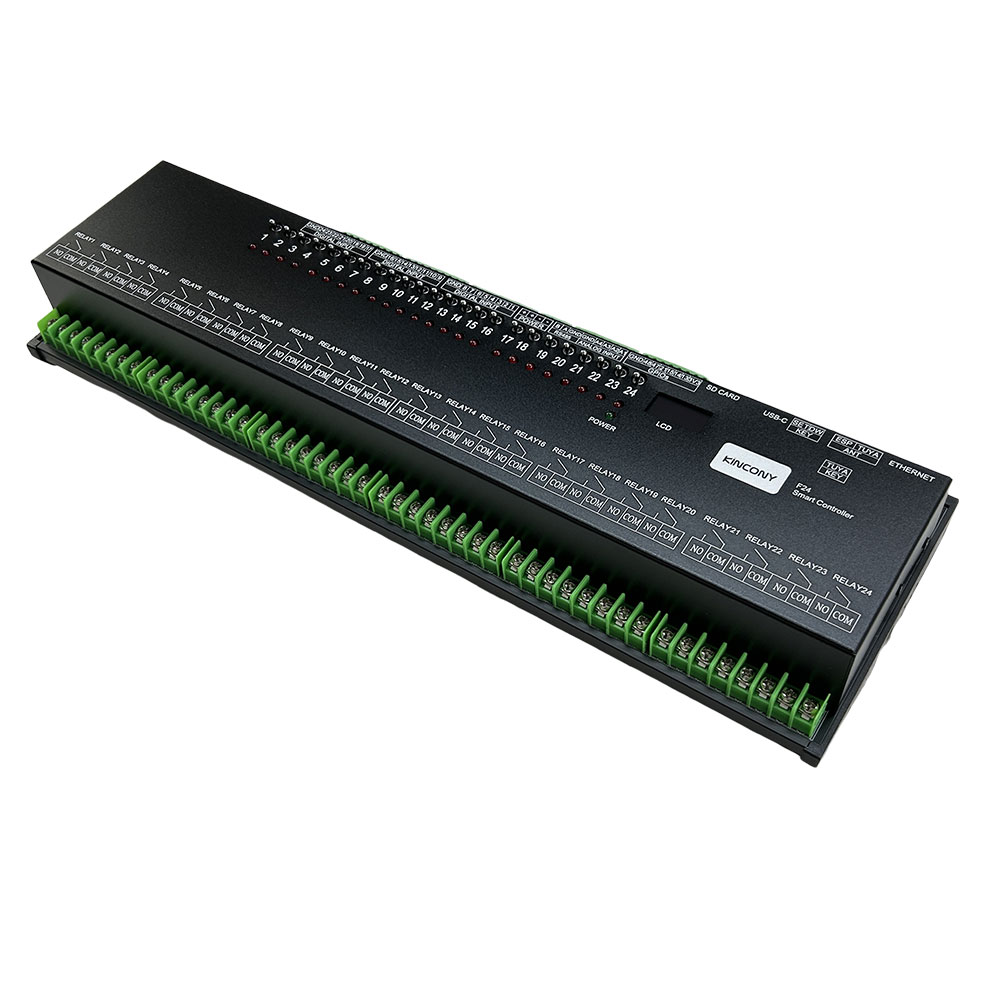
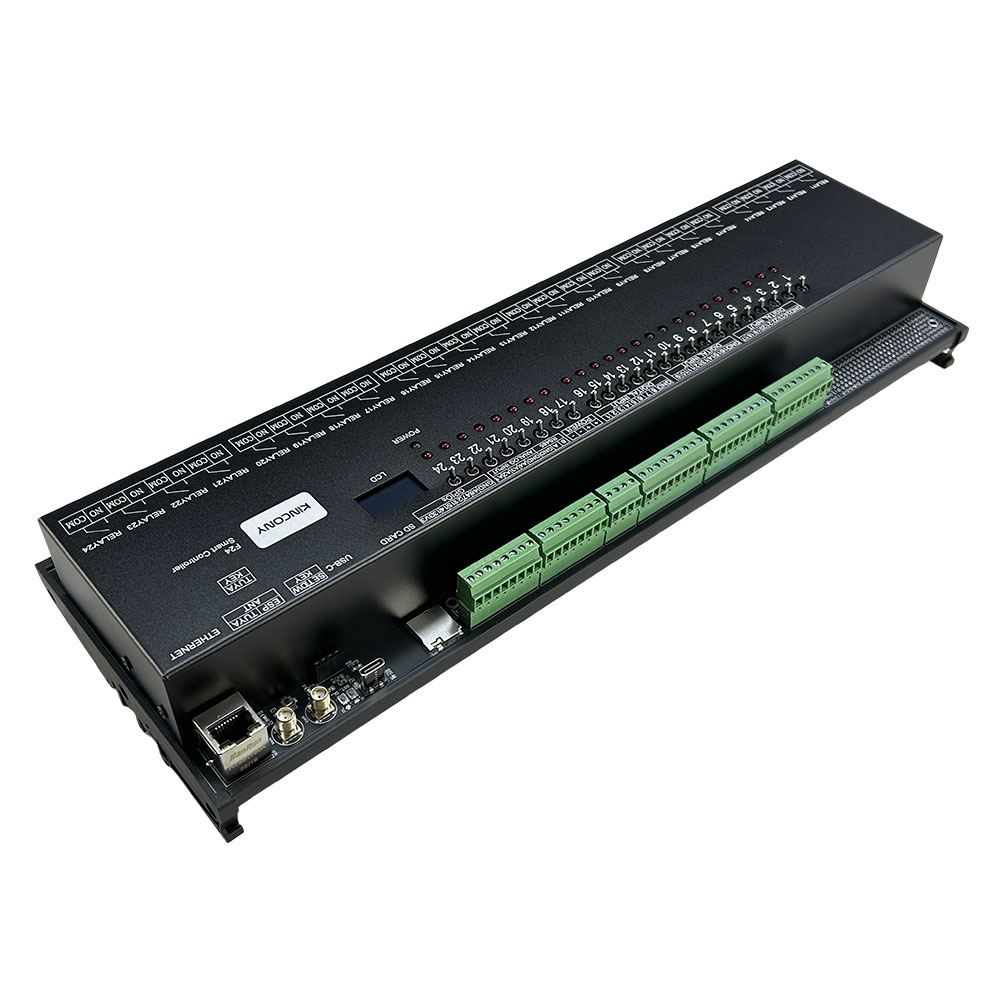
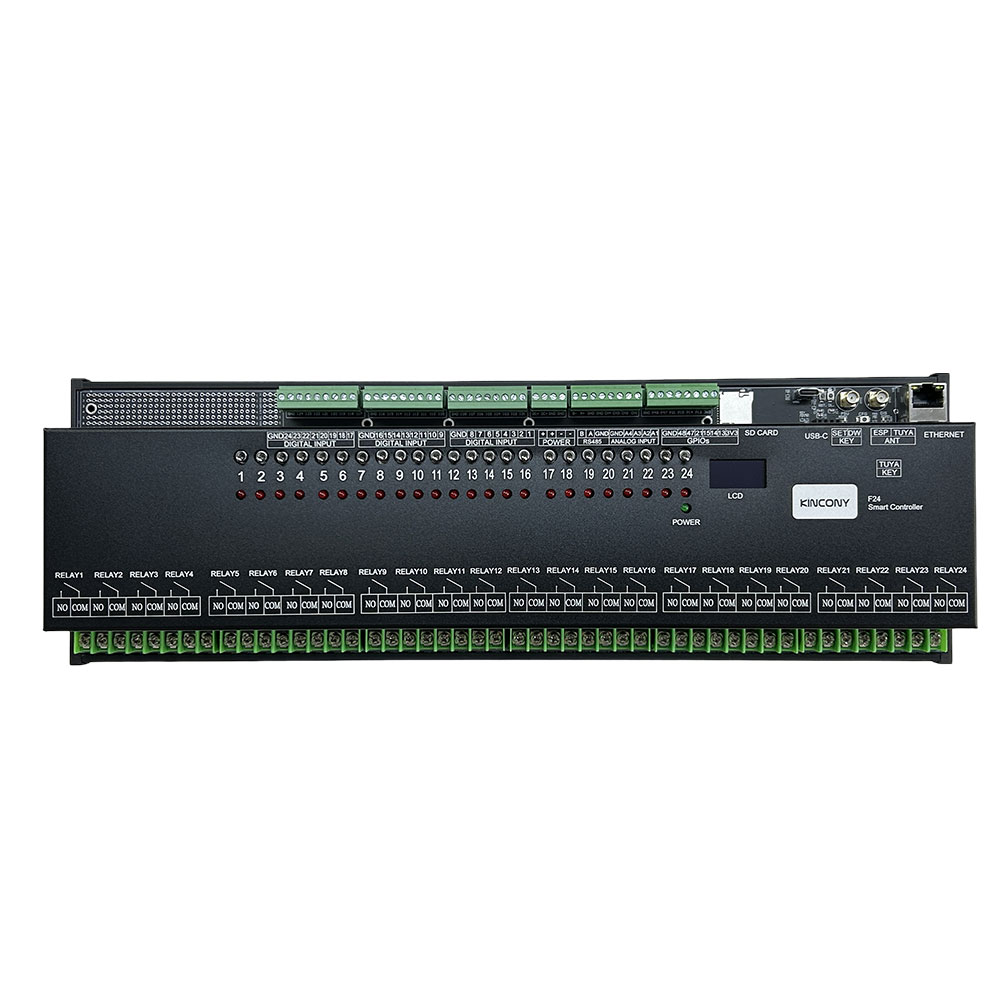

## Resources

- [ESP32 pin define details](https://www.kincony.com/forum/showthread.php?tid=7132)
- [YouTube video tour](https://youtu.be/N4cXM2jW9Ls)

## ESPHome Configuration

Here is an example YAML configuration for the KinCony-F24 board.

```yaml
esphome:
  name: f24
  friendly_name: f24
esp32:
  board: esp32-s3-devkitc-1
  framework:
    type: arduino

# Enable logging

# hardware_uart: USB_SERIAL_JTAG
# Enable Home Assistant API
api:

ethernet:
  type: W5500
  clk_pin: GPIO42
  mosi_pin: GPIO43
  miso_pin: GPIO44
  cs_pin: GPIO41
  interrupt_pin: GPIO2
  reset_pin: GPIO1

i2c:
  - id: bus_a
    sda: 8
    scl: 18
    scan: true
    frequency: 400kHz

pcf8574:
  - id: pcf8574_hub_out_1 # for output channel 9-24
    i2c_id: bus_a
    address: 0x25
    pcf8575: true

  - id: pcf8574_hub_in_1 # for digital input channel 1-16
    i2c_id: bus_a
    address: 0x24
    pcf8575: true

  - id: pcf8574_hub_out_in_2 # for output channel 1-8  + (input 17-24)
    i2c_id: bus_a
    address: 0x26
    pcf8575: true

uart:
  - id: uart_1 #RS485
    baud_rate: 9600
    debug:
      direction: BOTH
      dummy_receiver: true
      after:
        timeout: 10ms
    tx_pin: 16
    rx_pin: 17

switch:
  - platform: uart
    uart_id: uart_1
    name: "RS485 Button"
    data: [0x11, 0x22, 0x33, 0x44, 0x55]

  - platform: gpio
    name: "f24-output01"
    id: "f24_output01"
    pin:
      pcf8574: pcf8574_hub_out_in_2
      number: 12
      mode: OUTPUT
      inverted: true
  - platform: gpio
    name: "f24-output02"
    id: "f24_output02"
    pin:
      pcf8574: pcf8574_hub_out_in_2
      number: 13
      mode: OUTPUT
      inverted: true
  - platform: gpio
    name: "f24-output03"
    id: "f24_output03"
    pin:
      pcf8574: pcf8574_hub_out_in_2
      number: 14
      mode: OUTPUT
      inverted: true
  - platform: gpio
    name: "f24-output04"
    id: "f24_output04"
    pin:
      pcf8574: pcf8574_hub_out_in_2
      number: 15
      mode: OUTPUT
      inverted: true
  - platform: gpio
    name: "f24-output05"
    id: "f24_output05"
    pin:
      pcf8574: pcf8574_hub_out_in_2
      number: 8
      mode: OUTPUT
      inverted: true
  - platform: gpio
    name: "f24-output06"
    id: "f24_output06"
    pin:
      pcf8574: pcf8574_hub_out_in_2
      number: 9
      mode: OUTPUT
      inverted: true
  - platform: gpio
    name: "f24-output07"
    id: "f24_output07"
    pin:
      pcf8574: pcf8574_hub_out_in_2
      number: 10
      mode: OUTPUT
      inverted: true
  - platform: gpio
    name: "f24-output08"
    id: "f24_output08"
    pin:
      pcf8574: pcf8574_hub_out_in_2
      number: 11
      mode: OUTPUT
      inverted: true

  - platform: gpio
    name: "f24-output09"
    id: "f24_output09"
    pin:
      pcf8574: pcf8574_hub_out_1
      number: 0
      mode: OUTPUT
      inverted: true
  - platform: gpio
    name: "f24-output10"
    id: "f24_output10"
    pin:
      pcf8574: pcf8574_hub_out_1
      number: 1
      mode: OUTPUT
      inverted: true
  - platform: gpio
    name: "f24-output11"
    id: "f24_output11"
    pin:
      pcf8574: pcf8574_hub_out_1
      number: 2
      mode: OUTPUT
      inverted: true
  - platform: gpio
    name: "f24-output12"
    id: "f24_output12"
    pin:
      pcf8574: pcf8574_hub_out_1
      number: 3
      mode: OUTPUT
      inverted: true
  - platform: gpio
    name: "f24-output13"
    id: "f24_output13"
    pin:
      pcf8574: pcf8574_hub_out_1
      number: 4
      mode: OUTPUT
      inverted: true
  - platform: gpio
    name: "f24-output14"
    id: "f24_output14"
    pin:
      pcf8574: pcf8574_hub_out_1
      number: 5
      mode: OUTPUT
      inverted: true
  - platform: gpio
    name: "f24-output15"
    id: "f24_output15"
    pin:
      pcf8574: pcf8574_hub_out_1
      number: 6
      mode: OUTPUT
      inverted: true
  - platform: gpio
    name: "f24-output16"
    id: "f24_output16"
    pin:
      pcf8574: pcf8574_hub_out_1
      number: 7
      mode: OUTPUT
      inverted: true
  - platform: gpio
    name: "f24-output17"
    id: "f24_output17"
    pin:
      pcf8574: pcf8574_hub_out_1
      number: 8
      mode: OUTPUT
      inverted: true
  - platform: gpio
    name: "f24-output18"
    id: "f24_output18"
    pin:
      pcf8574: pcf8574_hub_out_1
      number: 9
      mode: OUTPUT
      inverted: true
  - platform: gpio
    name: "f24-output19"
    id: "f24_output19"
    pin:
      pcf8574: pcf8574_hub_out_1
      number: 10
      mode: OUTPUT
      inverted: true
  - platform: gpio
    name: "f24-output20"
    id: "f24_output20"
    pin:
      pcf8574: pcf8574_hub_out_1
      number: 11
      mode: OUTPUT
      inverted: true
  - platform: gpio
    name: "f24-output21"
    id: "f24_output21"
    pin:
      pcf8574: pcf8574_hub_out_1
      number: 12
      mode: OUTPUT
      inverted: true
  - platform: gpio
    name: "f24-output22"
    id: "f24_output22"
    pin:
      pcf8574: pcf8574_hub_out_1
      number: 13
      mode: OUTPUT
      inverted: true
  - platform: gpio
    name: "f24-output23"
    id: "f24_output23"
    pin:
      pcf8574: pcf8574_hub_out_1
      number: 14
      mode: OUTPUT
      inverted: true
  - platform: gpio
    name: "f24-output24"
    id: "f24_output24"
    pin:
      pcf8574: pcf8574_hub_out_1
      number: 15
      mode: OUTPUT
      inverted: true

binary_sensor:
  - platform: gpio
    name: "f24-input01"
    id: "f24_input01"
    pin:
      pcf8574: pcf8574_hub_in_1
      number: 0
      mode: INPUT
      inverted: true
  - platform: gpio
    name: "f24-input02"
    id: "f24_input02"
    pin:
      pcf8574: pcf8574_hub_in_1
      number: 1
      mode: INPUT
      inverted: true
  - platform: gpio
    name: "f24-input03"
    id: "f24_input03"
    pin:
      pcf8574: pcf8574_hub_in_1
      number: 2
      mode: INPUT
      inverted: true
  - platform: gpio
    name: "f24-input04"
    id: "f24_input04"
    pin:
      pcf8574: pcf8574_hub_in_1
      number: 3
      mode: INPUT
      inverted: true
  - platform: gpio
    name: "f24-input05"
    id: "f24_input05"
    pin:
      pcf8574: pcf8574_hub_in_1
      number: 4
      mode: INPUT
      inverted: true
  - platform: gpio
    name: "f24-input06"
    id: "f24_input06"
    pin:
      pcf8574: pcf8574_hub_in_1
      number: 5
      mode: INPUT
      inverted: true
  - platform: gpio
    name: "f24-input07"
    id: "f24_input07"
    pin:
      pcf8574: pcf8574_hub_in_1
      number: 6
      mode: INPUT
      inverted: true
  - platform: gpio
    name: "f24-input08"
    id: "f24_input08"
    pin:
      pcf8574: pcf8574_hub_in_1
      number: 7
      mode: INPUT
      inverted: true
  - platform: gpio
    name: "f24-input09"
    id: "f24_input09"
    pin:
      pcf8574: pcf8574_hub_in_1
      number: 8
      mode: INPUT
      inverted: true
  - platform: gpio
    name: "f24-input10"
    id: "f24_input10"
    pin:
      pcf8574: pcf8574_hub_in_1
      number: 9
      mode: INPUT
      inverted: true
  - platform: gpio
    name: "f24-input11"
    id: "f24_input11"
    pin:
      pcf8574: pcf8574_hub_in_1
      number: 10
      mode: INPUT
      inverted: true
  - platform: gpio
    name: "f24-input12"
    id: "f24_input12"
    pin:
      pcf8574: pcf8574_hub_in_1
      number: 11
      mode: INPUT
      inverted: true
  - platform: gpio
    name: "f24-input13"
    id: "f24_input13"
    pin:
      pcf8574: pcf8574_hub_in_1
      number: 12
      mode: INPUT
      inverted: true
  - platform: gpio
    name: "f24-input14"
    id: "f24_input14"
    pin:
      pcf8574: pcf8574_hub_in_1
      number: 13
      mode: INPUT
      inverted: true
  - platform: gpio
    name: "f24-input15"
    id: "f24_input15"
    pin:
      pcf8574: pcf8574_hub_in_1
      number: 14
      mode: INPUT
      inverted: true
  - platform: gpio
    name: "f24-input16"
    id: "f24_input16"
    pin:
      pcf8574: pcf8574_hub_in_1
      number: 15
      mode: INPUT
      inverted: true

  - platform: gpio
    name: "f24-input17"
    id: "f24_input17"
    pin:
      pcf8574: pcf8574_hub_out_in_2
      number: 0
      mode: INPUT
      inverted: true
  - platform: gpio
    name: "f24-input18"
    id: "f24_input18"
    pin:
      pcf8574: pcf8574_hub_out_in_2
      number: 1
      mode: INPUT
      inverted: true
  - platform: gpio
    name: "f24-input19"
    id: "f24_input19"
    pin:
      pcf8574: pcf8574_hub_out_in_2
      number: 2
      mode: INPUT
      inverted: true
  - platform: gpio
    name: "f24-input20"
    id: "f24_input20"
    pin:
      pcf8574: pcf8574_hub_out_in_2
      number: 3
      mode: INPUT
      inverted: true
  - platform: gpio
    name: "f24-input21"
    id: "f24_input21"
    pin:
      pcf8574: pcf8574_hub_out_in_2
      number: 4
      mode: INPUT
      inverted: true
  - platform: gpio
    name: "f24-input22"
    id: "f24_input22"
    pin:
      pcf8574: pcf8574_hub_out_in_2
      number: 5
      mode: INPUT
      inverted: true
  - platform: gpio
    name: "f24-input23"
    id: "f24_input23"
    pin:
      pcf8574: pcf8574_hub_out_in_2
      number: 6
      mode: INPUT
      inverted: true
  - platform: gpio
    name: "f24-input24"
    id: "f24_input24"
    pin:
      pcf8574: pcf8574_hub_out_in_2
      number: 7
      mode: INPUT
      inverted: true

  ##pull-up resistance on PCB
  - platform: gpio
    name: "f24-W1-io48"
    pin:
      number: 48
      inverted: true

  - platform: gpio
    name: "f24-W1-io47"
    pin:
      number: 47
      inverted: true

  - platform: gpio
    name: "f24-W1-io21"
    pin:
      number: 21
      inverted: true

  - platform: gpio
    name: "f24-W1-io15"
    pin:
      number: 15
      inverted: true
  ## without resistance on PCB
  - platform: gpio
    name: "f24-W1-io13"
    pin:
      number: 13
      inverted: false

  - platform: gpio
    name: "f24-W1-io14"
    pin:
      number: 14
      inverted: false

  - platform: gpio
    name: "f24-433M"
    pin:
      number: 40
      inverted: false

sensor:
  - platform: adc
    pin: 5
    name: "f24 A1 Voltage"
    update_interval: 5s
    attenuation: 11db
    filters:
      - lambda: |-
          if (x >= 3.11) {
            return x * 1.60256;
          } else if (x <= 0.15) {
            return 0;
          } else {
            return x * 1.51;
          }
  - platform: adc
    pin: 7
    name: "f24 A2 Voltage"
    update_interval: 5s
    attenuation: 11db
    filters:
      # - multiply: 1.51515
      - lambda: |-
          if (x >= 3.11) {
            return x * 1.60256;
          } else if (x <= 0.15) {
            return 0;
          } else {
            return x * 1.51;
          }
  - platform: adc
    pin: 6
    name: "f24 A3 Current"
    update_interval: 5s
    unit_of_measurement: mA
    attenuation: 11db
    filters:
      - multiply: 6.66666666
  - platform: adc
    pin: 4
    name: "f24 A4 Current"
    update_interval: 5s
    unit_of_measurement: mA
    attenuation: 11db
    filters:
      - multiply: 6.66666666

web_server:
  port: 80

font:
  - file: "gfonts://Roboto"
    id: roboto
    size: 20

display:
  - platform: ssd1306_i2c
    i2c_id: bus_a
    model: "SSD1306 128x64"
    address: 0x3C
    lambda: |-
      it.printf(0, 0, id(roboto), "KinCony F24");
```
