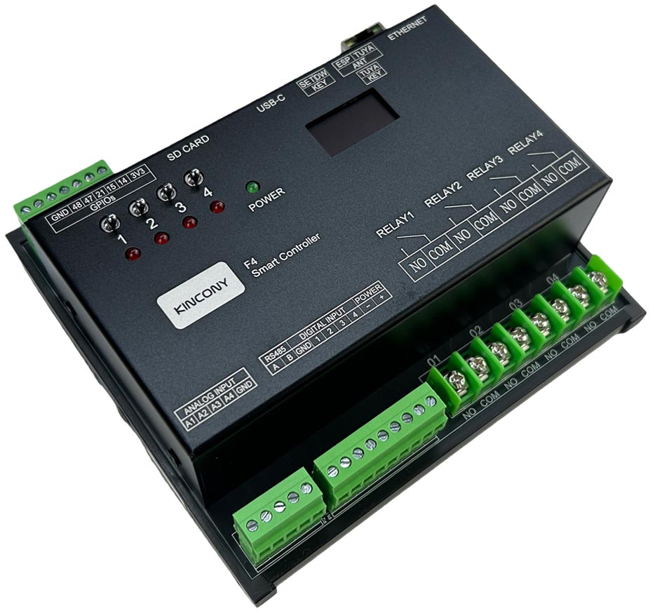

## Resources

- [ESP32 pin define details](https://www.kincony.com/forum/showthread.php?tid=8709)

## ESPHome Configuration

Here is an example YAML configuration for the KinCony F4 ESP32-S3 relay board.

```yaml
esphome:
  name: f4
  friendly_name: f4

esp32:
  board: esp32-s3-devkitc-1
  framework:
    type: arduino

api:

ethernet:
  type: W5500
  clk_pin: GPIO42
  mosi_pin: GPIO43
  miso_pin: GPIO44
  cs_pin: GPIO41
  interrupt_pin: GPIO2
  reset_pin: GPIO1

i2c:
   - id: bus_a
     sda: 8
     scl: 18
     scan: true
     frequency: 400kHz

pcf8574:
  - id: 'pcf8574_hub_in_1'  # for DI1-DI4 Relay1-Relay4
    i2c_id: bus_a
    address: 0x24

uart:
  - id: uart_1    #RS485
    baud_rate: 9600
    debug:
      direction: BOTH
      dummy_receiver: true
      after:
        timeout: 10ms
    tx_pin: 16
    rx_pin: 17


switch:
  - platform: uart
    uart_id: uart_1
    name: "RS485 Button"
    data: [0x11, 0x22, 0x33, 0x44, 0x55]

  - platform: gpio
    name: "f4-output01"
    id: "f4_output01"
    pin:
      pcf8574: pcf8574_hub_in_1
      number: 4
      mode: OUTPUT
      inverted: true


  - platform: gpio
    name: "f4-output02"
    id: "f4_output02"
    pin:
      pcf8574: pcf8574_hub_in_1
      number: 5
      mode: OUTPUT
      inverted: true


  - platform: gpio
    name: "f4-output03"
    id: "f4_output03"
    pin:
      pcf8574: pcf8574_hub_in_1
      number: 6
      mode: OUTPUT
      inverted: true


  - platform: gpio
    name: "f4-output04"
    id: "f4_output04"
    pin:
      pcf8574: pcf8574_hub_in_1
      number: 7
      mode: OUTPUT
      inverted: true

binary_sensor:
  - platform: gpio
    name: "f4-input01"
    id: "f4_input01"
    pin:
      pcf8574: pcf8574_hub_in_1
      number: 0
      mode: INPUT
      inverted: true

  - platform: gpio
    name: "f4-input02"
    id: "f4_input02"
    pin:
      pcf8574: pcf8574_hub_in_1
      number: 1
      mode: INPUT
      inverted: true

  - platform: gpio
    name: "f4-input03"
    id: "f4_input03"
    pin:
      pcf8574: pcf8574_hub_in_1
      number: 2
      mode: INPUT
      inverted: true

  - platform: gpio
    name: "f4-input04"
    id: "f4_input04"
    pin:
      pcf8574: pcf8574_hub_in_1
      number: 3
      mode: INPUT
      inverted: true

##pull-up resistance on PCB
  - platform: gpio
    name: "f4-W1-io48"
    pin:
      number: 48
      inverted: true

  - platform: gpio
    name: "f4-W1-io47"
    pin:
      number: 47
      inverted: true

  - platform: gpio
    name: "f4-W1-io21"
    pin:
      number: 21
      inverted: true

  - platform: gpio
    name: "f4-W1-io15"
    pin:
      number: 15
      inverted: true
## without resistance on PCB
  - platform: gpio
    name: "f4-W1-io14"
    pin:
      number: 14
      inverted:  false

  - platform: gpio
    name: "f4-433M"
    pin:
      number: 40
      inverted:  false

  - platform: gpio
    name: "f4-io0"
    pin:
      number: 0
      inverted:  false

sensor:
  - platform: adc
    pin: 5
    name: "f4 A1 Voltage"
    update_interval: 5s
    attenuation: 11db
    filters:
      - lambda:
          if (x >= 3.11) {
            return x * 1.60256;
          } else if (x <= 0.15) {
            return 0;
          } else {
            return x * 1.51;
          }
  - platform: adc
    pin: 7
    name: "f4 A2 Voltage"
    update_interval: 5s
    attenuation: 11db
    filters:
      # - multiply: 1.51515
      - lambda:
          if (x >= 3.11) {
            return x * 1.60256;
          } else if (x <= 0.15) {
            return 0;
          } else {
            return x * 1.51;
          }
  - platform: adc
    pin: 6
    name: "f4 A3 Current"
    update_interval: 5s
    unit_of_measurement: mA
    attenuation: 11db
    filters:
      - multiply: 6.66666666
  - platform: adc
    pin: 4
    name: "f4 A4 Current"
    update_interval: 5s
    unit_of_measurement: mA
    attenuation: 11db
    filters:
      - multiply: 6.66666666

web_server:
  port: 80

font:
  - file: "gfonts://Roboto"
    id: roboto
    size: 20

display:
  - platform: ssd1306_i2c
    i2c_id: bus_a
    model: "SSD1306 128x64"
    address: 0x3C
    lambda: |-
      it.printf(0, 0, id(roboto), "KinCony f4");
```
