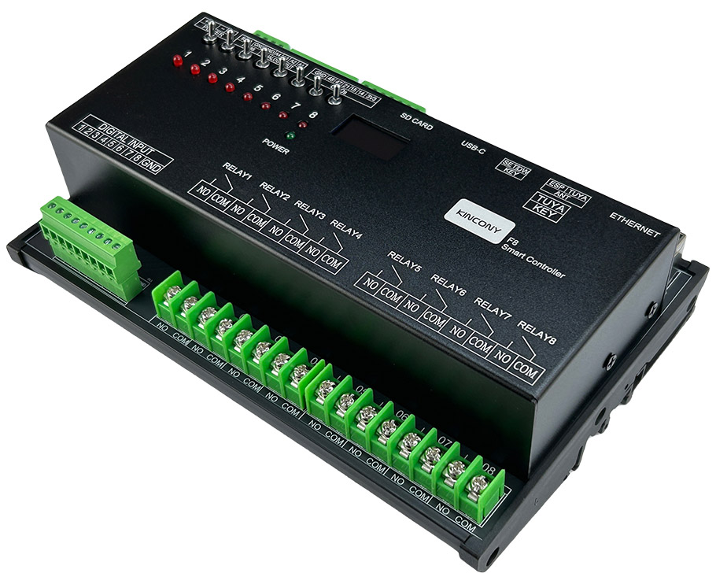
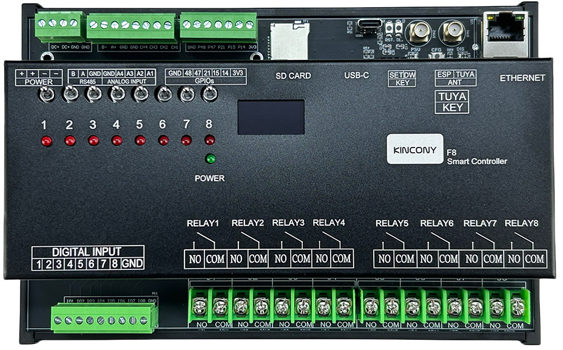
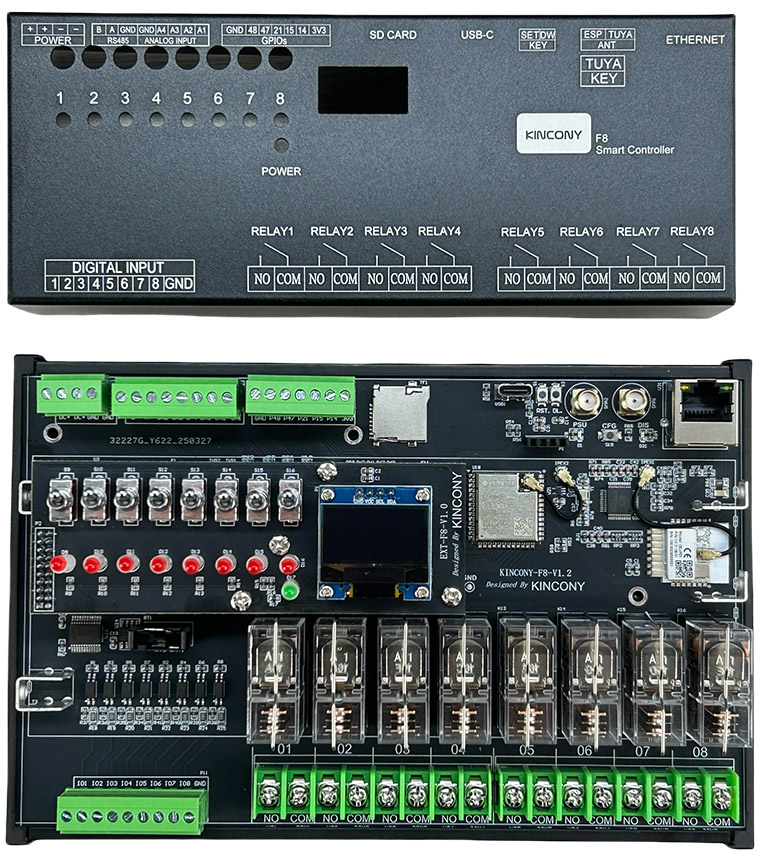

## Resources

- [ESP32 pin define details](https://www.kincony.com/forum/showthread.php?tid=7983)
- [YouTube video tour](https://youtu.be/Qlhkwwhnf6o)

## ESPHome Configuration

Here is an example YAML configuration for the KinCony-F8 board with Tuya integration.

```yaml
esphome:
  name: f8
  friendly_name: f8
  platformio_options:
    board_build.extra_flags:
      # WIFI_CONTROL_SELF_MODE = 0
      # WIFI_CONTROL_SELF_MODE = 1
      - "-DWIFI_CONTROL_SELF_MODE=1"
esp32:
  board: esp32-s3-devkitc-1
  framework:
    type: arduino

external_components:
  - source:
      type: git
      url: https://github.com/hzkincony/esphome-tuya-wifi-mcu
      ref: v1.1.0

# Enable logging

  # hardware_uart: USB_SERIAL_JTAG
# Enable Home Assistant API
api:

ethernet:
  type: W5500
  clk_pin: GPIO42
  mosi_pin: GPIO43
  miso_pin: GPIO44
  cs_pin: GPIO41
  interrupt_pin: GPIO2
  reset_pin: GPIO1

i2c:
   - id: bus_a
     sda: 8
     scl: 18
     scan: true
     frequency: 400kHz

pcf8574:
  - id: 'pcf8574_hub_in_1'  # for input channel 1-16
    i2c_id: bus_a
    address: 0x24
    pcf8575: true

uart:
  - id: uart_1    #RS485
    baud_rate: 9600
    debug:
      direction: BOTH
      dummy_receiver: true
      after:
        timeout: 10ms
    tx_pin: 16
    rx_pin: 17

  - id: tuya_mcu_uart
    tx_pin: GPIO39
    rx_pin: GPIO38
    baud_rate: 9600

tuya_wifi_mcu:
  # tuya mcu product id
  product_id: gk6ok3aysk6lw1bb
  uart_id: tuya_mcu_uart
  wifi_reset_pin: 28
  wifi_led_pin: 16

switch:
  - platform: uart
    uart_id: uart_1
    name: "RS485 Button"
    data: [0x11, 0x22, 0x33, 0x44, 0x55]

  - platform: gpio
    name: "f8-output01"
    id: "f8_output01"
    pin:
      pcf8574: pcf8574_hub_in_1
      number: 8
      mode: OUTPUT
      inverted: true
  - platform: tuya_wifi_mcu
    name: f8-output1-tuya
    dp_id: 1
    # hide from homeassistant ui
    internal: true
    # bind other switch, sync state
    bind_switch_id: "f8_output01"

  - platform: gpio
    name: "f8-output02"
    id: "f8_output02"
    pin:
      pcf8574: pcf8574_hub_in_1
      number: 9
      mode: OUTPUT
      inverted: true
  - platform: tuya_wifi_mcu
    name: f8-output2-tuya
    dp_id: 2
    # hide from homeassistant ui
    internal: true
    # bind other switch, sync state
    bind_switch_id: "f8_output02"

  - platform: gpio
    name: "f8-output03"
    id: "f8_output03"
    pin:
      pcf8574: pcf8574_hub_in_1
      number: 10
      mode: OUTPUT
      inverted: true
  - platform: tuya_wifi_mcu
    name: f8-output3-tuya
    dp_id: 3
    # hide from homeassistant ui
    internal: true
    # bind other switch, sync state
    bind_switch_id: "f8_output03"

  - platform: gpio
    name: "f8-output04"
    id: "f8_output04"
    pin:
      pcf8574: pcf8574_hub_in_1
      number: 11
      mode: OUTPUT
      inverted: true
  - platform: tuya_wifi_mcu
    name: f8-output4-tuya
    dp_id: 4
    # hide from homeassistant ui
    internal: true
    # bind other switch, sync state
    bind_switch_id: "f8_output04"

  - platform: gpio
    name: "f8-output05"
    id: "f8_output05"
    pin:
      pcf8574: pcf8574_hub_in_1
      number: 12
      mode: OUTPUT
      inverted: true
  - platform: tuya_wifi_mcu
    name: f8-output5-tuya
    dp_id: 5
    # hide from homeassistant ui
    internal: true
    # bind other switch, sync state
    bind_switch_id: "f8_output05"

  - platform: gpio
    name: "f8-output06"
    id: "f8_output06"
    pin:
      pcf8574: pcf8574_hub_in_1
      number: 13
      mode: OUTPUT
      inverted: true
  - platform: tuya_wifi_mcu
    name: f8-output6-tuya
    dp_id: 6
    # hide from homeassistant ui
    internal: true
    # bind other switch, sync state
    bind_switch_id: "f8_output06"

  - platform: gpio
    name: "f8-output07"
    id: "f8_output07"
    pin:
      pcf8574: pcf8574_hub_in_1
      number: 14
      mode: OUTPUT
      inverted: true
  - platform: tuya_wifi_mcu
    name: f8-output7-tuya
    dp_id: 101
    # hide from homeassistant ui
    internal: true
    # bind other switch, sync state
    bind_switch_id: "f8_output07"

  - platform: gpio
    name: "f8-output08"
    id: "f8_output08"
    pin:
      pcf8574: pcf8574_hub_in_1
      number: 15
      mode: OUTPUT
      inverted: true
  - platform: tuya_wifi_mcu
    name: f8-output8-tuya
    dp_id: 102
    # hide from homeassistant ui
    internal: true
    # bind other switch, sync state
    bind_switch_id: "f8_output08"

binary_sensor:
  - platform: gpio
    name: "f8-input01"
    id: "f8_input01"
    pin:
      pcf8574: pcf8574_hub_in_1
      number: 0
      mode: INPUT
      inverted: true
  - platform: tuya_wifi_mcu
    name: f8-input1-tuya
    dp_id: 111
    bind_binary_sensor_id: f8_input01
    internal: true

  - platform: gpio
    name: "f8-input02"
    id: "f8_input02"
    pin:
      pcf8574: pcf8574_hub_in_1
      number: 1
      mode: INPUT
      inverted: true
  - platform: tuya_wifi_mcu
    name: f8-input2-tuya
    dp_id: 112
    bind_binary_sensor_id: f8_input02
    internal: true

  - platform: gpio
    name: "f8-input03"
    id: "f8_input03"
    pin:
      pcf8574: pcf8574_hub_in_1
      number: 2
      mode: INPUT
      inverted: true
  - platform: tuya_wifi_mcu
    name: f8-input3-tuya
    dp_id: 113
    bind_binary_sensor_id: f8_input03
    internal: true

  - platform: gpio
    name: "f8-input04"
    id: "f8_input04"
    pin:
      pcf8574: pcf8574_hub_in_1
      number: 3
      mode: INPUT
      inverted: true
  - platform: tuya_wifi_mcu
    name: f8-input4-tuya
    dp_id: 114
    bind_binary_sensor_id: f8_input04
    internal: true

  - platform: gpio
    name: "f8-input05"
    id: "f8_input05"
    pin:
      pcf8574: pcf8574_hub_in_1
      number: 4
      mode: INPUT
      inverted: true
  - platform: tuya_wifi_mcu
    name: f8-input5-tuya
    dp_id: 115
    bind_binary_sensor_id: f8_input05
    internal: true

  - platform: gpio
    name: "f8-input06"
    id: "f8_input06"
    pin:
      pcf8574: pcf8574_hub_in_1
      number: 5
      mode: INPUT
      inverted: true
  - platform: tuya_wifi_mcu
    name: f8-input6-tuya
    dp_id: 116
    bind_binary_sensor_id: f8_input06
    internal: true

  - platform: gpio
    name: "f8-input07"
    id: "f8_input07"
    pin:
      pcf8574: pcf8574_hub_in_1
      number: 6
      mode: INPUT
      inverted: true
  - platform: tuya_wifi_mcu
    name: f8-input7-tuya
    dp_id: 117
    bind_binary_sensor_id: f8_input07
    internal: true

  - platform: gpio
    name: "f8-input08"
    id: "f8_input08"
    pin:
      pcf8574: pcf8574_hub_in_1
      number: 7
      mode: INPUT
      inverted: true
  - platform: tuya_wifi_mcu
    name: f8-input8-tuya
    dp_id: 118
    bind_binary_sensor_id: f8_input08
    internal: true


##pull-up resistance on PCB
  - platform: gpio
    name: "f8-W1-io48"
    pin:
      number: 48
      inverted: true

  - platform: gpio
    name: "f8-W1-io47"
    pin:
      number: 47
      inverted: true

  - platform: gpio
    name: "f8-W1-io21"
    pin:
      number: 21
      inverted: true

  - platform: gpio
    name: "f8-W1-io15"
    pin:
      number: 15
      inverted: true
## without resistance on PCB
  - platform: gpio
    name: "f8-W1-io14"
    pin:
      number: 14
      inverted:  false

  - platform: gpio
    name: "f8-433M"
    pin:
      number: 40
      inverted:  false

  - platform: gpio
    name: "f8-io0"
    pin:
      number: 0
      inverted:  false

sensor:
  - platform: adc
    pin: 5
    name: "f8 A1 Voltage"
    update_interval: 5s
    attenuation: 11db
    filters:
      - lambda:
          if (x >= 3.11) {
            return x * 1.60256;
          } else if (x <= 0.15) {
            return 0;
          } else {
            return x * 1.51;
          }
  - platform: adc
    pin: 7
    name: "f8 A2 Voltage"
    update_interval: 5s
    attenuation: 11db
    filters:
      # - multiply: 1.51515
      - lambda:
          if (x >= 3.11) {
            return x * 1.60256;
          } else if (x <= 0.15) {
            return 0;
          } else {
            return x * 1.51;
          }
  - platform: adc
    pin: 6
    name: "f8 A3 Current"
    update_interval: 5s
    unit_of_measurement: mA
    attenuation: 11db
    filters:
      - multiply: 6.66666666
  - platform: adc
    pin: 4
    name: "f8 A4 Current"
    update_interval: 5s
    unit_of_measurement: mA
    attenuation: 11db
    filters:
      - multiply: 6.66666666

web_server:
  port: 80

font:
  - file: "gfonts://Roboto"
    id: roboto
    size: 20

display:
  - platform: ssd1306_i2c
    i2c_id: bus_a
    model: "SSD1306 128x64"
    address: 0x3C
    lambda: |-
      it.printf(0, 0, id(roboto), "KinCony F8");
```
