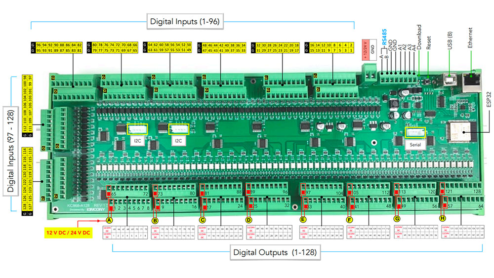

## GPIO Pinout

| Pin    | Function            |
| ------ | ------------------- |
| GPIO39 | ANALOG_A1           |
| GPIO34 | ANALOG_A2           |
| GPIO36 | ANALOG_A3           |
| GPIO35 | ANALOG_A4           |
| GPIO5  | IIC_Bus_1_SDA       |
| GPIO16 | IIC_Bus_1_SCL       |
| GPIO15 | IIC_Bus_2_SDA       |
| GPIO4  | IIC_Bus_2_SCL       |
| GPIO13 | RS485_RXD           |
| GPIO14 | RS485_TXD           |
| GPIO32 | Extend_Serial_RXD   |
| GPIO33 | Extend_Serial_TXD   |

[Additional pinout/design details](https://www.kincony.com/arduino-esp32-128-channel-relay-module-kc868-a128.html)

## Basic Configuration

```yaml
# Basic Config
esphome:
  name: KC868-A128

esp32:
  board: esp32dev

# Enable logging
logger:

# Enable Home Assistant API
api:

 # Example configuration entry
i2c:
   - id: bus_a
     sda: 5
     scl: 16
     scan: true
     frequency: 400kHz
   - id: bus_b
     sda: 15
     scl: 4
     scan: true
     frequency: 400kHz

# Example configuration entry
ethernet:
  type: LAN8720
  mdc_pin: GPIO23
  mdio_pin: GPIO18
  clk_mode: GPIO17_OUT
  phy_addr: 0

# Example configuration entry
pcf8574:
  - id: 'pcf8574_hub_out_1'  # for output channel 1-16
    i2c_id: bus_a
    address: 0x24
    pcf8575: true

  - id: 'pcf8574_hub_out_2'  # for output channel 17-32
    i2c_id: bus_a
    address: 0x25
    pcf8575: true

  - id: 'pcf8574_hub_out_3'  # for output channel 33-48
    i2c_id: bus_a
    address: 0x21
    pcf8575: true

  - id: 'pcf8574_hub_out_4'  # for output channel 49-64
    i2c_id: bus_a
    address: 0x22
    pcf8575: true

  - id: 'pcf8574_hub_out_5'  # for output channel 65-80
    i2c_id: bus_a
    address: 0x26
    pcf8575: true

  - id: 'pcf8574_hub_out_6'  # for output channel 81-96
    i2c_id: bus_a
    address: 0x27
    pcf8575: true

  - id: 'pcf8574_hub_out_7'  # for output channel 97-112
    i2c_id: bus_a
    address: 0x20
    pcf8575: true

  - id: 'pcf8574_hub_out_8'  # for output channel 113-128
    i2c_id: bus_a
    address: 0x23
    pcf8575: true

  - id: 'pcf8574_hub_in_1'  # for a128-input channel 1-16
    i2c_id: bus_b
    address: 0x24
    pcf8575: true

  - id: 'pcf8574_hub_in_2'  # for a128-input channel 17-32
    i2c_id: bus_b
    address: 0x25
    pcf8575: true

  - id: 'pcf8574_hub_in_3'  # for a128-input channel 33-48
    i2c_id: bus_b
    address: 0x21
    pcf8575: true

  - id: 'pcf8574_hub_in_4'  # for a128-input channel 49-64
    i2c_id: bus_b
    address: 0x22
    pcf8575: true

  - id: 'pcf8574_hub_in_5'  # for a128-input channel 65-80
    i2c_id: bus_b
    address: 0x26
    pcf8575: true

  - id: 'pcf8574_hub_in_6'  # for a128-input channel 81-96
    i2c_id: bus_b
    address: 0x27
    pcf8575: true

  - id: 'pcf8574_hub_in_7'  # for a128-input channel 97-112
    i2c_id: bus_b
    address: 0x20
    pcf8575: true

  - id: 'pcf8574_hub_in_8'  # for a128-input channel 113-128
    i2c_id: bus_b
    address: 0x23
    pcf8575: true

# Individual outputs
switch:
  - platform: gpio
    name: "a128-light1"
    pin:
      pcf8574: pcf8574_hub_out_1
      number: 0
      mode: OUTPUT
      inverted: true

  - platform: gpio
    name: "a128-light2"
    pin:
      pcf8574: pcf8574_hub_out_1
      number: 1
      mode: OUTPUT
      inverted: true

  - platform: gpio
    name: "a128-light3"
    pin:
      pcf8574: pcf8574_hub_out_1
      number: 2
      mode: OUTPUT
      inverted: true

  - platform: gpio
    name: "a128-light4"
    pin:
      pcf8574: pcf8574_hub_out_1
      number: 3
      mode: OUTPUT
      inverted: true

  - platform: gpio
    name: "a128-light5"
    pin:
      pcf8574: pcf8574_hub_out_1
      number: 4
      mode: OUTPUT
      inverted: true

  - platform: gpio
    name: "a128-light6"
    pin:
      pcf8574: pcf8574_hub_out_1
      number: 5
      mode: OUTPUT
      inverted: true

  - platform: gpio
    name: "a128-light7"
    pin:
      pcf8574: pcf8574_hub_out_1
      number: 6
      mode: OUTPUT
      inverted: true

  - platform: gpio
    name: "a128-light8"
    pin:
      pcf8574: pcf8574_hub_out_1
      number: 7
      mode: OUTPUT
      inverted: true

  - platform: gpio
    name: "a128-light9"
    pin:
      pcf8574: pcf8574_hub_out_1
      number: 8
      mode: OUTPUT
      inverted: true

  - platform: gpio
    name: "a128-light10"
    pin:
      pcf8574: pcf8574_hub_out_1
      number: 9
      mode: OUTPUT
      inverted: true

  - platform: gpio
    name: "a128-light11"
    pin:
      pcf8574: pcf8574_hub_out_1
      number: 10
      mode: OUTPUT
      inverted: true

  - platform: gpio
    name: "a128-light12"
    pin:
      pcf8574: pcf8574_hub_out_1
      number: 11
      mode: OUTPUT
      inverted: true

  - platform: gpio
    name: "a128-light13"
    pin:
      pcf8574: pcf8574_hub_out_1
      number: 12
      mode: OUTPUT
      inverted: true

  - platform: gpio
    name: "a128-light14"
    pin:
      pcf8574: pcf8574_hub_out_1
      number: 13
      mode: OUTPUT
      inverted: true

  - platform: gpio
    name: "a128-light15"
    pin:
      pcf8574: pcf8574_hub_out_1
      number: 14
      mode: OUTPUT
      inverted: true

  - platform: gpio
    name: "a128-light16"
    pin:
      pcf8574: pcf8574_hub_out_1
      number: 15
      mode: OUTPUT
      inverted: true

  - platform: gpio
    name: "a128-light17"
    pin:
      pcf8574: pcf8574_hub_out_2
      number: 0
      mode: OUTPUT
      inverted: true

  - platform: gpio
    name: "a128-light18"
    pin:
      pcf8574: pcf8574_hub_out_2
      number: 1
      mode: OUTPUT
      inverted: true

  - platform: gpio
    name: "a128-light19"
    pin:
      pcf8574: pcf8574_hub_out_2
      number: 2
      mode: OUTPUT
      inverted: true

  - platform: gpio
    name: "a128-light20"
    pin:
      pcf8574: pcf8574_hub_out_2
      number: 3
      mode: OUTPUT
      inverted: true

  - platform: gpio
    name: "a128-light21"
    pin:
      pcf8574: pcf8574_hub_out_2
      number: 4
      mode: OUTPUT
      inverted: true

  - platform: gpio
    name: "a128-light22"
    pin:
      pcf8574: pcf8574_hub_out_2
      number: 5
      mode: OUTPUT
      inverted: true

  - platform: gpio
    name: "a128-light23"
    pin:
      pcf8574: pcf8574_hub_out_2
      number: 6
      mode: OUTPUT
      inverted: true

  - platform: gpio
    name: "a128-light24"
    pin:
      pcf8574: pcf8574_hub_out_2
      number: 7
      mode: OUTPUT
      inverted: true

  - platform: gpio
    name: "a128-light25"
    pin:
      pcf8574: pcf8574_hub_out_2
      number: 8
      mode: OUTPUT
      inverted: true

  - platform: gpio
    name: "a128-light26"
    pin:
      pcf8574: pcf8574_hub_out_2
      number: 9
      mode: OUTPUT
      inverted: true

  - platform: gpio
    name: "a128-light27"
    pin:
      pcf8574: pcf8574_hub_out_2
      number: 10
      mode: OUTPUT
      inverted: true

  - platform: gpio
    name: "a128-light28"
    pin:
      pcf8574: pcf8574_hub_out_2
      number: 11
      mode: OUTPUT
      inverted: true

  - platform: gpio
    name: "a128-light29"
    pin:
      pcf8574: pcf8574_hub_out_2
      number: 12
      mode: OUTPUT
      inverted: true

  - platform: gpio
    name: "a128-light30"
    pin:
      pcf8574: pcf8574_hub_out_2
      number: 13
      mode: OUTPUT
      inverted: true

  - platform: gpio
    name: "a128-light31"
    pin:
      pcf8574: pcf8574_hub_out_2
      number: 14
      mode: OUTPUT
      inverted: true

  - platform: gpio
    name: "a128-light32"
    pin:
      pcf8574: pcf8574_hub_out_2
      number: 15
      mode: OUTPUT
      inverted: true

  - platform: gpio
    name: "a128-light33"
    pin:
      pcf8574: pcf8574_hub_out_3
      number: 0
      mode: OUTPUT
      inverted: true

  - platform: gpio
    name: "a128-light34"
    pin:
      pcf8574: pcf8574_hub_out_3
      number: 1
      mode: OUTPUT
      inverted: true

  - platform: gpio
    name: "a128-light35"
    pin:
      pcf8574: pcf8574_hub_out_3
      number: 2
      mode: OUTPUT
      inverted: true

  - platform: gpio
    name: "a128-light36"
    pin:
      pcf8574: pcf8574_hub_out_3
      number: 3
      mode: OUTPUT
      inverted: true

  - platform: gpio
    name: "a128-light37"
    pin:
      pcf8574: pcf8574_hub_out_3
      number: 4
      mode: OUTPUT
      inverted: true

  - platform: gpio
    name: "a128-light38"
    pin:
      pcf8574: pcf8574_hub_out_3
      number: 5
      mode: OUTPUT
      inverted: true

  - platform: gpio
    name: "a128-light39"
    pin:
      pcf8574: pcf8574_hub_out_3
      number: 6
      mode: OUTPUT
      inverted: true

  - platform: gpio
    name: "a128-light40"
    pin:
      pcf8574: pcf8574_hub_out_3
      number: 7
      mode: OUTPUT
      inverted: true

  - platform: gpio
    name: "a128-light41"
    pin:
      pcf8574: pcf8574_hub_out_3
      number: 8
      mode: OUTPUT
      inverted: true

  - platform: gpio
    name: "a128-light42"
    pin:
      pcf8574: pcf8574_hub_out_3
      number: 9
      mode: OUTPUT
      inverted: true

  - platform: gpio
    name: "a128-light43"
    pin:
      pcf8574: pcf8574_hub_out_3
      number: 10
      mode: OUTPUT
      inverted: true

  - platform: gpio
    name: "a128-light44"
    pin:
      pcf8574: pcf8574_hub_out_3
      number: 11
      mode: OUTPUT
      inverted: true

  - platform: gpio
    name: "a128-light45"
    pin:
      pcf8574: pcf8574_hub_out_3
      number: 12
      mode: OUTPUT
      inverted: true

  - platform: gpio
    name: "a128-light46"
    pin:
      pcf8574: pcf8574_hub_out_3
      number: 13
      mode: OUTPUT
      inverted: true

  - platform: gpio
    name: "a128-light47"
    pin:
      pcf8574: pcf8574_hub_out_3
      number: 14
      mode: OUTPUT
      inverted: true

  - platform: gpio
    name: "a128-light48"
    pin:
      pcf8574: pcf8574_hub_out_3
      number: 15
      mode: OUTPUT
      inverted: true

  - platform: gpio
    name: "a128-light49"
    pin:
      pcf8574: pcf8574_hub_out_4
      number: 0
      mode: OUTPUT
      inverted: true

  - platform: gpio
    name: "a128-light50"
    pin:
      pcf8574: pcf8574_hub_out_4
      number: 1
      mode: OUTPUT
      inverted: true

  - platform: gpio
    name: "a128-light51"
    pin:
      pcf8574: pcf8574_hub_out_4
      number: 2
      mode: OUTPUT
      inverted: true

  - platform: gpio
    name: "a128-light52"
    pin:
      pcf8574: pcf8574_hub_out_4
      number: 3
      mode: OUTPUT
      inverted: true

  - platform: gpio
    name: "a128-light53"
    pin:
      pcf8574: pcf8574_hub_out_4
      number: 4
      mode: OUTPUT
      inverted: true

  - platform: gpio
    name: "a128-light54"
    pin:
      pcf8574: pcf8574_hub_out_4
      number: 5
      mode: OUTPUT
      inverted: true

  - platform: gpio
    name: "a128-light55"
    pin:
      pcf8574: pcf8574_hub_out_4
      number: 6
      mode: OUTPUT
      inverted: true

  - platform: gpio
    name: "a128-light56"
    pin:
      pcf8574: pcf8574_hub_out_4
      number: 7
      mode: OUTPUT
      inverted: true

  - platform: gpio
    name: "a128-light57"
    pin:
      pcf8574: pcf8574_hub_out_4
      number: 8
      mode: OUTPUT
      inverted: true

  - platform: gpio
    name: "a128-light58"
    pin:
      pcf8574: pcf8574_hub_out_4
      number: 9
      mode: OUTPUT
      inverted: true

  - platform: gpio
    name: "a128-light59"
    pin:
      pcf8574: pcf8574_hub_out_4
      number: 10
      mode: OUTPUT
      inverted: true

  - platform: gpio
    name: "a128-light60"
    pin:
      pcf8574: pcf8574_hub_out_4
      number: 11
      mode: OUTPUT
      inverted: true

  - platform: gpio
    name: "a128-light61"
    pin:
      pcf8574: pcf8574_hub_out_4
      number: 12
      mode: OUTPUT
      inverted: true

  - platform: gpio
    name: "a128-light62"
    pin:
      pcf8574: pcf8574_hub_out_4
      number: 13
      mode: OUTPUT
      inverted: true

  - platform: gpio
    name: "a128-light63"
    pin:
      pcf8574: pcf8574_hub_out_4
      number: 14
      mode: OUTPUT
      inverted: true

  - platform: gpio
    name: "a128-light64"
    pin:
      pcf8574: pcf8574_hub_out_4
      number: 15
      mode: OUTPUT
      inverted: true

  - platform: gpio
    name: "a128-light65"
    pin:
      pcf8574: pcf8574_hub_out_5
      number: 0
      mode: OUTPUT
      inverted: true

  - platform: gpio
    name: "a128-light66"
    pin:
      pcf8574: pcf8574_hub_out_5
      number: 1
      mode: OUTPUT
      inverted: true

  - platform: gpio
    name: "a128-light67"
    pin:
      pcf8574: pcf8574_hub_out_5
      number: 2
      mode: OUTPUT
      inverted: true

  - platform: gpio
    name: "a128-light68"
    pin:
      pcf8574: pcf8574_hub_out_5
      number: 3
      mode: OUTPUT
      inverted: true

  - platform: gpio
    name: "a128-light69"
    pin:
      pcf8574: pcf8574_hub_out_5
      number: 4
      mode: OUTPUT
      inverted: true

  - platform: gpio
    name: "a128-light70"
    pin:
      pcf8574: pcf8574_hub_out_5
      number: 5
      mode: OUTPUT
      inverted: true

  - platform: gpio
    name: "a128-light71"
    pin:
      pcf8574: pcf8574_hub_out_5
      number: 6
      mode: OUTPUT
      inverted: true

  - platform: gpio
    name: "a128-light72"
    pin:
      pcf8574: pcf8574_hub_out_5
      number: 7
      mode: OUTPUT
      inverted: true

  - platform: gpio
    name: "a128-light73"
    pin:
      pcf8574: pcf8574_hub_out_5
      number: 8
      mode: OUTPUT
      inverted: true

  - platform: gpio
    name: "a128-light74"
    pin:
      pcf8574: pcf8574_hub_out_5
      number: 9
      mode: OUTPUT
      inverted: true

  - platform: gpio
    name: "a128-light75"
    pin:
      pcf8574: pcf8574_hub_out_5
      number: 10
      mode: OUTPUT
      inverted: true

  - platform: gpio
    name: "a128-light76"
    pin:
      pcf8574: pcf8574_hub_out_5
      number: 11
      mode: OUTPUT
      inverted: true

  - platform: gpio
    name: "a128-light77"
    pin:
      pcf8574: pcf8574_hub_out_5
      number: 12
      mode: OUTPUT
      inverted: true

  - platform: gpio
    name: "a128-light78"
    pin:
      pcf8574: pcf8574_hub_out_5
      number: 13
      mode: OUTPUT
      inverted: true

  - platform: gpio
    name: "a128-light79"
    pin:
      pcf8574: pcf8574_hub_out_5
      number: 14
      mode: OUTPUT
      inverted: true

  - platform: gpio
    name: "a128-light80"
    pin:
      pcf8574: pcf8574_hub_out_5
      number: 15
      mode: OUTPUT
      inverted: true

  - platform: gpio
    name: "a128-light81"
    pin:
      pcf8574: pcf8574_hub_out_6
      number: 0
      mode: OUTPUT
      inverted: true

  - platform: gpio
    name: "a128-light82"
    pin:
      pcf8574: pcf8574_hub_out_6
      number: 1
      mode: OUTPUT
      inverted: true

  - platform: gpio
    name: "a128-light83"
    pin:
      pcf8574: pcf8574_hub_out_6
      number: 2
      mode: OUTPUT
      inverted: true

  - platform: gpio
    name: "a128-light84"
    pin:
      pcf8574: pcf8574_hub_out_6
      number: 3
      mode: OUTPUT
      inverted: true

  - platform: gpio
    name: "a128-light85"
    pin:
      pcf8574: pcf8574_hub_out_6
      number: 4
      mode: OUTPUT
      inverted: true

  - platform: gpio
    name: "a128-light86"
    pin:
      pcf8574: pcf8574_hub_out_6
      number: 5
      mode: OUTPUT
      inverted: true

  - platform: gpio
    name: "a128-light87"
    pin:
      pcf8574: pcf8574_hub_out_6
      number: 6
      mode: OUTPUT
      inverted: true

  - platform: gpio
    name: "a128-light88"
    pin:
      pcf8574: pcf8574_hub_out_6
      number: 7
      mode: OUTPUT
      inverted: true

  - platform: gpio
    name: "a128-light89"
    pin:
      pcf8574: pcf8574_hub_out_6
      number: 8
      mode: OUTPUT
      inverted: true

  - platform: gpio
    name: "a128-light90"
    pin:
      pcf8574: pcf8574_hub_out_6
      number: 9
      mode: OUTPUT
      inverted: true

  - platform: gpio
    name: "a128-light91"
    pin:
      pcf8574: pcf8574_hub_out_6
      number: 10
      mode: OUTPUT
      inverted: true

  - platform: gpio
    name: "a128-light92"
    pin:
      pcf8574: pcf8574_hub_out_6
      number: 11
      mode: OUTPUT
      inverted: true

  - platform: gpio
    name: "a128-light93"
    pin:
      pcf8574: pcf8574_hub_out_6
      number: 12
      mode: OUTPUT
      inverted: true

  - platform: gpio
    name: "a128-light94"
    pin:
      pcf8574: pcf8574_hub_out_6
      number: 13
      mode: OUTPUT
      inverted: true

  - platform: gpio
    name: "a128-light95"
    pin:
      pcf8574: pcf8574_hub_out_6
      number: 14
      mode: OUTPUT
      inverted: true

  - platform: gpio
    name: "a128-light96"
    pin:
      pcf8574: pcf8574_hub_out_6
      number: 15
      mode: OUTPUT
      inverted: true

  - platform: gpio
    name: "a128-light97"
    pin:
      pcf8574: pcf8574_hub_out_7
      number: 0
      mode: OUTPUT
      inverted: true

  - platform: gpio
    name: "a128-light98"
    pin:
      pcf8574: pcf8574_hub_out_7
      number: 1
      mode: OUTPUT
      inverted: true

  - platform: gpio
    name: "a128-light99"
    pin:
      pcf8574: pcf8574_hub_out_7
      number: 2
      mode: OUTPUT
      inverted: true

  - platform: gpio
    name: "a128-light100"
    pin:
      pcf8574: pcf8574_hub_out_7
      number: 3
      mode: OUTPUT
      inverted: true

  - platform: gpio
    name: "a128-light101"
    pin:
      pcf8574: pcf8574_hub_out_7
      number: 4
      mode: OUTPUT
      inverted: true

  - platform: gpio
    name: "a128-light102"
    pin:
      pcf8574: pcf8574_hub_out_7
      number: 5
      mode: OUTPUT
      inverted: true

  - platform: gpio
    name: "a128-light103"
    pin:
      pcf8574: pcf8574_hub_out_7
      number: 6
      mode: OUTPUT
      inverted: true

  - platform: gpio
    name: "a128-light104"
    pin:
      pcf8574: pcf8574_hub_out_7
      number: 7
      mode: OUTPUT
      inverted: true

  - platform: gpio
    name: "a128-light105"
    pin:
      pcf8574: pcf8574_hub_out_7
      number: 8
      mode: OUTPUT
      inverted: true

  - platform: gpio
    name: "a128-light106"
    pin:
      pcf8574: pcf8574_hub_out_7
      number: 9
      mode: OUTPUT
      inverted: true

  - platform: gpio
    name: "a128-light107"
    pin:
      pcf8574: pcf8574_hub_out_7
      number: 10
      mode: OUTPUT
      inverted: true

  - platform: gpio
    name: "a128-light108"
    pin:
      pcf8574: pcf8574_hub_out_7
      number: 11
      mode: OUTPUT
      inverted: true

  - platform: gpio
    name: "a128-light109"
    pin:
      pcf8574: pcf8574_hub_out_7
      number: 12
      mode: OUTPUT
      inverted: true

  - platform: gpio
    name: "a128-light110"
    pin:
      pcf8574: pcf8574_hub_out_7
      number: 13
      mode: OUTPUT
      inverted: true

  - platform: gpio
    name: "a128-light111"
    pin:
      pcf8574: pcf8574_hub_out_7
      number: 14
      mode: OUTPUT
      inverted: true

  - platform: gpio
    name: "a128-light112"
    pin:
      pcf8574: pcf8574_hub_out_7
      number: 15
      mode: OUTPUT
      inverted: true

  - platform: gpio
    name: "a128-light113"
    pin:
      pcf8574: pcf8574_hub_out_8
      number: 0
      mode: OUTPUT
      inverted: true

  - platform: gpio
    name: "a128-light114"
    pin:
      pcf8574: pcf8574_hub_out_8
      number: 1
      mode: OUTPUT
      inverted: true

  - platform: gpio
    name: "a128-light115"
    pin:
      pcf8574: pcf8574_hub_out_8
      number: 2
      mode: OUTPUT
      inverted: true

  - platform: gpio
    name: "a128-light116"
    pin:
      pcf8574: pcf8574_hub_out_8
      number: 3
      mode: OUTPUT
      inverted: true

  - platform: gpio
    name: "a128-light117"
    pin:
      pcf8574: pcf8574_hub_out_8
      number: 4
      mode: OUTPUT
      inverted: true

  - platform: gpio
    name: "a128-light118"
    pin:
      pcf8574: pcf8574_hub_out_8
      number: 5
      mode: OUTPUT
      inverted: true

  - platform: gpio
    name: "a128-light119"
    pin:
      pcf8574: pcf8574_hub_out_8
      number: 6
      mode: OUTPUT
      inverted: true

  - platform: gpio
    name: "a128-light120"
    pin:
      pcf8574: pcf8574_hub_out_8
      number: 7
      mode: OUTPUT
      inverted: true

  - platform: gpio
    name: "a128-light121"
    pin:
      pcf8574: pcf8574_hub_out_8
      number: 8
      mode: OUTPUT
      inverted: true

  - platform: gpio
    name: "a128-light122"
    pin:
      pcf8574: pcf8574_hub_out_8
      number: 9
      mode: OUTPUT
      inverted: true

  - platform: gpio
    name: "a128-light123"
    pin:
      pcf8574: pcf8574_hub_out_8
      number: 10
      mode: OUTPUT
      inverted: true

  - platform: gpio
    name: "a128-light124"
    pin:
      pcf8574: pcf8574_hub_out_8
      number: 11
      mode: OUTPUT
      inverted: true

  - platform: gpio
    name: "a128-light125"
    pin:
      pcf8574: pcf8574_hub_out_8
      number: 12
      mode: OUTPUT
      inverted: true

  - platform: gpio
    name: "a128-light126"
    pin:
      pcf8574: pcf8574_hub_out_8
      number: 13
      mode: OUTPUT
      inverted: true

  - platform: gpio
    name: "a128-light127"
    pin:
      pcf8574: pcf8574_hub_out_8
      number: 14
      mode: OUTPUT
      inverted: true

  - platform: gpio
    name: "a128-light128"
    pin:
      pcf8574: pcf8574_hub_out_8
      number: 15
      mode: OUTPUT
      inverted: true

# Individual inputs
binary_sensor:
  - platform: gpio
    name: "a128-input1"
    pin:
      pcf8574: pcf8574_hub_in_1
      number: 0
      mode: INPUT
      inverted: true

  - platform: gpio
    name: "a128-input2"
    pin:
      pcf8574: pcf8574_hub_in_1
      number: 1
      mode: INPUT
      inverted: true

  - platform: gpio
    name: "a128-input3"
    pin:
      pcf8574: pcf8574_hub_in_1
      number: 2
      mode: INPUT
      inverted: true

  - platform: gpio
    name: "a128-input4"
    pin:
      pcf8574: pcf8574_hub_in_1
      number: 3
      mode: INPUT
      inverted: true

  - platform: gpio
    name: "a128-input5"
    pin:
      pcf8574: pcf8574_hub_in_1
      number: 4
      mode: INPUT
      inverted: true

  - platform: gpio
    name: "a128-input6"
    pin:
      pcf8574: pcf8574_hub_in_1
      number: 5
      mode: INPUT
      inverted: true

  - platform: gpio
    name: "a128-input7"
    pin:
      pcf8574: pcf8574_hub_in_1
      number: 6
      mode: INPUT
      inverted: true

  - platform: gpio
    name: "a128-input8"
    pin:
      pcf8574: pcf8574_hub_in_1
      number: 7
      mode: INPUT
      inverted: true

  - platform: gpio
    name: "a128-input9"
    pin:
      pcf8574: pcf8574_hub_in_1
      number: 8
      mode: INPUT
      inverted: true

  - platform: gpio
    name: "a128-input10"
    pin:
      pcf8574: pcf8574_hub_in_1
      number: 9
      mode: INPUT
      inverted: true

  - platform: gpio
    name: "a128-input11"
    pin:
      pcf8574: pcf8574_hub_in_1
      number: 10
      mode: INPUT
      inverted: true

  - platform: gpio
    name: "a128-input12"
    pin:
      pcf8574: pcf8574_hub_in_1
      number: 11
      mode: INPUT
      inverted: true

  - platform: gpio
    name: "a128-input13"
    pin:
      pcf8574: pcf8574_hub_in_1
      number: 12
      mode: INPUT
      inverted: true

  - platform: gpio
    name: "a128-input14"
    pin:
      pcf8574: pcf8574_hub_in_1
      number: 13
      mode: INPUT
      inverted: true

  - platform: gpio
    name: "a128-input15"
    pin:
      pcf8574: pcf8574_hub_in_1
      number: 14
      mode: INPUT
      inverted: true

  - platform: gpio
    name: "a128-input16"
    pin:
      pcf8574: pcf8574_hub_in_1
      number: 15
      mode: INPUT
      inverted: true

  - platform: gpio
    name: "a128-input17"
    pin:
      pcf8574: pcf8574_hub_in_2
      number: 0
      mode: INPUT
      inverted: true

  - platform: gpio
    name: "a128-input18"
    pin:
      pcf8574: pcf8574_hub_in_2
      number: 1
      mode: INPUT
      inverted: true

  - platform: gpio
    name: "a128-input19"
    pin:
      pcf8574: pcf8574_hub_in_2
      number: 2
      mode: INPUT
      inverted: true

  - platform: gpio
    name: "a128-input20"
    pin:
      pcf8574: pcf8574_hub_in_2
      number: 3
      mode: INPUT
      inverted: true

  - platform: gpio
    name: "a128-input21"
    pin:
      pcf8574: pcf8574_hub_in_2
      number: 4
      mode: INPUT
      inverted: true

  - platform: gpio
    name: "a128-input22"
    pin:
      pcf8574: pcf8574_hub_in_2
      number: 5
      mode: INPUT
      inverted: true

  - platform: gpio
    name: "a128-input23"
    pin:
      pcf8574: pcf8574_hub_in_2
      number: 6
      mode: INPUT
      inverted: true

  - platform: gpio
    name: "a128-input24"
    pin:
      pcf8574: pcf8574_hub_in_2
      number: 7
      mode: INPUT
      inverted: true

  - platform: gpio
    name: "a128-input25"
    pin:
      pcf8574: pcf8574_hub_in_2
      number: 8
      mode: INPUT
      inverted: true

  - platform: gpio
    name: "a128-input26"
    pin:
      pcf8574: pcf8574_hub_in_2
      number: 9
      mode: INPUT
      inverted: true

  - platform: gpio
    name: "a128-input27"
    pin:
      pcf8574: pcf8574_hub_in_2
      number: 10
      mode: INPUT
      inverted: true

  - platform: gpio
    name: "a128-input28"
    pin:
      pcf8574: pcf8574_hub_in_2
      number: 11
      mode: INPUT
      inverted: true

  - platform: gpio
    name: "a128-input29"
    pin:
      pcf8574: pcf8574_hub_in_2
      number: 12
      mode: INPUT
      inverted: true

  - platform: gpio
    name: "a128-input30"
    pin:
      pcf8574: pcf8574_hub_in_2
      number: 13
      mode: INPUT
      inverted: true

  - platform: gpio
    name: "a128-input31"
    pin:
      pcf8574: pcf8574_hub_in_2
      number: 14
      mode: INPUT
      inverted: true

  - platform: gpio
    name: "a128-input32"
    pin:
      pcf8574: pcf8574_hub_in_2
      number: 15
      mode: INPUT
      inverted: true

  - platform: gpio
    name: "a128-input33"
    pin:
      pcf8574: pcf8574_hub_in_3
      number: 0
      mode: INPUT
      inverted: true

  - platform: gpio
    name: "a128-input34"
    pin:
      pcf8574: pcf8574_hub_in_3
      number: 1
      mode: INPUT
      inverted: true

  - platform: gpio
    name: "a128-input35"
    pin:
      pcf8574: pcf8574_hub_in_3
      number: 2
      mode: INPUT
      inverted: true

  - platform: gpio
    name: "a128-input36"
    pin:
      pcf8574: pcf8574_hub_in_3
      number: 3
      mode: INPUT
      inverted: true

  - platform: gpio
    name: "a128-input37"
    pin:
      pcf8574: pcf8574_hub_in_3
      number: 4
      mode: INPUT
      inverted: true

  - platform: gpio
    name: "a128-input38"
    pin:
      pcf8574: pcf8574_hub_in_3
      number: 5
      mode: INPUT
      inverted: true

  - platform: gpio
    name: "a128-input39"
    pin:
      pcf8574: pcf8574_hub_in_3
      number: 6
      mode: INPUT
      inverted: true

  - platform: gpio
    name: "a128-input40"
    pin:
      pcf8574: pcf8574_hub_in_3
      number: 7
      mode: INPUT
      inverted: true

  - platform: gpio
    name: "a128-input41"
    pin:
      pcf8574: pcf8574_hub_in_3
      number: 8
      mode: INPUT
      inverted: true

  - platform: gpio
    name: "a128-input42"
    pin:
      pcf8574: pcf8574_hub_in_3
      number: 9
      mode: INPUT
      inverted: true

  - platform: gpio
    name: "a128-input43"
    pin:
      pcf8574: pcf8574_hub_in_3
      number: 10
      mode: INPUT
      inverted: true

  - platform: gpio
    name: "a128-input44"
    pin:
      pcf8574: pcf8574_hub_in_3
      number: 11
      mode: INPUT
      inverted: true

  - platform: gpio
    name: "a128-input45"
    pin:
      pcf8574: pcf8574_hub_in_3
      number: 12
      mode: INPUT
      inverted: true

  - platform: gpio
    name: "a128-input46"
    pin:
      pcf8574: pcf8574_hub_in_3
      number: 13
      mode: INPUT
      inverted: true

  - platform: gpio
    name: "a128-input47"
    pin:
      pcf8574: pcf8574_hub_in_3
      number: 14
      mode: INPUT
      inverted: true

  - platform: gpio
    name: "a128-input48"
    pin:
      pcf8574: pcf8574_hub_in_3
      number: 15
      mode: INPUT
      inverted: true

  - platform: gpio
    name: "a128-input49"
    pin:
      pcf8574: pcf8574_hub_in_4
      number: 0
      mode: INPUT
      inverted: true

  - platform: gpio
    name: "a128-input50"
    pin:
      pcf8574: pcf8574_hub_in_4
      number: 1
      mode: INPUT
      inverted: true

  - platform: gpio
    name: "a128-input51"
    pin:
      pcf8574: pcf8574_hub_in_4
      number: 2
      mode: INPUT
      inverted: true

  - platform: gpio
    name: "a128-input52"
    pin:
      pcf8574: pcf8574_hub_in_4
      number: 3
      mode: INPUT
      inverted: true

  - platform: gpio
    name: "a128-input53"
    pin:
      pcf8574: pcf8574_hub_in_4
      number: 4
      mode: INPUT
      inverted: true

  - platform: gpio
    name: "a128-input54"
    pin:
      pcf8574: pcf8574_hub_in_4
      number: 5
      mode: INPUT
      inverted: true

  - platform: gpio
    name: "a128-input55"
    pin:
      pcf8574: pcf8574_hub_in_4
      number: 6
      mode: INPUT
      inverted: true

  - platform: gpio
    name: "a128-input56"
    pin:
      pcf8574: pcf8574_hub_in_4
      number: 7
      mode: INPUT
      inverted: true

  - platform: gpio
    name: "a128-input57"
    pin:
      pcf8574: pcf8574_hub_in_4
      number: 8
      mode: INPUT
      inverted: true

  - platform: gpio
    name: "a128-input58"
    pin:
      pcf8574: pcf8574_hub_in_4
      number: 9
      mode: INPUT
      inverted: true

  - platform: gpio
    name: "a128-input59"
    pin:
      pcf8574: pcf8574_hub_in_4
      number: 10
      mode: INPUT
      inverted: true

  - platform: gpio
    name: "a128-input60"
    pin:
      pcf8574: pcf8574_hub_in_4
      number: 11
      mode: INPUT
      inverted: true

  - platform: gpio
    name: "a128-input61"
    pin:
      pcf8574: pcf8574_hub_in_4
      number: 12
      mode: INPUT
      inverted: true

  - platform: gpio
    name: "a128-input62"
    pin:
      pcf8574: pcf8574_hub_in_4
      number: 13
      mode: INPUT
      inverted: true

  - platform: gpio
    name: "a128-input63"
    pin:
      pcf8574: pcf8574_hub_in_4
      number: 14
      mode: INPUT
      inverted: true

  - platform: gpio
    name: "a128-input64"
    pin:
      pcf8574: pcf8574_hub_in_4
      number: 15
      mode: INPUT
      inverted: true

  - platform: gpio
    name: "a128-input65"
    pin:
      pcf8574: pcf8574_hub_in_5
      number: 0
      mode: INPUT
      inverted: true

  - platform: gpio
    name: "a128-input66"
    pin:
      pcf8574: pcf8574_hub_in_5
      number: 1
      mode: INPUT
      inverted: true

  - platform: gpio
    name: "a128-input67"
    pin:
      pcf8574: pcf8574_hub_in_5
      number: 2
      mode: INPUT
      inverted: true

  - platform: gpio
    name: "a128-input68"
    pin:
      pcf8574: pcf8574_hub_in_5
      number: 3
      mode: INPUT
      inverted: true

  - platform: gpio
    name: "a128-input69"
    pin:
      pcf8574: pcf8574_hub_in_5
      number: 4
      mode: INPUT
      inverted: true

  - platform: gpio
    name: "a128-input70"
    pin:
      pcf8574: pcf8574_hub_in_5
      number: 5
      mode: INPUT
      inverted: true

  - platform: gpio
    name: "a128-input71"
    pin:
      pcf8574: pcf8574_hub_in_5
      number: 6
      mode: INPUT
      inverted: true

  - platform: gpio
    name: "a128-input72"
    pin:
      pcf8574: pcf8574_hub_in_5
      number: 7
      mode: INPUT
      inverted: true

  - platform: gpio
    name: "a128-input73"
    pin:
      pcf8574: pcf8574_hub_in_5
      number: 8
      mode: INPUT
      inverted: true

  - platform: gpio
    name: "a128-input74"
    pin:
      pcf8574: pcf8574_hub_in_5
      number: 9
      mode: INPUT
      inverted: true

  - platform: gpio
    name: "a128-input75"
    pin:
      pcf8574: pcf8574_hub_in_5
      number: 10
      mode: INPUT
      inverted: true

  - platform: gpio
    name: "a128-input76"
    pin:
      pcf8574: pcf8574_hub_in_5
      number: 11
      mode: INPUT
      inverted: true

  - platform: gpio
    name: "a128-input77"
    pin:
      pcf8574: pcf8574_hub_in_5
      number: 12
      mode: INPUT
      inverted: true

  - platform: gpio
    name: "a128-input78"
    pin:
      pcf8574: pcf8574_hub_in_5
      number: 13
      mode: INPUT
      inverted: true

  - platform: gpio
    name: "a128-input79"
    pin:
      pcf8574: pcf8574_hub_in_5
      number: 14
      mode: INPUT
      inverted: true

  - platform: gpio
    name: "a128-input80"
    pin:
      pcf8574: pcf8574_hub_in_5
      number: 15
      mode: INPUT
      inverted: true

  - platform: gpio
    name: "a128-input81"
    pin:
      pcf8574: pcf8574_hub_in_6
      number: 0
      mode: INPUT
      inverted: true

  - platform: gpio
    name: "a128-input82"
    pin:
      pcf8574: pcf8574_hub_in_6
      number: 1
      mode: INPUT
      inverted: true

  - platform: gpio
    name: "a128-input83"
    pin:
      pcf8574: pcf8574_hub_in_6
      number: 2
      mode: INPUT
      inverted: true

  - platform: gpio
    name: "a128-input84"
    pin:
      pcf8574: pcf8574_hub_in_6
      number: 3
      mode: INPUT
      inverted: true

  - platform: gpio
    name: "a128-input85"
    pin:
      pcf8574: pcf8574_hub_in_6
      number: 4
      mode: INPUT
      inverted: true

  - platform: gpio
    name: "a128-input86"
    pin:
      pcf8574: pcf8574_hub_in_6
      number: 5
      mode: INPUT
      inverted: true

  - platform: gpio
    name: "a128-input87"
    pin:
      pcf8574: pcf8574_hub_in_6
      number: 6
      mode: INPUT
      inverted: true

  - platform: gpio
    name: "a128-input88"
    pin:
      pcf8574: pcf8574_hub_in_6
      number: 7
      mode: INPUT
      inverted: true

  - platform: gpio
    name: "a128-input89"
    pin:
      pcf8574: pcf8574_hub_in_6
      number: 8
      mode: INPUT
      inverted: true

  - platform: gpio
    name: "a128-input90"
    pin:
      pcf8574: pcf8574_hub_in_6
      number: 9
      mode: INPUT
      inverted: true

  - platform: gpio
    name: "a128-input91"
    pin:
      pcf8574: pcf8574_hub_in_6
      number: 10
      mode: INPUT
      inverted: true

  - platform: gpio
    name: "a128-input92"
    pin:
      pcf8574: pcf8574_hub_in_6
      number: 11
      mode: INPUT
      inverted: true

  - platform: gpio
    name: "a128-input93"
    pin:
      pcf8574: pcf8574_hub_in_6
      number: 12
      mode: INPUT
      inverted: true

  - platform: gpio
    name: "a128-input94"
    pin:
      pcf8574: pcf8574_hub_in_6
      number: 13
      mode: INPUT
      inverted: true

  - platform: gpio
    name: "a128-input95"
    pin:
      pcf8574: pcf8574_hub_in_6
      number: 14
      mode: INPUT
      inverted: true

  - platform: gpio
    name: "a128-input96"
    pin:
      pcf8574: pcf8574_hub_in_6
      number: 15
      mode: INPUT
      inverted: true

  - platform: gpio
    name: "a128-input97"
    pin:
      pcf8574: pcf8574_hub_in_7
      number: 0
      mode: INPUT
      inverted: true

  - platform: gpio
    name: "a128-input98"
    pin:
      pcf8574: pcf8574_hub_in_7
      number: 1
      mode: INPUT
      inverted: true

  - platform: gpio
    name: "a128-input99"
    pin:
      pcf8574: pcf8574_hub_in_7
      number: 2
      mode: INPUT
      inverted: true

  - platform: gpio
    name: "a128-input100"
    pin:
      pcf8574: pcf8574_hub_in_7
      number: 3
      mode: INPUT
      inverted: true

  - platform: gpio
    name: "a128-input101"
    pin:
      pcf8574: pcf8574_hub_in_7
      number: 4
      mode: INPUT
      inverted: true

  - platform: gpio
    name: "a128-input102"
    pin:
      pcf8574: pcf8574_hub_in_7
      number: 5
      mode: INPUT
      inverted: true

  - platform: gpio
    name: "a128-input103"
    pin:
      pcf8574: pcf8574_hub_in_7
      number: 6
      mode: INPUT
      inverted: true

  - platform: gpio
    name: "a128-input104"
    pin:
      pcf8574: pcf8574_hub_in_7
      number: 7
      mode: INPUT
      inverted: true

  - platform: gpio
    name: "a128-input105"
    pin:
      pcf8574: pcf8574_hub_in_7
      number: 8
      mode: INPUT
      inverted: true

  - platform: gpio
    name: "a128-input106"
    pin:
      pcf8574: pcf8574_hub_in_7
      number: 9
      mode: INPUT
      inverted: true

  - platform: gpio
    name: "a128-input107"
    pin:
      pcf8574: pcf8574_hub_in_7
      number: 10
      mode: INPUT
      inverted: true

  - platform: gpio
    name: "a128-input108"
    pin:
      pcf8574: pcf8574_hub_in_7
      number: 11
      mode: INPUT
      inverted: true

  - platform: gpio
    name: "a128-input109"
    pin:
      pcf8574: pcf8574_hub_in_7
      number: 12
      mode: INPUT
      inverted: true

  - platform: gpio
    name: "a128-input110"
    pin:
      pcf8574: pcf8574_hub_in_7
      number: 13
      mode: INPUT
      inverted: true

  - platform: gpio
    name: "a128-input111"
    pin:
      pcf8574: pcf8574_hub_in_7
      number: 14
      mode: INPUT
      inverted: true

  - platform: gpio
    name: "a128-input112"
    pin:
      pcf8574: pcf8574_hub_in_7
      number: 15
      mode: INPUT
      inverted: true

  - platform: gpio
    name: "a128-input113"
    pin:
      pcf8574: pcf8574_hub_in_8
      number: 0
      mode: INPUT
      inverted: true

  - platform: gpio
    name: "a128-input114"
    pin:
      pcf8574: pcf8574_hub_in_8
      number: 1
      mode: INPUT
      inverted: true

  - platform: gpio
    name: "a128-input115"
    pin:
      pcf8574: pcf8574_hub_in_8
      number: 2
      mode: INPUT
      inverted: true

  - platform: gpio
    name: "a128-input116"
    pin:
      pcf8574: pcf8574_hub_in_8
      number: 3
      mode: INPUT
      inverted: true

  - platform: gpio
    name: "a128-input117"
    pin:
      pcf8574: pcf8574_hub_in_8
      number: 4
      mode: INPUT
      inverted: true

  - platform: gpio
    name: "a128-input118"
    pin:
      pcf8574: pcf8574_hub_in_8
      number: 5
      mode: INPUT
      inverted: true

  - platform: gpio
    name: "a128-input119"
    pin:
      pcf8574: pcf8574_hub_in_8
      number: 6
      mode: INPUT
      inverted: true

  - platform: gpio
    name: "a128-input120"
    pin:
      pcf8574: pcf8574_hub_in_8
      number: 7
      mode: INPUT
      inverted: true

  - platform: gpio
    name: "a128-input121"
    pin:
      pcf8574: pcf8574_hub_in_8
      number: 8
      mode: INPUT
      inverted: true

  - platform: gpio
    name: "a128-input122"
    pin:
      pcf8574: pcf8574_hub_in_8
      number: 9
      mode: INPUT
      inverted: true

  - platform: gpio
    name: "a128-input123"
    pin:
      pcf8574: pcf8574_hub_in_8
      number: 10
      mode: INPUT
      inverted: true

  - platform: gpio
    name: "a128-input124"
    pin:
      pcf8574: pcf8574_hub_in_8
      number: 11
      mode: INPUT
      inverted: true

  - platform: gpio
    name: "a128-input125"
    pin:
      pcf8574: pcf8574_hub_in_8
      number: 12
      mode: INPUT
      inverted: true

  - platform: gpio
    name: "a128-input126"
    pin:
      pcf8574: pcf8574_hub_in_8
      number: 13
      mode: INPUT
      inverted: true

  - platform: gpio
    name: "a128-input127"
    pin:
      pcf8574: pcf8574_hub_in_8
      number: 14
      mode: INPUT
      inverted: true

  - platform: gpio
    name: "a128-input128"
    pin:
      pcf8574: pcf8574_hub_in_8
      number: 15
      mode: INPUT
      inverted: true
```
