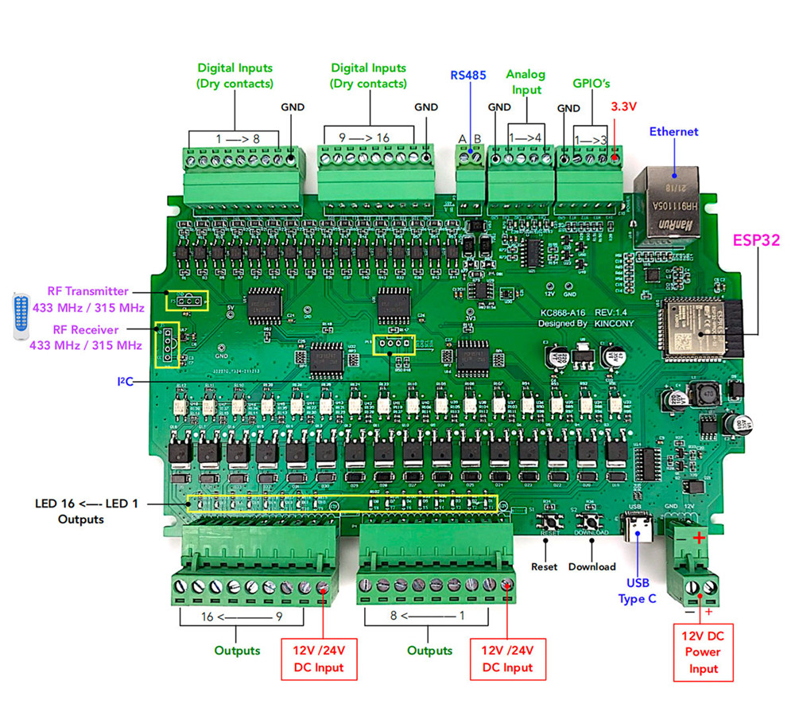

## GPIO Pinout

| Pin    | Function            |
| ------ | ------------------- |
| GPIO4  | I2C_SDA             |
| GPIO5  | I2C_SCL             |
| GPIO32 | GPIO terminal HT1   |
| GPIO33 | GPIO terminal HT2   |
| GPIO14 | GPIO terminal HT3   |
| GPIO2  | 433MHz Receiver     |
| GPIO15 | 433MHz Sender       |
| GPIO13 | RS485 TX            |
| GPIO16 | RS485 RX            |
| GPIO36 | Analog input A1     |
| GPIO34 | Analog input A2     |
| GPIO35 | Analog input A3     |
| GPIO39 | Analog input A4     |

[Additional pinout/design details](https://www.kincony.com/arduino-esp32-16-channel-relay-module-2.html)

## Installation

Remove the 433MHz modules from the board. Connect the board with a USB-C cable to your commputer. While pressing the `S2` switch, attach the external power supply (12V) to the board. Erase flash and then flash the board with the usual ESPHome installation methods.

## Basic Configuration

```yaml
esphome:
  name: kc868-a16

esp32:
  board: esp32dev
  framework:
    type: esp-idf

wifi:
  ssid: !secret wifi_ssid
  password: !secret wifi_password

logger:

api:
  encryption:
    key: !secret encryption_key

ota:
  - platform: esphome
    password: !secret ota_password

ethernet:
  type: LAN8720
  mdc_pin: GPIO23
  mdio_pin: GPIO18
  clk_mode: GPIO17_OUT
  phy_addr: 0

uart:
  - id: rs485
    tx_pin: GPIO13
    rx_pin: GPIO16
    baud_rate: 9600

remote_receiver:
  pin:
    number: GPIO2
    ignore_strapping_warning: true

remote_transmitter:
  pin:
    number: GPIO15
    ignore_strapping_warning: true
  carrier_duty_percent: 100%

i2c:
  sda: GPIO4
  scl:
    number: GPIO5
    ignore_strapping_warning: true

pcf8574:
  - id: inputs_1_8
    address: 0x22
    pcf8575: false
  - id: inputs_9_16
    address: 0x21
    pcf8575: false
  - id: outputs_1_8
    address: 0x24
    pcf8575: false
  - id: outputs_9_16
    address: 0x25
    pcf8575: false

binary_sensor:
  - platform: gpio
    name: "KC868-A16-HT1"
    pin:
      number: GPIO32
      inverted: true

  - platform: gpio
    name: "KC868-A16-HT2"
    pin:
      number: GPIO33
      inverted: true

  - platform: gpio
    name: "KC868-A16-HT3"
    pin:
      number: GPIO14
      inverted: true

  - platform: gpio
    name: "KC868-A16-X01"
    pin:
      pcf8574: inputs_1_8
      number: 0
      mode: INPUT
      inverted: true

  - platform: gpio
    name: "KC868-A16-X02"
    pin:
      pcf8574: inputs_1_8
      number: 1
      mode: INPUT
      inverted: true

  - platform: gpio
    name: "KC868-A16-X03"
    pin:
      pcf8574: inputs_1_8
      number: 2
      mode: INPUT
      inverted: true

  - platform: gpio
    name: "KC868-A16-X04"
    pin:
      pcf8574: inputs_1_8
      number: 3
      mode: INPUT
      inverted: true

  - platform: gpio
    name: "KC868-A16-X05"
    pin:
      pcf8574: inputs_1_8
      number: 4
      mode: INPUT
      inverted: true

  - platform: gpio
    name: "KC868-A16-X06"
    pin:
      pcf8574: inputs_1_8
      number: 5
      mode: INPUT
      inverted: true

  - platform: gpio
    name: "KC868-A16-X07"
    pin:
      pcf8574: inputs_1_8
      number: 6
      mode: INPUT
      inverted: true

  - platform: gpio
    name: "KC868-A16-X08"
    pin:
      pcf8574: inputs_1_8
      number: 7
      mode: INPUT
      inverted: true

  - platform: gpio
    name: "KC868-A16-X09"
    pin:
      pcf8574: inputs_9_16
      number: 0
      mode: INPUT
      inverted: true

  - platform: gpio
    name: "KC868-A16-X10"
    pin:
      pcf8574: inputs_9_16
      number: 1
      mode: INPUT
      inverted: true

  - platform: gpio
    name: "KC868-A16-X11"
    pin:
      pcf8574: inputs_9_16
      number: 2
      mode: INPUT
      inverted: true

  - platform: gpio
    name: "KC868-A16-X12"
    pin:
      pcf8574: inputs_9_16
      number: 3
      mode: INPUT
      inverted: true

  - platform: gpio
    name: "KC868-A16-X13"
    pin:
      pcf8574: inputs_9_16
      number: 4
      mode: INPUT
      inverted: true

  - platform: gpio
    name: "KC868-A16-X14"
    pin:
      pcf8574: inputs_9_16
      number: 5
      mode: INPUT
      inverted: true

  - platform: gpio
    name: "KC868-A16-X15"
    pin:
      pcf8574: inputs_9_16
      number: 6
      mode: INPUT
      inverted: true

  - platform: gpio
    name: "KC868-A16-X16"
    pin:
      pcf8574: inputs_9_16
      number: 7
      mode: INPUT
      inverted: true

switch:
  - platform: gpio
    name: "KC868-A16-Y01"
    id: out_y01
    pin:
      pcf8574: outputs_1_8
      number: 0
      mode: OUTPUT
      inverted: true

  - platform: gpio
    name: "KC868-A16-Y02"
    id: out_y02
    pin:
      pcf8574: outputs_1_8
      number: 1
      mode: OUTPUT
      inverted: true

  - platform: gpio
    name: "KC868-A16-Y03"
    id: out_y03
    pin:
      pcf8574: outputs_1_8
      number: 2
      mode: OUTPUT
      inverted: true

  - platform: gpio
    name: "KC868-A16-Y04"
    id: out_y04
    pin:
      pcf8574: outputs_1_8
      number: 3
      mode: OUTPUT
      inverted: true

  - platform: gpio
    name: "KC868-A16-Y05"
    id: out_y05
    pin:
      pcf8574: outputs_1_8
      number: 4
      mode: OUTPUT
      inverted: true

  - platform: gpio
    name: "KC868-A16-Y06"
    id: out_y06
    pin:
      pcf8574: outputs_1_8
      number: 5
      mode: OUTPUT
      inverted: true

  - platform: gpio
    name: "KC868-A16-Y07"
    id: out_y07
    pin:
      pcf8574: outputs_1_8
      number: 6
      mode: OUTPUT
      inverted: true

  - platform: gpio
    name: "KC868-A16-Y08"
    id: out_y08
    pin:
      pcf8574: outputs_1_8
      number: 7
      mode: OUTPUT
      inverted: true

  - platform: gpio
    name: "KC868-A16-Y09"
    id: out_y09
    pin:
      pcf8574: outputs_9_16
      number: 0
      mode: OUTPUT
      inverted: true

  - platform: gpio
    name: "KC868-A16-Y10"
    id: out_y10
    pin:
      pcf8574: outputs_9_16
      number: 1
      mode: OUTPUT
      inverted: true

  - platform: gpio
    name: "KC868-A16-Y11"
    id: out_y11
    pin:
      pcf8574: outputs_9_16
      number: 2
      mode: OUTPUT
      inverted: true

  - platform: gpio
    name: "KC868-A16-Y12"
    id: out_y12
    pin:
      pcf8574: outputs_9_16
      number: 3
      mode: OUTPUT
      inverted: true

  - platform: gpio
    name: "KC868-A16-Y13"
    id: out_y13
    pin:
      pcf8574: outputs_9_16
      number: 4
      mode: OUTPUT
      inverted: true

  - platform: gpio
    name: "KC868-A16-Y14"
    id: out_y14
    pin:
      pcf8574: outputs_9_16
      number: 5
      mode: OUTPUT
      inverted: true

  - platform: gpio
    name: "KC868-A16-Y15"
    id: out_y15
    pin:
      pcf8574: outputs_9_16
      number: 6
      mode: OUTPUT
      inverted: true

  - platform: gpio
    name: "KC868-A16-Y16"
    id: out_y16
    pin:
      pcf8574: outputs_9_16
      number: 7
      mode: OUTPUT
      inverted: true
```
