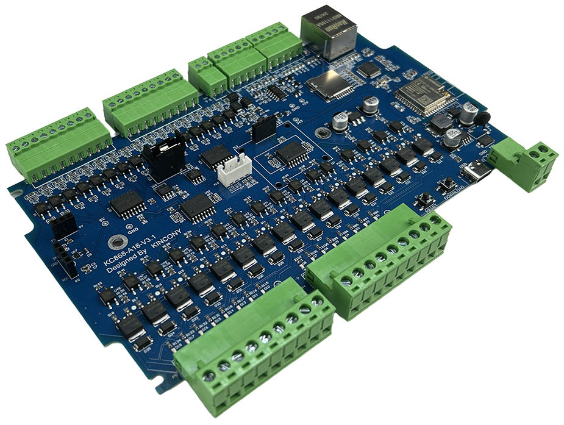
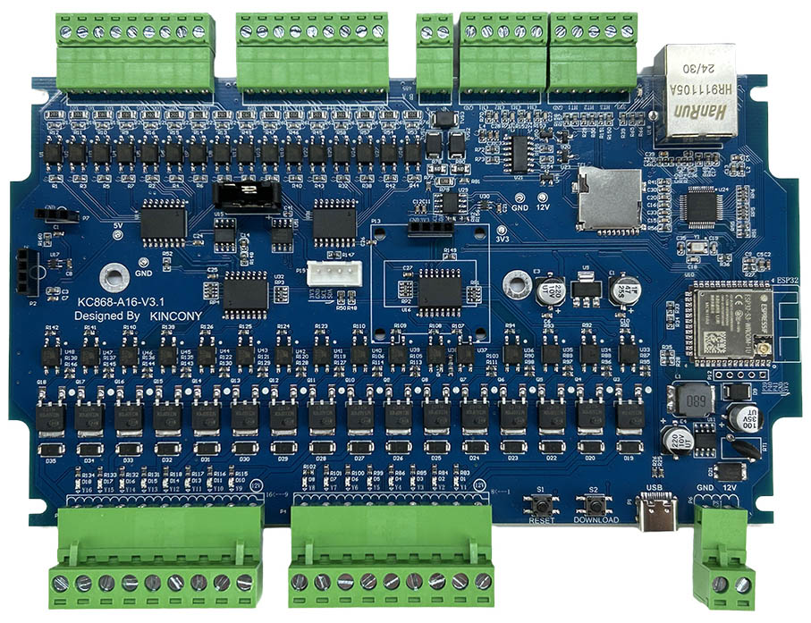
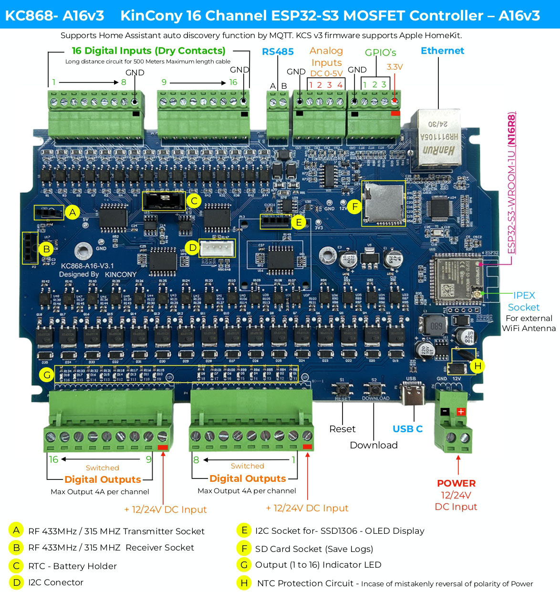

## Resources

- [ESP32 pin define details](https://www.kincony.com/forum/showthread.php?tid=7614)
- [YouTube video tour](https://youtu.be/FtXtbkdfoSE)

## ESPHome Configuration

Here is an example YAML configuration for the KinCony KC868-A16v3 board.

```yaml
esphome:
  name: a16v3
  friendly_name: a16v3
  platformio_options:
    board_build.flash_mode: dio

esp32:
  board: esp32-s3-devkitc-1
  framework:
    type: esp-idf

# Enable logging
logger:
  hardware_uart: USB_SERIAL_JTAG

api:

ethernet:
  type: W5500
  clk_pin: GPIO42
  mosi_pin: GPIO43
  miso_pin: GPIO44
  cs_pin: GPIO15
  interrupt_pin: GPIO2
  reset_pin: GPIO1

i2c:
   - id: bus_a
     sda: 9
     scl: 10
     scan: true
     frequency: 400kHz

# Example configuration entry
pcf8574:
  - id: 'pcf8574_hub_out_1'  # for output channel 1-8
    address: 0x24

  - id: 'pcf8574_hub_out_2'  # for output channel 9-16
    address: 0x25

  - id: 'pcf8574_hub_in_1'  # for input channel 1-8
    address: 0x21

  - id: 'pcf8574_hub_in_2'  # for input channel 9-16
    address: 0x22

uart:
  - id: uart_1
    baud_rate: 9600
    debug:
      direction: BOTH
      dummy_receiver: true
      after:
        timeout: 10ms
    tx_pin: 16
    rx_pin: 17


switch:

  - platform: uart
    uart_id: uart_1
    name: "RS485 Button"
    data: [0x11, 0x22, 0x33, 0x44, 0x55]

  - platform: gpio
    name: "a16v3_output1"
    pin:
      pcf8574: pcf8574_hub_out_1
      number: 0
      mode: OUTPUT
      inverted: true

  - platform: gpio
    name: "a16v3_output2"
    pin:
      pcf8574: pcf8574_hub_out_1
      number: 1
      mode: OUTPUT
      inverted: true

  - platform: gpio
    name: "a16v3_output3"
    pin:
      pcf8574: pcf8574_hub_out_1
      number: 2
      mode: OUTPUT
      inverted: true

  - platform: gpio
    name: "a16v3_output4"
    pin:
      pcf8574: pcf8574_hub_out_1
      number: 3
      mode: OUTPUT
      inverted: true

  - platform: gpio
    name: "a16v3_output5"
    pin:
      pcf8574: pcf8574_hub_out_1
      number: 4
      mode: OUTPUT
      inverted: true

  - platform: gpio
    name: "a16v3_output6"
    pin:
      pcf8574: pcf8574_hub_out_1
      number: 5
      mode: OUTPUT
      inverted: true

  - platform: gpio
    name: "a16v3_output7"
    pin:
      pcf8574: pcf8574_hub_out_1
      number: 6
      mode: OUTPUT
      inverted: true

  - platform: gpio
    name: "a16v3_output8"
    pin:
      pcf8574: pcf8574_hub_out_1
      number: 7
      mode: OUTPUT
      inverted: true

  - platform: gpio
    name: "a16v3_output9"
    pin:
      pcf8574: pcf8574_hub_out_2
      number: 0
      mode: OUTPUT
      inverted: true

  - platform: gpio
    name: "a16v3_output10"
    pin:
      pcf8574: pcf8574_hub_out_2
      number: 1
      mode: OUTPUT
      inverted: true

  - platform: gpio
    name: "a16v3_output11"
    pin:
      pcf8574: pcf8574_hub_out_2
      number: 2
      mode: OUTPUT
      inverted: true

  - platform: gpio
    name: "a16v3_output12"
    pin:
      pcf8574: pcf8574_hub_out_2
      number: 3
      mode: OUTPUT
      inverted: true

  - platform: gpio
    name: "a16v3_output13"
    pin:
      pcf8574: pcf8574_hub_out_2
      number: 4
      mode: OUTPUT
      inverted: true

  - platform: gpio
    name: "a16v3_output14"
    pin:
      pcf8574: pcf8574_hub_out_2
      number: 5
      mode: OUTPUT
      inverted: true

  - platform: gpio
    name: "a16v3_output15"
    pin:
      pcf8574: pcf8574_hub_out_2
      number: 6
      mode: OUTPUT
      inverted: true

  - platform: gpio
    name: "a16v3_output16"
    pin:
      pcf8574: pcf8574_hub_out_2
      number: 7
      mode: OUTPUT
      inverted: true


binary_sensor:

  - platform: gpio
    name: "a16v3_input1"
    pin:
      pcf8574: pcf8574_hub_in_1
      number: 0
      mode: INPUT
      inverted: true

  - platform: gpio
    name: "a16v3_input2"
    pin:
      pcf8574: pcf8574_hub_in_1
      number: 1
      mode: INPUT
      inverted: true

  - platform: gpio
    name: "a16v3_input3"
    pin:
      pcf8574: pcf8574_hub_in_1
      number: 2
      mode: INPUT
      inverted: true

  - platform: gpio
    name: "a16v3_input4"
    pin:
      pcf8574: pcf8574_hub_in_1
      number: 3
      mode: INPUT
      inverted: true

  - platform: gpio
    name: "a16v3_input5"
    pin:
      pcf8574: pcf8574_hub_in_1
      number: 4
      mode: INPUT
      inverted: true

  - platform: gpio
    name: "a16v3_input6"
    pin:
      pcf8574: pcf8574_hub_in_1
      number: 5
      mode: INPUT
      inverted: true

  - platform: gpio
    name: "a16v3_input7"
    pin:
      pcf8574: pcf8574_hub_in_1
      number: 6
      mode: INPUT
      inverted: true

  - platform: gpio
    name: "a16v3_input8"
    pin:
      pcf8574: pcf8574_hub_in_1
      number: 7
      mode: INPUT
      inverted: true

  - platform: gpio
    name: "a16v3_input9"
    pin:
      pcf8574: pcf8574_hub_in_2
      number: 0
      mode: INPUT
      inverted: true

  - platform: gpio
    name: "a16v3_input10"
    pin:
      pcf8574: pcf8574_hub_in_2
      number: 1
      mode: INPUT
      inverted: true

  - platform: gpio
    name: "a16v3_input11"
    pin:
      pcf8574: pcf8574_hub_in_2
      number: 2
      mode: INPUT
      inverted: true

  - platform: gpio
    name: "a16v3_input12"
    pin:
      pcf8574: pcf8574_hub_in_2
      number: 3
      mode: INPUT
      inverted: true

  - platform: gpio
    name: "a16v3_input13"
    pin:
      pcf8574: pcf8574_hub_in_2
      number: 4
      mode: INPUT
      inverted: true

  - platform: gpio
    name: "a16v3_input14"
    pin:
      pcf8574: pcf8574_hub_in_2
      number: 5
      mode: INPUT
      inverted: true

  - platform: gpio
    name: "a16v3_input15"
    pin:
      pcf8574: pcf8574_hub_in_2
      number: 6
      mode: INPUT
      inverted: true

  - platform: gpio
    name: "a16v3_input16"
    pin:
      pcf8574: pcf8574_hub_in_2
      number: 7
      mode: INPUT
      inverted: true

  - platform: gpio
    name: "A16v3 IO47"
    pin:
      number: 47
      inverted: true

  - platform: gpio
    name: "A16v3 IO48"
    pin:
      number: 48
      inverted: true

  - platform: gpio
    name: "A16v3 IO38"
    pin:
      number: 38
      inverted: true

  - platform: gpio
    name: "A16v3 IO39"
    pin:
      number: 39
      inverted: true

  - platform: gpio
    name: "A16v3 IO40"
    pin:
      number: 40
      inverted: true

  - platform: gpio
    name: "A16v3 IO41"
    pin:
      number: 41
      inverted: true

  - platform: gpio
    name: "A16v3 DW"
    pin:
      number: 0
      inverted: true

sensor:
  - platform: adc
    pin: 4
    name: "A16v3 A1 Voltage"
    update_interval: 5s
    attenuation: 11db
    filters:
      - lambda:
          if (x >= 3.11) {
            return x * 1.60256;
          } else if (x <= 0.15) {
            return 0;
          } else {
            return x * 1.51;
          }
  - platform: adc
    pin: 6
    name: "A16v3 A2 Voltage"
    update_interval: 5s
    attenuation: 11db
    filters:
      # - multiply: 1.51515
      - lambda:
          if (x >= 3.11) {
            return x * 1.60256;
          } else if (x <= 0.15) {
            return 0;
          } else {
            return x * 1.51;
          }
  - platform: adc
    pin: 7
    name: "A16v3 A3 Current"
    update_interval: 5s
    unit_of_measurement: mA
    attenuation: 11db
    filters:
      - multiply: 6.66666666
  - platform: adc
    pin: 5
    name: "A16v3 A4 Current"
    update_interval: 5s
    unit_of_measurement: mA
    attenuation: 11db
    filters:
      - multiply: 6.66666666

web_server:
  port: 80

# font:
#   - file: "gfonts://Roboto"
#     id: roboto
#     size: 20

# display:
#   - platform: ssd1306_i2c
#     i2c_id: bus_a
#     model: "SSD1306 128x64"
#     address: 0x3C
#     lambda: |-
#       it.printf(0, 0, id(roboto), "A16v3");
