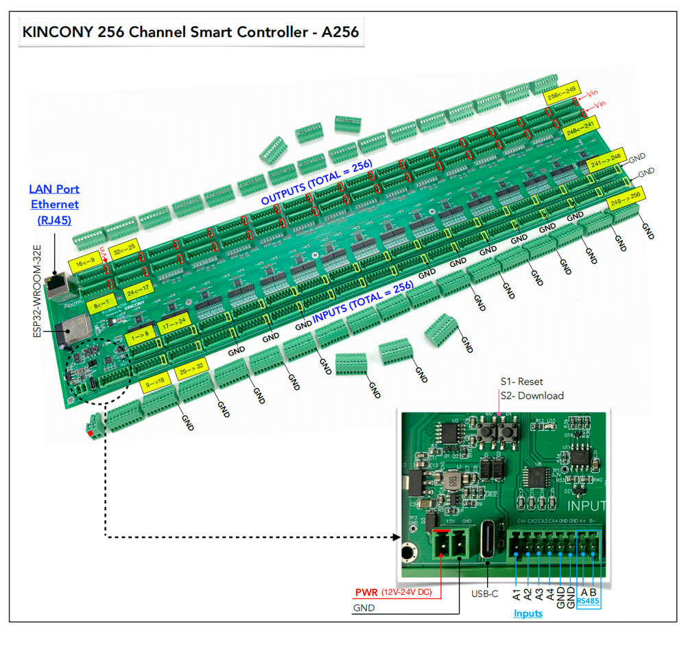

## GPIO Pinout

| Pin    | Function            |
| ------ | ------------------- |
| GPIO36 | ANALOG_A1           |
| GPIO39 | ANALOG_A2           |
| GPIO34 | ANALOG_A3           |
| GPIO35 | ANALOG_A4           |
| GPIO5  | 74HC595-Data        |
| GPIO16 | 74HC595-Clock       |
| GPIO4  | 74HC595-Latch       |
| GPIO15 | 74HC165-Data        |
| GPIO32 | 74HC165-Clock       |
| GPIO33 | 74HC165-LD          |
| GPIO13 | RS485_RXD           |
| GPIO14 | RS485_TXD           |

[Additional pinout/design details](https://www.kincony.com/esp32-arduino-256-channel-io-module.html)

## Basic Configuration

```yaml
# Basic Config
esphome:
  name: KC868-A256

esp32:
  board: esp32dev

# Enable logging
logger:

# Enable Home Assistant API
api:

# Example configuration entry
ethernet:
  type: LAN8720
  mdc_pin: GPIO23
  mdio_pin: GPIO18
  clk_mode: GPIO17_OUT
  phy_addr: 0

# Example configuration entry
sn74hc595:
  - id: 'sn74hc595_hub'
    data_pin: 5
    clock_pin: 16
    latch_pin: 4
    sr_count: 32

# Individual outputs
switch:
  - platform: gpio
    name: "a256-light1"
    pin:
      sn74hc595: sn74hc595_hub
      number: 0
      inverted: false
    restore_mode: ALWAYS_OFF

  - platform: gpio
    name: "a256-light2"
    pin:
      sn74hc595: sn74hc595_hub
      number: 1
      inverted: false
    restore_mode: ALWAYS_OFF

  - platform: gpio
    name: "a256-light3"
    pin:
      sn74hc595: sn74hc595_hub
      number: 2
      inverted: false
    restore_mode: ALWAYS_OFF

  - platform: gpio
    name: "a256-light4"
    pin:
      sn74hc595: sn74hc595_hub
      number: 3
      inverted: false
    restore_mode: ALWAYS_OFF

  - platform: gpio
    name: "a256-light5"
    pin:
      sn74hc595: sn74hc595_hub
      number: 4
      inverted: false
    restore_mode: ALWAYS_OFF

  - platform: gpio
    name: "a256-light6"
    pin:
      sn74hc595: sn74hc595_hub
      number: 5
      inverted: false
    restore_mode: ALWAYS_OFF

  - platform: gpio
    name: "a256-light7"
    pin:
      sn74hc595: sn74hc595_hub
      number: 6
      inverted: false
    restore_mode: ALWAYS_OFF

  - platform: gpio
    name: "a256-light8"
    pin:
      sn74hc595: sn74hc595_hub
      number: 7
      inverted: false
    restore_mode: ALWAYS_OFF

  - platform: gpio
    name: "a256-light9"
    pin:
      sn74hc595: sn74hc595_hub
      number: 8
      inverted: false
    restore_mode: ALWAYS_OFF

  - platform: gpio
    name: "a256-light10"
    pin:
      sn74hc595: sn74hc595_hub
      number: 9
      inverted: false
    restore_mode: ALWAYS_OFF

  - platform: gpio
    name: "a256-light11"
    pin:
      sn74hc595: sn74hc595_hub
      number: 10
      inverted: false
    restore_mode: ALWAYS_OFF

  - platform: gpio
    name: "a256-light12"
    pin:
      sn74hc595: sn74hc595_hub
      number: 11
      inverted: false
    restore_mode: ALWAYS_OFF

  - platform: gpio
    name: "a256-light13"
    pin:
      sn74hc595: sn74hc595_hub
      number: 12
      inverted: false
    restore_mode: ALWAYS_OFF

  - platform: gpio
    name: "a256-light14"
    pin:
      sn74hc595: sn74hc595_hub
      number: 13
      inverted: false
    restore_mode: ALWAYS_OFF

  - platform: gpio
    name: "a256-light15"
    pin:
      sn74hc595: sn74hc595_hub
      number: 14
      inverted: false
    restore_mode: ALWAYS_OFF

  - platform: gpio
    name: "a256-light16"
    pin:
      sn74hc595: sn74hc595_hub
      number: 15
      inverted: false
    restore_mode: ALWAYS_OFF

  - platform: gpio
    name: "a256-light17"
    pin:
      sn74hc595: sn74hc595_hub
      number: 16
      inverted: false
    restore_mode: ALWAYS_OFF

  - platform: gpio
    name: "a256-light18"
    pin:
      sn74hc595: sn74hc595_hub
      number: 17
      inverted: false
    restore_mode: ALWAYS_OFF

  - platform: gpio
    name: "a256-light19"
    pin:
      sn74hc595: sn74hc595_hub
      number: 18
      inverted: false
    restore_mode: ALWAYS_OFF

  - platform: gpio
    name: "a256-light20"
    pin:
      sn74hc595: sn74hc595_hub
      number: 19
      inverted: false
    restore_mode: ALWAYS_OFF

  - platform: gpio
    name: "a256-light21"
    pin:
      sn74hc595: sn74hc595_hub
      number: 20
      inverted: false
    restore_mode: ALWAYS_OFF

  - platform: gpio
    name: "a256-light22"
    pin:
      sn74hc595: sn74hc595_hub
      number: 21
      inverted: false
    restore_mode: ALWAYS_OFF

  - platform: gpio
    name: "a256-light23"
    pin:
      sn74hc595: sn74hc595_hub
      number: 22
      inverted: false
    restore_mode: ALWAYS_OFF

  - platform: gpio
    name: "a256-light24"
    pin:
      sn74hc595: sn74hc595_hub
      number: 23
      inverted: false
    restore_mode: ALWAYS_OFF

  - platform: gpio
    name: "a256-light25"
    pin:
      sn74hc595: sn74hc595_hub
      number: 24
      inverted: false
    restore_mode: ALWAYS_OFF

  - platform: gpio
    name: "a256-light26"
    pin:
      sn74hc595: sn74hc595_hub
      number: 25
      inverted: false
    restore_mode: ALWAYS_OFF

  - platform: gpio
    name: "a256-light27"
    pin:
      sn74hc595: sn74hc595_hub
      number: 26
      inverted: false
    restore_mode: ALWAYS_OFF

  - platform: gpio
    name: "a256-light28"
    pin:
      sn74hc595: sn74hc595_hub
      number: 27
      inverted: false
    restore_mode: ALWAYS_OFF

  - platform: gpio
    name: "a256-light29"
    pin:
      sn74hc595: sn74hc595_hub
      number: 28
      inverted: false
    restore_mode: ALWAYS_OFF

  - platform: gpio
    name: "a256-light30"
    pin:
      sn74hc595: sn74hc595_hub
      number: 29
      inverted: false
    restore_mode: ALWAYS_OFF

  - platform: gpio
    name: "a256-light31"
    pin:
      sn74hc595: sn74hc595_hub
      number: 30
      inverted: false
    restore_mode: ALWAYS_OFF

  - platform: gpio
    name: "a256-light32"
    pin:
      sn74hc595: sn74hc595_hub
      number: 31
      inverted: false
    restore_mode: ALWAYS_OFF

  - platform: gpio
    name: "a256-light33"
    pin:
      sn74hc595: sn74hc595_hub
      number: 32
      inverted: false
    restore_mode: ALWAYS_OFF

  - platform: gpio
    name: "a256-light34"
    pin:
      sn74hc595: sn74hc595_hub
      number: 33
      inverted: false
    restore_mode: ALWAYS_OFF

  - platform: gpio
    name: "a256-light35"
    pin:
      sn74hc595: sn74hc595_hub
      number: 34
      inverted: false
    restore_mode: ALWAYS_OFF

  - platform: gpio
    name: "a256-light36"
    pin:
      sn74hc595: sn74hc595_hub
      number: 35
      inverted: false
    restore_mode: ALWAYS_OFF

  - platform: gpio
    name: "a256-light37"
    pin:
      sn74hc595: sn74hc595_hub
      number: 36
      inverted: false
    restore_mode: ALWAYS_OFF

  - platform: gpio
    name: "a256-light38"
    pin:
      sn74hc595: sn74hc595_hub
      number: 37
      inverted: false
    restore_mode: ALWAYS_OFF

  - platform: gpio
    name: "a256-light39"
    pin:
      sn74hc595: sn74hc595_hub
      number: 38
      inverted: false
    restore_mode: ALWAYS_OFF

  - platform: gpio
    name: "a256-light40"
    pin:
      sn74hc595: sn74hc595_hub
      number: 39
      inverted: false
    restore_mode: ALWAYS_OFF

  - platform: gpio
    name: "a256-light41"
    pin:
      sn74hc595: sn74hc595_hub
      number: 40
      inverted: false
    restore_mode: ALWAYS_OFF

  - platform: gpio
    name: "a256-light42"
    pin:
      sn74hc595: sn74hc595_hub
      number: 41
      inverted: false
    restore_mode: ALWAYS_OFF

  - platform: gpio
    name: "a256-light43"
    pin:
      sn74hc595: sn74hc595_hub
      number: 42
      inverted: false
    restore_mode: ALWAYS_OFF

  - platform: gpio
    name: "a256-light44"
    pin:
      sn74hc595: sn74hc595_hub
      number: 43
      inverted: false
    restore_mode: ALWAYS_OFF

  - platform: gpio
    name: "a256-light45"
    pin:
      sn74hc595: sn74hc595_hub
      number: 44
      inverted: false
    restore_mode: ALWAYS_OFF

  - platform: gpio
    name: "a256-light46"
    pin:
      sn74hc595: sn74hc595_hub
      number: 45
      inverted: false
    restore_mode: ALWAYS_OFF

  - platform: gpio
    name: "a256-light47"
    pin:
      sn74hc595: sn74hc595_hub
      number: 46
      inverted: false
    restore_mode: ALWAYS_OFF

  - platform: gpio
    name: "a256-light48"
    pin:
      sn74hc595: sn74hc595_hub
      number: 47
      inverted: false
    restore_mode: ALWAYS_OFF

  - platform: gpio
    name: "a256-light49"
    pin:
      sn74hc595: sn74hc595_hub
      number: 48
      inverted: false
    restore_mode: ALWAYS_OFF

  - platform: gpio
    name: "a256-light50"
    pin:
      sn74hc595: sn74hc595_hub
      number: 49
      inverted: false
    restore_mode: ALWAYS_OFF

  - platform: gpio
    name: "a256-light51"
    pin:
      sn74hc595: sn74hc595_hub
      number: 50
      inverted: false
    restore_mode: ALWAYS_OFF

  - platform: gpio
    name: "a256-light52"
    pin:
      sn74hc595: sn74hc595_hub
      number: 51
      inverted: false
    restore_mode: ALWAYS_OFF

  - platform: gpio
    name: "a256-light53"
    pin:
      sn74hc595: sn74hc595_hub
      number: 52
      inverted: false
    restore_mode: ALWAYS_OFF

  - platform: gpio
    name: "a256-light54"
    pin:
      sn74hc595: sn74hc595_hub
      number: 53
      inverted: false
    restore_mode: ALWAYS_OFF

  - platform: gpio
    name: "a256-light55"
    pin:
      sn74hc595: sn74hc595_hub
      number: 54
      inverted: false
    restore_mode: ALWAYS_OFF

  - platform: gpio
    name: "a256-light56"
    pin:
      sn74hc595: sn74hc595_hub
      number: 55
      inverted: false
    restore_mode: ALWAYS_OFF

  - platform: gpio
    name: "a256-light57"
    pin:
      sn74hc595: sn74hc595_hub
      number: 56
      inverted: false
    restore_mode: ALWAYS_OFF

  - platform: gpio
    name: "a256-light58"
    pin:
      sn74hc595: sn74hc595_hub
      number: 57
      inverted: false
    restore_mode: ALWAYS_OFF

  - platform: gpio
    name: "a256-light59"
    pin:
      sn74hc595: sn74hc595_hub
      number: 58
      inverted: false
    restore_mode: ALWAYS_OFF

  - platform: gpio
    name: "a256-light60"
    pin:
      sn74hc595: sn74hc595_hub
      number: 59
      inverted: false
    restore_mode: ALWAYS_OFF

  - platform: gpio
    name: "a256-light61"
    pin:
      sn74hc595: sn74hc595_hub
      number: 60
      inverted: false
    restore_mode: ALWAYS_OFF

  - platform: gpio
    name: "a256-light62"
    pin:
      sn74hc595: sn74hc595_hub
      number: 61
      inverted: false
    restore_mode: ALWAYS_OFF

  - platform: gpio
    name: "a256-light63"
    pin:
      sn74hc595: sn74hc595_hub
      number: 62
      inverted: false
    restore_mode: ALWAYS_OFF

  - platform: gpio
    name: "a256-light64"
    pin:
      sn74hc595: sn74hc595_hub
      number: 63
      inverted: false
    restore_mode: ALWAYS_OFF

  - platform: gpio
    name: "a256-light65"
    pin:
      sn74hc595: sn74hc595_hub
      number: 64
      inverted: false
    restore_mode: ALWAYS_OFF

  - platform: gpio
    name: "a256-light66"
    pin:
      sn74hc595: sn74hc595_hub
      number: 65
      inverted: false
    restore_mode: ALWAYS_OFF

  - platform: gpio
    name: "a256-light67"
    pin:
      sn74hc595: sn74hc595_hub
      number: 66
      inverted: false
    restore_mode: ALWAYS_OFF

  - platform: gpio
    name: "a256-light68"
    pin:
      sn74hc595: sn74hc595_hub
      number: 67
      inverted: false
    restore_mode: ALWAYS_OFF

  - platform: gpio
    name: "a256-light69"
    pin:
      sn74hc595: sn74hc595_hub
      number: 68
      inverted: false
    restore_mode: ALWAYS_OFF

  - platform: gpio
    name: "a256-light70"
    pin:
      sn74hc595: sn74hc595_hub
      number: 69
      inverted: false
    restore_mode: ALWAYS_OFF

  - platform: gpio
    name: "a256-light71"
    pin:
      sn74hc595: sn74hc595_hub
      number: 70
      inverted: false
    restore_mode: ALWAYS_OFF

  - platform: gpio
    name: "a256-light72"
    pin:
      sn74hc595: sn74hc595_hub
      number: 71
      inverted: false
    restore_mode: ALWAYS_OFF

  - platform: gpio
    name: "a256-light73"
    pin:
      sn74hc595: sn74hc595_hub
      number: 72
      inverted: false
    restore_mode: ALWAYS_OFF

  - platform: gpio
    name: "a256-light74"
    pin:
      sn74hc595: sn74hc595_hub
      number: 73
      inverted: false
    restore_mode: ALWAYS_OFF

  - platform: gpio
    name: "a256-light75"
    pin:
      sn74hc595: sn74hc595_hub
      number: 74
      inverted: false
    restore_mode: ALWAYS_OFF

  - platform: gpio
    name: "a256-light76"
    pin:
      sn74hc595: sn74hc595_hub
      number: 75
      inverted: false
    restore_mode: ALWAYS_OFF

  - platform: gpio
    name: "a256-light77"
    pin:
      sn74hc595: sn74hc595_hub
      number: 76
      inverted: false
    restore_mode: ALWAYS_OFF

  - platform: gpio
    name: "a256-light78"
    pin:
      sn74hc595: sn74hc595_hub
      number: 77
      inverted: false
    restore_mode: ALWAYS_OFF

  - platform: gpio
    name: "a256-light79"
    pin:
      sn74hc595: sn74hc595_hub
      number: 78
      inverted: false
    restore_mode: ALWAYS_OFF

  - platform: gpio
    name: "a256-light80"
    pin:
      sn74hc595: sn74hc595_hub
      number: 79
      inverted: false
    restore_mode: ALWAYS_OFF

  - platform: gpio
    name: "a256-light81"
    pin:
      sn74hc595: sn74hc595_hub
      number: 80
      inverted: false
    restore_mode: ALWAYS_OFF

  - platform: gpio
    name: "a256-light82"
    pin:
      sn74hc595: sn74hc595_hub
      number: 81
      inverted: false
    restore_mode: ALWAYS_OFF

  - platform: gpio
    name: "a256-light83"
    pin:
      sn74hc595: sn74hc595_hub
      number: 82
      inverted: false
    restore_mode: ALWAYS_OFF

  - platform: gpio
    name: "a256-light84"
    pin:
      sn74hc595: sn74hc595_hub
      number: 83
      inverted: false
    restore_mode: ALWAYS_OFF

  - platform: gpio
    name: "a256-light85"
    pin:
      sn74hc595: sn74hc595_hub
      number: 84
      inverted: false
    restore_mode: ALWAYS_OFF

  - platform: gpio
    name: "a256-light86"
    pin:
      sn74hc595: sn74hc595_hub
      number: 85
      inverted: false
    restore_mode: ALWAYS_OFF

  - platform: gpio
    name: "a256-light87"
    pin:
      sn74hc595: sn74hc595_hub
      number: 86
      inverted: false
    restore_mode: ALWAYS_OFF

  - platform: gpio
    name: "a256-light88"
    pin:
      sn74hc595: sn74hc595_hub
      number: 87
      inverted: false
    restore_mode: ALWAYS_OFF

  - platform: gpio
    name: "a256-light89"
    pin:
      sn74hc595: sn74hc595_hub
      number: 88
      inverted: false
    restore_mode: ALWAYS_OFF

  - platform: gpio
    name: "a256-light90"
    pin:
      sn74hc595: sn74hc595_hub
      number: 89
      inverted: false
    restore_mode: ALWAYS_OFF

  - platform: gpio
    name: "a256-light91"
    pin:
      sn74hc595: sn74hc595_hub
      number: 90
      inverted: false
    restore_mode: ALWAYS_OFF

  - platform: gpio
    name: "a256-light92"
    pin:
      sn74hc595: sn74hc595_hub
      number: 91
      inverted: false
    restore_mode: ALWAYS_OFF

  - platform: gpio
    name: "a256-light93"
    pin:
      sn74hc595: sn74hc595_hub
      number: 92
      inverted: false
    restore_mode: ALWAYS_OFF

  - platform: gpio
    name: "a256-light94"
    pin:
      sn74hc595: sn74hc595_hub
      number: 93
      inverted: false
    restore_mode: ALWAYS_OFF

  - platform: gpio
    name: "a256-light95"
    pin:
      sn74hc595: sn74hc595_hub
      number: 94
      inverted: false
    restore_mode: ALWAYS_OFF

  - platform: gpio
    name: "a256-light96"
    pin:
      sn74hc595: sn74hc595_hub
      number: 95
      inverted: false
    restore_mode: ALWAYS_OFF

  - platform: gpio
    name: "a256-light97"
    pin:
      sn74hc595: sn74hc595_hub
      number: 96
      inverted: false
    restore_mode: ALWAYS_OFF

  - platform: gpio
    name: "a256-light98"
    pin:
      sn74hc595: sn74hc595_hub
      number: 97
      inverted: false
    restore_mode: ALWAYS_OFF

  - platform: gpio
    name: "a256-light99"
    pin:
      sn74hc595: sn74hc595_hub
      number: 98
      inverted: false
    restore_mode: ALWAYS_OFF

  - platform: gpio
    name: "a256-light100"
    pin:
      sn74hc595: sn74hc595_hub
      number: 99
      inverted: false
    restore_mode: ALWAYS_OFF

  - platform: gpio
    name: "a256-light101"
    pin:
      sn74hc595: sn74hc595_hub
      number: 100
      inverted: false
    restore_mode: ALWAYS_OFF

  - platform: gpio
    name: "a256-light102"
    pin:
      sn74hc595: sn74hc595_hub
      number: 101
      inverted: false
    restore_mode: ALWAYS_OFF

  - platform: gpio
    name: "a256-light103"
    pin:
      sn74hc595: sn74hc595_hub
      number: 102
      inverted: false
    restore_mode: ALWAYS_OFF

  - platform: gpio
    name: "a256-light104"
    pin:
      sn74hc595: sn74hc595_hub
      number: 103
      inverted: false
    restore_mode: ALWAYS_OFF

  - platform: gpio
    name: "a256-light105"
    pin:
      sn74hc595: sn74hc595_hub
      number: 104
      inverted: false
    restore_mode: ALWAYS_OFF

  - platform: gpio
    name: "a256-light106"
    pin:
      sn74hc595: sn74hc595_hub
      number: 105
      inverted: false
    restore_mode: ALWAYS_OFF

  - platform: gpio
    name: "a256-light107"
    pin:
      sn74hc595: sn74hc595_hub
      number: 106
      inverted: false
    restore_mode: ALWAYS_OFF

  - platform: gpio
    name: "a256-light108"
    pin:
      sn74hc595: sn74hc595_hub
      number: 107
      inverted: false
    restore_mode: ALWAYS_OFF

  - platform: gpio
    name: "a256-light109"
    pin:
      sn74hc595: sn74hc595_hub
      number: 108
      inverted: false
    restore_mode: ALWAYS_OFF

  - platform: gpio
    name: "a256-light110"
    pin:
      sn74hc595: sn74hc595_hub
      number: 109
      inverted: false
    restore_mode: ALWAYS_OFF

  - platform: gpio
    name: "a256-light111"
    pin:
      sn74hc595: sn74hc595_hub
      number: 110
      inverted: false
    restore_mode: ALWAYS_OFF

  - platform: gpio
    name: "a256-light112"
    pin:
      sn74hc595: sn74hc595_hub
      number: 111
      inverted: false
    restore_mode: ALWAYS_OFF

  - platform: gpio
    name: "a256-light113"
    pin:
      sn74hc595: sn74hc595_hub
      number: 112
      inverted: false
    restore_mode: ALWAYS_OFF

  - platform: gpio
    name: "a256-light114"
    pin:
      sn74hc595: sn74hc595_hub
      number: 113
      inverted: false
    restore_mode: ALWAYS_OFF

  - platform: gpio
    name: "a256-light115"
    pin:
      sn74hc595: sn74hc595_hub
      number: 114
      inverted: false
    restore_mode: ALWAYS_OFF

  - platform: gpio
    name: "a256-light116"
    pin:
      sn74hc595: sn74hc595_hub
      number: 115
      inverted: false
    restore_mode: ALWAYS_OFF

  - platform: gpio
    name: "a256-light117"
    pin:
      sn74hc595: sn74hc595_hub
      number: 116
      inverted: false
    restore_mode: ALWAYS_OFF

  - platform: gpio
    name: "a256-light118"
    pin:
      sn74hc595: sn74hc595_hub
      number: 117
      inverted: false
    restore_mode: ALWAYS_OFF

  - platform: gpio
    name: "a256-light119"
    pin:
      sn74hc595: sn74hc595_hub
      number: 118
      inverted: false
    restore_mode: ALWAYS_OFF

  - platform: gpio
    name: "a256-light120"
    pin:
      sn74hc595: sn74hc595_hub
      number: 119
      inverted: false
    restore_mode: ALWAYS_OFF

  - platform: gpio
    name: "a256-light121"
    pin:
      sn74hc595: sn74hc595_hub
      number: 120
      inverted: false
    restore_mode: ALWAYS_OFF

  - platform: gpio
    name: "a256-light122"
    pin:
      sn74hc595: sn74hc595_hub
      number: 121
      inverted: false
    restore_mode: ALWAYS_OFF

  - platform: gpio
    name: "a256-light123"
    pin:
      sn74hc595: sn74hc595_hub
      number: 122
      inverted: false
    restore_mode: ALWAYS_OFF

  - platform: gpio
    name: "a256-light124"
    pin:
      sn74hc595: sn74hc595_hub
      number: 123
      inverted: false
    restore_mode: ALWAYS_OFF

  - platform: gpio
    name: "a256-light125"
    pin:
      sn74hc595: sn74hc595_hub
      number: 124
      inverted: false
    restore_mode: ALWAYS_OFF

  - platform: gpio
    name: "a256-light126"
    pin:
      sn74hc595: sn74hc595_hub
      number: 125
      inverted: false
    restore_mode: ALWAYS_OFF

  - platform: gpio
    name: "a256-light127"
    pin:
      sn74hc595: sn74hc595_hub
      number: 126
      inverted: false
    restore_mode: ALWAYS_OFF

  - platform: gpio
    name: "a256-light128"
    pin:
      sn74hc595: sn74hc595_hub
      number: 127
      inverted: false
    restore_mode: ALWAYS_OFF

  - platform: gpio
    name: "a256-light129"
    pin:
      sn74hc595: sn74hc595_hub
      number: 128
      inverted: false
    restore_mode: ALWAYS_OFF

  - platform: gpio
    name: "a256-light130"
    pin:
      sn74hc595: sn74hc595_hub
      number: 129
      inverted: false
    restore_mode: ALWAYS_OFF

  - platform: gpio
    name: "a256-light131"
    pin:
      sn74hc595: sn74hc595_hub
      number: 130
      inverted: false
    restore_mode: ALWAYS_OFF

  - platform: gpio
    name: "a256-light132"
    pin:
      sn74hc595: sn74hc595_hub
      number: 131
      inverted: false
    restore_mode: ALWAYS_OFF

  - platform: gpio
    name: "a256-light133"
    pin:
      sn74hc595: sn74hc595_hub
      number: 132
      inverted: false
    restore_mode: ALWAYS_OFF

  - platform: gpio
    name: "a256-light134"
    pin:
      sn74hc595: sn74hc595_hub
      number: 133
      inverted: false
    restore_mode: ALWAYS_OFF

  - platform: gpio
    name: "a256-light135"
    pin:
      sn74hc595: sn74hc595_hub
      number: 134
      inverted: false
    restore_mode: ALWAYS_OFF

  - platform: gpio
    name: "a256-light136"
    pin:
      sn74hc595: sn74hc595_hub
      number: 135
      inverted: false
    restore_mode: ALWAYS_OFF

  - platform: gpio
    name: "a256-light137"
    pin:
      sn74hc595: sn74hc595_hub
      number: 136
      inverted: false
    restore_mode: ALWAYS_OFF

  - platform: gpio
    name: "a256-light138"
    pin:
      sn74hc595: sn74hc595_hub
      number: 137
      inverted: false
    restore_mode: ALWAYS_OFF

  - platform: gpio
    name: "a256-light139"
    pin:
      sn74hc595: sn74hc595_hub
      number: 138
      inverted: false
    restore_mode: ALWAYS_OFF

  - platform: gpio
    name: "a256-light140"
    pin:
      sn74hc595: sn74hc595_hub
      number: 139
      inverted: false
    restore_mode: ALWAYS_OFF

  - platform: gpio
    name: "a256-light141"
    pin:
      sn74hc595: sn74hc595_hub
      number: 140
      inverted: false
    restore_mode: ALWAYS_OFF

  - platform: gpio
    name: "a256-light142"
    pin:
      sn74hc595: sn74hc595_hub
      number: 141
      inverted: false
    restore_mode: ALWAYS_OFF

  - platform: gpio
    name: "a256-light143"
    pin:
      sn74hc595: sn74hc595_hub
      number: 142
      inverted: false
    restore_mode: ALWAYS_OFF

  - platform: gpio
    name: "a256-light144"
    pin:
      sn74hc595: sn74hc595_hub
      number: 143
      inverted: false
    restore_mode: ALWAYS_OFF

  - platform: gpio
    name: "a256-light145"
    pin:
      sn74hc595: sn74hc595_hub
      number: 144
      inverted: false
    restore_mode: ALWAYS_OFF

  - platform: gpio
    name: "a256-light146"
    pin:
      sn74hc595: sn74hc595_hub
      number: 145
      inverted: false
    restore_mode: ALWAYS_OFF

  - platform: gpio
    name: "a256-light147"
    pin:
      sn74hc595: sn74hc595_hub
      number: 146
      inverted: false
    restore_mode: ALWAYS_OFF

  - platform: gpio
    name: "a256-light148"
    pin:
      sn74hc595: sn74hc595_hub
      number: 147
      inverted: false
    restore_mode: ALWAYS_OFF

  - platform: gpio
    name: "a256-light149"
    pin:
      sn74hc595: sn74hc595_hub
      number: 148
      inverted: false
    restore_mode: ALWAYS_OFF

  - platform: gpio
    name: "a256-light150"
    pin:
      sn74hc595: sn74hc595_hub
      number: 149
      inverted: false
    restore_mode: ALWAYS_OFF

  - platform: gpio
    name: "a256-light151"
    pin:
      sn74hc595: sn74hc595_hub
      number: 150
      inverted: false
    restore_mode: ALWAYS_OFF

  - platform: gpio
    name: "a256-light152"
    pin:
      sn74hc595: sn74hc595_hub
      number: 151
      inverted: false
    restore_mode: ALWAYS_OFF

  - platform: gpio
    name: "a256-light153"
    pin:
      sn74hc595: sn74hc595_hub
      number: 152
      inverted: false
    restore_mode: ALWAYS_OFF

  - platform: gpio
    name: "a256-light154"
    pin:
      sn74hc595: sn74hc595_hub
      number: 153
      inverted: false
    restore_mode: ALWAYS_OFF

  - platform: gpio
    name: "a256-light155"
    pin:
      sn74hc595: sn74hc595_hub
      number: 154
      inverted: false
    restore_mode: ALWAYS_OFF

  - platform: gpio
    name: "a256-light156"
    pin:
      sn74hc595: sn74hc595_hub
      number: 155
      inverted: false
    restore_mode: ALWAYS_OFF

  - platform: gpio
    name: "a256-light157"
    pin:
      sn74hc595: sn74hc595_hub
      number: 156
      inverted: false
    restore_mode: ALWAYS_OFF

  - platform: gpio
    name: "a256-light158"
    pin:
      sn74hc595: sn74hc595_hub
      number: 157
      inverted: false
    restore_mode: ALWAYS_OFF

  - platform: gpio
    name: "a256-light159"
    pin:
      sn74hc595: sn74hc595_hub
      number: 158
      inverted: false
    restore_mode: ALWAYS_OFF

  - platform: gpio
    name: "a256-light160"
    pin:
      sn74hc595: sn74hc595_hub
      number: 159
      inverted: false
    restore_mode: ALWAYS_OFF

  - platform: gpio
    name: "a256-light161"
    pin:
      sn74hc595: sn74hc595_hub
      number: 160
      inverted: false
    restore_mode: ALWAYS_OFF

  - platform: gpio
    name: "a256-light162"
    pin:
      sn74hc595: sn74hc595_hub
      number: 161
      inverted: false
    restore_mode: ALWAYS_OFF

  - platform: gpio
    name: "a256-light163"
    pin:
      sn74hc595: sn74hc595_hub
      number: 162
      inverted: false
    restore_mode: ALWAYS_OFF

  - platform: gpio
    name: "a256-light164"
    pin:
      sn74hc595: sn74hc595_hub
      number: 163
      inverted: false
    restore_mode: ALWAYS_OFF

  - platform: gpio
    name: "a256-light165"
    pin:
      sn74hc595: sn74hc595_hub
      number: 164
      inverted: false
    restore_mode: ALWAYS_OFF

  - platform: gpio
    name: "a256-light166"
    pin:
      sn74hc595: sn74hc595_hub
      number: 165
      inverted: false
    restore_mode: ALWAYS_OFF

  - platform: gpio
    name: "a256-light167"
    pin:
      sn74hc595: sn74hc595_hub
      number: 166
      inverted: false
    restore_mode: ALWAYS_OFF

  - platform: gpio
    name: "a256-light168"
    pin:
      sn74hc595: sn74hc595_hub
      number: 167
      inverted: false
    restore_mode: ALWAYS_OFF

  - platform: gpio
    name: "a256-light169"
    pin:
      sn74hc595: sn74hc595_hub
      number: 168
      inverted: false
    restore_mode: ALWAYS_OFF

  - platform: gpio
    name: "a256-light170"
    pin:
      sn74hc595: sn74hc595_hub
      number: 169
      inverted: false
    restore_mode: ALWAYS_OFF

  - platform: gpio
    name: "a256-light171"
    pin:
      sn74hc595: sn74hc595_hub
      number: 170
      inverted: false
    restore_mode: ALWAYS_OFF

  - platform: gpio
    name: "a256-light172"
    pin:
      sn74hc595: sn74hc595_hub
      number: 171
      inverted: false
    restore_mode: ALWAYS_OFF

  - platform: gpio
    name: "a256-light173"
    pin:
      sn74hc595: sn74hc595_hub
      number: 172
      inverted: false
    restore_mode: ALWAYS_OFF

  - platform: gpio
    name: "a256-light174"
    pin:
      sn74hc595: sn74hc595_hub
      number: 173
      inverted: false
    restore_mode: ALWAYS_OFF

  - platform: gpio
    name: "a256-light175"
    pin:
      sn74hc595: sn74hc595_hub
      number: 174
      inverted: false
    restore_mode: ALWAYS_OFF

  - platform: gpio
    name: "a256-light176"
    pin:
      sn74hc595: sn74hc595_hub
      number: 175
      inverted: false
    restore_mode: ALWAYS_OFF

  - platform: gpio
    name: "a256-light177"
    pin:
      sn74hc595: sn74hc595_hub
      number: 176
      inverted: false
    restore_mode: ALWAYS_OFF

  - platform: gpio
    name: "a256-light178"
    pin:
      sn74hc595: sn74hc595_hub
      number: 177
      inverted: false
    restore_mode: ALWAYS_OFF

  - platform: gpio
    name: "a256-light179"
    pin:
      sn74hc595: sn74hc595_hub
      number: 178
      inverted: false
    restore_mode: ALWAYS_OFF

  - platform: gpio
    name: "a256-light180"
    pin:
      sn74hc595: sn74hc595_hub
      number: 179
      inverted: false
    restore_mode: ALWAYS_OFF

  - platform: gpio
    name: "a256-light181"
    pin:
      sn74hc595: sn74hc595_hub
      number: 180
      inverted: false
    restore_mode: ALWAYS_OFF

  - platform: gpio
    name: "a256-light182"
    pin:
      sn74hc595: sn74hc595_hub
      number: 181
      inverted: false
    restore_mode: ALWAYS_OFF

  - platform: gpio
    name: "a256-light183"
    pin:
      sn74hc595: sn74hc595_hub
      number: 182
      inverted: false
    restore_mode: ALWAYS_OFF

  - platform: gpio
    name: "a256-light184"
    pin:
      sn74hc595: sn74hc595_hub
      number: 183
      inverted: false
    restore_mode: ALWAYS_OFF

  - platform: gpio
    name: "a256-light185"
    pin:
      sn74hc595: sn74hc595_hub
      number: 184
      inverted: false
    restore_mode: ALWAYS_OFF

  - platform: gpio
    name: "a256-light186"
    pin:
      sn74hc595: sn74hc595_hub
      number: 185
      inverted: false
    restore_mode: ALWAYS_OFF

  - platform: gpio
    name: "a256-light187"
    pin:
      sn74hc595: sn74hc595_hub
      number: 186
      inverted: false
    restore_mode: ALWAYS_OFF

  - platform: gpio
    name: "a256-light188"
    pin:
      sn74hc595: sn74hc595_hub
      number: 187
      inverted: false
    restore_mode: ALWAYS_OFF

  - platform: gpio
    name: "a256-light189"
    pin:
      sn74hc595: sn74hc595_hub
      number: 188
      inverted: false
    restore_mode: ALWAYS_OFF

  - platform: gpio
    name: "a256-light190"
    pin:
      sn74hc595: sn74hc595_hub
      number: 189
      inverted: false
    restore_mode: ALWAYS_OFF

  - platform: gpio
    name: "a256-light191"
    pin:
      sn74hc595: sn74hc595_hub
      number: 190
      inverted: false
    restore_mode: ALWAYS_OFF

  - platform: gpio
    name: "a256-light192"
    pin:
      sn74hc595: sn74hc595_hub
      number: 191
      inverted: false
    restore_mode: ALWAYS_OFF

  - platform: gpio
    name: "a256-light193"
    pin:
      sn74hc595: sn74hc595_hub
      number: 192
      inverted: false
    restore_mode: ALWAYS_OFF

  - platform: gpio
    name: "a256-light194"
    pin:
      sn74hc595: sn74hc595_hub
      number: 193
      inverted: false
    restore_mode: ALWAYS_OFF

  - platform: gpio
    name: "a256-light195"
    pin:
      sn74hc595: sn74hc595_hub
      number: 194
      inverted: false
    restore_mode: ALWAYS_OFF

  - platform: gpio
    name: "a256-light196"
    pin:
      sn74hc595: sn74hc595_hub
      number: 195
      inverted: false
    restore_mode: ALWAYS_OFF

  - platform: gpio
    name: "a256-light197"
    pin:
      sn74hc595: sn74hc595_hub
      number: 196
      inverted: false
    restore_mode: ALWAYS_OFF

  - platform: gpio
    name: "a256-light198"
    pin:
      sn74hc595: sn74hc595_hub
      number: 197
      inverted: false
    restore_mode: ALWAYS_OFF

  - platform: gpio
    name: "a256-light199"
    pin:
      sn74hc595: sn74hc595_hub
      number: 198
      inverted: false
    restore_mode: ALWAYS_OFF

  - platform: gpio
    name: "a256-light200"
    pin:
      sn74hc595: sn74hc595_hub
      number: 199
      inverted: false
    restore_mode: ALWAYS_OFF

  - platform: gpio
    name: "a256-light201"
    pin:
      sn74hc595: sn74hc595_hub
      number: 200
      inverted: false
    restore_mode: ALWAYS_OFF

  - platform: gpio
    name: "a256-light202"
    pin:
      sn74hc595: sn74hc595_hub
      number: 201
      inverted: false
    restore_mode: ALWAYS_OFF

  - platform: gpio
    name: "a256-light203"
    pin:
      sn74hc595: sn74hc595_hub
      number: 202
      inverted: false
    restore_mode: ALWAYS_OFF

  - platform: gpio
    name: "a256-light204"
    pin:
      sn74hc595: sn74hc595_hub
      number: 203
      inverted: false
    restore_mode: ALWAYS_OFF

  - platform: gpio
    name: "a256-light205"
    pin:
      sn74hc595: sn74hc595_hub
      number: 204
      inverted: false
    restore_mode: ALWAYS_OFF

  - platform: gpio
    name: "a256-light206"
    pin:
      sn74hc595: sn74hc595_hub
      number: 205
      inverted: false
    restore_mode: ALWAYS_OFF

  - platform: gpio
    name: "a256-light207"
    pin:
      sn74hc595: sn74hc595_hub
      number: 206
      inverted: false
    restore_mode: ALWAYS_OFF

  - platform: gpio
    name: "a256-light208"
    pin:
      sn74hc595: sn74hc595_hub
      number: 207
      inverted: false
    restore_mode: ALWAYS_OFF

  - platform: gpio
    name: "a256-light209"
    pin:
      sn74hc595: sn74hc595_hub
      number: 208
      inverted: false
    restore_mode: ALWAYS_OFF

  - platform: gpio
    name: "a256-light210"
    pin:
      sn74hc595: sn74hc595_hub
      number: 209
      inverted: false
    restore_mode: ALWAYS_OFF

  - platform: gpio
    name: "a256-light211"
    pin:
      sn74hc595: sn74hc595_hub
      number: 210
      inverted: false
    restore_mode: ALWAYS_OFF

  - platform: gpio
    name: "a256-light212"
    pin:
      sn74hc595: sn74hc595_hub
      number: 211
      inverted: false
    restore_mode: ALWAYS_OFF

  - platform: gpio
    name: "a256-light213"
    pin:
      sn74hc595: sn74hc595_hub
      number: 212
      inverted: false
    restore_mode: ALWAYS_OFF

  - platform: gpio
    name: "a256-light214"
    pin:
      sn74hc595: sn74hc595_hub
      number: 213
      inverted: false
    restore_mode: ALWAYS_OFF

  - platform: gpio
    name: "a256-light215"
    pin:
      sn74hc595: sn74hc595_hub
      number: 214
      inverted: false
    restore_mode: ALWAYS_OFF

  - platform: gpio
    name: "a256-light216"
    pin:
      sn74hc595: sn74hc595_hub
      number: 215
      inverted: false
    restore_mode: ALWAYS_OFF

  - platform: gpio
    name: "a256-light217"
    pin:
      sn74hc595: sn74hc595_hub
      number: 216
      inverted: false
    restore_mode: ALWAYS_OFF

  - platform: gpio
    name: "a256-light218"
    pin:
      sn74hc595: sn74hc595_hub
      number: 217
      inverted: false
    restore_mode: ALWAYS_OFF

  - platform: gpio
    name: "a256-light219"
    pin:
      sn74hc595: sn74hc595_hub
      number: 218
      inverted: false
    restore_mode: ALWAYS_OFF

  - platform: gpio
    name: "a256-light220"
    pin:
      sn74hc595: sn74hc595_hub
      number: 219
      inverted: false
    restore_mode: ALWAYS_OFF

  - platform: gpio
    name: "a256-light221"
    pin:
      sn74hc595: sn74hc595_hub
      number: 220
      inverted: false
    restore_mode: ALWAYS_OFF

  - platform: gpio
    name: "a256-light222"
    pin:
      sn74hc595: sn74hc595_hub
      number: 221
      inverted: false
    restore_mode: ALWAYS_OFF

  - platform: gpio
    name: "a256-light223"
    pin:
      sn74hc595: sn74hc595_hub
      number: 222
      inverted: false
    restore_mode: ALWAYS_OFF

  - platform: gpio
    name: "a256-light224"
    pin:
      sn74hc595: sn74hc595_hub
      number: 223
      inverted: false
    restore_mode: ALWAYS_OFF

  - platform: gpio
    name: "a256-light225"
    pin:
      sn74hc595: sn74hc595_hub
      number: 224
      inverted: false
    restore_mode: ALWAYS_OFF

  - platform: gpio
    name: "a256-light226"
    pin:
      sn74hc595: sn74hc595_hub
      number: 225
      inverted: false
    restore_mode: ALWAYS_OFF

  - platform: gpio
    name: "a256-light227"
    pin:
      sn74hc595: sn74hc595_hub
      number: 226
      inverted: false
    restore_mode: ALWAYS_OFF

  - platform: gpio
    name: "a256-light228"
    pin:
      sn74hc595: sn74hc595_hub
      number: 227
      inverted: false
    restore_mode: ALWAYS_OFF

  - platform: gpio
    name: "a256-light229"
    pin:
      sn74hc595: sn74hc595_hub
      number: 228
      inverted: false
    restore_mode: ALWAYS_OFF

  - platform: gpio
    name: "a256-light230"
    pin:
      sn74hc595: sn74hc595_hub
      number: 229
      inverted: false
    restore_mode: ALWAYS_OFF

  - platform: gpio
    name: "a256-light231"
    pin:
      sn74hc595: sn74hc595_hub
      number: 230
      inverted: false
    restore_mode: ALWAYS_OFF

  - platform: gpio
    name: "a256-light232"
    pin:
      sn74hc595: sn74hc595_hub
      number: 231
      inverted: false
    restore_mode: ALWAYS_OFF

  - platform: gpio
    name: "a256-light233"
    pin:
      sn74hc595: sn74hc595_hub
      number: 232
      inverted: false
    restore_mode: ALWAYS_OFF

  - platform: gpio
    name: "a256-light234"
    pin:
      sn74hc595: sn74hc595_hub
      number: 233
      inverted: false
    restore_mode: ALWAYS_OFF

  - platform: gpio
    name: "a256-light235"
    pin:
      sn74hc595: sn74hc595_hub
      number: 234
      inverted: false
    restore_mode: ALWAYS_OFF

  - platform: gpio
    name: "a256-light236"
    pin:
      sn74hc595: sn74hc595_hub
      number: 235
      inverted: false
    restore_mode: ALWAYS_OFF

  - platform: gpio
    name: "a256-light237"
    pin:
      sn74hc595: sn74hc595_hub
      number: 236
      inverted: false
    restore_mode: ALWAYS_OFF

  - platform: gpio
    name: "a256-light238"
    pin:
      sn74hc595: sn74hc595_hub
      number: 237
      inverted: false
    restore_mode: ALWAYS_OFF

  - platform: gpio
    name: "a256-light239"
    pin:
      sn74hc595: sn74hc595_hub
      number: 238
      inverted: false
    restore_mode: ALWAYS_OFF

  - platform: gpio
    name: "a256-light240"
    pin:
      sn74hc595: sn74hc595_hub
      number: 239
      inverted: false
    restore_mode: ALWAYS_OFF

  - platform: gpio
    name: "a256-light241"
    pin:
      sn74hc595: sn74hc595_hub
      number: 240
      inverted: false
    restore_mode: ALWAYS_OFF

  - platform: gpio
    name: "a256-light242"
    pin:
      sn74hc595: sn74hc595_hub
      number: 241
      inverted: false
    restore_mode: ALWAYS_OFF

  - platform: gpio
    name: "a256-light243"
    pin:
      sn74hc595: sn74hc595_hub
      number: 242
      inverted: false
    restore_mode: ALWAYS_OFF

  - platform: gpio
    name: "a256-light244"
    pin:
      sn74hc595: sn74hc595_hub
      number: 243
      inverted: false
    restore_mode: ALWAYS_OFF

  - platform: gpio
    name: "a256-light245"
    pin:
      sn74hc595: sn74hc595_hub
      number: 244
      inverted: false
    restore_mode: ALWAYS_OFF

  - platform: gpio
    name: "a256-light246"
    pin:
      sn74hc595: sn74hc595_hub
      number: 245
      inverted: false
    restore_mode: ALWAYS_OFF

  - platform: gpio
    name: "a256-light247"
    pin:
      sn74hc595: sn74hc595_hub
      number: 246
      inverted: false
    restore_mode: ALWAYS_OFF

  - platform: gpio
    name: "a256-light248"
    pin:
      sn74hc595: sn74hc595_hub
      number: 247
      inverted: false
    restore_mode: ALWAYS_OFF

  - platform: gpio
    name: "a256-light249"
    pin:
      sn74hc595: sn74hc595_hub
      number: 248
      inverted: false
    restore_mode: ALWAYS_OFF

  - platform: gpio
    name: "a256-light250"
    pin:
      sn74hc595: sn74hc595_hub
      number: 249
      inverted: false
    restore_mode: ALWAYS_OFF

  - platform: gpio
    name: "a256-light251"
    pin:
      sn74hc595: sn74hc595_hub
      number: 250
      inverted: false
    restore_mode: ALWAYS_OFF

  - platform: gpio
    name: "a256-light252"
    pin:
      sn74hc595: sn74hc595_hub
      number: 251
      inverted: false
    restore_mode: ALWAYS_OFF

  - platform: gpio
    name: "a256-light253"
    pin:
      sn74hc595: sn74hc595_hub
      number: 252
      inverted: false
    restore_mode: ALWAYS_OFF

  - platform: gpio
    name: "a256-light254"
    pin:
      sn74hc595: sn74hc595_hub
      number: 253
      inverted: false
    restore_mode: ALWAYS_OFF

  - platform: gpio
    name: "a256-light255"
    pin:
      sn74hc595: sn74hc595_hub
      number: 254
      inverted: false
    restore_mode: ALWAYS_OFF

  - platform: gpio
    name: "a256-light256"
    pin:
      sn74hc595: sn74hc595_hub
      number: 255
      inverted: false
    restore_mode: ALWAYS_OFF

# Example configuration entry
sn74hc165:
  - id: sn74hc165_hub
    clock_pin: 32
    data_pin: 15
    load_pin: 33
    sr_count: 32

# Individual inputs
binary_sensor:
  - platform: gpio
    name: "a256-input1"
    pin:
      sn74hc165: sn74hc165_hub
      number: 0
      inverted: true

  - platform: gpio
    name: "a256-input2"
    pin:
      sn74hc165: sn74hc165_hub
      number: 1
      inverted: true

  - platform: gpio
    name: "a256-input3"
    pin:
      sn74hc165: sn74hc165_hub
      number: 2
      inverted: true

  - platform: gpio
    name: "a256-input4"
    pin:
      sn74hc165: sn74hc165_hub
      number: 3
      inverted: true

  - platform: gpio
    name: "a256-input5"
    pin:
      sn74hc165: sn74hc165_hub
      number: 4
      inverted: true

  - platform: gpio
    name: "a256-input6"
    pin:
      sn74hc165: sn74hc165_hub
      number: 5
      inverted: true

  - platform: gpio
    name: "a256-input7"
    pin:
      sn74hc165: sn74hc165_hub
      number: 6
      inverted: true

  - platform: gpio
    name: "a256-input8"
    pin:
      sn74hc165: sn74hc165_hub
      number: 7
      inverted: true

  - platform: gpio
    name: "a256-input9"
    pin:
      sn74hc165: sn74hc165_hub
      number: 8
      inverted: true

  - platform: gpio
    name: "a256-input10"
    pin:
      sn74hc165: sn74hc165_hub
      number: 9
      inverted: true

  - platform: gpio
    name: "a256-input11"
    pin:
      sn74hc165: sn74hc165_hub
      number: 10
      inverted: true

  - platform: gpio
    name: "a256-input12"
    pin:
      sn74hc165: sn74hc165_hub
      number: 11
      inverted: true

  - platform: gpio
    name: "a256-input13"
    pin:
      sn74hc165: sn74hc165_hub
      number: 12
      inverted: true

  - platform: gpio
    name: "a256-input14"
    pin:
      sn74hc165: sn74hc165_hub
      number: 13
      inverted: true

  - platform: gpio
    name: "a256-input15"
    pin:
      sn74hc165: sn74hc165_hub
      number: 14
      inverted: true

  - platform: gpio
    name: "a256-input16"
    pin:
      sn74hc165: sn74hc165_hub
      number: 15
      inverted: true

  - platform: gpio
    name: "a256-input17"
    pin:
      sn74hc165: sn74hc165_hub
      number: 16
      inverted: true

  - platform: gpio
    name: "a256-input18"
    pin:
      sn74hc165: sn74hc165_hub
      number: 17
      inverted: true

  - platform: gpio
    name: "a256-input19"
    pin:
      sn74hc165: sn74hc165_hub
      number: 18
      inverted: true

  - platform: gpio
    name: "a256-input20"
    pin:
      sn74hc165: sn74hc165_hub
      number: 19
      inverted: true

  - platform: gpio
    name: "a256-input21"
    pin:
      sn74hc165: sn74hc165_hub
      number: 20
      inverted: true

  - platform: gpio
    name: "a256-input22"
    pin:
      sn74hc165: sn74hc165_hub
      number: 21
      inverted: true

  - platform: gpio
    name: "a256-input23"
    pin:
      sn74hc165: sn74hc165_hub
      number: 22
      inverted: true

  - platform: gpio
    name: "a256-input24"
    pin:
      sn74hc165: sn74hc165_hub
      number: 23
      inverted: true

  - platform: gpio
    name: "a256-input25"
    pin:
      sn74hc165: sn74hc165_hub
      number: 24
      inverted: true

  - platform: gpio
    name: "a256-input26"
    pin:
      sn74hc165: sn74hc165_hub
      number: 25
      inverted: true

  - platform: gpio
    name: "a256-input27"
    pin:
      sn74hc165: sn74hc165_hub
      number: 26
      inverted: true

  - platform: gpio
    name: "a256-input28"
    pin:
      sn74hc165: sn74hc165_hub
      number: 27
      inverted: true

  - platform: gpio
    name: "a256-input29"
    pin:
      sn74hc165: sn74hc165_hub
      number: 28
      inverted: true

  - platform: gpio
    name: "a256-input30"
    pin:
      sn74hc165: sn74hc165_hub
      number: 29
      inverted: true

  - platform: gpio
    name: "a256-input31"
    pin:
      sn74hc165: sn74hc165_hub
      number: 30
      inverted: true

  - platform: gpio
    name: "a256-input32"
    pin:
      sn74hc165: sn74hc165_hub
      number: 31
      inverted: true

  - platform: gpio
    name: "a256-input33"
    pin:
      sn74hc165: sn74hc165_hub
      number: 32
      inverted: true

  - platform: gpio
    name: "a256-input34"
    pin:
      sn74hc165: sn74hc165_hub
      number: 33
      inverted: true

  - platform: gpio
    name: "a256-input35"
    pin:
      sn74hc165: sn74hc165_hub
      number: 34
      inverted: true

  - platform: gpio
    name: "a256-input36"
    pin:
      sn74hc165: sn74hc165_hub
      number: 35
      inverted: true

  - platform: gpio
    name: "a256-input37"
    pin:
      sn74hc165: sn74hc165_hub
      number: 36
      inverted: true

  - platform: gpio
    name: "a256-input38"
    pin:
      sn74hc165: sn74hc165_hub
      number: 37
      inverted: true

  - platform: gpio
    name: "a256-input39"
    pin:
      sn74hc165: sn74hc165_hub
      number: 38
      inverted: true

  - platform: gpio
    name: "a256-input40"
    pin:
      sn74hc165: sn74hc165_hub
      number: 39
      inverted: true

  - platform: gpio
    name: "a256-input41"
    pin:
      sn74hc165: sn74hc165_hub
      number: 40
      inverted: true

  - platform: gpio
    name: "a256-input42"
    pin:
      sn74hc165: sn74hc165_hub
      number: 41
      inverted: true

  - platform: gpio
    name: "a256-input43"
    pin:
      sn74hc165: sn74hc165_hub
      number: 42
      inverted: true

  - platform: gpio
    name: "a256-input44"
    pin:
      sn74hc165: sn74hc165_hub
      number: 43
      inverted: true

  - platform: gpio
    name: "a256-input45"
    pin:
      sn74hc165: sn74hc165_hub
      number: 44
      inverted: true

  - platform: gpio
    name: "a256-input46"
    pin:
      sn74hc165: sn74hc165_hub
      number: 45
      inverted: true

  - platform: gpio
    name: "a256-input47"
    pin:
      sn74hc165: sn74hc165_hub
      number: 46
      inverted: true

  - platform: gpio
    name: "a256-input48"
    pin:
      sn74hc165: sn74hc165_hub
      number: 47
      inverted: true

  - platform: gpio
    name: "a256-input49"
    pin:
      sn74hc165: sn74hc165_hub
      number: 48
      inverted: true

  - platform: gpio
    name: "a256-input50"
    pin:
      sn74hc165: sn74hc165_hub
      number: 49
      inverted: true

  - platform: gpio
    name: "a256-input51"
    pin:
      sn74hc165: sn74hc165_hub
      number: 50
      inverted: true

  - platform: gpio
    name: "a256-input52"
    pin:
      sn74hc165: sn74hc165_hub
      number: 51
      inverted: true

  - platform: gpio
    name: "a256-input53"
    pin:
      sn74hc165: sn74hc165_hub
      number: 52
      inverted: true

  - platform: gpio
    name: "a256-input54"
    pin:
      sn74hc165: sn74hc165_hub
      number: 53
      inverted: true

  - platform: gpio
    name: "a256-input55"
    pin:
      sn74hc165: sn74hc165_hub
      number: 54
      inverted: true

  - platform: gpio
    name: "a256-input56"
    pin:
      sn74hc165: sn74hc165_hub
      number: 55
      inverted: true

  - platform: gpio
    name: "a256-input57"
    pin:
      sn74hc165: sn74hc165_hub
      number: 56
      inverted: true

  - platform: gpio
    name: "a256-input58"
    pin:
      sn74hc165: sn74hc165_hub
      number: 57
      inverted: true

  - platform: gpio
    name: "a256-input59"
    pin:
      sn74hc165: sn74hc165_hub
      number: 58
      inverted: true

  - platform: gpio
    name: "a256-input60"
    pin:
      sn74hc165: sn74hc165_hub
      number: 59
      inverted: true

  - platform: gpio
    name: "a256-input61"
    pin:
      sn74hc165: sn74hc165_hub
      number: 60
      inverted: true

  - platform: gpio
    name: "a256-input62"
    pin:
      sn74hc165: sn74hc165_hub
      number: 61
      inverted: true

  - platform: gpio
    name: "a256-input63"
    pin:
      sn74hc165: sn74hc165_hub
      number: 62
      inverted: true

  - platform: gpio
    name: "a256-input64"
    pin:
      sn74hc165: sn74hc165_hub
      number: 63
      inverted: true

  - platform: gpio
    name: "a256-input65"
    pin:
      sn74hc165: sn74hc165_hub
      number: 64
      inverted: true

  - platform: gpio
    name: "a256-input66"
    pin:
      sn74hc165: sn74hc165_hub
      number: 65
      inverted: true

  - platform: gpio
    name: "a256-input67"
    pin:
      sn74hc165: sn74hc165_hub
      number: 66
      inverted: true

  - platform: gpio
    name: "a256-input68"
    pin:
      sn74hc165: sn74hc165_hub
      number: 67
      inverted: true

  - platform: gpio
    name: "a256-input69"
    pin:
      sn74hc165: sn74hc165_hub
      number: 68
      inverted: true

  - platform: gpio
    name: "a256-input70"
    pin:
      sn74hc165: sn74hc165_hub
      number: 69
      inverted: true

  - platform: gpio
    name: "a256-input71"
    pin:
      sn74hc165: sn74hc165_hub
      number: 70
      inverted: true

  - platform: gpio
    name: "a256-input72"
    pin:
      sn74hc165: sn74hc165_hub
      number: 71
      inverted: true

  - platform: gpio
    name: "a256-input73"
    pin:
      sn74hc165: sn74hc165_hub
      number: 72
      inverted: true

  - platform: gpio
    name: "a256-input74"
    pin:
      sn74hc165: sn74hc165_hub
      number: 73
      inverted: true

  - platform: gpio
    name: "a256-input75"
    pin:
      sn74hc165: sn74hc165_hub
      number: 74
      inverted: true

  - platform: gpio
    name: "a256-input76"
    pin:
      sn74hc165: sn74hc165_hub
      number: 75
      inverted: true

  - platform: gpio
    name: "a256-input77"
    pin:
      sn74hc165: sn74hc165_hub
      number: 76
      inverted: true

  - platform: gpio
    name: "a256-input78"
    pin:
      sn74hc165: sn74hc165_hub
      number: 77
      inverted: true

  - platform: gpio
    name: "a256-input79"
    pin:
      sn74hc165: sn74hc165_hub
      number: 78
      inverted: true

  - platform: gpio
    name: "a256-input80"
    pin:
      sn74hc165: sn74hc165_hub
      number: 79
      inverted: true

  - platform: gpio
    name: "a256-input81"
    pin:
      sn74hc165: sn74hc165_hub
      number: 80
      inverted: true

  - platform: gpio
    name: "a256-input82"
    pin:
      sn74hc165: sn74hc165_hub
      number: 81
      inverted: true

  - platform: gpio
    name: "a256-input83"
    pin:
      sn74hc165: sn74hc165_hub
      number: 82
      inverted: true

  - platform: gpio
    name: "a256-input84"
    pin:
      sn74hc165: sn74hc165_hub
      number: 83
      inverted: true

  - platform: gpio
    name: "a256-input85"
    pin:
      sn74hc165: sn74hc165_hub
      number: 84
      inverted: true

  - platform: gpio
    name: "a256-input86"
    pin:
      sn74hc165: sn74hc165_hub
      number: 85
      inverted: true

  - platform: gpio
    name: "a256-input87"
    pin:
      sn74hc165: sn74hc165_hub
      number: 86
      inverted: true

  - platform: gpio
    name: "a256-input88"
    pin:
      sn74hc165: sn74hc165_hub
      number: 87
      inverted: true

  - platform: gpio
    name: "a256-input89"
    pin:
      sn74hc165: sn74hc165_hub
      number: 88
      inverted: true

  - platform: gpio
    name: "a256-input90"
    pin:
      sn74hc165: sn74hc165_hub
      number: 89
      inverted: true

  - platform: gpio
    name: "a256-input91"
    pin:
      sn74hc165: sn74hc165_hub
      number: 90
      inverted: true

  - platform: gpio
    name: "a256-input92"
    pin:
      sn74hc165: sn74hc165_hub
      number: 91
      inverted: true

  - platform: gpio
    name: "a256-input93"
    pin:
      sn74hc165: sn74hc165_hub
      number: 92
      inverted: true

  - platform: gpio
    name: "a256-input94"
    pin:
      sn74hc165: sn74hc165_hub
      number: 93
      inverted: true

  - platform: gpio
    name: "a256-input95"
    pin:
      sn74hc165: sn74hc165_hub
      number: 94
      inverted: true

  - platform: gpio
    name: "a256-input96"
    pin:
      sn74hc165: sn74hc165_hub
      number: 95
      inverted: true

  - platform: gpio
    name: "a256-input97"
    pin:
      sn74hc165: sn74hc165_hub
      number: 96
      inverted: true

  - platform: gpio
    name: "a256-input98"
    pin:
      sn74hc165: sn74hc165_hub
      number: 97
      inverted: true

  - platform: gpio
    name: "a256-input99"
    pin:
      sn74hc165: sn74hc165_hub
      number: 98
      inverted: true

  - platform: gpio
    name: "a256-input100"
    pin:
      sn74hc165: sn74hc165_hub
      number: 99
      inverted: true

  - platform: gpio
    name: "a256-input101"
    pin:
      sn74hc165: sn74hc165_hub
      number: 100
      inverted: true

  - platform: gpio
    name: "a256-input102"
    pin:
      sn74hc165: sn74hc165_hub
      number: 101
      inverted: true

  - platform: gpio
    name: "a256-input103"
    pin:
      sn74hc165: sn74hc165_hub
      number: 102
      inverted: true

  - platform: gpio
    name: "a256-input104"
    pin:
      sn74hc165: sn74hc165_hub
      number: 103
      inverted: true

  - platform: gpio
    name: "a256-input105"
    pin:
      sn74hc165: sn74hc165_hub
      number: 104
      inverted: true

  - platform: gpio
    name: "a256-input106"
    pin:
      sn74hc165: sn74hc165_hub
      number: 105
      inverted: true

  - platform: gpio
    name: "a256-input107"
    pin:
      sn74hc165: sn74hc165_hub
      number: 106
      inverted: true

  - platform: gpio
    name: "a256-input108"
    pin:
      sn74hc165: sn74hc165_hub
      number: 107
      inverted: true

  - platform: gpio
    name: "a256-input109"
    pin:
      sn74hc165: sn74hc165_hub
      number: 108
      inverted: true

  - platform: gpio
    name: "a256-input110"
    pin:
      sn74hc165: sn74hc165_hub
      number: 109
      inverted: true

  - platform: gpio
    name: "a256-input111"
    pin:
      sn74hc165: sn74hc165_hub
      number: 110
      inverted: true

  - platform: gpio
    name: "a256-input112"
    pin:
      sn74hc165: sn74hc165_hub
      number: 111
      inverted: true

  - platform: gpio
    name: "a256-input113"
    pin:
      sn74hc165: sn74hc165_hub
      number: 112
      inverted: true

  - platform: gpio
    name: "a256-input114"
    pin:
      sn74hc165: sn74hc165_hub
      number: 113
      inverted: true

  - platform: gpio
    name: "a256-input115"
    pin:
      sn74hc165: sn74hc165_hub
      number: 114
      inverted: true

  - platform: gpio
    name: "a256-input116"
    pin:
      sn74hc165: sn74hc165_hub
      number: 115
      inverted: true

  - platform: gpio
    name: "a256-input117"
    pin:
      sn74hc165: sn74hc165_hub
      number: 116
      inverted: true

  - platform: gpio
    name: "a256-input118"
    pin:
      sn74hc165: sn74hc165_hub
      number: 117
      inverted: true

  - platform: gpio
    name: "a256-input119"
    pin:
      sn74hc165: sn74hc165_hub
      number: 118
      inverted: true

  - platform: gpio
    name: "a256-input120"
    pin:
      sn74hc165: sn74hc165_hub
      number: 119
      inverted: true

  - platform: gpio
    name: "a256-input121"
    pin:
      sn74hc165: sn74hc165_hub
      number: 120
      inverted: true

  - platform: gpio
    name: "a256-input122"
    pin:
      sn74hc165: sn74hc165_hub
      number: 121
      inverted: true

  - platform: gpio
    name: "a256-input123"
    pin:
      sn74hc165: sn74hc165_hub
      number: 122
      inverted: true

  - platform: gpio
    name: "a256-input124"
    pin:
      sn74hc165: sn74hc165_hub
      number: 123
      inverted: true

  - platform: gpio
    name: "a256-input125"
    pin:
      sn74hc165: sn74hc165_hub
      number: 124
      inverted: true

  - platform: gpio
    name: "a256-input126"
    pin:
      sn74hc165: sn74hc165_hub
      number: 125
      inverted: true

  - platform: gpio
    name: "a256-input127"
    pin:
      sn74hc165: sn74hc165_hub
      number: 126
      inverted: true

  - platform: gpio
    name: "a256-input128"
    pin:
      sn74hc165: sn74hc165_hub
      number: 127
      inverted: true

  - platform: gpio
    name: "a256-input129"
    pin:
      sn74hc165: sn74hc165_hub
      number: 128
      inverted: true

  - platform: gpio
    name: "a256-input130"
    pin:
      sn74hc165: sn74hc165_hub
      number: 129
      inverted: true

  - platform: gpio
    name: "a256-input131"
    pin:
      sn74hc165: sn74hc165_hub
      number: 130
      inverted: true

  - platform: gpio
    name: "a256-input132"
    pin:
      sn74hc165: sn74hc165_hub
      number: 131
      inverted: true

  - platform: gpio
    name: "a256-input133"
    pin:
      sn74hc165: sn74hc165_hub
      number: 132
      inverted: true

  - platform: gpio
    name: "a256-input134"
    pin:
      sn74hc165: sn74hc165_hub
      number: 133
      inverted: true

  - platform: gpio
    name: "a256-input135"
    pin:
      sn74hc165: sn74hc165_hub
      number: 134
      inverted: true

  - platform: gpio
    name: "a256-input136"
    pin:
      sn74hc165: sn74hc165_hub
      number: 135
      inverted: true

  - platform: gpio
    name: "a256-input137"
    pin:
      sn74hc165: sn74hc165_hub
      number: 136
      inverted: true

  - platform: gpio
    name: "a256-input138"
    pin:
      sn74hc165: sn74hc165_hub
      number: 137
      inverted: true

  - platform: gpio
    name: "a256-input139"
    pin:
      sn74hc165: sn74hc165_hub
      number: 138
      inverted: true

  - platform: gpio
    name: "a256-input140"
    pin:
      sn74hc165: sn74hc165_hub
      number: 139
      inverted: true

  - platform: gpio
    name: "a256-input141"
    pin:
      sn74hc165: sn74hc165_hub
      number: 140
      inverted: true

  - platform: gpio
    name: "a256-input142"
    pin:
      sn74hc165: sn74hc165_hub
      number: 141
      inverted: true

  - platform: gpio
    name: "a256-input143"
    pin:
      sn74hc165: sn74hc165_hub
      number: 142
      inverted: true

  - platform: gpio
    name: "a256-input144"
    pin:
      sn74hc165: sn74hc165_hub
      number: 143
      inverted: true

  - platform: gpio
    name: "a256-input145"
    pin:
      sn74hc165: sn74hc165_hub
      number: 144
      inverted: true

  - platform: gpio
    name: "a256-input146"
    pin:
      sn74hc165: sn74hc165_hub
      number: 145
      inverted: true

  - platform: gpio
    name: "a256-input147"
    pin:
      sn74hc165: sn74hc165_hub
      number: 146
      inverted: true

  - platform: gpio
    name: "a256-input148"
    pin:
      sn74hc165: sn74hc165_hub
      number: 147
      inverted: true

  - platform: gpio
    name: "a256-input149"
    pin:
      sn74hc165: sn74hc165_hub
      number: 148
      inverted: true

  - platform: gpio
    name: "a256-input150"
    pin:
      sn74hc165: sn74hc165_hub
      number: 149
      inverted: true

  - platform: gpio
    name: "a256-input151"
    pin:
      sn74hc165: sn74hc165_hub
      number: 150
      inverted: true

  - platform: gpio
    name: "a256-input152"
    pin:
      sn74hc165: sn74hc165_hub
      number: 151
      inverted: true

  - platform: gpio
    name: "a256-input153"
    pin:
      sn74hc165: sn74hc165_hub
      number: 152
      inverted: true

  - platform: gpio
    name: "a256-input154"
    pin:
      sn74hc165: sn74hc165_hub
      number: 153
      inverted: true

  - platform: gpio
    name: "a256-input155"
    pin:
      sn74hc165: sn74hc165_hub
      number: 154
      inverted: true

  - platform: gpio
    name: "a256-input156"
    pin:
      sn74hc165: sn74hc165_hub
      number: 155
      inverted: true

  - platform: gpio
    name: "a256-input157"
    pin:
      sn74hc165: sn74hc165_hub
      number: 156
      inverted: true

  - platform: gpio
    name: "a256-input158"
    pin:
      sn74hc165: sn74hc165_hub
      number: 157
      inverted: true

  - platform: gpio
    name: "a256-input159"
    pin:
      sn74hc165: sn74hc165_hub
      number: 158
      inverted: true

  - platform: gpio
    name: "a256-input160"
    pin:
      sn74hc165: sn74hc165_hub
      number: 159
      inverted: true

  - platform: gpio
    name: "a256-input161"
    pin:
      sn74hc165: sn74hc165_hub
      number: 160
      inverted: true

  - platform: gpio
    name: "a256-input162"
    pin:
      sn74hc165: sn74hc165_hub
      number: 161
      inverted: true

  - platform: gpio
    name: "a256-input163"
    pin:
      sn74hc165: sn74hc165_hub
      number: 162
      inverted: true

  - platform: gpio
    name: "a256-input164"
    pin:
      sn74hc165: sn74hc165_hub
      number: 163
      inverted: true

  - platform: gpio
    name: "a256-input165"
    pin:
      sn74hc165: sn74hc165_hub
      number: 164
      inverted: true

  - platform: gpio
    name: "a256-input166"
    pin:
      sn74hc165: sn74hc165_hub
      number: 165
      inverted: true

  - platform: gpio
    name: "a256-input167"
    pin:
      sn74hc165: sn74hc165_hub
      number: 166
      inverted: true

  - platform: gpio
    name: "a256-input168"
    pin:
      sn74hc165: sn74hc165_hub
      number: 167
      inverted: true

  - platform: gpio
    name: "a256-input169"
    pin:
      sn74hc165: sn74hc165_hub
      number: 168
      inverted: true

  - platform: gpio
    name: "a256-input170"
    pin:
      sn74hc165: sn74hc165_hub
      number: 169
      inverted: true

  - platform: gpio
    name: "a256-input171"
    pin:
      sn74hc165: sn74hc165_hub
      number: 170
      inverted: true

  - platform: gpio
    name: "a256-input172"
    pin:
      sn74hc165: sn74hc165_hub
      number: 171
      inverted: true

  - platform: gpio
    name: "a256-input173"
    pin:
      sn74hc165: sn74hc165_hub
      number: 172
      inverted: true

  - platform: gpio
    name: "a256-input174"
    pin:
      sn74hc165: sn74hc165_hub
      number: 173
      inverted: true

  - platform: gpio
    name: "a256-input175"
    pin:
      sn74hc165: sn74hc165_hub
      number: 174
      inverted: true

  - platform: gpio
    name: "a256-input176"
    pin:
      sn74hc165: sn74hc165_hub
      number: 175
      inverted: true

  - platform: gpio
    name: "a256-input177"
    pin:
      sn74hc165: sn74hc165_hub
      number: 176
      inverted: true

  - platform: gpio
    name: "a256-input178"
    pin:
      sn74hc165: sn74hc165_hub
      number: 177
      inverted: true

  - platform: gpio
    name: "a256-input179"
    pin:
      sn74hc165: sn74hc165_hub
      number: 178
      inverted: true

  - platform: gpio
    name: "a256-input180"
    pin:
      sn74hc165: sn74hc165_hub
      number: 179
      inverted: true

  - platform: gpio
    name: "a256-input181"
    pin:
      sn74hc165: sn74hc165_hub
      number: 180
      inverted: true

  - platform: gpio
    name: "a256-input182"
    pin:
      sn74hc165: sn74hc165_hub
      number: 181
      inverted: true

  - platform: gpio
    name: "a256-input183"
    pin:
      sn74hc165: sn74hc165_hub
      number: 182
      inverted: true

  - platform: gpio
    name: "a256-input184"
    pin:
      sn74hc165: sn74hc165_hub
      number: 183
      inverted: true

  - platform: gpio
    name: "a256-input185"
    pin:
      sn74hc165: sn74hc165_hub
      number: 184
      inverted: true

  - platform: gpio
    name: "a256-input186"
    pin:
      sn74hc165: sn74hc165_hub
      number: 185
      inverted: true

  - platform: gpio
    name: "a256-input187"
    pin:
      sn74hc165: sn74hc165_hub
      number: 186
      inverted: true

  - platform: gpio
    name: "a256-input188"
    pin:
      sn74hc165: sn74hc165_hub
      number: 187
      inverted: true

  - platform: gpio
    name: "a256-input189"
    pin:
      sn74hc165: sn74hc165_hub
      number: 188
      inverted: true

  - platform: gpio
    name: "a256-input190"
    pin:
      sn74hc165: sn74hc165_hub
      number: 189
      inverted: true

  - platform: gpio
    name: "a256-input191"
    pin:
      sn74hc165: sn74hc165_hub
      number: 190
      inverted: true

  - platform: gpio
    name: "a256-input192"
    pin:
      sn74hc165: sn74hc165_hub
      number: 191
      inverted: true

  - platform: gpio
    name: "a256-input193"
    pin:
      sn74hc165: sn74hc165_hub
      number: 192
      inverted: true

  - platform: gpio
    name: "a256-input194"
    pin:
      sn74hc165: sn74hc165_hub
      number: 193
      inverted: true

  - platform: gpio
    name: "a256-input195"
    pin:
      sn74hc165: sn74hc165_hub
      number: 194
      inverted: true

  - platform: gpio
    name: "a256-input196"
    pin:
      sn74hc165: sn74hc165_hub
      number: 195
      inverted: true

  - platform: gpio
    name: "a256-input197"
    pin:
      sn74hc165: sn74hc165_hub
      number: 196
      inverted: true

  - platform: gpio
    name: "a256-input198"
    pin:
      sn74hc165: sn74hc165_hub
      number: 197
      inverted: true

  - platform: gpio
    name: "a256-input199"
    pin:
      sn74hc165: sn74hc165_hub
      number: 198
      inverted: true

  - platform: gpio
    name: "a256-input200"
    pin:
      sn74hc165: sn74hc165_hub
      number: 199
      inverted: true

  - platform: gpio
    name: "a256-input201"
    pin:
      sn74hc165: sn74hc165_hub
      number: 200
      inverted: true

  - platform: gpio
    name: "a256-input202"
    pin:
      sn74hc165: sn74hc165_hub
      number: 201
      inverted: true

  - platform: gpio
    name: "a256-input203"
    pin:
      sn74hc165: sn74hc165_hub
      number: 202
      inverted: true

  - platform: gpio
    name: "a256-input204"
    pin:
      sn74hc165: sn74hc165_hub
      number: 203
      inverted: true

  - platform: gpio
    name: "a256-input205"
    pin:
      sn74hc165: sn74hc165_hub
      number: 204
      inverted: true

  - platform: gpio
    name: "a256-input206"
    pin:
      sn74hc165: sn74hc165_hub
      number: 205
      inverted: true

  - platform: gpio
    name: "a256-input207"
    pin:
      sn74hc165: sn74hc165_hub
      number: 206
      inverted: true

  - platform: gpio
    name: "a256-input208"
    pin:
      sn74hc165: sn74hc165_hub
      number: 207
      inverted: true

  - platform: gpio
    name: "a256-input209"
    pin:
      sn74hc165: sn74hc165_hub
      number: 208
      inverted: true

  - platform: gpio
    name: "a256-input210"
    pin:
      sn74hc165: sn74hc165_hub
      number: 209
      inverted: true

  - platform: gpio
    name: "a256-input211"
    pin:
      sn74hc165: sn74hc165_hub
      number: 210
      inverted: true

  - platform: gpio
    name: "a256-input212"
    pin:
      sn74hc165: sn74hc165_hub
      number: 211
      inverted: true

  - platform: gpio
    name: "a256-input213"
    pin:
      sn74hc165: sn74hc165_hub
      number: 212
      inverted: true

  - platform: gpio
    name: "a256-input214"
    pin:
      sn74hc165: sn74hc165_hub
      number: 213
      inverted: true

  - platform: gpio
    name: "a256-input215"
    pin:
      sn74hc165: sn74hc165_hub
      number: 214
      inverted: true

  - platform: gpio
    name: "a256-input216"
    pin:
      sn74hc165: sn74hc165_hub
      number: 215
      inverted: true

  - platform: gpio
    name: "a256-input217"
    pin:
      sn74hc165: sn74hc165_hub
      number: 216
      inverted: true

  - platform: gpio
    name: "a256-input218"
    pin:
      sn74hc165: sn74hc165_hub
      number: 217
      inverted: true

  - platform: gpio
    name: "a256-input219"
    pin:
      sn74hc165: sn74hc165_hub
      number: 218
      inverted: true

  - platform: gpio
    name: "a256-input220"
    pin:
      sn74hc165: sn74hc165_hub
      number: 219
      inverted: true

  - platform: gpio
    name: "a256-input221"
    pin:
      sn74hc165: sn74hc165_hub
      number: 220
      inverted: true

  - platform: gpio
    name: "a256-input222"
    pin:
      sn74hc165: sn74hc165_hub
      number: 221
      inverted: true

  - platform: gpio
    name: "a256-input223"
    pin:
      sn74hc165: sn74hc165_hub
      number: 222
      inverted: true

  - platform: gpio
    name: "a256-input224"
    pin:
      sn74hc165: sn74hc165_hub
      number: 223
      inverted: true

  - platform: gpio
    name: "a256-input225"
    pin:
      sn74hc165: sn74hc165_hub
      number: 224
      inverted: true

  - platform: gpio
    name: "a256-input226"
    pin:
      sn74hc165: sn74hc165_hub
      number: 225
      inverted: true

  - platform: gpio
    name: "a256-input227"
    pin:
      sn74hc165: sn74hc165_hub
      number: 226
      inverted: true

  - platform: gpio
    name: "a256-input228"
    pin:
      sn74hc165: sn74hc165_hub
      number: 227
      inverted: true

  - platform: gpio
    name: "a256-input229"
    pin:
      sn74hc165: sn74hc165_hub
      number: 228
      inverted: true

  - platform: gpio
    name: "a256-input230"
    pin:
      sn74hc165: sn74hc165_hub
      number: 229
      inverted: true

  - platform: gpio
    name: "a256-input231"
    pin:
      sn74hc165: sn74hc165_hub
      number: 230
      inverted: true

  - platform: gpio
    name: "a256-input232"
    pin:
      sn74hc165: sn74hc165_hub
      number: 231
      inverted: true

  - platform: gpio
    name: "a256-input233"
    pin:
      sn74hc165: sn74hc165_hub
      number: 232
      inverted: true

  - platform: gpio
    name: "a256-input234"
    pin:
      sn74hc165: sn74hc165_hub
      number: 233
      inverted: true

  - platform: gpio
    name: "a256-input235"
    pin:
      sn74hc165: sn74hc165_hub
      number: 234
      inverted: true

  - platform: gpio
    name: "a256-input236"
    pin:
      sn74hc165: sn74hc165_hub
      number: 235
      inverted: true

  - platform: gpio
    name: "a256-input237"
    pin:
      sn74hc165: sn74hc165_hub
      number: 236
      inverted: true

  - platform: gpio
    name: "a256-input238"
    pin:
      sn74hc165: sn74hc165_hub
      number: 237
      inverted: true

  - platform: gpio
    name: "a256-input239"
    pin:
      sn74hc165: sn74hc165_hub
      number: 238
      inverted: true

  - platform: gpio
    name: "a256-input240"
    pin:
      sn74hc165: sn74hc165_hub
      number: 239
      inverted: true

  - platform: gpio
    name: "a256-input241"
    pin:
      sn74hc165: sn74hc165_hub
      number: 240
      inverted: true

  - platform: gpio
    name: "a256-input242"
    pin:
      sn74hc165: sn74hc165_hub
      number: 241
      inverted: true

  - platform: gpio
    name: "a256-input243"
    pin:
      sn74hc165: sn74hc165_hub
      number: 242
      inverted: true

  - platform: gpio
    name: "a256-input244"
    pin:
      sn74hc165: sn74hc165_hub
      number: 243
      inverted: true

  - platform: gpio
    name: "a256-input245"
    pin:
      sn74hc165: sn74hc165_hub
      number: 244
      inverted: true

  - platform: gpio
    name: "a256-input246"
    pin:
      sn74hc165: sn74hc165_hub
      number: 245
      inverted: true

  - platform: gpio
    name: "a256-input247"
    pin:
      sn74hc165: sn74hc165_hub
      number: 246
      inverted: true

  - platform: gpio
    name: "a256-input248"
    pin:
      sn74hc165: sn74hc165_hub
      number: 247
      inverted: true

  - platform: gpio
    name: "a256-input249"
    pin:
      sn74hc165: sn74hc165_hub
      number: 248
      inverted: true

  - platform: gpio
    name: "a256-input250"
    pin:
      sn74hc165: sn74hc165_hub
      number: 249
      inverted: true

  - platform: gpio
    name: "a256-input251"
    pin:
      sn74hc165: sn74hc165_hub
      number: 250
      inverted: true

  - platform: gpio
    name: "a256-input252"
    pin:
      sn74hc165: sn74hc165_hub
      number: 251
      inverted: true

  - platform: gpio
    name: "a256-input253"
    pin:
      sn74hc165: sn74hc165_hub
      number: 252
      inverted: true

  - platform: gpio
    name: "a256-input254"
    pin:
      sn74hc165: sn74hc165_hub
      number: 253
      inverted: true

  - platform: gpio
    name: "a256-input255"
    pin:
      sn74hc165: sn74hc165_hub
      number: 254
      inverted: true

  - platform: gpio
    name: "a256-input256"
    pin:
      sn74hc165: sn74hc165_hub
      number: 255
      inverted: true
```
