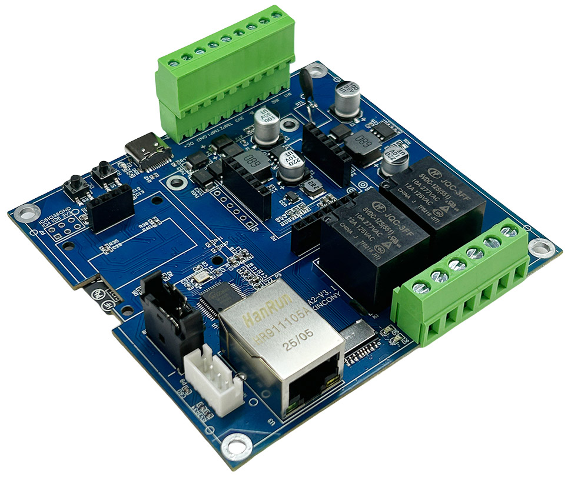
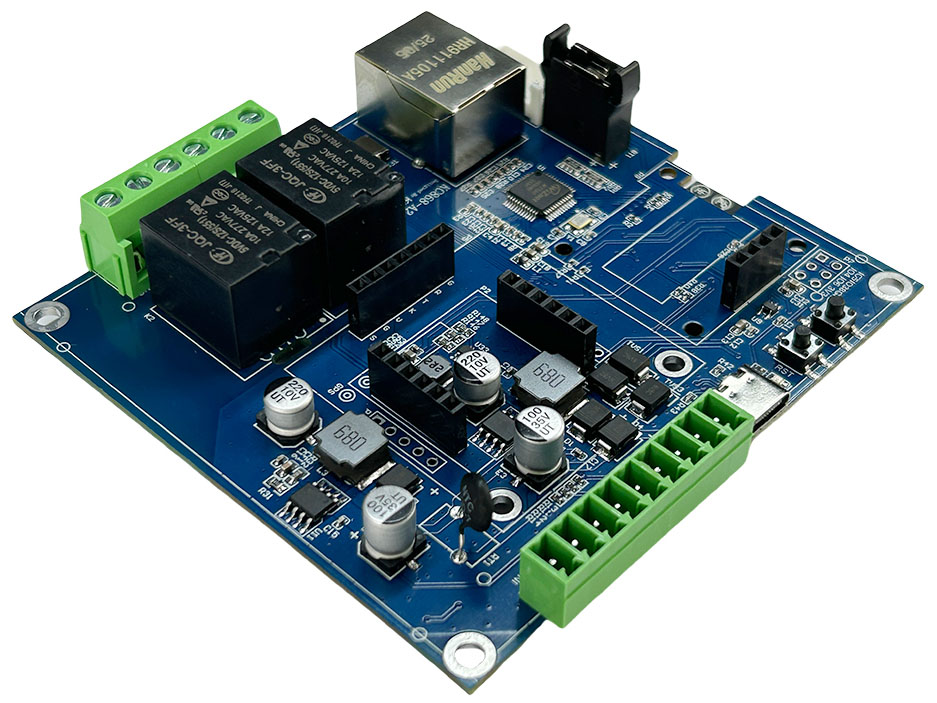
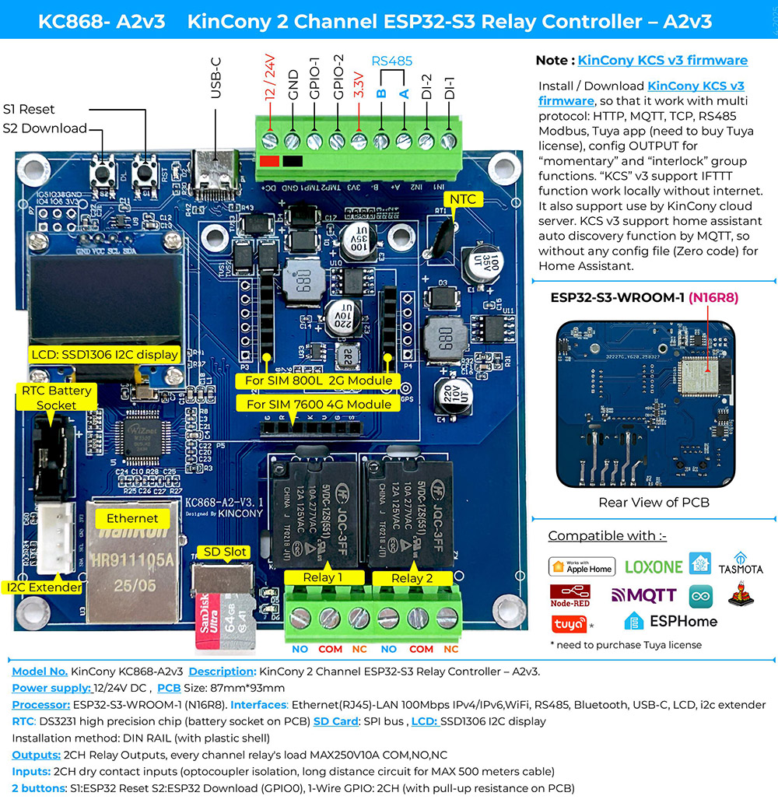

## Resources

- [ESP32 pin define details](https://www.kincony.com/forum/showthread.php?tid=7958)
- [YouTube video tour](https://youtu.be/oFZbByLGK2M)

## ESPHome Configuration

Here is an example YAML configuration for the KinCony KC868-A2v3 board.

```yaml
esphome:
  name: a2v3
  friendly name: a2v3

esp32:
  board: esp32-s3-devkitc-1
  framework:
    type: arduino

# Enable logging
logger:

# Enable Home Assistant API
api:

ethernet:
  type: W5500
  clk_pin: GPIO42
  mosi_pin: GPIO43
  miso_pin: GPIO44
  cs_pin: GPIO41
  interrupt_pin: GPIO2
  reset_pin: GPIO1

i2c:
   - id: bus_a
     sda: 48
     scl: 47
     scan: true
     frequency: 400kHz

uart:
  - id: uart_1
    baud_rate: 9600
    debug:
      direction: BOTH
      dummy_receiver: true
      after:
        timeout: 10ms
    tx_pin: 7
    rx_pin: 15

  - id: uart_sim7600
    baud_rate: 115200
    debug:
      direction: BOTH
      dummy_receiver: true
      after:
        timeout: 10ms
      sequence:
        - lambda: UARTDebug::log_string(direction, bytes);
    tx_pin: 10
    rx_pin: 9

switch:

  - platform: gpio
    pin: 40
    name: "A2v3-Relay1"

  - platform: gpio
    pin: 39
    name: "A2v3-Relay2"

  - platform: uart
    uart_id: uart_1
    name: "RS485 Button"
    data: [0x11, 0x22, 0x33, 0x44, 0x55]

  - platform: uart
    uart_id: uart_sim7600
    name: "UART 4G"
    data: "AT+CGSN\r\n" # read 4G SIM7600 ID

binary_sensor:
  - platform: gpio
    name: "A2v3-input1"
    pin:
      number: 16
      inverted: true

  - platform: gpio
    name: "A2v3-input2"
    pin:
      number: 17
      inverted: true

  - platform: gpio
    name: "IO18"
    pin:
      number: 18
      inverted: true

  - platform: gpio
    name: "IO8"
    pin:
      number: 8
      inverted: true

  - platform: gpio
    name: "IO4"
    pin:
      number: 4
      mode:
        input: true
        pullup: true
      inverted: true

  - platform: gpio
    name: "IO5"
    pin:
      number: 5
      mode:
        input: true
        pullup: true
      inverted: true

  - platform: gpio
    name: "IO6"
    pin:
      number: 6
      mode:
        input: true
        pullup: true
      inverted: true

  - platform: gpio
    name: "IO38"
    pin:
      number: 38
      mode:
        input: true
        pullup: true
      inverted: true

web_server:
  port: 80

font:
  - file: "gfonts://Roboto"
    id: roboto
    size: 20

display:
  - platform: ssd1306_i2c
    i2c_id: bus_a
    model: "SSD1306 128x64"
    address: 0x3C
    lambda: |-
      it.printf(0, 0, id(roboto), "A2v3");
