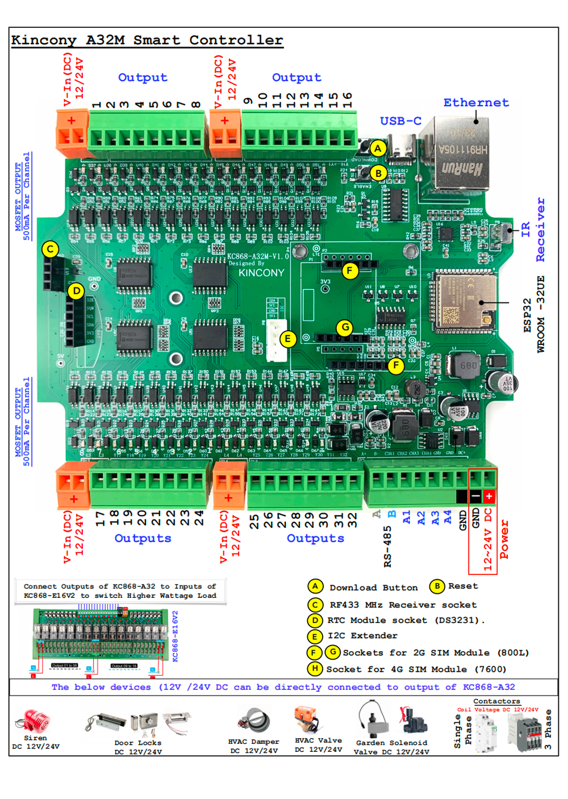

## GPIO Pinout

| Pin    | Function            |
| ------ | ------------------- |
| GPIO34 | ANALOG_A1           |
| GPIO35 | ANALOG_A2           |
| GPIO39 | ANALOG_A3           |
| GPIO36 | ANALOG_A4           |
| GPIO4  | IIC_SDA             |
| GPIO5  | IIC_SCL             |
| GPIO14 | 433MHz Receiver     |
| GPIO16 | IR Receiver         |
| GPIO33 | RS485_RXD           |
| GPIO32 | RS485_TXD           |

[Additional pinout/design details](https://www.kincony.com/32-channel-esp32-mosfet-board.html)

## Basic Configuration

```yaml
# Basic Config
esphome:
  name: KC868-A32M

esp32:
  board: esp32dev

# Enable logging
logger:

# Enable Home Assistant API
api:

# Example configuration entry
i2c:
   - id: bus_a
     sda: 4
     scl: 5
     scan: true

# Example configuration entry
ethernet:
  type: LAN8720
  mdc_pin: GPIO23
  mdio_pin: GPIO18
  clk_mode: GPIO17_OUT
  phy_addr: 0

# Example configuration entry
pcf8574:
  - id: 'pcf8574_hub_out_1'  # for output channel 1-8
    i2c_id: bus_a
    address: 0x23

  - id: 'pcf8574_hub_out_2'  # for output channel 9-16
    i2c_id: bus_a
    address: 0x24

  - id: 'pcf8574_hub_out_3'  # for output channel 17-24
    i2c_id: bus_a
    address: 0x25

  - id: 'pcf8574_hub_out_4'  # for output channel 25-32
    i2c_id: bus_a
    address: 0x26

# Individual outputs
switch:
  - platform: gpio
    name: "a32m-light1"
    pin:
      pcf8574: pcf8574_hub_out_1
      number: 0
      mode: OUTPUT
      inverted: true

  - platform: gpio
    name: "a32m-light2"
    pin:
      pcf8574: pcf8574_hub_out_1
      number: 1
      mode: OUTPUT
      inverted: true

  - platform: gpio
    name: "a32m-light3"
    pin:
      pcf8574: pcf8574_hub_out_1
      number: 2
      mode: OUTPUT
      inverted: true

  - platform: gpio
    name: "a32m-light4"
    pin:
      pcf8574: pcf8574_hub_out_1
      number: 3
      mode: OUTPUT
      inverted: true

  - platform: gpio
    name: "a32m-light5"
    pin:
      pcf8574: pcf8574_hub_out_1
      number: 4
      mode: OUTPUT
      inverted: true

  - platform: gpio
    name: "a32m-light6"
    pin:
      pcf8574: pcf8574_hub_out_1
      number: 5
      mode: OUTPUT
      inverted: true

  - platform: gpio
    name: "a32m-light7"
    pin:
      pcf8574: pcf8574_hub_out_1
      number: 6
      mode: OUTPUT
      inverted: true

  - platform: gpio
    name: "a32m-light8"
    pin:
      pcf8574: pcf8574_hub_out_1
      number: 7
      mode: OUTPUT
      inverted: true

  - platform: gpio
    name: "a32m-light9"
    pin:
      pcf8574: pcf8574_hub_out_2
      number: 0
      mode: OUTPUT
      inverted: true

  - platform: gpio
    name: "a32m-light10"
    pin:
      pcf8574: pcf8574_hub_out_2
      number: 1
      mode: OUTPUT
      inverted: true

  - platform: gpio
    name: "a32m-light11"
    pin:
      pcf8574: pcf8574_hub_out_2
      number: 2
      mode: OUTPUT
      inverted: true

  - platform: gpio
    name: "a32m-light12"
    pin:
      pcf8574: pcf8574_hub_out_2
      number: 3
      mode: OUTPUT
      inverted: true

  - platform: gpio
    name: "a32m-light13"
    pin:
      pcf8574: pcf8574_hub_out_2
      number: 4
      mode: OUTPUT
      inverted: true

  - platform: gpio
    name: "a32m-light14"
    pin:
      pcf8574: pcf8574_hub_out_2
      number: 5
      mode: OUTPUT
      inverted: true

  - platform: gpio
    name: "a32m-light15"
    pin:
      pcf8574: pcf8574_hub_out_2
      number: 6
      mode: OUTPUT
      inverted: true

  - platform: gpio
    name: "a32m-light16"
    pin:
      pcf8574: pcf8574_hub_out_2
      number: 7
      mode: OUTPUT
      inverted: true

  - platform: gpio
    name: "a32m-light17"
    pin:
      pcf8574: pcf8574_hub_out_3
      number: 0
      mode: OUTPUT
      inverted: true

  - platform: gpio
    name: "a32m-light18"
    pin:
      pcf8574: pcf8574_hub_out_3
      number: 1
      mode: OUTPUT
      inverted: true

  - platform: gpio
    name: "a32m-light19"
    pin:
      pcf8574: pcf8574_hub_out_3
      number: 2
      mode: OUTPUT
      inverted: true

  - platform: gpio
    name: "a32m-light20"
    pin:
      pcf8574: pcf8574_hub_out_3
      number: 3
      mode: OUTPUT
      inverted: true

  - platform: gpio
    name: "a32m-light21"
    pin:
      pcf8574: pcf8574_hub_out_3
      number: 4
      mode: OUTPUT
      inverted: true

  - platform: gpio
    name: "a32m-light22"
    pin:
      pcf8574: pcf8574_hub_out_3
      number: 5
      mode: OUTPUT
      inverted: true

  - platform: gpio
    name: "a32m-light23"
    pin:
      pcf8574: pcf8574_hub_out_3
      number: 6
      mode: OUTPUT
      inverted: true

  - platform: gpio
    name: "a32m-light24"
    pin:
      pcf8574: pcf8574_hub_out_3
      number: 7
      mode: OUTPUT
      inverted: true

  - platform: gpio
    name: "a32m-light25"
    pin:
      pcf8574: pcf8574_hub_out_4
      number: 0
      mode: OUTPUT
      inverted: true

  - platform: gpio
    name: "a32m-light26"
    pin:
      pcf8574: pcf8574_hub_out_4
      number: 1
      mode: OUTPUT
      inverted: true

  - platform: gpio
    name: "a32m-light27"
    pin:
      pcf8574: pcf8574_hub_out_4
      number: 2
      mode: OUTPUT
      inverted: true

  - platform: gpio
    name: "a32m-light28"
    pin:
      pcf8574: pcf8574_hub_out_4
      number: 3
      mode: OUTPUT
      inverted: true

  - platform: gpio
    name: "a32m-light29"
    pin:
      pcf8574: pcf8574_hub_out_4
      number: 4
      mode: OUTPUT
      inverted: true

  - platform: gpio
    name: "a32m-light30"
    pin:
      pcf8574: pcf8574_hub_out_4
      number: 5
      mode: OUTPUT
      inverted: true

  - platform: gpio
    name: "a32m-light31"
    pin:
      pcf8574: pcf8574_hub_out_4
      number: 6
      mode: OUTPUT
      inverted: true

  - platform: gpio
    name: "a32m-light32"
    pin:
      pcf8574: pcf8574_hub_out_4
      number: 7
      mode: OUTPUT
      inverted: true

# Example configuration entry
sensor:
  - platform: adc
    pin: 34
    name: "a32m-analog-1"
    update_interval: 10s
    attenuation: 12db

  - platform: adc
    pin: 35
    name: "a32m-analog-2"
    update_interval: 10s
    attenuation: 12db

  - platform: adc
    pin: 39
    name: "a32m-analog-3"
    update_interval: 10s
    attenuation: 12db

  - platform: adc
    pin: 36
    name: "a32m-analog-4"
    update_interval: 10s
    attenuation: 12db
```
