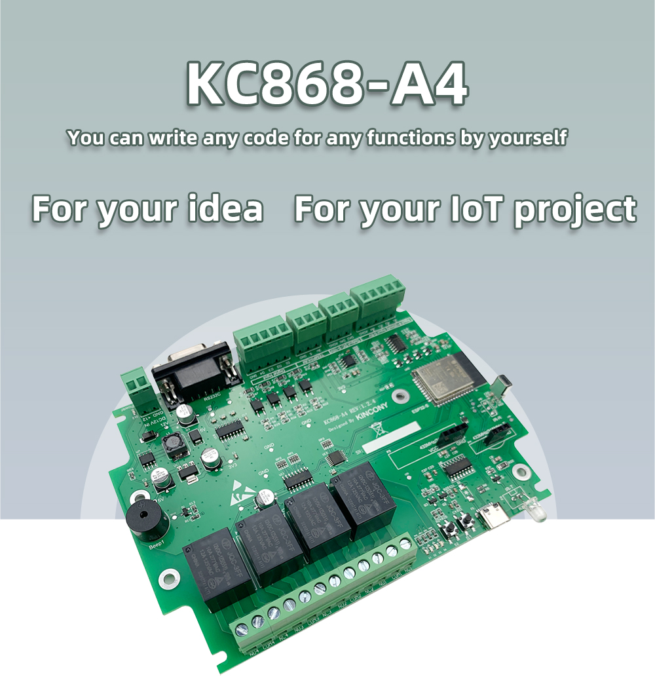

## GPIO Pinout

| Pin    | Function            |
| ------ | ------------------  |
| GPIO2  | Relay1              |
| GPIO15 | Relay2              |
| GPIO5  | Relay3              |
| GPIO4  | Relay4              |
| GPIO2  | digital input1      |
| GPIO15 | digital input2      |
| GPIO5  | digital input3      |
| GPIO4  | digital input4      |
| GPIO32 | analog  input1      |
| GPIO33 | analog  input2      |
| GPIO34 | analog  input3      |
| GPIO35 | analog  input4      |
| GPIO25 | analog  output1     |
| GPIO26 | analog  output2     |
| GPIO13 | 1-Wire GPIO         |
| GPIO18 | beep                |
| GPIO16 | RS232_RXD           |
| GPIO17 | RS232_TXD           |
| GPIO21 | 433MHz Transmitter  |
| GPIO19 | 433MHz Receiver     |
| GPIO23 | IR Receiver         |
| GPIO22 | IR Transmitter      |
| GPIO0  | PCB Button          |

[Additional pinout/design details](https://www.kincony.com/arduino-esp32-4-channel-relay-module.html)

## Basic Configuration

```yaml
# Basic Config
esphome:
  name: kc868-a4

esp32:
  board: esp32dev

# Enable logging
logger:

# Enable Home Assistant API
api:

ota:
  password: "4d5a388de4f759bf88e71cde7a31af6f"

wifi:
  ssid: "KinCony"
  password: "a12345678"

  # Enable fallback hotspot (captive portal) in case wifi connection fails
  ap:
    ssid: "Kc868-A4 Fallback Hotspot"
    password: "QOU4hbAjJ5Wb"

captive_portal:

switch:
  - platform: gpio
    name: "light1"
    pin: 2
    inverted: false

  - platform: gpio
    name: "light2"
    pin: 15
    inverted: false

  - platform: gpio
    name: "light3"
    pin: 5
    inverted: false

  - platform: gpio
    name: "light4"
    pin: 4
    inverted: false

binary_sensor:
  - platform: gpio
    name: "input1"
    pin:
      number: 36
      inverted: true

  - platform: gpio
    name: "input2"
    pin:
      number: 39
      inverted: true

  - platform: gpio
    name: "input3"
    pin:
      number: 27
      inverted: true

  - platform: gpio
    name: "input4"
    pin:
      number: 14
      inverted: true
```
