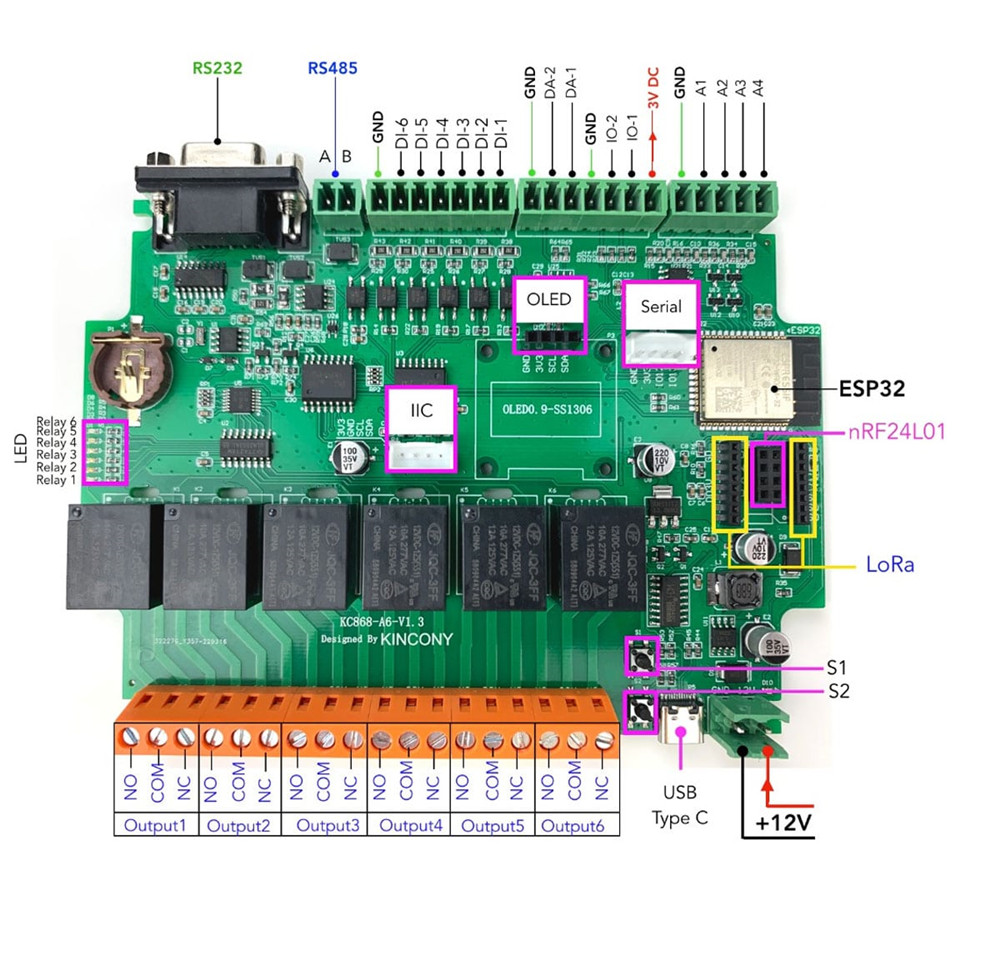

## GPIO Pinout

| Pin    | Function           |
| ------ | ------------------ |
| GPIO32 | 1-Wire GPIO IO-1   |
| GPIO33 | 1-Wire GPIO IO-2   |
| GPIO4  | I2C SDA            |
| GPIO15 | I2C SCL            |
| GPIO14 | RS485 RX           |
| GPIO27 | RS485 TX           |
| GPIO17 | RS232 RX           |
| GPIO16 | RS232 TX           |
| GPIO5  | SPI CS             |
| GPIO23 | SPI MOSI           |
| GPIO19 | SPI MISO           |
| GPIO18 | SPI CSK            |
| GPIO21 | LORA RST           |
| GPIO2  | LORA DIO0          |
| GPIO26 | Analog output DA1  |
| GPIO25 | Analog output DA2  |
| GPIO36 | Analog input A1    |
| GPIO39 | Analog input A2    |
| GPIO34 | Analog input A3    |
| GPIO35 | Analog input A4    |

[Additional pinout/design details](https://www.kincony.com/esp32-6-channel-relay-module-kc868-a6.html)

## Installation

Connect the board with a USB-C cable to your commputer. While pressing the `S2` switch, attach the external power supply (12V) to the board. Erase flash and then flash the board with the usual ESPHome installation methods.

## Basic Configuration

```yaml
# Basic Config
esphome:
  name: kc868-a6

esp32:
  board: esp32dev
  framework:
    type: esp-idf

wifi:
  ssid: !secret wifi_ssid
  password: !secret wifi_password

logger:

api:
  encryption:
    key: !secret encryption_key

ota:
  - platform: esphome
    password: !secret ota_password

uart:
  - id: rs485
    tx_pin: GPIO27
    rx_pin: GPIO14
    baud_rate: 9600
  - id: rs232
    tx_pin: GPIO17
    rx_pin: GPIO16
    baud_rate: 9600

spi:
  clk_pin: GPIO18
  mosi_pin: GPIO23
  miso_pin: GPIO19
  # cs pin: GPIO5

i2c:
  sda: GPIO4
  scl:
    number: GPIO15
    ignore_strapping_warning: true

pcf8574:
  - id: inputs
    address: 0x22
  - id: outputs
    address: 0x24

time:
  - platform: ds1307
    id: rtc_time

binary_sensor:
  - platform: gpio
    name: "KC868-A6-IN-1"
    pin:
      pcf8574: inputs
      number: 0
      mode: INPUT
      inverted: true
  - platform: gpio
    name: "KC868-A6-IN-2"
    pin:
      pcf8574: inputs
      number: 1
      mode: INPUT
      inverted: true
  - platform: gpio
    name: "KC868-A6-IN-3"
    pin:
      pcf8574: inputs
      number: 2
      mode: INPUT
      inverted: true
  - platform: gpio
    name: "KC868-A6-IN-4"
    pin:
      pcf8574: inputs
      number: 3
      mode: INPUT
      inverted: true
  - platform: gpio
    name: "KC868-A6-IN-5"
    pin:
      pcf8574: inputs
      number: 4
      mode: INPUT
      inverted: true
  - platform: gpio
    name: "KC868-A6-IN-6"
    pin:
      pcf8574: inputs
      number: 5
      mode: INPUT
      inverted: true

switch:
  - platform: gpio
    name: "KC868-A6-RELAY-1"
    id: relay_1
    pin:
      pcf8574: outputs
      number: 0
      mode: OUTPUT
      inverted: true
  - platform: gpio
    name: "KC868-A6-RELAY-2"
    id: relay_2
    pin:
      pcf8574: outputs
      number: 1
      mode: OUTPUT
      inverted: true
  - platform: gpio
    name: "KC868-A6-RELAY-3"
    id: relay_3
    pin:
      pcf8574: outputs
      number: 2
      mode: OUTPUT
      inverted: true
  - platform: gpio
    name: "KC868-A6-RELAY-4"
    id: relay_4
    pin:
      pcf8574: outputs
      number: 3
      mode: OUTPUT
      inverted: true
  - platform: gpio
    name: "KC868-A6-RELAY-5"
    id: relay_5
    pin:
      pcf8574: outputs
      number: 4
      mode: OUTPUT
      inverted: true
  - platform: gpio
    name: "KC868-A6-RELAY-6"
    id: relay_6
    pin:
      pcf8574: outputs
      number: 5
      mode: OUTPUT
      inverted: true
```
