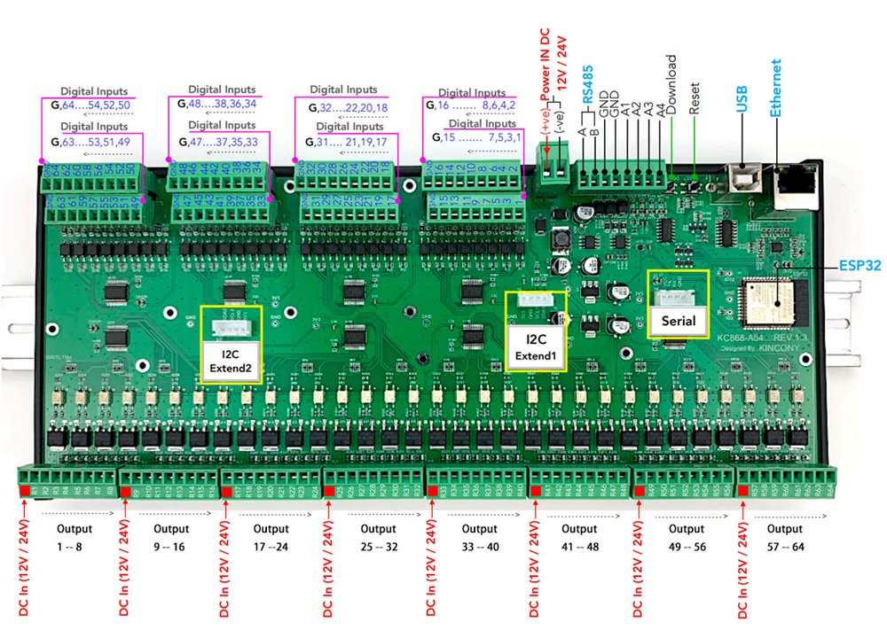

## GPIO Pinout

| Pin    | Function            |
| ------ | ------------------- |
| GPIO39 | ANALOG_A1           |
| GPIO34 | ANALOG_A2           |
| GPIO36 | ANALOG_A3           |
| GPIO35 | ANALOG_A4           |
| GPIO5  | IIC_Bus_1_SDA       |
| GPIO16 | IIC_Bus_1_SCL       |
| GPIO15 | IIC_Bus_2_SDA       |
| GPIO4  | IIC_Bus_2_SCL       |
| GPIO13 | RS485_RXD           |
| GPIO14 | RS485_TXD           |
| GPIO32 | Extend_Serial_RXD   |
| GPIO33 | Extend_Serial_TXD   |

[Additional pinout/design details](https://www.kincony.com/arduino-esp32-64-channel-relay-module-kc868-a64.html)

## Basic Configuration

```yaml
# Basic Config
esphome:
  name: KC868-A64

esp32:
  board: esp32dev

# Enable logging
logger:

# Enable Home Assistant API
api:

 # Example configuration entry
i2c:
   - id: bus_a
     sda: 5
     scl: 16
     scan: true
     frequency: 400kHz
   - id: bus_b
     sda: 15
     scl: 4
     scan: true
     frequency: 400kHz

# Example configuration entry
ethernet:
  type: LAN8720
  mdc_pin: GPIO23
  mdio_pin: GPIO18
  clk_mode: GPIO17_OUT
  phy_addr: 0

# Example configuration entry
pcf8574:
  - id: 'pcf8574_hub_out_1'  # for output channel 1-16
    i2c_id: bus_a
    address: 0x24
    pcf8575: true

  - id: 'pcf8574_hub_out_2'  # for output channel 17-32
    i2c_id: bus_a
    address: 0x25
    pcf8575: true

  - id: 'pcf8574_hub_out_3'  # for output channel 33-48
    i2c_id: bus_a
    address: 0x21
    pcf8575: true

  - id: 'pcf8574_hub_out_4'  # for output channel 49-64
    i2c_id: bus_a
    address: 0x22
    pcf8575: true

  - id: 'pcf8574_hub_in_1'  # for a64--input channel 1-16
    i2c_id: bus_b
    address: 0x24
    pcf8575: true

  - id: 'pcf8574_hub_in_2'  # for a64--input channel 17-32
    i2c_id: bus_b
    address: 0x25
    pcf8575: true

  - id: 'pcf8574_hub_in_3'  # for a64--input channel 33-48
    i2c_id: bus_b
    address: 0x21
    pcf8575: true

  - id: 'pcf8574_hub_in_4'  # for a64--input channel 49-64
    i2c_id: bus_b
    address: 0x22
    pcf8575: true

# Individual outputs
switch:
  - platform: gpio
    name: "a64--light1"
    pin:
      pcf8574: pcf8574_hub_out_1
      number: 0
      mode: OUTPUT
      inverted: true

  - platform: gpio
    name: "a64--light2"
    pin:
      pcf8574: pcf8574_hub_out_1
      number: 1
      mode: OUTPUT
      inverted: true

  - platform: gpio
    name: "a64--light3"
    pin:
      pcf8574: pcf8574_hub_out_1
      number: 2
      mode: OUTPUT
      inverted: true

  - platform: gpio
    name: "a64--light4"
    pin:
      pcf8574: pcf8574_hub_out_1
      number: 3
      mode: OUTPUT
      inverted: true

  - platform: gpio
    name: "a64--light5"
    pin:
      pcf8574: pcf8574_hub_out_1
      number: 4
      mode: OUTPUT
      inverted: true

  - platform: gpio
    name: "a64--light6"
    pin:
      pcf8574: pcf8574_hub_out_1
      number: 5
      mode: OUTPUT
      inverted: true

  - platform: gpio
    name: "a64--light7"
    pin:
      pcf8574: pcf8574_hub_out_1
      number: 6
      mode: OUTPUT
      inverted: true

  - platform: gpio
    name: "a64--light8"
    pin:
      pcf8574: pcf8574_hub_out_1
      number: 7
      mode: OUTPUT
      inverted: true

  - platform: gpio
    name: "a64--light9"
    pin:
      pcf8574: pcf8574_hub_out_1
      number: 8
      mode: OUTPUT
      inverted: true

  - platform: gpio
    name: "a64--light10"
    pin:
      pcf8574: pcf8574_hub_out_1
      number: 9
      mode: OUTPUT
      inverted: true

  - platform: gpio
    name: "a64--light11"
    pin:
      pcf8574: pcf8574_hub_out_1
      number: 10
      mode: OUTPUT
      inverted: true

  - platform: gpio
    name: "a64--light12"
    pin:
      pcf8574: pcf8574_hub_out_1
      number: 11
      mode: OUTPUT
      inverted: true

  - platform: gpio
    name: "a64--light13"
    pin:
      pcf8574: pcf8574_hub_out_1
      number: 12
      mode: OUTPUT
      inverted: true

  - platform: gpio
    name: "a64--light14"
    pin:
      pcf8574: pcf8574_hub_out_1
      number: 13
      mode: OUTPUT
      inverted: true

  - platform: gpio
    name: "a64--light15"
    pin:
      pcf8574: pcf8574_hub_out_1
      number: 14
      mode: OUTPUT
      inverted: true

  - platform: gpio
    name: "a64--light16"
    pin:
      pcf8574: pcf8574_hub_out_1
      number: 15
      mode: OUTPUT
      inverted: true

  - platform: gpio
    name: "a64--light17"
    pin:
      pcf8574: pcf8574_hub_out_2
      number: 0
      mode: OUTPUT
      inverted: true

  - platform: gpio
    name: "a64--light18"
    pin:
      pcf8574: pcf8574_hub_out_2
      number: 1
      mode: OUTPUT
      inverted: true

  - platform: gpio
    name: "a64--light19"
    pin:
      pcf8574: pcf8574_hub_out_2
      number: 2
      mode: OUTPUT
      inverted: true

  - platform: gpio
    name: "a64--light20"
    pin:
      pcf8574: pcf8574_hub_out_2
      number: 3
      mode: OUTPUT
      inverted: true

  - platform: gpio
    name: "a64--light21"
    pin:
      pcf8574: pcf8574_hub_out_2
      number: 4
      mode: OUTPUT
      inverted: true

  - platform: gpio
    name: "a64--light22"
    pin:
      pcf8574: pcf8574_hub_out_2
      number: 5
      mode: OUTPUT
      inverted: true

  - platform: gpio
    name: "a64--light23"
    pin:
      pcf8574: pcf8574_hub_out_2
      number: 6
      mode: OUTPUT
      inverted: true

  - platform: gpio
    name: "a64--light24"
    pin:
      pcf8574: pcf8574_hub_out_2
      number: 7
      mode: OUTPUT
      inverted: true

  - platform: gpio
    name: "a64--light25"
    pin:
      pcf8574: pcf8574_hub_out_2
      number: 8
      mode: OUTPUT
      inverted: true

  - platform: gpio
    name: "a64--light26"
    pin:
      pcf8574: pcf8574_hub_out_2
      number: 9
      mode: OUTPUT
      inverted: true

  - platform: gpio
    name: "a64--light27"
    pin:
      pcf8574: pcf8574_hub_out_2
      number: 10
      mode: OUTPUT
      inverted: true

  - platform: gpio
    name: "a64--light28"
    pin:
      pcf8574: pcf8574_hub_out_2
      number: 11
      mode: OUTPUT
      inverted: true

  - platform: gpio
    name: "a64--light29"
    pin:
      pcf8574: pcf8574_hub_out_2
      number: 12
      mode: OUTPUT
      inverted: true

  - platform: gpio
    name: "a64--light30"
    pin:
      pcf8574: pcf8574_hub_out_2
      number: 13
      mode: OUTPUT
      inverted: true

  - platform: gpio
    name: "a64--light31"
    pin:
      pcf8574: pcf8574_hub_out_2
      number: 14
      mode: OUTPUT
      inverted: true

  - platform: gpio
    name: "a64--light32"
    pin:
      pcf8574: pcf8574_hub_out_2
      number: 15
      mode: OUTPUT
      inverted: true

  - platform: gpio
    name: "a64--light33"
    pin:
      pcf8574: pcf8574_hub_out_3
      number: 0
      mode: OUTPUT
      inverted: true

  - platform: gpio
    name: "a64--light34"
    pin:
      pcf8574: pcf8574_hub_out_3
      number: 1
      mode: OUTPUT
      inverted: true

  - platform: gpio
    name: "a64--light35"
    pin:
      pcf8574: pcf8574_hub_out_3
      number: 2
      mode: OUTPUT
      inverted: true

  - platform: gpio
    name: "a64--light36"
    pin:
      pcf8574: pcf8574_hub_out_3
      number: 3
      mode: OUTPUT
      inverted: true

  - platform: gpio
    name: "a64--light37"
    pin:
      pcf8574: pcf8574_hub_out_3
      number: 4
      mode: OUTPUT
      inverted: true

  - platform: gpio
    name: "a64--light38"
    pin:
      pcf8574: pcf8574_hub_out_3
      number: 5
      mode: OUTPUT
      inverted: true

  - platform: gpio
    name: "a64--light39"
    pin:
      pcf8574: pcf8574_hub_out_3
      number: 6
      mode: OUTPUT
      inverted: true

  - platform: gpio
    name: "a64--light40"
    pin:
      pcf8574: pcf8574_hub_out_3
      number: 7
      mode: OUTPUT
      inverted: true

  - platform: gpio
    name: "a64--light41"
    pin:
      pcf8574: pcf8574_hub_out_3
      number: 8
      mode: OUTPUT
      inverted: true

  - platform: gpio
    name: "a64--light42"
    pin:
      pcf8574: pcf8574_hub_out_3
      number: 9
      mode: OUTPUT
      inverted: true

  - platform: gpio
    name: "a64--light43"
    pin:
      pcf8574: pcf8574_hub_out_3
      number: 10
      mode: OUTPUT
      inverted: true

  - platform: gpio
    name: "a64--light44"
    pin:
      pcf8574: pcf8574_hub_out_3
      number: 11
      mode: OUTPUT
      inverted: true

  - platform: gpio
    name: "a64--light45"
    pin:
      pcf8574: pcf8574_hub_out_3
      number: 12
      mode: OUTPUT
      inverted: true

  - platform: gpio
    name: "a64--light46"
    pin:
      pcf8574: pcf8574_hub_out_3
      number: 13
      mode: OUTPUT
      inverted: true

  - platform: gpio
    name: "a64--light47"
    pin:
      pcf8574: pcf8574_hub_out_3
      number: 14
      mode: OUTPUT
      inverted: true

  - platform: gpio
    name: "a64--light48"
    pin:
      pcf8574: pcf8574_hub_out_3
      number: 15
      mode: OUTPUT
      inverted: true

  - platform: gpio
    name: "a64--light49"
    pin:
      pcf8574: pcf8574_hub_out_4
      number: 0
      mode: OUTPUT
      inverted: true

  - platform: gpio
    name: "a64--light50"
    pin:
      pcf8574: pcf8574_hub_out_4
      number: 1
      mode: OUTPUT
      inverted: true

  - platform: gpio
    name: "a64--light51"
    pin:
      pcf8574: pcf8574_hub_out_4
      number: 2
      mode: OUTPUT
      inverted: true

  - platform: gpio
    name: "a64--light52"
    pin:
      pcf8574: pcf8574_hub_out_4
      number: 3
      mode: OUTPUT
      inverted: true

  - platform: gpio
    name: "a64--light53"
    pin:
      pcf8574: pcf8574_hub_out_4
      number: 4
      mode: OUTPUT
      inverted: true

  - platform: gpio
    name: "a64--light54"
    pin:
      pcf8574: pcf8574_hub_out_4
      number: 5
      mode: OUTPUT
      inverted: true

  - platform: gpio
    name: "a64--light55"
    pin:
      pcf8574: pcf8574_hub_out_4
      number: 6
      mode: OUTPUT
      inverted: true

  - platform: gpio
    name: "a64--light56"
    pin:
      pcf8574: pcf8574_hub_out_4
      number: 7
      mode: OUTPUT
      inverted: true

  - platform: gpio
    name: "a64--light57"
    pin:
      pcf8574: pcf8574_hub_out_4
      number: 8
      mode: OUTPUT
      inverted: true

  - platform: gpio
    name: "a64--light58"
    pin:
      pcf8574: pcf8574_hub_out_4
      number: 9
      mode: OUTPUT
      inverted: true

  - platform: gpio
    name: "a64--light59"
    pin:
      pcf8574: pcf8574_hub_out_4
      number: 10
      mode: OUTPUT
      inverted: true

  - platform: gpio
    name: "a64--light60"
    pin:
      pcf8574: pcf8574_hub_out_4
      number: 11
      mode: OUTPUT
      inverted: true

  - platform: gpio
    name: "a64--light61"
    pin:
      pcf8574: pcf8574_hub_out_4
      number: 12
      mode: OUTPUT
      inverted: true

  - platform: gpio
    name: "a64--light62"
    pin:
      pcf8574: pcf8574_hub_out_4
      number: 13
      mode: OUTPUT
      inverted: true

  - platform: gpio
    name: "a64--light63"
    pin:
      pcf8574: pcf8574_hub_out_4
      number: 14
      mode: OUTPUT
      inverted: true

  - platform: gpio
    name: "a64--light64"
    pin:
      pcf8574: pcf8574_hub_out_4
      number: 15
      mode: OUTPUT
      inverted: true

# Individual inputs
binary_sensor:
  - platform: gpio
    name: "a64--input1"
    pin:
      pcf8574: pcf8574_hub_in_1
      number: 0
      mode: INPUT
      inverted: true

  - platform: gpio
    name: "a64--input2"
    pin:
      pcf8574: pcf8574_hub_in_1
      number: 1
      mode: INPUT
      inverted: true

  - platform: gpio
    name: "a64--input3"
    pin:
      pcf8574: pcf8574_hub_in_1
      number: 2
      mode: INPUT
      inverted: true

  - platform: gpio
    name: "a64--input4"
    pin:
      pcf8574: pcf8574_hub_in_1
      number: 3
      mode: INPUT
      inverted: true

  - platform: gpio
    name: "a64--input5"
    pin:
      pcf8574: pcf8574_hub_in_1
      number: 4
      mode: INPUT
      inverted: true

  - platform: gpio
    name: "a64--input6"
    pin:
      pcf8574: pcf8574_hub_in_1
      number: 5
      mode: INPUT
      inverted: true

  - platform: gpio
    name: "a64--input7"
    pin:
      pcf8574: pcf8574_hub_in_1
      number: 6
      mode: INPUT
      inverted: true

  - platform: gpio
    name: "a64--input8"
    pin:
      pcf8574: pcf8574_hub_in_1
      number: 7
      mode: INPUT
      inverted: true

  - platform: gpio
    name: "a64--input9"
    pin:
      pcf8574: pcf8574_hub_in_1
      number: 8
      mode: INPUT
      inverted: true

  - platform: gpio
    name: "a64--input10"
    pin:
      pcf8574: pcf8574_hub_in_1
      number: 9
      mode: INPUT
      inverted: true

  - platform: gpio
    name: "a64--input11"
    pin:
      pcf8574: pcf8574_hub_in_1
      number: 10
      mode: INPUT
      inverted: true

  - platform: gpio
    name: "a64--input12"
    pin:
      pcf8574: pcf8574_hub_in_1
      number: 11
      mode: INPUT
      inverted: true

  - platform: gpio
    name: "a64--input13"
    pin:
      pcf8574: pcf8574_hub_in_1
      number: 12
      mode: INPUT
      inverted: true

  - platform: gpio
    name: "a64--input14"
    pin:
      pcf8574: pcf8574_hub_in_1
      number: 13
      mode: INPUT
      inverted: true

  - platform: gpio
    name: "a64--input15"
    pin:
      pcf8574: pcf8574_hub_in_1
      number: 14
      mode: INPUT
      inverted: true

  - platform: gpio
    name: "a64--input16"
    pin:
      pcf8574: pcf8574_hub_in_1
      number: 15
      mode: INPUT
      inverted: true

  - platform: gpio
    name: "a64--input17"
    pin:
      pcf8574: pcf8574_hub_in_2
      number: 0
      mode: INPUT
      inverted: true

  - platform: gpio
    name: "a64--input18"
    pin:
      pcf8574: pcf8574_hub_in_2
      number: 1
      mode: INPUT
      inverted: true

  - platform: gpio
    name: "a64--input19"
    pin:
      pcf8574: pcf8574_hub_in_2
      number: 2
      mode: INPUT
      inverted: true

  - platform: gpio
    name: "a64--input20"
    pin:
      pcf8574: pcf8574_hub_in_2
      number: 3
      mode: INPUT
      inverted: true

  - platform: gpio
    name: "a64--input21"
    pin:
      pcf8574: pcf8574_hub_in_2
      number: 4
      mode: INPUT
      inverted: true

  - platform: gpio
    name: "a64--input22"
    pin:
      pcf8574: pcf8574_hub_in_2
      number: 5
      mode: INPUT
      inverted: true

  - platform: gpio
    name: "a64--input23"
    pin:
      pcf8574: pcf8574_hub_in_2
      number: 6
      mode: INPUT
      inverted: true

  - platform: gpio
    name: "a64--input24"
    pin:
      pcf8574: pcf8574_hub_in_2
      number: 7
      mode: INPUT
      inverted: true

  - platform: gpio
    name: "a64--input25"
    pin:
      pcf8574: pcf8574_hub_in_2
      number: 8
      mode: INPUT
      inverted: true

  - platform: gpio
    name: "a64--input26"
    pin:
      pcf8574: pcf8574_hub_in_2
      number: 9
      mode: INPUT
      inverted: true

  - platform: gpio
    name: "a64--input27"
    pin:
      pcf8574: pcf8574_hub_in_2
      number: 10
      mode: INPUT
      inverted: true

  - platform: gpio
    name: "a64--input28"
    pin:
      pcf8574: pcf8574_hub_in_2
      number: 11
      mode: INPUT
      inverted: true

  - platform: gpio
    name: "a64--input29"
    pin:
      pcf8574: pcf8574_hub_in_2
      number: 12
      mode: INPUT
      inverted: true

  - platform: gpio
    name: "a64--input30"
    pin:
      pcf8574: pcf8574_hub_in_2
      number: 13
      mode: INPUT
      inverted: true

  - platform: gpio
    name: "a64--input31"
    pin:
      pcf8574: pcf8574_hub_in_2
      number: 14
      mode: INPUT
      inverted: true

  - platform: gpio
    name: "a64--input32"
    pin:
      pcf8574: pcf8574_hub_in_2
      number: 15
      mode: INPUT
      inverted: true

  - platform: gpio
    name: "a64--input33"
    pin:
      pcf8574: pcf8574_hub_in_3
      number: 0
      mode: INPUT
      inverted: true

  - platform: gpio
    name: "a64--input34"
    pin:
      pcf8574: pcf8574_hub_in_3
      number: 1
      mode: INPUT
      inverted: true

  - platform: gpio
    name: "a64--input35"
    pin:
      pcf8574: pcf8574_hub_in_3
      number: 2
      mode: INPUT
      inverted: true

  - platform: gpio
    name: "a64--input36"
    pin:
      pcf8574: pcf8574_hub_in_3
      number: 3
      mode: INPUT
      inverted: true

  - platform: gpio
    name: "a64--input37"
    pin:
      pcf8574: pcf8574_hub_in_3
      number: 4
      mode: INPUT
      inverted: true

  - platform: gpio
    name: "a64--input38"
    pin:
      pcf8574: pcf8574_hub_in_3
      number: 5
      mode: INPUT
      inverted: true

  - platform: gpio
    name: "a64--input39"
    pin:
      pcf8574: pcf8574_hub_in_3
      number: 6
      mode: INPUT
      inverted: true

  - platform: gpio
    name: "a64--input40"
    pin:
      pcf8574: pcf8574_hub_in_3
      number: 7
      mode: INPUT
      inverted: true

  - platform: gpio
    name: "a64--input41"
    pin:
      pcf8574: pcf8574_hub_in_3
      number: 8
      mode: INPUT
      inverted: true

  - platform: gpio
    name: "a64--input42"
    pin:
      pcf8574: pcf8574_hub_in_3
      number: 9
      mode: INPUT
      inverted: true

  - platform: gpio
    name: "a64--input43"
    pin:
      pcf8574: pcf8574_hub_in_3
      number: 10
      mode: INPUT
      inverted: true

  - platform: gpio
    name: "a64--input44"
    pin:
      pcf8574: pcf8574_hub_in_3
      number: 11
      mode: INPUT
      inverted: true

  - platform: gpio
    name: "a64--input45"
    pin:
      pcf8574: pcf8574_hub_in_3
      number: 12
      mode: INPUT
      inverted: true

  - platform: gpio
    name: "a64--input46"
    pin:
      pcf8574: pcf8574_hub_in_3
      number: 13
      mode: INPUT
      inverted: true

  - platform: gpio
    name: "a64--input47"
    pin:
      pcf8574: pcf8574_hub_in_3
      number: 14
      mode: INPUT
      inverted: true

  - platform: gpio
    name: "a64--input48"
    pin:
      pcf8574: pcf8574_hub_in_3
      number: 15
      mode: INPUT
      inverted: true

  - platform: gpio
    name: "a64--input49"
    pin:
      pcf8574: pcf8574_hub_in_4
      number: 0
      mode: INPUT
      inverted: true

  - platform: gpio
    name: "a64--input50"
    pin:
      pcf8574: pcf8574_hub_in_4
      number: 1
      mode: INPUT
      inverted: true

  - platform: gpio
    name: "a64--input51"
    pin:
      pcf8574: pcf8574_hub_in_4
      number: 2
      mode: INPUT
      inverted: true

  - platform: gpio
    name: "a64--input52"
    pin:
      pcf8574: pcf8574_hub_in_4
      number: 3
      mode: INPUT
      inverted: true

  - platform: gpio
    name: "a64--input53"
    pin:
      pcf8574: pcf8574_hub_in_4
      number: 4
      mode: INPUT
      inverted: true

  - platform: gpio
    name: "a64--input54"
    pin:
      pcf8574: pcf8574_hub_in_4
      number: 5
      mode: INPUT
      inverted: true

  - platform: gpio
    name: "a64--input55"
    pin:
      pcf8574: pcf8574_hub_in_4
      number: 6
      mode: INPUT
      inverted: true

  - platform: gpio
    name: "a64--input56"
    pin:
      pcf8574: pcf8574_hub_in_4
      number: 7
      mode: INPUT
      inverted: true

  - platform: gpio
    name: "a64--input57"
    pin:
      pcf8574: pcf8574_hub_in_4
      number: 8
      mode: INPUT
      inverted: true

  - platform: gpio
    name: "a64--input58"
    pin:
      pcf8574: pcf8574_hub_in_4
      number: 9
      mode: INPUT
      inverted: true

  - platform: gpio
    name: "a64--input59"
    pin:
      pcf8574: pcf8574_hub_in_4
      number: 10
      mode: INPUT
      inverted: true

  - platform: gpio
    name: "a64--input60"
    pin:
      pcf8574: pcf8574_hub_in_4
      number: 11
      mode: INPUT
      inverted: true

  - platform: gpio
    name: "a64--input61"
    pin:
      pcf8574: pcf8574_hub_in_4
      number: 12
      mode: INPUT
      inverted: true

  - platform: gpio
    name: "a64--input62"
    pin:
      pcf8574: pcf8574_hub_in_4
      number: 13
      mode: INPUT
      inverted: true

  - platform: gpio
    name: "a64--input63"
    pin:
      pcf8574: pcf8574_hub_in_4
      number: 14
      mode: INPUT
      inverted: true

  - platform: gpio
    name: "a64--input64"
    pin:
      pcf8574: pcf8574_hub_in_4
      number: 15
      mode: INPUT
      inverted: true

# Example configuration entry
sensor:
  - platform: adc
    pin: 39
    name: "a64--analog--1"
    update_interval: 20s
    attenuation: 12db

  - platform: adc
    pin: 34
    name: "a64--analog--2"
    update_interval: 20s
    attenuation: 12db

  - platform: adc
    pin: 36
    name: "a64--analog--3"
    update_interval: 20s
    attenuation: 12db

  - platform: adc
    pin: 35
    name: "a64--analog--4"
    update_interval: 20s
    attenuation: 12db
```
