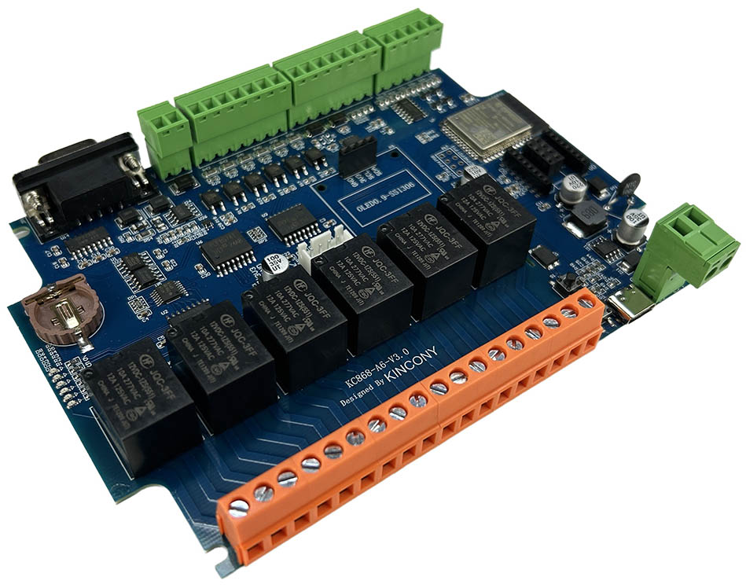
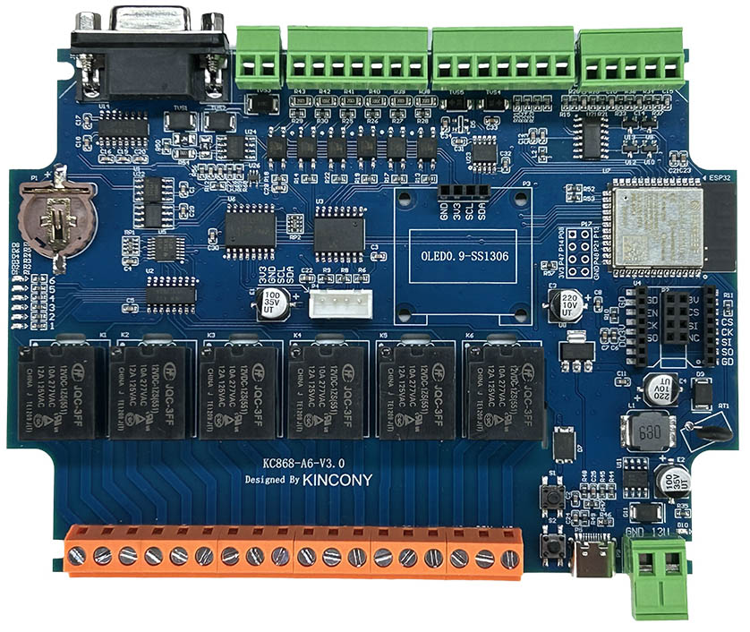
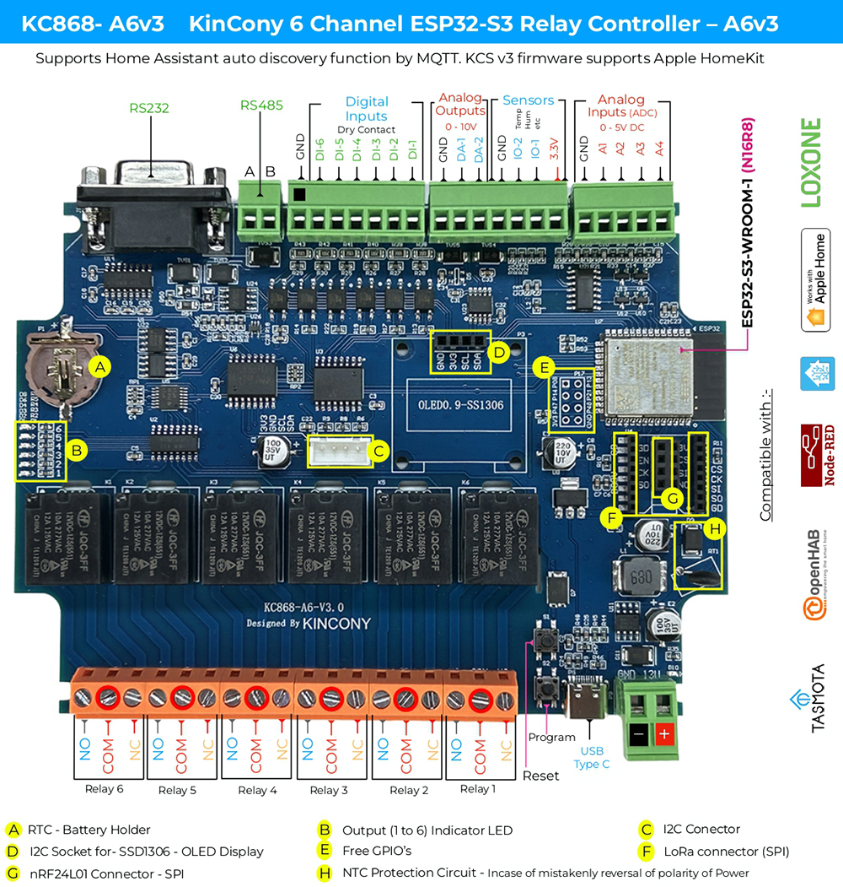

## Resources

- [ESP32 pin define details](https://www.kincony.com/forum/showthread.php?tid=7622)
- [YouTube video tour](https://youtu.be/1lCZ4HQrQFU)

## ESPHome Configuration

Here is an example YAML configuration for the KinCony KC868-A6v3 relay board.

```yaml
esphome:
  name: a6v3
  friendly_name: a6v3

esp32:
  board: esp32-s3-devkitc-1
  framework:
    type: arduino

# Enable logging
logger:

# Enable Home Assistant API
api:

wifi:
  ssid: !secret wifi_ssid
  password: !secret wifi_password

captive_portal:

i2c:
  sda: 12
  scl: 11
  scan: true
  id: bus_a

pcf8574:
  - id: 'pcf8574_hub_out_1'  # for output channel 1-8
    address: 0x24

  - id: 'pcf8574_hub_in_1'  # for input channel 1-8
    address: 0x22

uart:
  - id: uart_1    #RS485
    baud_rate: 9600
    debug:
      direction: BOTH
      dummy_receiver: true
      after:
        timeout: 10ms
    tx_pin: 17
    rx_pin: 18

  - id: uart_2    #RS232
    baud_rate: 9600
    debug:
      direction: BOTH
      dummy_receiver: true
      after:
        timeout: 10ms
    tx_pin: 9
    rx_pin: 10

switch:
  - platform: gpio
    name: "A6v3-output1"
    id: a6v3_output1
    pin:
      pcf8574: pcf8574_hub_out_1
      number: 0
      mode: OUTPUT
      inverted: true

  - platform: gpio
    name: "A6v3-output2"
    id: a6v3_output2
    pin:
      pcf8574: pcf8574_hub_out_1
      number: 1
      mode: OUTPUT
      inverted: true

  - platform: gpio
    name: "A6v3-output3"
    id: a6v3_output3
    pin:
      pcf8574: pcf8574_hub_out_1
      number: 2
      mode: OUTPUT
      inverted: true

  - platform: gpio
    name: "A6v3-output4"
    id: a6v3_output4
    pin:
      pcf8574: pcf8574_hub_out_1
      number: 3
      mode: OUTPUT
      inverted: true

  - platform: gpio
    name: "A6v3-output5"
    id: a6v3_output5
    pin:
      pcf8574: pcf8574_hub_out_1
      number: 4
      mode: OUTPUT
      inverted: true

  - platform: gpio
    name: "A6v3-output6"
    id: a6v3_output6
    pin:
      pcf8574: pcf8574_hub_out_1
      number: 5
      mode: OUTPUT
      inverted: true

  - platform: uart
    uart_id: uart_1
    name: "RS485 Button"
    data: [0x11, 0x22, 0x33, 0x44, 0x55]

  - platform: uart
    uart_id: uart_2
    name: "RS232 Button"
    data: [0x55, 0x66, 0x77, 0x88, 0x99]

binary_sensor:
  - platform: gpio
    name: "A6v3-input1"
    pin:
      pcf8574: pcf8574_hub_in_1
      number: 0
      mode: INPUT
      inverted: true

  - platform: gpio
    name: "A6v3-input2"
    pin:
      pcf8574: pcf8574_hub_in_1
      number: 1
      mode: INPUT
      inverted: true

  - platform: gpio
    name: "A6v3-input3"
    pin:
      pcf8574: pcf8574_hub_in_1
      number: 2
      mode: INPUT
      inverted: true

  - platform: gpio
    name: "A6v3-input4"
    pin:
      pcf8574: pcf8574_hub_in_1
      number: 3
      mode: INPUT
      inverted: true

  - platform: gpio
    name: "A6v3-input5"
    pin:
      pcf8574: pcf8574_hub_in_1
      number: 4
      mode: INPUT
      inverted: true

  - platform: gpio
    name: "A6v3-input6"
    pin:
      pcf8574: pcf8574_hub_in_1
      number: 5
      mode: INPUT
      inverted: true


##pull-up resistance on PCB
  - platform: gpio
    name: "A6v3-W1-io15"
    pin:
      number: 15
      inverted: true

  - platform: gpio
    name: "A6v3-W1-io16"
    pin:
      number: 16
      inverted: true

  - platform: gpio
    name: "A6v3-W1-DW"
    pin:
      number: 0
      inverted: true


sensor:
  - platform: adc
    pin: 4
    name: "A6v3 A1 Voltage"
    update_interval: 5s
    attenuation: 11db
    filters:
      - lambda:
          if (x >= 3.11) {
            return x * 1.60256;
          } else if (x <= 0.15) {
            return 0;
          } else {
            return x * 1.51;
          }
  - platform: adc
    pin: 5
    name: "A6v3 A2 Voltage"
    update_interval: 5s
    attenuation: 11db
    filters:
      # - multiply: 1.51515
      - lambda:
          if (x >= 3.11) {
            return x * 1.60256;
          } else if (x <= 0.15) {
            return 0;
          } else {
            return x * 1.51;
          }
  - platform: adc
    pin: 6
    name: "A6v3 A3 Current"
    update_interval: 5s
    unit_of_measurement: mA
    attenuation: 11db
    filters:
      - multiply: 6.66666666
  - platform: adc
    pin: 7
    name: "A6v3 A4 Current"
    update_interval: 5s
    unit_of_measurement: mA
    attenuation: 11db
    filters:
      - multiply: 6.66666666

font:
  - file: "gfonts://Roboto"
    id: roboto
    size: 20

display:
  - platform: ssd1306_i2c
    i2c_id: bus_a
    model: "SSD1306 128x64"
    address: 0x3C
    lambda: |-
      it.printf(0, 0, id(roboto), "KinCony A6v3");

gp8403:
  id: my_gp8403
  voltage: 10V

output:
  - platform: gp8403
    id: gp8403_output_1
    gp8403_id: my_gp8403
    channel: 0
  - platform: gp8403
    id: gp8403_output_2
    gp8403_id: my_gp8403
    channel: 1

light:
  - platform: monochromatic
    name: "A6v3-DAC-1"
    output: gp8403_output_1

  - platform: monochromatic
    name: "A6v3-DAC-2"
    output: gp8403_output_2

web_server:
  port: 80
