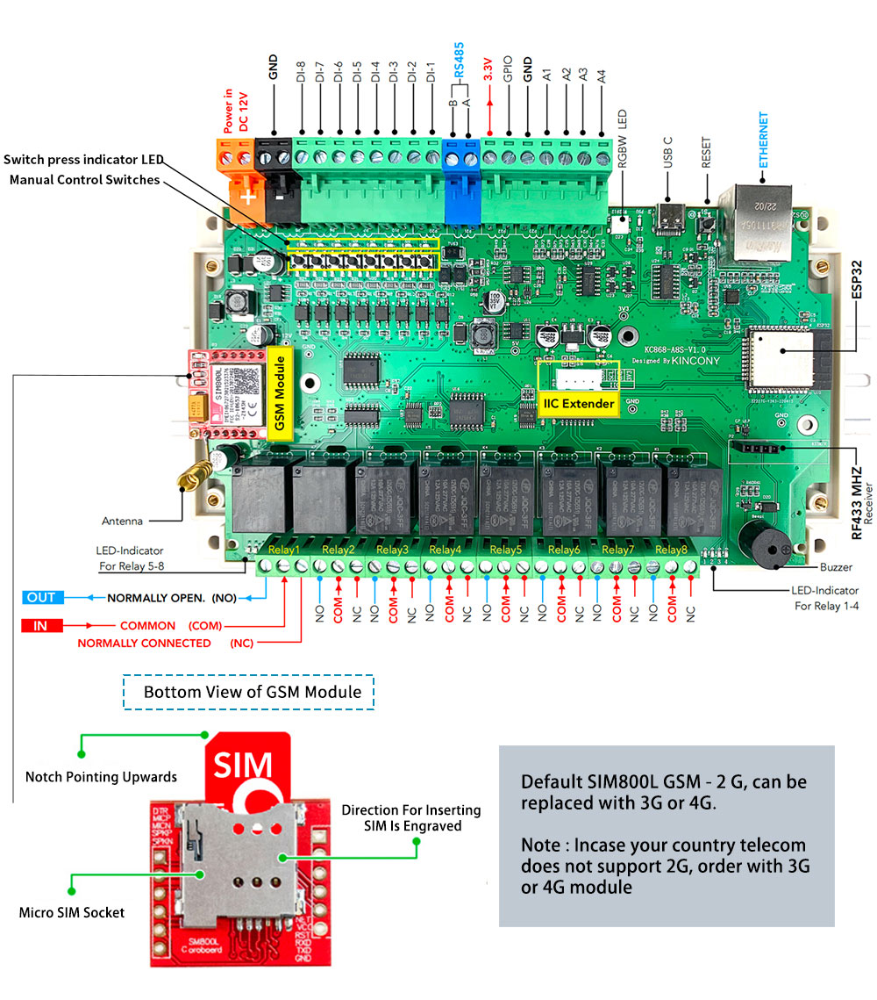

## GPIO Pinout

| Pin    | Function            |
| ------ | ------------------- |
| GPIO36 | ANALOG_A1           |
| GPIO39 | ANALOG_A2           |
| GPIO34 | ANALOG_A3           |
| GPIO35 | ANALOG_A4           |
| GPIO4  | IIC_SDA             |
| GPIO5  | IIC_SCL             |
| GPIO14 | 1-Wire GPIO         |
| GPIO16 | 433MHz Receiver     |
| GPIO32 | RS485_RXD           |
| GPIO33 | RS485_TXD           |
| GPIO13 | GSM_RXD             |
| GPIO15 | GSM_TXD             |
| GPIO2  | Buzzer              |
| GPIO12 | WS2812B LED         |

[Additional pinout/design details](https://www.kincony.com/gsm-relay-esp32-board.html)

## Basic Configuration

```yaml
# Basic Config
esphome:
  name: KC868-A8S

esp32:
  board: esp32dev

remote_receiver:
  pin: 16
  dump:
    - rc_switch
  tolerance: 50%
  filter: 250us
  idle: 2ms
  buffer_size: 2kb

# Example configuration entry for ESP32
i2c:
  sda: 4
  scl: 5
  scan: true
  id: bus_a

# Example configuration entry
ethernet:
  type: LAN8720
  mdc_pin: GPIO23
  mdio_pin: GPIO18
  clk_mode: GPIO17_OUT
  phy_addr: 0

# Example configuration entry
pcf8574:
  - id: 'pcf8574_hub_out_1'  # for output channel 1-8
    address: 0x24

  - id: 'pcf8574_hub_in_1'  # for input channel 1-8
    address: 0x22

# Individual outputs
switch:
  - platform: gpio
    name: "light1"
    id: light1
    pin:
      pcf8574: pcf8574_hub_out_1
      number: 0
      mode: OUTPUT
      inverted: true

  - platform: gpio
    name: "light2"
    id: light2
    pin:
      pcf8574: pcf8574_hub_out_1
      number: 1
      mode: OUTPUT
      inverted: true

  - platform: gpio
    name: "light3"
    id: light3
    pin:
      pcf8574: pcf8574_hub_out_1
      number: 2
      mode: OUTPUT
      inverted: true

  - platform: gpio
    name: "light4"
    id: light4
    pin:
      pcf8574: pcf8574_hub_out_1
      number: 3
      mode: OUTPUT
      inverted: true

  - platform: gpio
    name: "curtain1-up"
    id: relay5
    interlock: [relay6]
    pin:
      pcf8574: pcf8574_hub_out_1
      number: 4
      mode: OUTPUT
      inverted: true

  - platform: gpio
    name: "curtain1-down"
    id: relay6
    interlock: [relay5]
    pin:
      pcf8574: pcf8574_hub_out_1
      number: 5
      mode: OUTPUT
      inverted: true

  - platform: gpio
    name: "curtain2-up"
    id: relay7
    interlock: [relay8]
    pin:
      pcf8574: pcf8574_hub_out_1
      number: 6
      mode: OUTPUT
      inverted: true

  - platform: gpio
    name: "curtain2-down"
    id: relay8
    interlock: [relay7]
    pin:
      pcf8574: pcf8574_hub_out_1
      number: 7
      mode: OUTPUT
      inverted: true

binary_sensor:
  - platform: gpio
    name: "input1"
    on_press:
      then:
        - switch.toggle: light1
    pin:
      pcf8574: pcf8574_hub_in_1
      number: 0
      mode: INPUT
      inverted: true

  - platform: gpio
    name: "input2"
    on_press:
      then:
        - switch.toggle: light2
    pin:
      pcf8574: pcf8574_hub_in_1
      number: 1
      mode: INPUT
      inverted: true

  - platform: gpio
    name: "input3"
    on_press:
      then:
        - switch.toggle: light3
    pin:
      pcf8574: pcf8574_hub_in_1
      number: 2
      mode: INPUT
      inverted: true

  - platform: gpio
    name: "input4"
    on_press:
      then:
        - switch.toggle: light4
    pin:
      pcf8574: pcf8574_hub_in_1
      number: 3
      mode: INPUT
      inverted: true

  - platform: gpio
    name: "input5"
    on_press:
      then:
        - switch.toggle: relay5
    pin:
      pcf8574: pcf8574_hub_in_1
      number: 4
      mode: INPUT
      inverted: true

  - platform: gpio
    name: "input6"
    on_press:
      then:
        - switch.toggle: relay6
    pin:
      pcf8574: pcf8574_hub_in_1
      number: 5
      mode: INPUT
      inverted: true

  - platform: gpio
    name: "input7"
    on_press:
      then:
        - switch.toggle: relay7
    pin:
      pcf8574: pcf8574_hub_in_1
      number: 6
      mode: INPUT
      inverted: true

  - platform: gpio
    name: "input8"
    on_press:
      then:
        - switch.toggle: relay8
    pin:
      pcf8574: pcf8574_hub_in_1
      number: 7
      mode: INPUT
      inverted: true

  - platform: remote_receiver
    name: "remoter1"
    rc_switch_raw:
      code: '001111010111001010111000'
      protocol: 1
    on_press:
      then:
        - switch.toggle: light1
    filters:
      - delayed_off: 200ms

  - platform: remote_receiver
    name: "remoter2"
    rc_switch_raw:
      code: '001111010111001010111100'
      protocol: 1
    on_press:
      then:
        - switch.toggle: light2
    filters:
      - delayed_off: 200ms

  - platform: remote_receiver
    name: "remoter3"
    rc_switch_raw:
      code: '001111010111001010110100'
      protocol: 1
    on_press:
      then:
        - switch.toggle: light3
    filters:
      - delayed_off: 200ms

  - platform: remote_receiver
    name: "remoter4"
    rc_switch_raw:
      code: '001111010111001010111001'
      protocol: 1
    on_press:
      then:
        - switch.toggle: light4
    filters:
      - delayed_off: 200ms  

  - platform: remote_receiver
    name: "remoter5"
    rc_switch_raw:
      code: '001111010111001010110010'
      protocol: 1
    on_press:
      then:
        - switch.toggle: relay5
    filters:
      - delayed_off: 200ms

  - platform: remote_receiver
    name: "remoter6"
    rc_switch_raw:
      code: '001111010111001010110101'
      protocol: 1
    on_press:
      then:
        - switch.toggle: relay6
    filters:
      - delayed_off: 200ms

  - platform: remote_receiver
    name: "remoter7"
    rc_switch_raw:
      code: '001111010111001010110001'
      protocol: 1
    on_press:
      then:
        - switch.toggle: relay7
    filters:
      - delayed_off: 200ms

  - platform: remote_receiver
    name: "remoter8"
    rc_switch_raw:
      code: '001111010111001010110011'
      protocol: 1
    on_press:
      then:
        - switch.toggle: relay8
    filters:
      - delayed_off: 200ms

  - platform: gpio
    name: "PIR1"
    pin: 14
    device_class: motion
    on_release:
       - script.execute: motion_timer

script:
  - id: motion_timer
    mode: restart
    then:
      - delay: 10s
      - switch.turn_off: light1
      - switch.turn_off: light2
      - switch.turn_off: light3
      - switch.turn_off: light4

# Enable logging
logger:

# Enable Home Assistant API
api:
```
