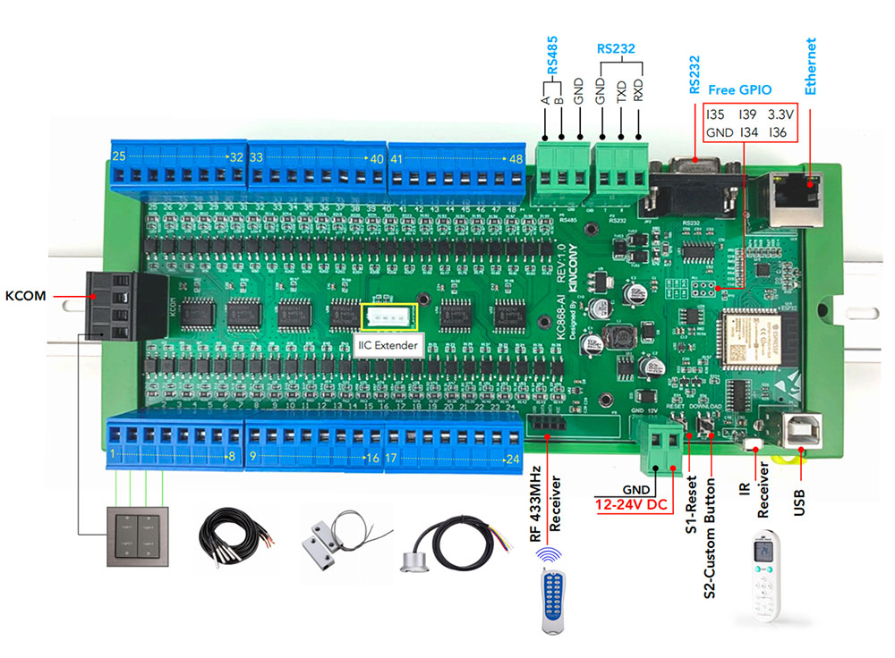

## GPIO Pinout

| Pin    | Function            |
| ------ | ------------------- |
| GPIO36 | Free GPIO           |
| GPIO39 | Free GPIO           |
| GPIO34 | Free GPIO           |
| GPIO35 | Free GPIO           |
| GPIO4  | IIC_SDA             |
| GPIO5  | IIC_SCL             |
| GPIO15 | IR Receiver         |
| GPIO13 | 433MHz Receiver     |
| GPIO16 | RS485_RXD           |
| GPIO14 | RS485_TXD           |
| GPIO33 | RS232_RXD           |
| GPIO32 | RS232_TXD           |

[Additional pinout/design details](https://www.kincony.com/esp32-input-module.html)

## Basic Configuration

```yaml
# Basic Config
esphome:
  name: KC868-AI

esp32:
  board: esp32dev

# Example configuration entry for ESP32
i2c:
  sda: 4
  scl: 5
  scan: true
  id: bus_a

# Example configuration entry
ethernet:
  type: LAN8720
  mdc_pin: GPIO23
  mdio_pin: GPIO18
  clk_mode: GPIO17_OUT
  phy_addr: 0

# Example configuration entry
pcf8574:
  - id: 'pcf8574_hub_in_1'  # for input channel 1-8
    address: 0x24

  - id: 'pcf8574_hub_in_2'  # for input channel 9-16
    address: 0x25

  - id: 'pcf8574_hub_in_3'  # for input channel 17-24
    address: 0x21

  - id: 'pcf8574_hub_in_4'  # for input channel 25-32
    address: 0x22

  - id: 'pcf8574_hub_in_5'  # for input channel 33-40
    address: 0x26

  - id: 'pcf8574_hub_in_6'  # for input channel 41-48
    address: 0x23

# Individual outputs

binary_sensor:
  - platform: gpio
    name: "ai-input1"
    pin:
      pcf8574: pcf8574_hub_in_1
      number: 0
      mode: INPUT
      inverted: true

  - platform: gpio
    name: "ai-input2"
    pin:
      pcf8574: pcf8574_hub_in_1
      number: 1
      mode: INPUT
      inverted: true

  - platform: gpio
    name: "ai-input3"
    pin:
      pcf8574: pcf8574_hub_in_1
      number: 2
      mode: INPUT
      inverted: true

  - platform: gpio
    name: "ai-input4"
    pin:
      pcf8574: pcf8574_hub_in_1
      number: 3
      mode: INPUT
      inverted: true

  - platform: gpio
    name: "ai-input5"
    pin:
      pcf8574: pcf8574_hub_in_1
      number: 4
      mode: INPUT
      inverted: true

  - platform: gpio
    name: "ai-input6"
    pin:
      pcf8574: pcf8574_hub_in_1
      number: 5
      mode: INPUT
      inverted: true

  - platform: gpio
    name: "ai-input7"
    pin:
      pcf8574: pcf8574_hub_in_1
      number: 6
      mode: INPUT
      inverted: true

  - platform: gpio
    name: "ai-input8"
    pin:
      pcf8574: pcf8574_hub_in_1
      number: 7
      mode: INPUT
      inverted: true

  - platform: gpio
    name: "ai-input9"
    pin:
      pcf8574: pcf8574_hub_in_2
      number: 0
      mode: INPUT
      inverted: true

  - platform: gpio
    name: "ai-input10"
    pin:
      pcf8574: pcf8574_hub_in_2
      number: 1
      mode: INPUT
      inverted: true

  - platform: gpio
    name: "ai-input11"
    pin:
      pcf8574: pcf8574_hub_in_2
      number: 2
      mode: INPUT
      inverted: true

  - platform: gpio
    name: "ai-input12"
    pin:
      pcf8574: pcf8574_hub_in_2
      number: 3
      mode: INPUT
      inverted: true

  - platform: gpio
    name: "ai-input13"
    pin:
      pcf8574: pcf8574_hub_in_2
      number: 4
      mode: INPUT
      inverted: true

  - platform: gpio
    name: "ai-input14"
    pin:
      pcf8574: pcf8574_hub_in_2
      number: 5
      mode: INPUT
      inverted: true

  - platform: gpio
    name: "ai-input15"
    pin:
      pcf8574: pcf8574_hub_in_2
      number: 6
      mode: INPUT
      inverted: true

  - platform: gpio
    name: "ai-input16"
    pin:
      pcf8574: pcf8574_hub_in_2
      number: 7
      mode: INPUT
      inverted: true

  - platform: gpio
    name: "ai-input17"
    pin:
      pcf8574: pcf8574_hub_in_3
      number: 0
      mode: INPUT
      inverted: true

  - platform: gpio
    name: "ai-input18"
    pin:
      pcf8574: pcf8574_hub_in_3
      number: 1
      mode: INPUT
      inverted: true

  - platform: gpio
    name: "ai-input19"
    pin:
      pcf8574: pcf8574_hub_in_3
      number: 2
      mode: INPUT
      inverted: true

  - platform: gpio
    name: "ai-input20"
    pin:
      pcf8574: pcf8574_hub_in_3
      number: 3
      mode: INPUT
      inverted: true

  - platform: gpio
    name: "ai-input21"
    pin:
      pcf8574: pcf8574_hub_in_3
      number: 4
      mode: INPUT
      inverted: true

  - platform: gpio
    name: "ai-input22"
    pin:
      pcf8574: pcf8574_hub_in_3
      number: 5
      mode: INPUT
      inverted: true

  - platform: gpio
    name: "ai-input23"
    pin:
      pcf8574: pcf8574_hub_in_3
      number: 6
      mode: INPUT
      inverted: true

  - platform: gpio
    name: "ai-input24"
    pin:
      pcf8574: pcf8574_hub_in_3
      number: 7
      mode: INPUT
      inverted: true

  - platform: gpio
    name: "ai-input25"
    pin:
      pcf8574: pcf8574_hub_in_4
      number: 0
      mode: INPUT
      inverted: true

  - platform: gpio
    name: "ai-input26"
    pin:
      pcf8574: pcf8574_hub_in_4
      number: 1
      mode: INPUT
      inverted: true

  - platform: gpio
    name: "ai-input27"
    pin:
      pcf8574: pcf8574_hub_in_4
      number: 2
      mode: INPUT
      inverted: true

  - platform: gpio
    name: "ai-input28"
    pin:
      pcf8574: pcf8574_hub_in_4
      number: 3
      mode: INPUT
      inverted: true

  - platform: gpio
    name: "ai-input29"
    pin:
      pcf8574: pcf8574_hub_in_4
      number: 4
      mode: INPUT
      inverted: true

  - platform: gpio
    name: "ai-input30"
    pin:
      pcf8574: pcf8574_hub_in_4
      number: 5
      mode: INPUT
      inverted: true

  - platform: gpio
    name: "ai-input31"
    pin:
      pcf8574: pcf8574_hub_in_4
      number: 6
      mode: INPUT
      inverted: true

  - platform: gpio
    name: "ai-input32"
    pin:
      pcf8574: pcf8574_hub_in_4
      number: 7
      mode: INPUT
      inverted: true

  - platform: gpio
    name: "ai-input33"
    pin:
      pcf8574: pcf8574_hub_in_5
      number: 0
      mode: INPUT
      inverted: true

  - platform: gpio
    name: "ai-input34"
    pin:
      pcf8574: pcf8574_hub_in_5
      number: 1
      mode: INPUT
      inverted: true

  - platform: gpio
    name: "ai-input35"
    pin:
      pcf8574: pcf8574_hub_in_5
      number: 2
      mode: INPUT
      inverted: true

  - platform: gpio
    name: "ai-input36"
    pin:
      pcf8574: pcf8574_hub_in_5
      number: 3
      mode: INPUT
      inverted: true

  - platform: gpio
    name: "ai-input37"
    pin:
      pcf8574: pcf8574_hub_in_5
      number: 4
      mode: INPUT
      inverted: true

  - platform: gpio
    name: "ai-input38"
    pin:
      pcf8574: pcf8574_hub_in_5
      number: 5
      mode: INPUT
      inverted: true

  - platform: gpio
    name: "ai-input39"
    pin:
      pcf8574: pcf8574_hub_in_5
      number: 6
      mode: INPUT
      inverted: true

  - platform: gpio
    name: "ai-input40"
    pin:
      pcf8574: pcf8574_hub_in_5
      number: 7
      mode: INPUT
      inverted: true

  - platform: gpio
    name: "ai-input41"
    pin:
      pcf8574: pcf8574_hub_in_6
      number: 0
      mode: INPUT
      inverted: true

  - platform: gpio
    name: "ai-input42"
    pin:
      pcf8574: pcf8574_hub_in_6
      number: 1
      mode: INPUT
      inverted: true

  - platform: gpio
    name: "ai-input43"
    pin:
      pcf8574: pcf8574_hub_in_6
      number: 2
      mode: INPUT
      inverted: true

  - platform: gpio
    name: "ai-input44"
    pin:
      pcf8574: pcf8574_hub_in_6
      number: 3
      mode: INPUT
      inverted: true

  - platform: gpio
    name: "ai-input45"
    pin:
      pcf8574: pcf8574_hub_in_6
      number: 4
      mode: INPUT
      inverted: true

  - platform: gpio
    name: "ai-input46"
    pin:
      pcf8574: pcf8574_hub_in_6
      number: 5
      mode: INPUT
      inverted: true

  - platform: gpio
    name: "ai-input47"
    pin:
      pcf8574: pcf8574_hub_in_6
      number: 6
      mode: INPUT
      inverted: true

  - platform: gpio
    name: "ai-input48"
    pin:
      pcf8574: pcf8574_hub_in_6
      number: 7
      mode: INPUT
      inverted: true

# Enable logging
logger:

# Enable Home Assistant API
api:
```
