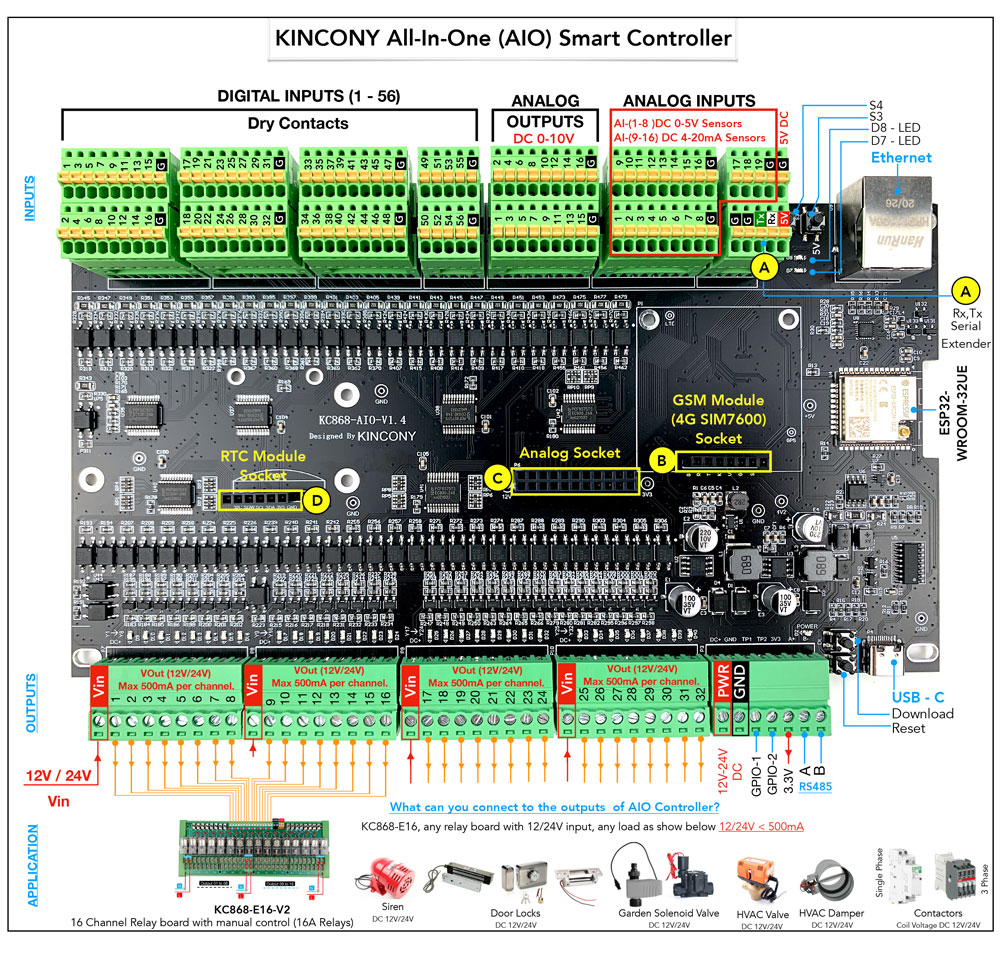

## GPIO Pinout

| Pin    | Function            |
| ------ | ------------------- |
| GPIO36 | ANALOG_A1           |
| GPIO39 | ANALOG_A17          |
| GPIO34 | ANALOG_A18          |
| GPIO35 | ANALOG_A19          |
| GPIO4  | IIC_SDA             |
| GPIO16 | IIC_SCL             |
| GPIO14 | 1-Wire GPIO         |
| GPIO5  | 1-Wire GPIO         |
| GPIO32 | RS485_RXD           |
| GPIO33 | RS485_TXD           |
| GPIO13 | GSM_RXD             |
| GPIO15 | GSM_TXD             |

[Additional pinout/design details](https://www.kincony.com/esp32-all-in-one-board-home-assistant.html)

## Basic Configuration

```yaml
# Basic Config
esphome:
  name: KC868-AIO

esp32:
  board: esp32dev
  framework:
    type: arduino

# Enable logging
logger:

# Enable Home Assistant API
api:
  encryption:
    key: "D69bY/GXlmjYkovak6WIhgmbOH8vwyqvMxIHBriYoaY="

ota:
  password: "9984b688b9646975bfd1b760a9c2df8b"

# Example configuration entry
ethernet:
  type: LAN8720
  mdc_pin: GPIO23
  mdio_pin: GPIO18
  clk_mode: GPIO17_OUT
  phy_addr: 0

i2c:
   - id: bus_a
     sda: 4
     scl: 16
     scan: true

# Example configuration entry
pcf8574:
  - id: 'pcf8574_hub_out_1'  # for output channel 1-16
    i2c_id: bus_a
    address: 0x24
    pcf8575: true

  - id: 'pcf8574_hub_out_2'  # for output channel 17-32
    i2c_id: bus_a
    address: 0x25
    pcf8575: true

  - id: 'pcf8574_hub_out_in_3'  # for output channel 33-38  + (input 49-58)
    i2c_id: bus_a
    address: 0x26
    pcf8575: true

  - id: 'pcf8574_hub_in_1'  # for input channel 1-16
    i2c_id: bus_a
    address: 0x21
    pcf8575: true

  - id: 'pcf8574_hub_in_2'  # for input channel 17-32
    i2c_id: bus_a
    address: 0x22
    pcf8575: true

  - id: 'pcf8574_hub_in_3'  # for input channel 33-48
    i2c_id: bus_a
    address: 0x23
    pcf8575: true

# Individual outputs
switch:
  - platform: gpio
    name: "aio--light1"
    pin:
      pcf8574: pcf8574_hub_out_1
      number: 0
      mode: OUTPUT
      inverted: true

  - platform: gpio
    name: "aio--light2"
    pin:
      pcf8574: pcf8574_hub_out_1
      number: 1
      mode: OUTPUT
      inverted: true

  - platform: gpio
    name: "aio--light3"
    pin:
      pcf8574: pcf8574_hub_out_1
      number: 2
      mode: OUTPUT
      inverted: true

  - platform: gpio
    name: "aio--light4"
    pin:
      pcf8574: pcf8574_hub_out_1
      number: 3
      mode: OUTPUT
      inverted: true

  - platform: gpio
    name: "aio--light5"
    pin:
      pcf8574: pcf8574_hub_out_1
      number: 4
      mode: OUTPUT
      inverted: true

  - platform: gpio
    name: "aio--light6"
    pin:
      pcf8574: pcf8574_hub_out_1
      number: 5
      mode: OUTPUT
      inverted: true

  - platform: gpio
    name: "aio--light7"
    pin:
      pcf8574: pcf8574_hub_out_1
      number: 6
      mode: OUTPUT
      inverted: true

  - platform: gpio
    name: "aio--light8"
    pin:
      pcf8574: pcf8574_hub_out_1
      number: 7
      mode: OUTPUT
      inverted: true

  - platform: gpio
    name: "aio--light9"
    pin:
      pcf8574: pcf8574_hub_out_1
      number: 8
      mode: OUTPUT
      inverted: true

  - platform: gpio
    name: "aio--light10"
    pin:
      pcf8574: pcf8574_hub_out_1
      number: 9
      mode: OUTPUT
      inverted: true

  - platform: gpio
    name: "aio--light11"
    pin:
      pcf8574: pcf8574_hub_out_1
      number: 10
      mode: OUTPUT
      inverted: true

  - platform: gpio
    name: "aio--light12"
    pin:
      pcf8574: pcf8574_hub_out_1
      number: 11
      mode: OUTPUT
      inverted: true

  - platform: gpio
    name: "aio--light13"
    pin:
      pcf8574: pcf8574_hub_out_1
      number: 12
      mode: OUTPUT
      inverted: true

  - platform: gpio
    name: "aio--light14"
    pin:
      pcf8574: pcf8574_hub_out_1
      number: 13
      mode: OUTPUT
      inverted: true

  - platform: gpio
    name: "aio--light15"
    pin:
      pcf8574: pcf8574_hub_out_1
      number: 14
      mode: OUTPUT
      inverted: true

  - platform: gpio
    name: "aio--light16"
    pin:
      pcf8574: pcf8574_hub_out_1
      number: 15
      mode: OUTPUT
      inverted: true

  - platform: gpio
    name: "aio--light17"
    pin:
      pcf8574: pcf8574_hub_out_2
      number: 0
      mode: OUTPUT
      inverted: true

  - platform: gpio
    name: "aio--light18"
    pin:
      pcf8574: pcf8574_hub_out_2
      number: 1
      mode: OUTPUT
      inverted: true

  - platform: gpio
    name: "aio--light19"
    pin:
      pcf8574: pcf8574_hub_out_2
      number: 2
      mode: OUTPUT
      inverted: true

  - platform: gpio
    name: "aio--light20"
    pin:
      pcf8574: pcf8574_hub_out_2
      number: 3
      mode: OUTPUT
      inverted: true

  - platform: gpio
    name: "aio--light21"
    pin:
      pcf8574: pcf8574_hub_out_2
      number: 4
      mode: OUTPUT
      inverted: true

  - platform: gpio
    name: "aio--light22"
    pin:
      pcf8574: pcf8574_hub_out_2
      number: 5
      mode: OUTPUT
      inverted: true

  - platform: gpio
    name: "aio--light23"
    pin:
      pcf8574: pcf8574_hub_out_2
      number: 6
      mode: OUTPUT
      inverted: true

  - platform: gpio
    name: "aio--light24"
    pin:
      pcf8574: pcf8574_hub_out_2
      number: 7
      mode: OUTPUT
      inverted: true

  - platform: gpio
    name: "aio--light25"
    pin:
      pcf8574: pcf8574_hub_out_2
      number: 8
      mode: OUTPUT
      inverted: true

  - platform: gpio
    name: "aio--light26"
    pin:
      pcf8574: pcf8574_hub_out_2
      number: 9
      mode: OUTPUT
      inverted: true

  - platform: gpio
    name: "aio--light27"
    pin:
      pcf8574: pcf8574_hub_out_2
      number: 10
      mode: OUTPUT
      inverted: true

  - platform: gpio
    name: "aio--light28"
    pin:
      pcf8574: pcf8574_hub_out_2
      number: 11
      mode: OUTPUT
      inverted: true

  - platform: gpio
    name: "aio--light29"
    pin:
      pcf8574: pcf8574_hub_out_2
      number: 12
      mode: OUTPUT
      inverted: true

  - platform: gpio
    name: "aio--light30"
    pin:
      pcf8574: pcf8574_hub_out_2
      number: 13
      mode: OUTPUT
      inverted: true

  - platform: gpio
    name: "aio--light31"
    pin:
      pcf8574: pcf8574_hub_out_2
      number: 14
      mode: OUTPUT
      inverted: true

  - platform: gpio
    name: "aio--light32"
    pin:
      pcf8574: pcf8574_hub_out_2
      number: 15
      mode: OUTPUT
      inverted: true

  - platform: gpio
    name: "aio--led-D7"
    pin:
      pcf8574: pcf8574_hub_out_in_3
      number: 12
      mode: OUTPUT
      inverted: true

  - platform: gpio
    name: "aio--led-D8"
    pin:
      pcf8574: pcf8574_hub_out_in_3
      number: 13
      mode: OUTPUT
      inverted: true

cd74hc4067:
  - id: cd74hc4067_1
    pin_s0:
      pcf8574: pcf8574_hub_out_in_3
      number: 8
      mode: OUTPUT
      inverted: true
    pin_s1:
      pcf8574: pcf8574_hub_out_in_3
      number: 9
      mode: OUTPUT
      inverted: true
    pin_s2:
      pcf8574: pcf8574_hub_out_in_3
      number: 10
      mode: OUTPUT
      inverted: true
    pin_s3:
      pcf8574: pcf8574_hub_out_in_3
      number: 11
      mode: OUTPUT
      inverted: true

one_wire:
  - pin: 5
    update_interval: 60s

# Example configuration entry
sensor:

  - platform: dallas_temp
    address: 0xec0921405caae128
    name: "aio--ds18b20"

  - platform: adc
    pin: 36
    id: adc36
    update_interval: never
    attenuation: 12db

  - platform: adc
    name: "aio--AI-17"
    pin: 39
    id: adc39
    update_interval: 5s
    attenuation: 12db

  - platform: adc
    pin: 34
    name: "aio--AI-18"
    id: adc34
    update_interval: 5s
    attenuation: 12db

  - platform: adc
    pin: 35
    name: "aio--AI-19"
    id: adc35
    update_interval: 5s
    attenuation: 12db

  - platform: cd74hc4067
    name: "aio--AI-16"
    id: ai1
    number: 0
    sensor: adc36
    update_interval: 5s

  - platform: cd74hc4067
    name: "aio--AI-15"
    id: ai2
    number: 1
    sensor: adc36
    update_interval: 5s

  - platform: cd74hc4067
    name: "aio--AI-14"
    id: ai3
    number: 2
    sensor: adc36
    update_interval: 5s

  - platform: cd74hc4067
    name: "aio--AI-13"
    id: ai4
    number: 3
    sensor: adc36
    update_interval: 5s

  - platform: cd74hc4067
    name: "aio--AI-12"
    id: ai5
    number: 4
    sensor: adc36
    update_interval: 5s

  - platform: cd74hc4067
    name: "aio--AI-11"
    id: ai6
    number: 5
    sensor: adc36
    update_interval: 5s

  - platform: cd74hc4067
    name: "aio--AI-10"
    id: ai7
    number: 6
    sensor: adc36
    update_interval: 5s

  - platform: cd74hc4067
    name: "aio--AI-9"
    id: ai8
    number: 7
    sensor: adc36
    update_interval: 5s

  - platform: cd74hc4067
    name: "aio--AI-8"
    id: ai9
    number: 8
    sensor: adc36
    update_interval: 5s

  - platform: cd74hc4067
    name: "aio--AI-7"
    id: ai10
    number: 9
    sensor: adc36
    update_interval: 5s

  - platform: cd74hc4067
    name: "aio--AI-6"
    id: ai11
    number: 10
    sensor: adc36
    update_interval: 5s

  - platform: cd74hc4067
    name: "aio--AI-5"
    id: ai12
    number: 11
    sensor: adc36
    update_interval: 5s

  - platform: cd74hc4067
    name: "aio--AI-4"
    id: ai13
    number: 12
    sensor: adc36
    update_interval: 5s

  - platform: cd74hc4067
    name: "aio--AI-3"
    id: ai14
    number: 13
    sensor: adc36
    update_interval: 5s

  - platform: cd74hc4067
    name: "aio--AI-2"
    id: ai15
    number: 14
    sensor: adc36
    update_interval: 5s

  - platform: cd74hc4067
    name: "aio--AI-1"
    id: ai16
    number: 15
    sensor: adc36
    update_interval: 5s

# Individual inputs  
binary_sensor:
  - platform: gpio
    name: "aio--input1"
    pin:
      pcf8574: pcf8574_hub_in_1
      number: 0
      mode: INPUT
      inverted: true

  - platform: gpio
    name: "aio--input2"
    pin:
      pcf8574: pcf8574_hub_in_1
      number: 1
      mode: INPUT
      inverted: true

  - platform: gpio
    name: "aio--input3"
    pin:
      pcf8574: pcf8574_hub_in_1
      number: 2
      mode: INPUT
      inverted: true

  - platform: gpio
    name: "aio--input4"
    pin:
      pcf8574: pcf8574_hub_in_1
      number: 3
      mode: INPUT
      inverted: true

  - platform: gpio
    name: "aio--input5"
    pin:
      pcf8574: pcf8574_hub_in_1
      number: 4
      mode: INPUT
      inverted: true

  - platform: gpio
    name: "aio--input6"
    pin:
      pcf8574: pcf8574_hub_in_1
      number: 5
      mode: INPUT
      inverted: true

  - platform: gpio
    name: "aio--input7"
    pin:
      pcf8574: pcf8574_hub_in_1
      number: 6
      mode: INPUT
      inverted: true

  - platform: gpio
    name: "aio--input8"
    pin:
      pcf8574: pcf8574_hub_in_1
      number: 7
      mode: INPUT
      inverted: true

  - platform: gpio
    name: "aio--input9"
    pin:
      pcf8574: pcf8574_hub_in_1
      number: 8
      mode: INPUT
      inverted: true

  - platform: gpio
    name: "aio--input10"
    pin:
      pcf8574: pcf8574_hub_in_1
      number: 9
      mode: INPUT
      inverted: true

  - platform: gpio
    name: "aio--input11"
    pin:
      pcf8574: pcf8574_hub_in_1
      number: 10
      mode: INPUT
      inverted: true

  - platform: gpio
    name: "aio--input12"
    pin:
      pcf8574: pcf8574_hub_in_1
      number: 11
      mode: INPUT
      inverted: true

  - platform: gpio
    name: "aio--input13"
    pin:
      pcf8574: pcf8574_hub_in_1
      number: 12
      mode: INPUT
      inverted: true

  - platform: gpio
    name: "aio--input14"
    pin:
      pcf8574: pcf8574_hub_in_1
      number: 13
      mode: INPUT
      inverted: true

  - platform: gpio
    name: "aio--input15"
    pin:
      pcf8574: pcf8574_hub_in_1
      number: 14
      mode: INPUT
      inverted: true

  - platform: gpio
    name: "aio--input16"
    pin:
      pcf8574: pcf8574_hub_in_1
      number: 15
      mode: INPUT
      inverted: true

  - platform: gpio
    name: "aio--input17"
    pin:
      pcf8574: pcf8574_hub_in_2
      number: 0
      mode: INPUT
      inverted: true

  - platform: gpio
    name: "aio--input18"
    pin:
      pcf8574: pcf8574_hub_in_2
      number: 1
      mode: INPUT
      inverted: true

  - platform: gpio
    name: "aio--input19"
    pin:
      pcf8574: pcf8574_hub_in_2
      number: 2
      mode: INPUT
      inverted: true

  - platform: gpio
    name: "aio--input20"
    pin:
      pcf8574: pcf8574_hub_in_2
      number: 3
      mode: INPUT
      inverted: true

  - platform: gpio
    name: "aio--input21"
    pin:
      pcf8574: pcf8574_hub_in_2
      number: 4
      mode: INPUT
      inverted: true

  - platform: gpio
    name: "aio--input22"
    pin:
      pcf8574: pcf8574_hub_in_2
      number: 5
      mode: INPUT
      inverted: true

  - platform: gpio
    name: "aio--input23"
    pin:
      pcf8574: pcf8574_hub_in_2
      number: 6
      mode: INPUT
      inverted: true

  - platform: gpio
    name: "aio--input24"
    pin:
      pcf8574: pcf8574_hub_in_2
      number: 7
      mode: INPUT
      inverted: true

  - platform: gpio
    name: "aio--input25"
    pin:
      pcf8574: pcf8574_hub_in_2
      number: 8
      mode: INPUT
      inverted: true

  - platform: gpio
    name: "aio--input26"
    pin:
      pcf8574: pcf8574_hub_in_2
      number: 9
      mode: INPUT
      inverted: true

  - platform: gpio
    name: "aio--input27"
    pin:
      pcf8574: pcf8574_hub_in_2
      number: 10
      mode: INPUT
      inverted: true

  - platform: gpio
    name: "aio--input28"
    pin:
      pcf8574: pcf8574_hub_in_2
      number: 11
      mode: INPUT
      inverted: true

  - platform: gpio
    name: "aio--input29"
    pin:
      pcf8574: pcf8574_hub_in_2
      number: 12
      mode: INPUT
      inverted: true

  - platform: gpio
    name: "aio--input30"
    pin:
      pcf8574: pcf8574_hub_in_2
      number: 13
      mode: INPUT
      inverted: true

  - platform: gpio
    name: "aio--input31"
    pin:
      pcf8574: pcf8574_hub_in_2
      number: 14
      mode: INPUT
      inverted: true

  - platform: gpio
    name: "aio--input32"
    pin:
      pcf8574: pcf8574_hub_in_2
      number: 15
      mode: INPUT
      inverted: true

  - platform: gpio
    name: "aio--input33"
    pin:
      pcf8574: pcf8574_hub_in_3
      number: 0
      mode: INPUT
      inverted: true

  - platform: gpio
    name: "aio--input34"
    pin:
      pcf8574: pcf8574_hub_in_3
      number: 1
      mode: INPUT
      inverted: true

  - platform: gpio
    name: "aio--input35"
    pin:
      pcf8574: pcf8574_hub_in_3
      number: 2
      mode: INPUT
      inverted: true

  - platform: gpio
    name: "aio--input36"
    pin:
      pcf8574: pcf8574_hub_in_3
      number: 3
      mode: INPUT
      inverted: true

  - platform: gpio
    name: "aio--input37"
    pin:
      pcf8574: pcf8574_hub_in_3
      number: 4
      mode: INPUT
      inverted: true

  - platform: gpio
    name: "aio--input38"
    pin:
      pcf8574: pcf8574_hub_in_3
      number: 5
      mode: INPUT
      inverted: true

  - platform: gpio
    name: "aio--input39"
    pin:
      pcf8574: pcf8574_hub_in_3
      number: 6
      mode: INPUT
      inverted: true

  - platform: gpio
    name: "aio--input40"
    pin:
      pcf8574: pcf8574_hub_in_3
      number: 7
      mode: INPUT
      inverted: true

  - platform: gpio
    name: "aio--input41"
    pin:
      pcf8574: pcf8574_hub_in_3
      number: 8
      mode: INPUT
      inverted: true

  - platform: gpio
    name: "aio--input42"
    pin:
      pcf8574: pcf8574_hub_in_3
      number: 9
      mode: INPUT
      inverted: true

  - platform: gpio
    name: "aio--input43"
    pin:
      pcf8574: pcf8574_hub_in_3
      number: 10
      mode: INPUT
      inverted: true

  - platform: gpio
    name: "aio--input44"
    pin:
      pcf8574: pcf8574_hub_in_3
      number: 11
      mode: INPUT
      inverted: true

  - platform: gpio
    name: "aio--input45"
    pin:
      pcf8574: pcf8574_hub_in_3
      number: 12
      mode: INPUT
      inverted: true

  - platform: gpio
    name: "aio--input46"
    pin:
      pcf8574: pcf8574_hub_in_3
      number: 13
      mode: INPUT
      inverted: true

  - platform: gpio
    name: "aio--input47"
    pin:
      pcf8574: pcf8574_hub_in_3
      number: 14
      mode: INPUT
      inverted: true

  - platform: gpio
    name: "aio--input48"
    pin:
      pcf8574: pcf8574_hub_in_3
      number: 15
      mode: INPUT
      inverted: true

  - platform: gpio
    name: "aio--input49"
    pin:
      pcf8574: pcf8574_hub_out_in_3
      number: 0
      mode: INPUT
      inverted: true

  - platform: gpio
    name: "aio--input50"
    pin:
      pcf8574: pcf8574_hub_out_in_3
      number: 1
      mode: INPUT
      inverted: true

  - platform: gpio
    name: "aio--input51"
    pin:
      pcf8574: pcf8574_hub_out_in_3
      number: 2
      mode: INPUT
      inverted: true

  - platform: gpio
    name: "aio--input52"
    pin:
      pcf8574: pcf8574_hub_out_in_3
      number: 3
      mode: INPUT
      inverted: true

  - platform: gpio
    name: "aio--input53"
    pin:
      pcf8574: pcf8574_hub_out_in_3
      number: 4
      mode: INPUT
      inverted: true

  - platform: gpio
    name: "aio--input54"
    pin:
      pcf8574: pcf8574_hub_out_in_3
      number: 5
      mode: INPUT
      inverted: true

  - platform: gpio
    name: "aio--input55"
    pin:
      pcf8574: pcf8574_hub_out_in_3
      number: 6
      mode: INPUT
      inverted: true

  - platform: gpio
    name: "aio--input56"
    pin:
      pcf8574: pcf8574_hub_out_in_3
      number: 7
      mode: INPUT
      inverted: true

  - platform: gpio
    name: "aio--input57-s3"
    pin:
      pcf8574: pcf8574_hub_out_in_3
      number: 14
      mode: INPUT
      inverted: true

  - platform: gpio
    name: "aio--input58-s4"
    pin:
      pcf8574: pcf8574_hub_out_in_3
      number: 15
      mode: INPUT
      inverted: true

pca9685:
    id: 'pca9685_hub'
    frequency: 500

output:
  - platform: pca9685
    pca9685_id: 'pca9685_hub'
    id: "PWM0"
    channel: 0

  - platform: pca9685
    pca9685_id: 'pca9685_hub'
    id: "PWM1"
    channel: 1

  - platform: pca9685
    pca9685_id: 'pca9685_hub'
    id: "PWM2"
    channel: 2

  - platform: pca9685
    pca9685_id: 'pca9685_hub'
    id: "PWM3"
    channel: 3

  - platform: pca9685
    pca9685_id: 'pca9685_hub'
    id: "PWM4"
    channel: 4

  - platform: pca9685
    pca9685_id: 'pca9685_hub'
    id: "PWM5"
    channel: 5

  - platform: pca9685
    pca9685_id: 'pca9685_hub'
    id: "PWM6"
    channel: 6

  - platform: pca9685
    pca9685_id: 'pca9685_hub'
    id: "PWM7"
    channel: 7

  - platform: pca9685
    pca9685_id: 'pca9685_hub'
    id: "PWM8"
    channel: 8

  - platform: pca9685
    pca9685_id: 'pca9685_hub'
    id: "PWM9"
    channel: 9

  - platform: pca9685
    pca9685_id: 'pca9685_hub'
    id: "PWM10"
    channel: 10

  - platform: pca9685
    pca9685_id: 'pca9685_hub'
    id: "PWM11"
    channel: 11

  - platform: pca9685
    pca9685_id: 'pca9685_hub'
    id: "PWM12"
    channel: 12

  - platform: pca9685
    pca9685_id: 'pca9685_hub'
    id: "PWM13"
    channel: 13

  - platform: pca9685
    pca9685_id: 'pca9685_hub'
    id: "PWM14"
    channel: 14

  - platform: pca9685
    pca9685_id: 'pca9685_hub'
    id: "PWM15"
    channel: 15

light:
  - platform: monochromatic
    name: "aio-Color-LED-1"
    output: PWM0
  - platform: monochromatic
    name: "aio-Color-LED-2"
    output: PWM1
  - platform: monochromatic
    name: "aio-Color-LED-3"
    output: PWM2
  - platform: monochromatic
    name: "aio-Color-LED-4"
    output: PWM3
  - platform: monochromatic
    name: "aio-Color-LED-5"
    output: PWM4
  - platform: monochromatic
    name: "aio-Color-LED-6"
    output: PWM5
  - platform: monochromatic
    name: "aio-Color-LED-7"
    output: PWM6
  - platform: monochromatic
    name: "aio-Color-LED-8"
    output: PWM7
  - platform: monochromatic
    name: "aio-Color-LED-9"
    output: PWM8
  - platform: monochromatic
    name: "aio-Color-LED-10"
    output: PWM9
  - platform: monochromatic
    name: "aio-Color-LED-11"
    output: PWM10
  - platform: monochromatic
    name: "aio-Color-LED-12"
    output: PWM11
  - platform: monochromatic
    name: "aio-Color-LED-13"
    output: PWM12
  - platform: monochromatic
    name: "aio-Color-LED-14"
    output: PWM13
  - platform: monochromatic
    name: "aio-Color-LED-15"
    output: PWM14
  - platform: monochromatic
    name: "aio-Color-LED-16"
    output: PWM15

  - platform: rgbw
    name: "aio-rgbw"
    red: PWM1
    green: PWM2
    blue: PWM3
    white: PWM4
```
