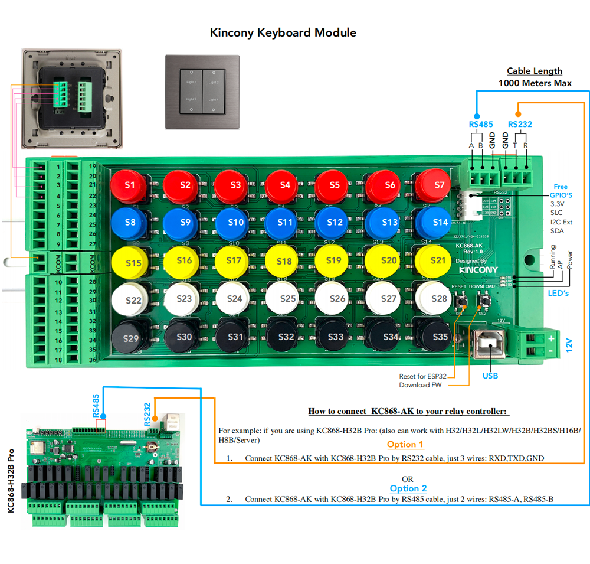

## GPIO Pinout

| Pin    | Function            |
| ------ | ------------------- |
| GPIO36 | Free GPIO           |
| GPIO39 | Free GPIO           |
| GPIO34 | Free GPIO           |
| GPIO35 | Free GPIO           |
| GPIO4  | IIC_SDA             |
| GPIO5  | IIC_SCL             |
| GPIO16 | RS485_RXD           |
| GPIO14 | RS485_TXD           |
| GPIO33 | RS232_RXD           |
| GPIO32 | RS232_TXD           |

[Additional pinout/design details](https://www.kincony.com/esp32-programmable-keyboard.html)

## Basic Configuration

```yaml
# Basic Config
esphome:
  name: kc868-ak

esp32:
  board: esp32dev

# Example configuration entry for ESP32
i2c:
  sda: 4
  scl: 5
  scan: true
  id: bus_a

wifi:
  ssid: "KinCony"
  password: "a12345678"

  # Enable fallback hotspot (captive portal) in case wifi connection fails
  ap:
    ssid: "A4 Fallback Hotspot"
    password: "ZvKhDPUYilHj"

captive_portal:

# Example configuration entry
pcf8574:
  - id: 'pcf8574_hub_in_1'  # for input channel 1-8
    address: 0x24

  - id: 'pcf8574_hub_in_2'  # for input channel 9-16
    address: 0x25

  - id: 'pcf8574_hub_in_3'  # for input channel 17-24
    address: 0x21

  - id: 'pcf8574_hub_in_4'  # for input channel 25-32
    address: 0x22

  - id: 'pcf8574_hub_in_5'  # for input channel 33-40
    address: 0x26

# Individual outputs

binary_sensor:
  - platform: gpio
    name: "ak-input1"
    pin:
      pcf8574: pcf8574_hub_in_1
      number: 0
      mode: INPUT
      inverted: true

  - platform: gpio
    name: "ak-input2"
    pin:
      pcf8574: pcf8574_hub_in_1
      number: 1
      mode: INPUT
      inverted: true

  - platform: gpio
    name: "ak-input3"
    pin:
      pcf8574: pcf8574_hub_in_1
      number: 2
      mode: INPUT
      inverted: true

  - platform: gpio
    name: "ak-input4"
    pin:
      pcf8574: pcf8574_hub_in_1
      number: 3
      mode: INPUT
      inverted: true

  - platform: gpio
    name: "ak-input5"
    pin:
      pcf8574: pcf8574_hub_in_1
      number: 4
      mode: INPUT
      inverted: true

  - platform: gpio
    name: "ak-input6"
    pin:
      pcf8574: pcf8574_hub_in_1
      number: 5
      mode: INPUT
      inverted: true

  - platform: gpio
    name: "ak-input7"
    pin:
      pcf8574: pcf8574_hub_in_1
      number: 6
      mode: INPUT
      inverted: true

  - platform: gpio
    name: "ak-input8"
    pin:
      pcf8574: pcf8574_hub_in_1
      number: 7
      mode: INPUT
      inverted: true

  - platform: gpio
    name: "ak-input9"
    pin:
      pcf8574: pcf8574_hub_in_2
      number: 0
      mode: INPUT
      inverted: true

  - platform: gpio
    name: "ak-input10"
    pin:
      pcf8574: pcf8574_hub_in_2
      number: 1
      mode: INPUT
      inverted: true

  - platform: gpio
    name: "ak-input11"
    pin:
      pcf8574: pcf8574_hub_in_2
      number: 2
      mode: INPUT
      inverted: true

  - platform: gpio
    name: "ak-input12"
    pin:
      pcf8574: pcf8574_hub_in_2
      number: 3
      mode: INPUT
      inverted: true

  - platform: gpio
    name: "ak-input13"
    pin:
      pcf8574: pcf8574_hub_in_2
      number: 4
      mode: INPUT
      inverted: true

  - platform: gpio
    name: "ak-input14"
    pin:
      pcf8574: pcf8574_hub_in_2
      number: 5
      mode: INPUT
      inverted: true

  - platform: gpio
    name: "ak-input15"
    pin:
      pcf8574: pcf8574_hub_in_2
      number: 6
      mode: INPUT
      inverted: true

  - platform: gpio
    name: "ak-input16"
    pin:
      pcf8574: pcf8574_hub_in_2
      number: 7
      mode: INPUT
      inverted: true

  - platform: gpio
    name: "ak-input17"
    pin:
      pcf8574: pcf8574_hub_in_3
      number: 0
      mode: INPUT
      inverted: true

  - platform: gpio
    name: "ak-input18"
    pin:
      pcf8574: pcf8574_hub_in_3
      number: 1
      mode: INPUT
      inverted: true

  - platform: gpio
    name: "ak-input19"
    pin:
      pcf8574: pcf8574_hub_in_3
      number: 2
      mode: INPUT
      inverted: true

  - platform: gpio
    name: "ak-input20"
    pin:
      pcf8574: pcf8574_hub_in_3
      number: 3
      mode: INPUT
      inverted: true

  - platform: gpio
    name: "ak-input21"
    pin:
      pcf8574: pcf8574_hub_in_3
      number: 4
      mode: INPUT
      inverted: true

  - platform: gpio
    name: "ak-input22"
    pin:
      pcf8574: pcf8574_hub_in_3
      number: 5
      mode: INPUT
      inverted: true

  - platform: gpio
    name: "ak-input23"
    pin:
      pcf8574: pcf8574_hub_in_3
      number: 6
      mode: INPUT
      inverted: true

  - platform: gpio
    name: "ak-input24"
    pin:
      pcf8574: pcf8574_hub_in_3
      number: 7
      mode: INPUT
      inverted: true

  - platform: gpio
    name: "ak-input25"
    pin:
      pcf8574: pcf8574_hub_in_4
      number: 0
      mode: INPUT
      inverted: true

  - platform: gpio
    name: "ak-input26"
    pin:
      pcf8574: pcf8574_hub_in_4
      number: 1
      mode: INPUT
      inverted: true

  - platform: gpio
    name: "ak-input27"
    pin:
      pcf8574: pcf8574_hub_in_4
      number: 2
      mode: INPUT
      inverted: true

  - platform: gpio
    name: "ak-input28"
    pin:
      pcf8574: pcf8574_hub_in_4
      number: 3
      mode: INPUT
      inverted: true

  - platform: gpio
    name: "ak-input29"
    pin:
      pcf8574: pcf8574_hub_in_4
      number: 4
      mode: INPUT
      inverted: true

  - platform: gpio
    name: "ak-input30"
    pin:
      pcf8574: pcf8574_hub_in_4
      number: 5
      mode: INPUT
      inverted: true

  - platform: gpio
    name: "ak-input31"
    pin:
      pcf8574: pcf8574_hub_in_4
      number: 6
      mode: INPUT
      inverted: true

  - platform: gpio
    name: "ak-input32"
    pin:
      pcf8574: pcf8574_hub_in_4
      number: 7
      mode: INPUT
      inverted: true

  - platform: gpio
    name: "ak-input33"
    pin:
      pcf8574: pcf8574_hub_in_5
      number: 0
      mode: INPUT
      inverted: true

  - platform: gpio
    name: "ak-input34"
    pin:
      pcf8574: pcf8574_hub_in_5
      number: 1
      mode: INPUT
      inverted: true

  - platform: gpio
    name: "ak-input35"
    pin:
      pcf8574: pcf8574_hub_in_5
      number: 2
      mode: INPUT
      inverted: true

  - platform: gpio
    name: "ak-input36"
    pin:
      pcf8574: pcf8574_hub_in_5
      number: 3
      mode: INPUT
      inverted: true

# Enable logging
logger:

# Enable Home Assistant API
api:
```
