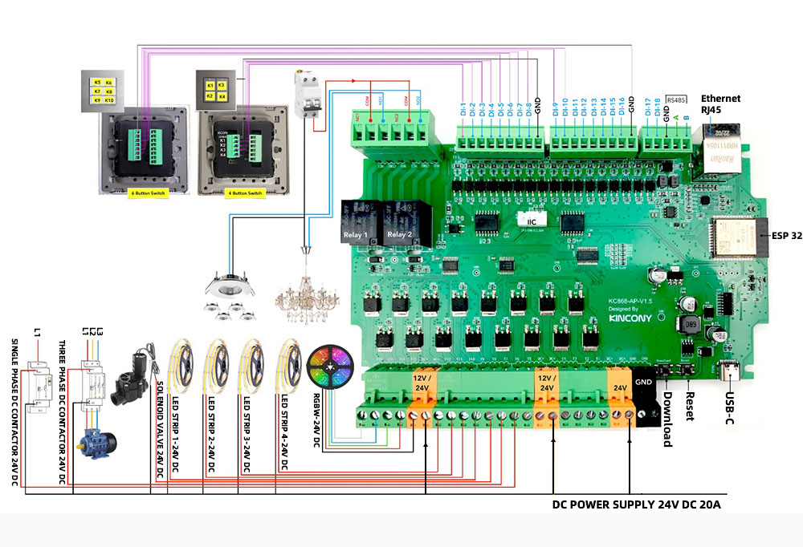

## GPIO Pinout

| Pin    | Function            |
| ------ | ------------------- |
| GPIO34 | Digital-Input-17    |
| GPIO35 | Digital-Input-18    |
| GPIO13 | Realy1              |
| GPIO2  | Relay2              |
| GPIO4  | IIC_SDA             |
| GPIO16 | IIC_SCL             |
| GPIO33 | RS485_RXD           |
| GPIO14 | RS485_TXD           |
| GPIO5  | Extend_Serial_RXD   |
| GPIO32 | Extend_Serial_TXD   |

[Additional pinout/design details](https://www.kincony.com/esp32-pwm-dimmer.html)

## Basic Configuration

```yaml
# Basic Config
esphome:
  name: KC868-AP

esp32:
  board: esp32dev
  framework:
    type: arduino
  
# OTA flashing
ota:
  - platform: esphome

wifi: # Your Wifi network details
  
# Enable fallback hotspot in case wifi connection fails  
  ap:

# Enabling the logging component
logger:

# Enable Home Assistant API
api:

# Enable the captive portal
captive_portal:

# Example configuration entry
ethernet:
  type: LAN8720
  mdc_pin: GPIO23
  mdio_pin: GPIO18
  clk_mode: GPIO17_OUT
  phy_addr: 0

# Example configuration entry for ESP32
i2c:
  sda: 4
  scl: 16
  scan: true
  id: bus_a

pcf8574:
  - id: 'pcf8574_hub_in_1'  # for input channel 1-8    maybe 0x22  /  0x3A
    address: 0x3A

  - id: 'pcf8574_hub_in_2'  # for input channel 9-16
    address: 0x21

binary_sensor:
  - platform: gpio
    name: "ap-input1"
    pin:
      pcf8574: pcf8574_hub_in_1
      number: 0
      mode: INPUT
      inverted: true

  - platform: gpio
    name: "ap-input2"
    pin:
      pcf8574: pcf8574_hub_in_1
      number: 1
      mode: INPUT
      inverted: true

  - platform: gpio
    name: "ap-input3"
    pin:
      pcf8574: pcf8574_hub_in_1
      number: 2
      mode: INPUT
      inverted: true

  - platform: gpio
    name: "ap-input4"
    pin:
      pcf8574: pcf8574_hub_in_1
      number: 3
      mode: INPUT
      inverted: true

  - platform: gpio
    name: "ap-input5"
    pin:
      pcf8574: pcf8574_hub_in_1
      number: 4
      mode: INPUT
      inverted: true

  - platform: gpio
    name: "ap-input6"
    pin:
      pcf8574: pcf8574_hub_in_1
      number: 5
      mode: INPUT
      inverted: true

  - platform: gpio
    name: "ap-input7"
    pin:
      pcf8574: pcf8574_hub_in_1
      number: 6
      mode: INPUT
      inverted: true

  - platform: gpio
    name: "ap-input8"
    pin:
      pcf8574: pcf8574_hub_in_1
      number: 7
      mode: INPUT
      inverted: true

  - platform: gpio
    name: "ap-input9"
    pin:
      pcf8574: pcf8574_hub_in_2
      number: 0
      mode: INPUT
      inverted: true

  - platform: gpio
    name: "ap-input10"
    pin:
      pcf8574: pcf8574_hub_in_2
      number: 1
      mode: INPUT
      inverted: true

  - platform: gpio
    name: "ap-input11"
    pin:
      pcf8574: pcf8574_hub_in_2
      number: 2
      mode: INPUT
      inverted: true

  - platform: gpio
    name: "ap-input12"
    pin:
      pcf8574: pcf8574_hub_in_2
      number: 3
      mode: INPUT
      inverted: true

  - platform: gpio
    name: "ap-input13"
    pin:
      pcf8574: pcf8574_hub_in_2
      number: 4
      mode: INPUT
      inverted: true

  - platform: gpio
    name: "ap-input14"
    pin:
      pcf8574: pcf8574_hub_in_2
      number: 5
      mode: INPUT
      inverted: true

  - platform: gpio
    name: "ap-input15"
    pin:
      pcf8574: pcf8574_hub_in_2
      number: 6
      mode: INPUT
      inverted: true

  - platform: gpio
    name: "ap-input16"
    pin:
      pcf8574: pcf8574_hub_in_2
      number: 7
      mode: INPUT
      inverted: true

  - platform: gpio
    name: "ap-input17"
    pin:
      number: 34
      inverted: true

  - platform: gpio
    name: "ap-input18"
    pin:
      number: 35
      inverted: true

pca9685:
    id: 'pca9685_hub'
    frequency: 500

output:
  - platform: pca9685
    pca9685_id: 'pca9685_hub'
    id: "PWM0"
    channel: 0

  - platform: pca9685
    pca9685_id: 'pca9685_hub'
    id: "PWM1"
    channel: 1

  - platform: pca9685
    pca9685_id: 'pca9685_hub'
    id: "PWM2"
    channel: 2

  - platform: pca9685
    pca9685_id: 'pca9685_hub'
    id: "PWM3"
    channel: 3

  - platform: pca9685
    pca9685_id: 'pca9685_hub'
    id: "PWM4"
    channel: 4

  - platform: pca9685
    pca9685_id: 'pca9685_hub'
    id: "PWM5"
    channel: 5

  - platform: pca9685
    pca9685_id: 'pca9685_hub'
    id: "PWM6"
    channel: 6

  - platform: pca9685
    pca9685_id: 'pca9685_hub'
    id: "PWM7"
    channel: 7

  - platform: pca9685
    pca9685_id: 'pca9685_hub'
    id: "PWM8"
    channel: 8

  - platform: pca9685
    pca9685_id: 'pca9685_hub'
    id: "PWM9"
    channel: 9

  - platform: pca9685
    pca9685_id: 'pca9685_hub'
    id: "PWM10"
    channel: 10

  - platform: pca9685
    pca9685_id: 'pca9685_hub'
    id: "PWM11"
    channel: 11

  - platform: pca9685
    pca9685_id: 'pca9685_hub'
    id: "PWM12"
    channel: 12

  - platform: pca9685
    pca9685_id: 'pca9685_hub'
    id: "PWM13"
    channel: 13

  - platform: pca9685
    pca9685_id: 'pca9685_hub'
    id: "PWM14"
    channel: 14

  - platform: pca9685
    pca9685_id: 'pca9685_hub'
    id: "PWM15"
    channel: 15

light:
  - platform: monochromatic
    name: "Color-LED-1"
    output: PWM0
  - platform: monochromatic
    name: "Color-LED-2"
    output: PWM1
  - platform: monochromatic
    name: "Color-LED-3"
    output: PWM2
  - platform: monochromatic
    name: "Color-LED-4"
    output: PWM3
  - platform: monochromatic
    name: "Color-LED-5"
    output: PWM4
  - platform: monochromatic
    name: "Color-LED-6"
    output: PWM5
  - platform: monochromatic
    name: "Color-LED-7"
    output: PWM6
  - platform: monochromatic
    name: "Color-LED-8"
    output: PWM7
  - platform: monochromatic
    name: "Color-LED-9"
    output: PWM8
  - platform: monochromatic
    name: "Color-LED-10"
    output: PWM9
  - platform: monochromatic
    name: "Color-LED-11"
    output: PWM10
  - platform: monochromatic
    name: "Color-LED-12"
    output: PWM11
  - platform: monochromatic
    name: "Color-LED-13"
    output: PWM12
  - platform: monochromatic
    name: "Color-LED-14"
    output: PWM13
  - platform: monochromatic
    name: "Color-LED-15"
    output: PWM14
  - platform: monochromatic
    name: "Color-LED-16"
    output: PWM15

  - platform: rgbw
    name: "ap-rgbw"
    red: PWM1
    green: PWM2
    blue: PWM3
    white: PWM4

switch:
  - platform: gpio
    name: "ap-light1"
    pin: 13
    inverted: false

  - platform: gpio
    name: "ap-light2"
    pin: 2
    inverted: false
```
