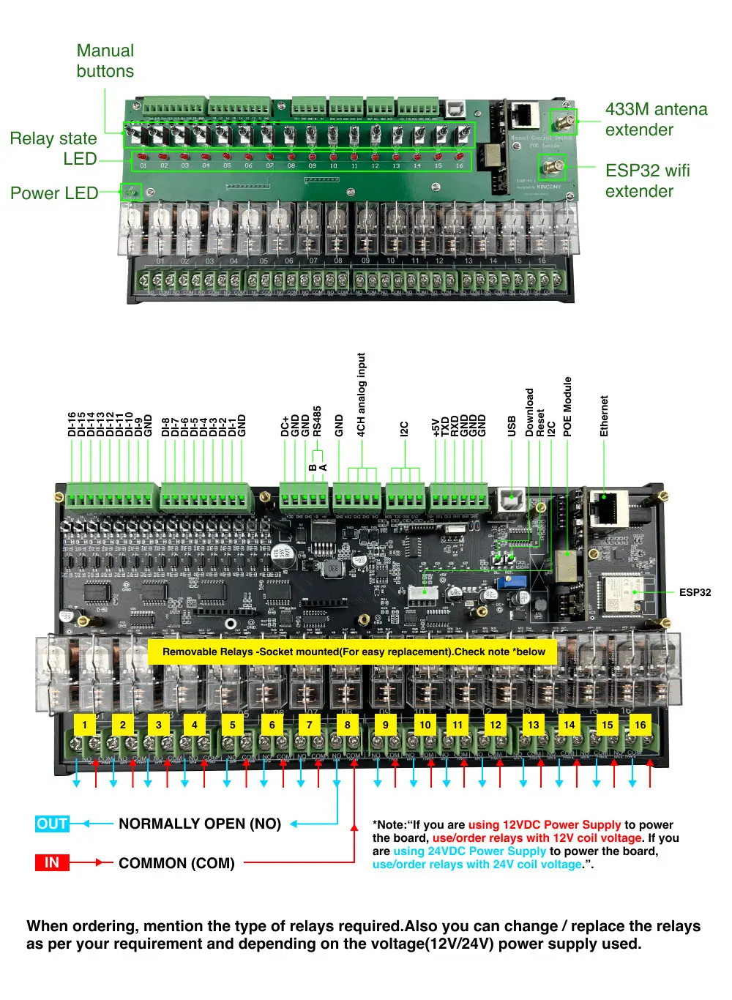

## GPIO Pinout

| Pin    | Function            |
| ------ | ------------------- |
| GPIO36 | ANALOG_A1           |
| GPIO35 | ANALOG_A2           |
| GPIO34 | ANALOG_A3           |
| GPIO39 | ANALOG_A4           |
| GPIO16 | IIC_SDA             |
| GPIO15 | IIC_SCL             |
| GPIO4  | 433MHz Receiver     |
| GPIO13 | RS485_RXD           |
| GPIO32 | RS485_TXD           |
| GPIO23 | Ethernet MDC        |
| GPIO18 | Ethernet MDIO       |
| GPIO17 | Ethernet Clock      |

## Basic Configuration

```yaml
# ESP32 Board config
esphome:
  name: kc868-e16p

esp32:
  board: esp32dev
  framework:
    type: esp-idf

# Enable IPv6
network:
  enable_ipv6: true

# Add a I2C entry
i2c:
  sda: 16
  scl: 15
  scan: true
  id: bus_a

# LAN8720 configuration entry
ethernet:
  type: LAN8720
  mdc_pin: GPIO23
  mdio_pin: GPIO18
  clk_mode: GPIO17_OUT
  phy_addr: 0

# PCF8574 I2C IO Expanders configuration
pcf8574:
  - id: 'pcf8574_hub_out_1'  # for output channel 1-8
    address: 0x21

  - id: 'pcf8574_hub_out_2'  # for output channel 9-16
    address: 0x25

  - id: 'pcf8574_hub_in_1'  # for input channel 1-8
    address: 0x22

  - id: 'pcf8574_hub_in_2'  # for input channel 9-16
    address: 0x24

# Config of 433MHz Receiver
remote_receiver:

  # see https://esphome.io/components/remote_transmitter.html#setting-up-rf-devices
  # for details on discovering the correct codes for your devices
  - id: receiver_rf
    pin:
      number: GPIO4
    dump: all
    # Settings to optimize recognition of RF devices
    tolerance: 50%
    filter: 250us
    idle: 4ms
    buffer_size: 2kb

# RS485 basic configuration
#uart:
#  id: mod_bus
#  tx_pin: 32
#  rx_pin: 16
#  baud_rate: 9600
#  stop_bits: 1
#  parity: EVEN
#
#modbus:
#  id: modbus1
#  uart_id: mod_bus
#
#modbus_controller:
#  - id: a8s
#    address: 0x01
#    modbus_id: modbus1
#    setup_priority: -10
#    update_interval: 5s


# Individual outputs
switch:
  - platform: gpio
    name: "e16p-output1"
    pin:
      pcf8574: pcf8574_hub_out_1
      number: 0
      mode: OUTPUT
      inverted: true

  - platform: gpio
    name: "e16p-output2"
    pin:
      pcf8574: pcf8574_hub_out_1
      number: 1
      mode: OUTPUT
      inverted: true

  - platform: gpio
    name: "e16p-output3"
    pin:
      pcf8574: pcf8574_hub_out_1
      number: 2
      mode: OUTPUT
      inverted: true

  - platform: gpio
    name: "e16p-output4"
    pin:
      pcf8574: pcf8574_hub_out_1
      number: 3
      mode: OUTPUT
      inverted: true

  - platform: gpio
    name: "e16p-output5"
    pin:
      pcf8574: pcf8574_hub_out_1
      number: 4
      mode: OUTPUT
      inverted: true

  - platform: gpio
    name: "e16p-output6"
    pin:
      pcf8574: pcf8574_hub_out_1
      number: 5
      mode: OUTPUT
      inverted: true

  - platform: gpio
    name: "e16p-output7"
    pin:
      pcf8574: pcf8574_hub_out_1
      number: 6
      mode: OUTPUT
      inverted: true

  - platform: gpio
    name: "e16p-output8"
    pin:
      pcf8574: pcf8574_hub_out_1
      number: 7
      mode: OUTPUT
      inverted: true

  - platform: gpio
    name: "e16p-output9"
    pin:
      pcf8574: pcf8574_hub_out_2
      number: 0
      mode: OUTPUT
      inverted: true

  - platform: gpio
    name: "e16p-output10"
    pin:
      pcf8574: pcf8574_hub_out_2
      number: 1
      mode: OUTPUT
      inverted: true

  - platform: gpio
    name: "e16p-output11"
    pin:
      pcf8574: pcf8574_hub_out_2
      number: 2
      mode: OUTPUT
      inverted: true

  - platform: gpio
    name: "e16p-output12"
    pin:
      pcf8574: pcf8574_hub_out_2
      number: 3
      mode: OUTPUT
      inverted: true

  - platform: gpio
    name: "e16p-output13"
    pin:
      pcf8574: pcf8574_hub_out_2
      number: 4
      mode: OUTPUT
      inverted: true

  - platform: gpio
    name: "e16p-output14"
    pin:
      pcf8574: pcf8574_hub_out_2
      number: 5
      mode: OUTPUT
      inverted: true

  - platform: gpio
    name: "e16p-output15"
    pin:
      pcf8574: pcf8574_hub_out_2
      number: 6
      mode: OUTPUT
      inverted: true

  - platform: gpio
    name: "e16p-output16"
    pin:
      pcf8574: pcf8574_hub_out_2
      number: 7
      mode: OUTPUT
      inverted: true

binary_sensor:
  - platform: gpio
    name: "e16p-input1"
    on_press:
      then:
        - switch.toggle: output1
    pin:
      pcf8574: pcf8574_hub_in_1
      number: 0
      mode: INPUT
      inverted: true

  - platform: gpio
    name: "e16p-input2"
    on_press:
      then:
        - switch.toggle: output2
    pin:
      pcf8574: pcf8574_hub_in_1
      number: 1
      mode: INPUT
      inverted: true

  - platform: gpio
    name: "e16p-input3"
    on_press:
      then:
        - switch.toggle: output3
    pin:
      pcf8574: pcf8574_hub_in_1
      number: 2
      mode: INPUT
      inverted: true

  - platform: gpio
    name: "e16p-input4"
    on_press:
      then:
        - switch.toggle: output4
    pin:
      pcf8574: pcf8574_hub_in_1
      number: 3
      mode: INPUT
      inverted: true

  - platform: gpio
    name: "e16p-input5"
    on_press:
      then:
        - switch.toggle: output5
    pin:
      pcf8574: pcf8574_hub_in_1
      number: 4
      mode: INPUT
      inverted: true

  - platform: gpio
    name: "e16p-input6"
    on_press:
      then:
        - switch.toggle: output6
    pin:
      pcf8574: pcf8574_hub_in_1
      number: 5
      mode: INPUT
      inverted: true

  - platform: gpio
    name: "e16p-input7"
    on_press:
      then:
        - switch.toggle: output7
    pin:
      pcf8574: pcf8574_hub_in_1
      number: 6
      mode: INPUT
      inverted: true

  - platform: gpio
    name: "e16p-input8"
    on_press:
      then:
        - switch.toggle: output8
    pin:
      pcf8574: pcf8574_hub_in_1
      number: 7
      mode: INPUT
      inverted: true

  - platform: gpio
    name: "e16p-input9"
    on_press:
      then:
        - switch.toggle: output9
    pin:
      pcf8574: pcf8574_hub_in_2
      number: 0
      mode: INPUT
      inverted: true

  - platform: gpio
    name: "e16p-input10"
    on_press:
      then:
        - switch.toggle: output10
    pin:
      pcf8574: pcf8574_hub_in_2
      number: 1
      mode: INPUT
      inverted: true

  - platform: gpio
    name: "e16p-input11"
    on_press:
      then:
        - switch.toggle: output11
    pin:
      pcf8574: pcf8574_hub_in_2
      number: 2
      mode: INPUT
      inverted: true

  - platform: gpio
    name: "e16p-input12"
    on_press:
      then:
        - switch.toggle: output12
    pin:
      pcf8574: pcf8574_hub_in_2
      number: 3
      mode: INPUT
      inverted: true

  - platform: gpio
    name: "e16p-input13"
    on_press:
      then:
        - switch.toggle: output13
    pin:
      pcf8574: pcf8574_hub_in_2
      number: 4
      mode: INPUT
      inverted: true

  - platform: gpio
    name: "e16p-input14"
    on_press:
      then:
        - switch.toggle: output14
    pin:
      pcf8574: pcf8574_hub_in_2
      number: 5
      mode: INPUT
      inverted: true

  - platform: gpio
    name: "e16p-input15"
    on_press:
      then:
        - switch.toggle: output15
    pin:
      pcf8574: pcf8574_hub_in_2
      number: 6
      mode: INPUT
      inverted: true

  - platform: gpio
    name: "e16p-input16"
    on_press:
      then:
        - switch.toggle: output16
    pin:
      pcf8574: pcf8574_hub_in_2
      number: 7
      mode: INPUT
      inverted: true

# Enable logging
logger:

# Enable Home Assistant API
api:
```
